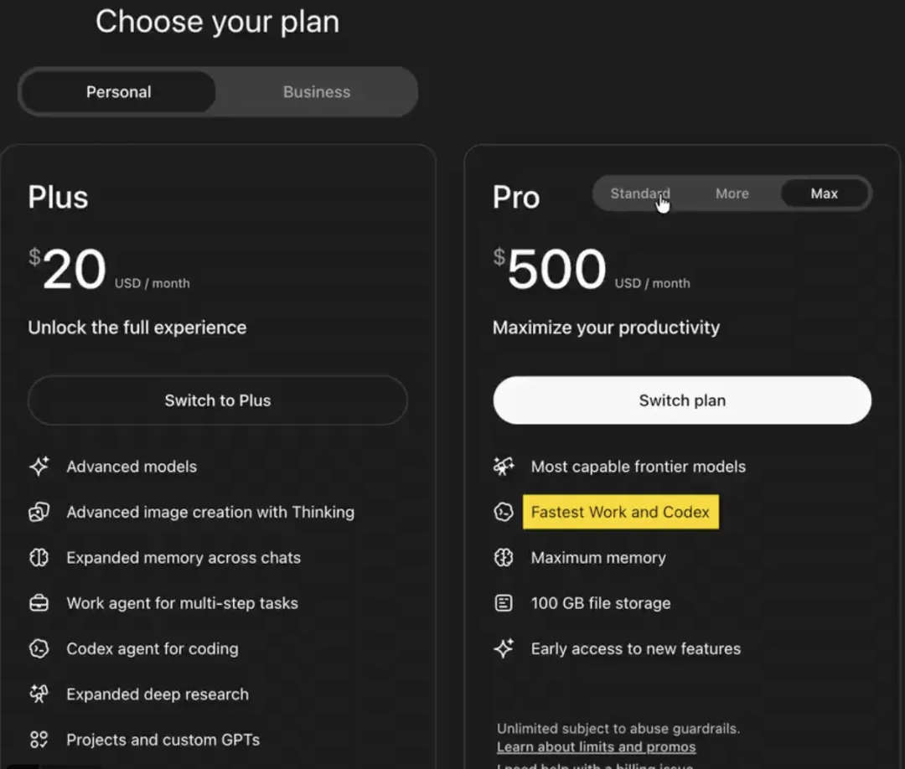
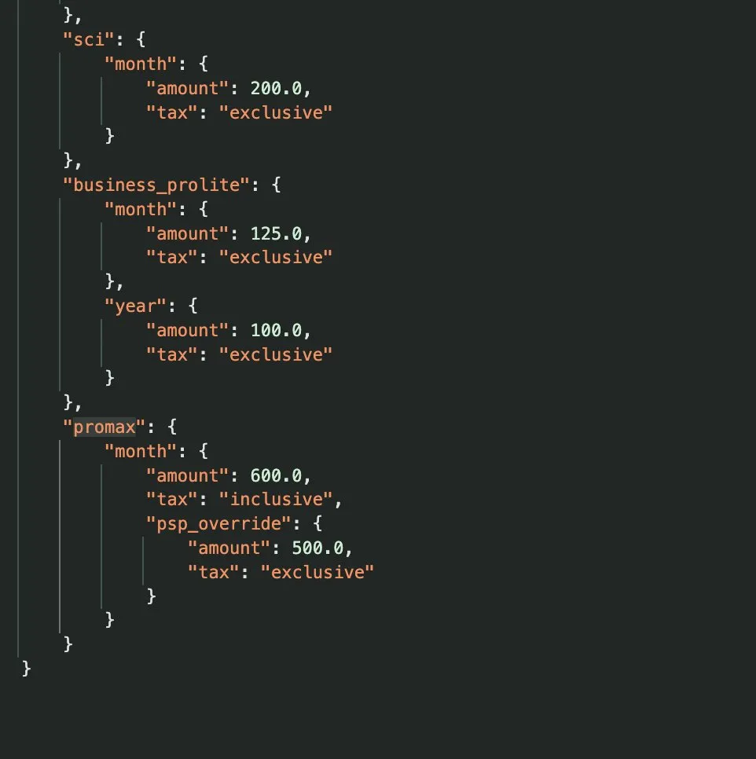
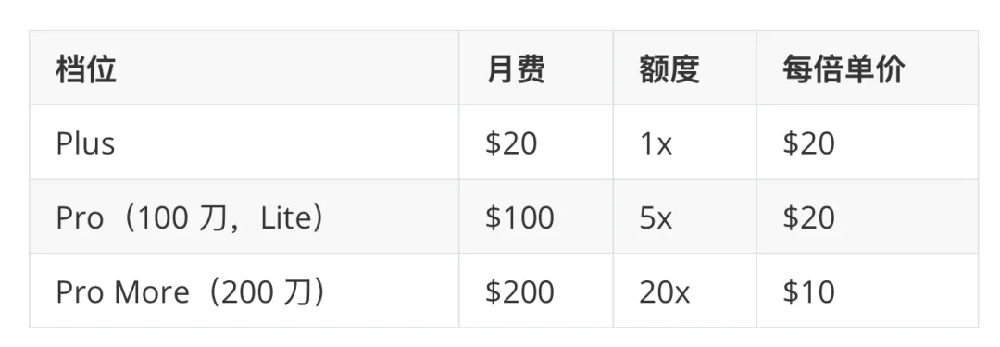

On September 24, a new tier surfaced in OpenAI's frontend: **ChatGPT Pro Max, $500 a month.** Some screenshots showed $600, a price that included local VAT.

The next day, OpenAI itself merged a PR into the open-source Codex repository, renaming the Pro lineup: the $100 tier is now “Pro,” the $200 tier is “Pro (More),” and the new `promax` tier is “Pro (Max).” Authentication, accounts, and usage limits are all wired up.

Dig into the backend pricing configuration on chatgpt.com and you find $500 in the US before tax; ¥84,000 in Japan, roughly $534 including tax; NT$16,500 in Taiwan; £445 in the UK; and €510 in Germany. Country-specific pricing is already in place.

This is more than a rumor. It's on the way. The likeliest place for an announcement is DevDay in San Francisco next Tuesday, early on September 30 in Beijing.

But I don't want to debate whether $500 is expensive. For someone using it to get real work done, $500 a month isn't much. I want to talk about a number nobody knows yet: **how much usage that buys.**

That number matters far more than the price.

## Start with the Math

Here's ChatGPT's current paid lineup, taking the Plus allowance as 1×:

The $200 tier is the best deal in the lineup. Each unit of usage costs $10, half the retail rate. That's a bulk discount. It's why heavy users gravitate to the $200 plan.

So how much usage will $500 Pro Max buy? It comes down to one question: **does each $100 buy 5× usage or 10×?**

- At 10× per $100, you get **50×**, preserving the bulk discount.
- At 5× per $100, you get **25×**, back at Lite's retail rate.
- If you get only **20×**, with faster execution, each unit costs $25—more than Plus.

Of course, I'd love Pro Max to offer 100×, but that seems plainly unrealistic.

Two claims are circulating online. Some Chinese outlets state outright that it offers “50× usage.” Others say it has “the same allowance as the $200 plan, only faster.” I checked: neither claim has a primary source. OpenAI's code contains plan names, but no multipliers. The pricing configuration contains prices, but no multipliers either.

Compare the Pro Max and Pro descriptions on the upgrade page, and the main addition is a single line: “**Fastest Work and Codex**.” The 50× figure was probably calculated by dividing $500 by the $10 bulk rate. “Only faster” is a guess based on that line of copy.

One detail is interesting, though. Someone collected prices from 14 countries and found that Pro Max costs **exactly five times as much as the $100 tier in every country**. In the UK, that tier costs £89; Pro Max costs £445, exactly. In other words, Pro Max's pricing follows Lite, not the $200 plan. **If its usage allowance follows Lite's unit price too, that means 25×.**

## The Multiplier Sends a Message

Why does the multiplier matter so much? Because it answers a direct question: **is OpenAI still willing to subsidize heavy users?**

At 50×, the message is: the bulk discount stays, the subsidies continue, help yourselves. At 25× or even 20×, it's: the bulk discount ends here. Want more? Pay retail, perhaps with a rush fee on top. One invites more heavy users in; the other cuts the amount of subsidized usage on offer.

My guess is the latter. Just look at what OpenAI has done this month. GPT-6 Astra launched on September 3, with Brockman calling it “the beginning of the AGI era.” A week later, on September 10, OpenAI suspended new subscriptions and upgrades to the $200 tier. Tibo, who oversees Codex and ChatGPT, said demand for Astra was “unprecedented” and that the $200 tier put the most strain on the system. Existing users could renew as usual; newcomers couldn't buy it. More than two weeks later, it still hasn't reopened.

Put those events together. Two weeks ago, OpenAI was so short on compute that it stopped taking new $200 subscriptions. Two weeks later, a $500 tier appears. If that tier offers 50× usage, selling you more compute at the same bulk rate, what exactly was the September 10 suspension supposed to accomplish?

**When compute is scarce, a better-value plan isn't going to appear out of nowhere.**

Unless Pro Max runs on a completely separate pool of compute. Some people do suspect Cerebras. Earlier this year, OpenAI signed a deal worth more than $10 billion with Cerebras for up to 750 megawatts of inference capacity. In August, it also previewed Sol Ultrafast running on Cerebras, at up to 14 times the speed. “Fastest” would fit that quite well.

Now consider the buildup over the past two months. Throughout July and August, Codex communities were full of complaints about shrinking allowances. OpenAI denied cutting them while repeatedly resetting users' quotas to calm things down. In late August, the five-hour limit returned to Plus. People also spotted OpenAI testing a button that would let you pay $80 to reset your allowance immediately after running out.

Taken together, the direction is clear: **subscriptions are converging on usage-based pricing.** First, withdraw the cheapest bulk tier. Then put a more expensive tier above it. No price hike needs to be announced. Just keep the cheaper plan “temporarily” unavailable. It's the most graceful way to raise prices.

I've said for a long time that subsidized subscriptions are, at heart, a trade of compute for data—a game of musical chairs. Once there's enough data and an IPO to pursue, the music stops. It hasn't stopped yet, but the rhythm has changed. **Subsidies at the top of the pyramid are the first to go.**

## “Only Faster” Is Actually Worse

Let's consider the possibility of “the same 20× allowance, only faster.” Plenty of people think that sounds fine: same amount of usage, more speed. Not so fast. Codex meters usage in tokens. If you already run agents around the clock, faster execution simply means exhausting your weekly allowance sooner. More speed without more usage just makes you hit the wall sooner.

For people whose bottleneck is speed—say, those who want Astra to operate a computer faster while playing games or editing video—that would be welcome. But if your bottleneck is the allowance, speed alone does nothing for you.

So if DevDay reveals a 20× multiplier, this plan simply isn't meant for people like us: individuals paying out of pocket for several accounts each. The message would be clear: the good times for individual heavy users are over.

## The $200 Plan May Become Irreplaceable

If the allowance really does shrink relative to the price, something interesting will follow: **existing $200 accounts will become something to hold on to for dear life.**

Think about it. At $10 per unit of usage, it's the cheapest tier in the lineup. Newcomers can't buy it, and sales remain suspended. Tibo has also said that Pro won't get a five-hour limit over the next few months. Put those three things together, and you have a deal that may never be available again.

OpenAI's rules are explicit: cancel, downgrade, or miss a renewal payment, and you lose the $200 tier. There is a one-time opportunity to return, but only for existing users who were on the plan around September 10. It's a one-way ticket: get off, and you can't simply get back on.

I've experienced this firsthand. When Zhipu launched its Coding Plan this January, I bought an annual Max subscription for RMB 1,700. That works out to a little over RMB 140 a month. The plan had only a quota for each five-hour window, with no weekly cap, so I could keep going indefinitely. The plans were later revised, and the console now labels mine “Legacy Version V1.” Max V2 costs RMB 375 a month even for existing users; new users pay RMB 9,000 a year.

None of this is new. Mobile carriers keep calling to persuade customers to switch away from old plans; people who know what they have refuse to budge. Cloud storage providers once gave away terabytes, then throttled access or shut down. **Whenever a business buys market share with subsidies, its earliest plans eventually become prized possessions.** Subsidized pricing is set for growth, not cost. When the growth story runs its course, prices have to return to cost.

## What to Do

A few blunt suggestions.

**If you have a $200 account, don't cancel.** If your credit card is about to expire, update it before a renewal payment fails. This plan may already be a discontinued deal. Lose it, and it could be gone for good.

**If you don't have one, stay away from resold shared accounts.** OpenAI's terms explicitly prohibit sharing and resale. If the account gets banned, you have no recourse. Someone else also has access to your chat history and uploaded files.

**Watch that number at DevDay.** The $500 price alone tells us little. The multiplier tells the story. At 25× or below, subsidized usage is shrinking and the window for heavy users is closing. Near 50×, OpenAI is still buying market share, and the deal has some life left in it.

**Either way, make the most of it while it lasts.** Last month, I said to use the subsidy window as hard as you can and get things done while it's open. My view hasn't changed. The urgency has.

One last thought. The alarming part isn't the $500 price. It's the possibility that we're at a turning point: AI subscriptions are shifting from selling usage allowances to selling speed and priority. Mass-market tiers will keep getting cheaper; even free users already have unlimited chat. But the best, fastest compute at the very top of the pyramid will get more expensive.

The multiplier on Pro Max is a letter from OpenAI to its heavy users. It will say either “keep going” or “the party's over.”

We may find out next Tuesday.

Here's hoping this week's Opus 5.5 gives OpenAI a reason to feel some competitive pressure—and keep the allowances generous.
