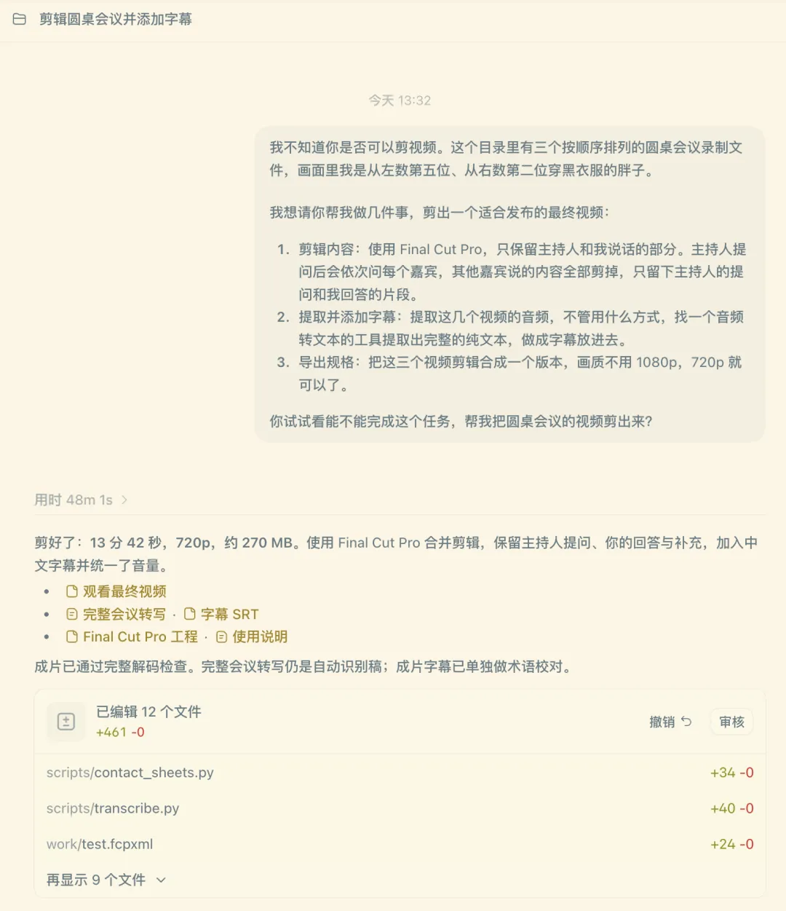
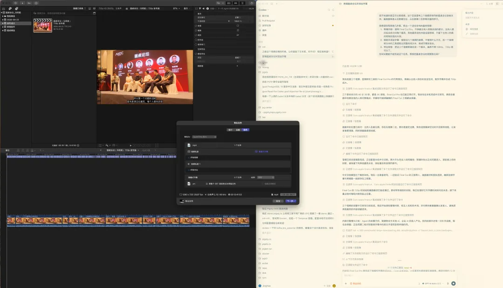
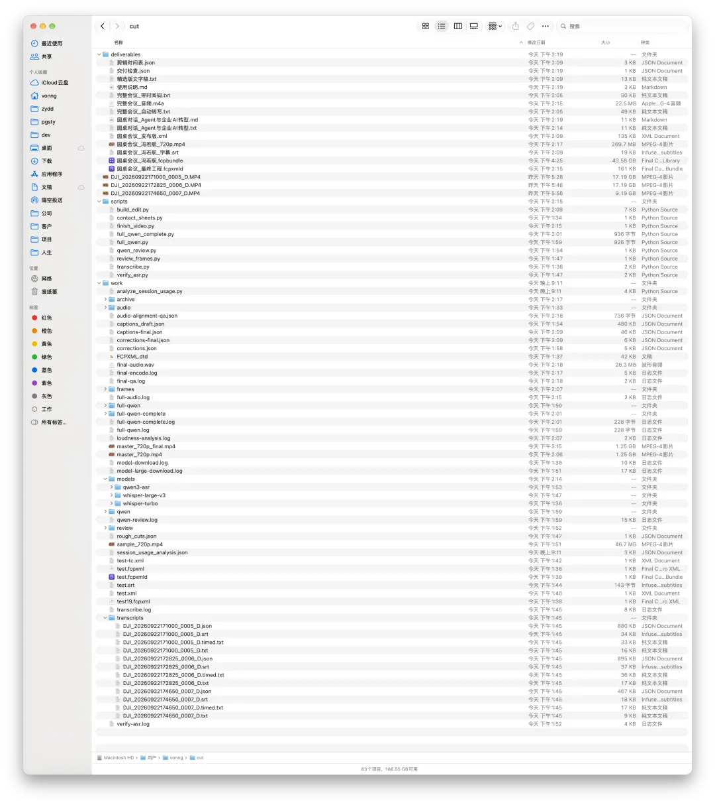
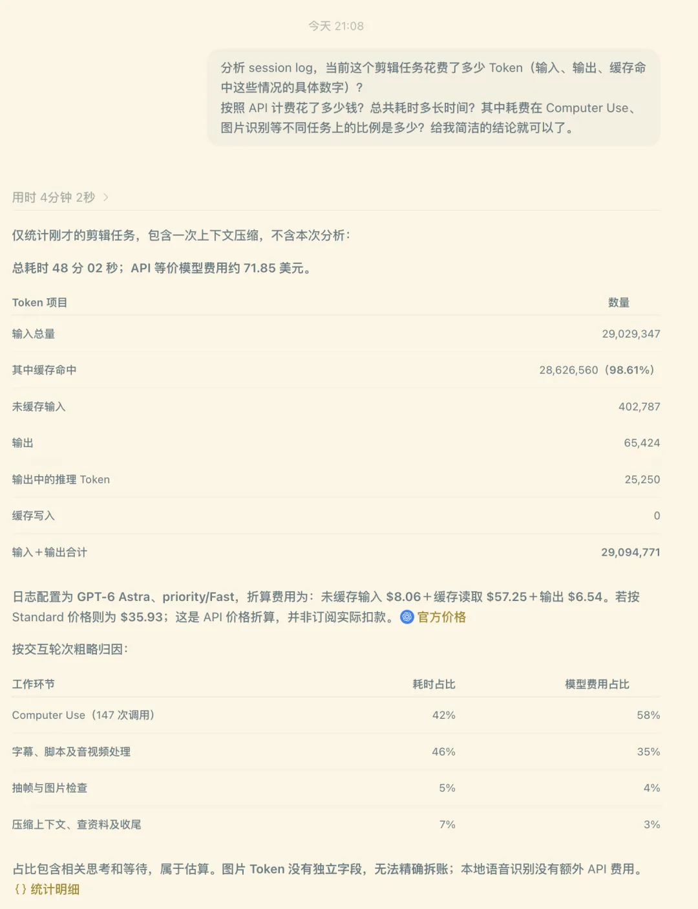
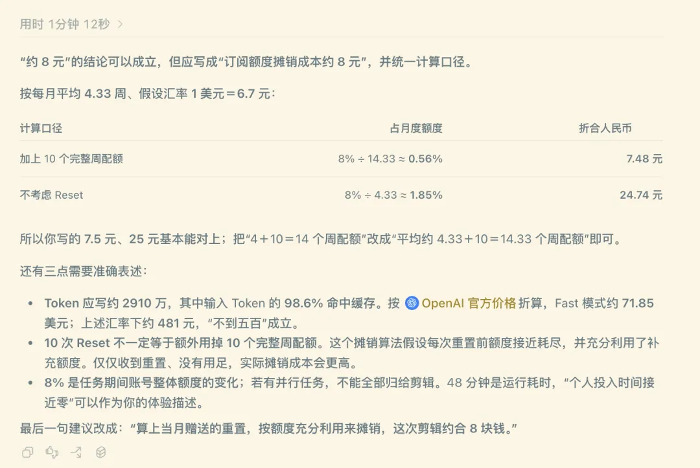

> [微信公众号](https://mp.weixin.qq.com/s/JMjX9A_5_L5fn3g5JGpC-A)

前一阵子 GPT-6 Astra 发布的时候，我就听说有人拿它配合 Codex 剪视频，效果相当不错。这不，这波又更新了，老冯也忍不住上手试了一把。

正好昨天老冯参加了一个 [AI 大会的圆桌环节](https://mp.weixin.qq.com/s?__biz=MzU5ODAyNTM5Ng==&mid=2247493372&idx=2&sn=9915f2dc25ac30114b326e64b6760eba&scene=21#wechat_redirect)，顺手拿 Pocket 4 把全程录了下来。这种视频，我以前向来是拍完就扔进硬盘吃灰：懒得剪，也懒得发。

台上坐了一排嘉宾，主持人挨个提问，要从里面把自己那几段扒出来，再一句一句配上字幕，想想就费劲。但既然 Astra 这么牛逼，为什么不让它来干这个活？成片已经发在视频号里了，一把直出。

> 视频参见：https://mp.weixin.qq.com/s/JMjX9A_5_L5fn3g5JGpC-A

## 提示词

下面是我的原始提示词，一把直出，没有任何调整修正：

> 我不知道你是否可以剪视频。这个目录里有三个按顺序排列的圆桌会议录制文件，画面里我是从左数第五位、从右数第二位穿黑衣服的胖子。
>
> 我想请你帮我做几件事，剪出一个适合发布的最终视频：
>
> 1. 剪辑内容：使用 Final Cut Pro，只保留主持人和我说话的部分。主持人提问后会依次问每个嘉宾，其他嘉宾说的内容全部剪掉，只留下主持人的提问和我回答的片段。
> 2. 提取并添加字幕：提取这几个视频的音频，不管用什么方式，找一个音频转文本的工具提取出完整的纯文本，做成字幕放进去。
> 3. 导出规格：把这三个视频剪辑合成一个版本，画质不用 1080p，720p 就可以了。
>
> 你试试看能不能完成这个任务，帮我把圆桌会议的视频剪出来？

你看，这个提示词写得相当随意。基本上就是把一个普通人的需求，用大白话原样甩了过去。实际就是语音转文字输入的，全程就摁下“开始听写”、“结束听写”、“回车”三个键。我给它准备的，就是一个新目录，把三个从 Pocket 4 里拷贝出来的视频文件放进去，仅此而已。

48 分钟后，东西就出来了，我非常满意。它准确地只保留了主持人和老冯的对话。

## 效果

成片我已经发在视频号里了。老实说，这个效果超出了我的预期。

最让我意外的是它干活的方式。手头没有语音识别工具？它自己去下了一个千问的 ASR 模型，在本地跑语音识别，把我讲的话全部转成了文字。整个过程都是它自己在推进：抽帧看画面，提取音频，语音转文字，校对修正，做成字幕，再跟时间轴对齐，最后剪好、合成、导出。

我一边用着这台电脑干活，它就在后台操作 Final Cut Pro，丝滑流畅地自动干活。全程我唯一做的动作，就是把视频拷贝出来，把这段提示词贴给 Codex。

这一整条链路，放在以前，得是一个既会用 ffmpeg、又懂点语音识别、还熟悉剪辑软件的人，折腾大半天才能搞定。就算有什么现成的 AI 剪辑工具，也还是需要一些学习成本和人工操作的。现在就是一段话的事。

尝到甜头之后，老冯现在正让它去翻我那几个 T 的影像资料库，看看这些年拍的那么多素材里，有哪些能剪成像样的视频发出来。

## 成本

老冯用的是 Codex 最强档位：Fast 模式下的 GPT-6 Astra 模型，Max 强度。这个任务大概消耗了 2910 万 Token，其中输入 Token 的 98.6% 命中缓存。如果按照 API 计费的话，大概成本不到五百块钱。当然，傻子才用 API 按量付费，大家都用订阅计划。

Codex 20x Pro 订阅每月 200 美元，按每月平均 4.33 周，加上过去一个月阳光普照的 10 次 Reset，满打满算相当于 14.33 个周配额。这个任务期间，账号的周配额下降了约 8%。按这个变化粗略摊算，并假设重置补充的配额都得到了充分利用，大概消耗了月度预算的 0.56%。按 1 美元兑 6.7 元人民币估算，折合人民币 7.5 元。

当然，不考虑重置的话，大概相当于月度配额的 1.9%，折合人民币 25 元。时间成本 48 分钟，反正不用我盯着，约等于零。

这无疑是让人震撼的成本。算上当月赠送的重置，按配额充分利用来摊销，这次剪辑约合 8 块钱。帮我剪个视频，太超值了。

## 一个杰文斯悖论

我觉得这是一个非常好的用例，很可能会催生一个很有意思的杰文斯悖论。

杰文斯悖论说的是：一样东西用起来更高效、更便宜了，人们对它的总消耗不降反升。蒸汽机烧煤的效率提高了，煤的总用量反而暴涨。剪视频也是一个道理：当剪一条视频的成本，从“一个下午外加一身手艺”降到“一句话”，被剪出来的视频不会只是原来那些，而是会多出好几个数量级。

因为这是普通人日常生活里就有的场景。手机随手就能拍视频，每个人手机里都躺着成百上千条“死掉”的素材：拍的时候兴致勃勃，拍完就再也没打开过。不是不想剪，是剪不动：要学软件，要花时间，还得有耐心一帧一帧地找。现在，如果这些素材能轻轻松松变成一个像样的作品发出去，那吸引力是相当大的。

我有个朋友最近就在为这事发愁。他家小孩三岁，这几年拍了一大堆视频，却一直抽不出时间剪。以前 Codex 这种东西跟他八竿子打不着，一个写代码的工具，关他什么事？但以后，它很可能就会成为他掏钱订阅的一个理由。

这才是我觉得真正有意思的地方。过去大家都把 Codex、Claude Code 这类东西当成程序员的专属工具，但它本质上是一个能在你电脑上动手干活的 Agent。写代码只是它最先跑通的场景。剪视频、整理照片、归档资料，这些普通人天天遇到、却从来没人帮他们干的活，才是更大的盘子。当它的用户从几千万程序员扩展到所有拿手机拍过视频的人，Token 的消耗量会涨到什么地步，大家可以自己算一算。

把拍好的视频直接丢给它，它就能剪得有模有样，这件事确实让我挺震撼的。硬盘里那些吃灰的素材，终于有机会重见天日了。
