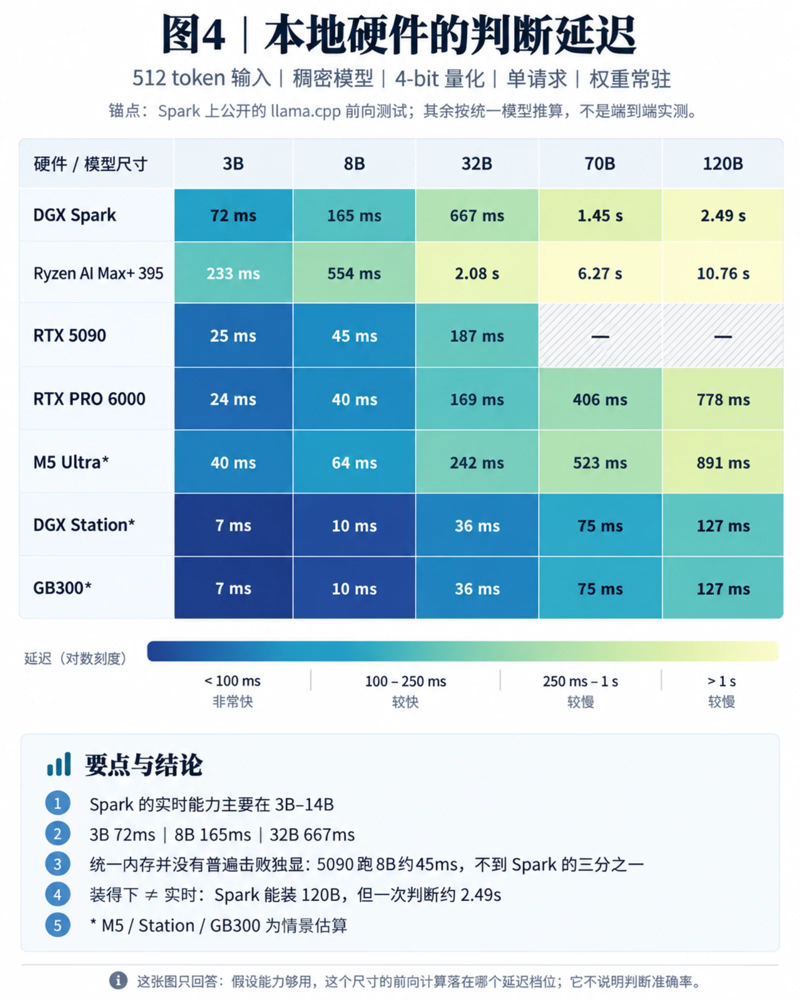

Three in the morning, an alert: replication lag 187 seconds, sustained for seven minutes, production cluster, both replicas still alive. Do you wake the on-call DBA?

That is a one-bit question.

Hand it to the smartest model available today and it will write three hundred words first—restating the metrics, analyzing the causes, weighing the odds of a false alarm—before finally coughing up a blob of JSON: `{"page": true}`. Two seconds, a few cents. The answer occupies one byte; the other few thousand tokens are packaging.

A complicated incident deserves that much thought. Running every ticket, every routing decision, every tool call through the same machinery does not. Most judgments need a very short answer, and we have wrapped every one of them in a long-form generation shell.

On September 15, a company called TypeSafe shipped Jev, on the back of a $40M seed round led by DCVC. The model cannot talk. You hand it a state and a set of questions—which failure class is this (multiple choice), how severe is it (a rating), do we page someone now (yes or no)—and it returns the probability distribution for all of them at once, in 70 to 500 milliseconds, at $0.042 per million input tokens, with output free, because there are no output tokens at all. It doesn't write essays, doesn't generate code, doesn't explain itself. It does one thing: take a look, and give every option a probability.

First reaction: isn't that crippled? Second reaction: that is what a working model should look like.

Let me be clear up front: this is not a review of Jev. It shipped days ago, it is still in private beta, its self-published benchmark score is 68%, and I am not betting an article on a startup. It is worth writing about because it puts something on the table that has existed for a long time and that nobody took seriously. This piece answers three questions: what the thing actually is, what it is worth, and which layer of software it belongs in. **The three answers add up to one sentence:**

**For the past few years, we have been running OLTP workloads on an OLAP engine.**

---------

# Part One · What It Is

## 1. Answering a Yes/No Question with an Essay

The vast majority of places in a program that need "intelligence" do not need an essay. Which team owns this ticket, is this log line anomalous, does this input contain an injection, is this candidate document relevant, is the operation the agent is about to run dangerous—all of them are multiple choice, yes/no, or a score. The answer space is known in advance. What you want is a few bits.

But getting those bits out of a large model today means: write a prompt, let it reason, make it emit JSON that fits a schema, parse, validate, retry on failure, then dig the field back out of the JSON. One bit wearing a two-thousand-token costume.

To be fair, nobody decreed that a yes/no question has to start with an essay. Turn reasoning off, constrain the output, read the probability of the candidate token directly—any of these cuts most of the overhead, and I will use that as a baseline later. The problem is that mainstream products and toolchains still start from "generate some text" and then reshape the text into the return value the program actually needed.

Why? Because large models were built from the start to talk to people. ChatGPT was a product decision made in November 2022; before that, GPT-3 was just a completion endpoint, and nobody assumed AI had to be a chat box. That chat box worked so well it locked the whole industry into "AI means talking." Every year of post-training since has served two customers: RLHF serves humans, tuning the model to say things people enjoy hearing; RLVR serves the grader, teaching the model to reason with verifiable rewards.

Nobody ever seriously served the third customer: the program.

A program does not need the model to sound pleasant, and does not need its reasoning written out. A program wants a type-safe return value plus a "how sure are you." It tried to call a function and got back an essay, and now it has to go find the return value inside the prose. Structured Outputs solved half of this—the JSON is guaranteed to parse—but you are still making the model *write* a well-formatted essay, and however short the essay is, it comes out one token at a time.

The root of the problem is that "one token at a time."

## 2. How the Mouth Got Sewn Shut

Everybody's first neural network lesson is MNIST: given a handwritten digit, decide which of 0 through 9 it is. The last layer is ten neurons through a softmax, and out come ten numbers that sum to one—the probability it is a 0, the probability it is a 1, and so on. Take the largest and you have your answer. Every tutorial from LeNet in 1998 to today does it this way. It cannot talk, and nobody ever thought it needed to. Nobody proposed having it generate "The digit appears to be a seven" and then regexing the 7 back out.

A large language model ends in the same structure: the last layer is also a softmax, also a set of probabilities summing to one. The only difference is that there are a hundred-odd thousand slots instead of ten—one per token in the vocabulary. Each forward pass gives you a distribution over "what is the next token." Normal generation picks one token from that distribution, appends it to the sentence, feeds the whole thing back in, and runs again to pick the next one. Squeezed out one token at a time. This is autoregressive decoding: a two-thousand-word answer is two thousand forward passes, each waiting on the one before it.

So what if you never let it talk at all? Write the question as "which of the following: A replication failure / B storage / C application load / D network," and at the position where the answer would go, read the probabilities in the A, B, C, D slots directly. One forward pass, done.

None of this is new. After MMLU landed in 2020, this is exactly how academia scored multiple choice on large models: read the logprobs of A/B/C/D at that position and take the largest. Qwen3-Reranker's official example pulls the `yes` and `no` logits straight out of the forward pass and normalizes them into a score—generation is never called. Anyone who runs evals has known for years that the MNIST-style classifier inside the model has always been there. Nobody was selling it as a product.

So what did Jev actually do?

Not "output a probability distribution." Classifiers have been outputting probability distributions since 1998; ad CTR models, fraud models, and spam filters have been returning probabilities in the request path at millisecond latency for decades. **What is new is this: MNIST's ten slots are nailed down at training time, while Jev's slots are defined in natural language at call time.** What you want judged and which options exist go in the request. No dataset to collect per question, no model to train. Behind it is the entire world the model has read. One classifier, swap the question at will.

On top of that it did three pieces of engineering. First, collapse the token distribution into an option distribution—in an ordinary model the probability mass smears across `"Yes"`, `" yes"`, `"Y"`, `"Based on"` and a pile of other tokens, whereas Jev's output head maps directly onto the options you supplied: five candidates, five slots. The cap on multiple choice is 255, which I assume is a one-byte index. Second, change the training objective—the probability at that position in an ordinary model was never trained to mean "the probability I am right," and RLHF makes the calibration worse. Jev's objective is "emit a calibrated distribution over the given option set," which they call RLCD, Reinforcement Learning for Calibrated Decisions, aiming to make 0.9 actually mean nine times out of ten. Third, parallel questions—encode the state once, hang a dozen short tails off it, mask them from each other, and let each read its own slot. The marginal cost of one more question is close to zero.

Until now, this capability traveled with a business line, a dataset, and an ML team. Now it has a shot at becoming a general-purpose part any programmer can reach for. The mechanism is old. What changes software is the delivery form.

An analogy: same brain, mouth sewn shut, a pressure gauge bolted to the forehead. Put a question in front of it, and the moment it finishes reading, the needle settles on a number. It cannot tell you why, and it cannot think it over. Whatever one look gets you is what you get.

That is also its ceiling. An answer that is one bit does not mean computing that bit takes only one bit of thought. "Is this proof correct" and "is this failover safe" are both answerable with yes or no, and both may require a great deal of analysis. With no chain of thought, on any conclusion that needs multi-step derivation it loses to a small model with CoT; on anything you would know at a glance, it comes close to the best models in the world.

One practical rule: always leave the question an escape hatch—"other," "insufficient information," "needs further analysis." If the true answer falls outside your option set, all the type safety in the world only means the model is distributing probability inside the wrong universe.

## 3. Intuition Is Revolution Zero, and Why Now

We are used to telling the last few years as "chat → reasoning → agents," and then guessing at the next step. On that story, if "intuition" counts as a revolution at all, it would be the third or fourth.

But look at the mechanism. What was GPT-3? No chain of thought, no reasoning steps—glance at the context, pop out a token. In Kahneman's terms, System 1: fast, automatic, no explanation. Chain of thought in 2022 and o1 in 2024 were both about welding a System 2 onto that intuition machine—write the intermediate steps out first, use your own output as scratch paper. The real order is: intuition → chat → reasoning → agents → and now, doubling back to sell that first discarded pass of intuition on its own.

Intuition is not the third revolution. It is the zeroth.

System 1 and System 2 are a metaphor here, not a mechanism—one forward pass is still dozens of layers of computation, not a flash of insight. But the metaphor catches three real properties: one step to a result, no thinking it over, no explanation. The dividing line is whether the task needs extra computation, not how many words the answer has.

Herbert Simon said something in 1992 that is the best key to this class of model: **intuition is nothing more and nothing less than recognition.** A chess master knows the move at a glance not because they calculate fast, but because they have seen fifty thousand similar positions and this one got recognized. Recognition presupposes that the answer lies in a known set. That draws the boundary of the mouthless model exactly: use it where the options are known—classification, routing, scoring, gating, ranking, validation. Where the options are unknown—writing code nobody has written, inventing a new approach, explaining a failure nobody has seen—you still need the model to open its mouth, because that is search, not recognition.

One aside, so this does not fight with my last post. In *[Two Hemispheres](/en/ai/transformer-left-diffusion-righ/)* I bet the right hemisphere on Diffusion: generative intuition, one look and it *sees* where to go. Jev is discriminative intuition: lay the options out and it tells you which one looks right. In AlphaGo terms, one is the policy network and the other the value network. A master has both. Jev built only the second.

If reading logits has been possible all along, why is it a "moment" only now? Three conditions just lined up. On the demand side, agents turned the one-glance questions inside software from a few thousand a day into a few thousand a second, and they show up in places that never had a classifier—before and after every tool call there is an "is this right, is this done, is this relevant." This is the first time in the history of programming that there has been a massive, machine-generated supply of questions whose answer is one bit. On the supply side, models in the few-billion to low-tens-of-billions range have caught up to about ninety percent of frontier quality on judgment tasks, and that size finishes a pass in a hundred milliseconds on a workstation or even a laptop. Finally, somebody started training specifically for "knowing how sure you are." Before those three lined up, reading logits was an eval trick. After, it is a layer of infrastructure.

---------

# Part Two · What It Is Worth

## 4. Hauling Bricks: Why It Is Fast, Why Output Is Free

A bit of computer architecture in this section. I will keep it in plain language.

Picture the GPU as a bricklayer and the model weights as a warehouse full of bricks. Every time he does any work, he has to haul the entire warehouse over to his station.

During decode, each haul lays exactly one brick—one token—and then he hauls again and lays another. All the time goes into hauling; the bricklaying skill sits idle. This is why an H100 generating tokens for a single request spends most of its FLOPs staring at the wall, waiting on memory to feed the weights through. The jargon is memory-bound, and it is why inference cards must ship with HBM—HBM is just a very fast conveyor belt for bricks, and one of the most expensive materials on the board. Decode carries a nastier bill too: laying each brick means running your hand back over the wall you already built—the KV cache. At 32K context, producing one token means reading several gigabytes. That is the real killer in long-context decode.

During prefill—reading the input once—one haul lays a whole course: as many bricks as the input has tokens. Each haul gets used hundreds or thousands of times, so hauling stops being the bottleneck and the craft becomes one. The jargon is compute-bound, meaning the GPU is finally working rather than waiting on memory.

The mouthless model only does prefill. Read the question, read out the probabilities, done. No decode loop, no KV cache rereads, no output tokens. It pulls AI back from a bandwidth game into a compute game. The industry already concedes these are two different animals—Kimi's Mooncake and DistServe out of academia both do prefill/decode disaggregation, running the two phases on different machines. The mouthless model says: I only want the prefill nodes.

Two caveats, written honestly. One: "memory-bound" only holds at low batch. A throughput-oriented service batches a few hundred requests and generates tokens together—one haul, a few hundred bricks—and the bottleneck goes away. The mouthless model's advantage is that it does not have to wait for a batch: a single request carries hundreds or thousands of tokens of parallelism on its own and can saturate the GPU by itself. So its dividend lands on latency: a hundred-millisecond synchronous call cannot sit around waiting for company. Two: bandwidth does not become useless—short input, big model, or a sloppy implementation and you are bound again. In aggregate, HBM demand certainly is not going to drop; training and long agent decodes are still the bulk of it. The accurate statement is: this class of workload does not need HBM, and can sink down to a cheaper hardware tier.

How much faster depends on how long the input is and how long the output used to be. Take a DGX Spark and a 32B model: 256 tokens in and 256 tokens out becomes 75x faster once you drop the generation; 1K in, 20x; 8K in, only 3x. Short input and long output is where the win is largest; long input and short output is where it nearly vanishes. And if the output was already a single label, reading a single token's logit off an ordinary LLM has already captured most of the speedup—I will come back to this.

Unpacking the official "400x cheaper": the model is small, 10 to 20x—working backwards from the price, it is probably something with ten to twenty billion active parameters, though that is my estimate, not theirs. No output tokens, another 5 to 20x—output already costs several times more than input, and you have to add the thinking on top of that. And one state encoding answering a dozen questions makes the marginal cost near zero. Multiply the three and you get two orders of magnitude with no magic required. **The last one matters most: the cost is almost entirely in reading the state once, and one more question is almost free.**

## 5. The OLTP Moment

After a decade and a half in databases, everything looks like a database to me. This time, though, I do not think the analogy is just occupational damage.

A database has two access patterns, different down to the roots. Point lookup: fetch one row by primary key, through an index, in milliseconds, hundreds of thousands of times a second. Scan: read the whole table and compute an aggregate, seconds to hours, a few dozen a day. The first is OLTP, the second OLAP. The two want completely different machinery—index structures, cache policy, execution paths, hardware ratios—and you can put them in two systems, or in one engine with two paths the way PostgreSQL does. But nobody answers every user login with a sequential scan. (Strictly, the heart of OLTP is transactions and not just speed; what I am borrowing here is the access pattern: short, frequent, fast, highly concurrent.)

For the past few years, large models have been OLAP. Heavy, slow, expensive: a few seconds and a few cents per call, a few tens of thousands of calls a day at most. What they do is essentially a sequential scan—read the entire context, write out the reasoning, derive the conclusion end to end. That capability is remarkable, the same way an analytical engine answering any question over a petabyte is remarkable. But you would not put it behind every click.

The mouthless model is AI's OLTP. Point lookup, milliseconds, cheap enough to call without thinking about it. It does not answer "why," it answers "which one." It does not scan, it recognizes. **In database terms: System 2 is a sequential scan, System 1 is an index lookup.** An index precomputes and stores the answer to "where is this row"; intuition precompresses "what do you do in this kind of situation" into the weights. Every mature data system needs both paths. AI only just grew the second one.

What OLTP actually changed back then was not that reports got faster—it was that a whole class of applications became possible: online transactions, real-time inventory, internet banking. What they have in common is putting the database in the request path: the user clicks, and an answer is due in tens of milliseconds. No analytical engine, however powerful, can do that, because it is not in that latency class. A web request has a budget of two or three hundred milliseconds, and a two-second LLM call will never fit inside it—which is why large models occupy essentially asynchronous positions in software today: background agents, batch labeling, a chat box where the user is waiting and watching. Purpose-built small classifiers have always been in the path, but each one had to be trained separately. A hundred-millisecond general-purpose judgment whose question is defined on the spot can be called synchronously, put inside a single HTTP request, or hung off a database trigger.

This is not an order of magnitude faster. It is a different position in which the thing can exist at all.

The OLTP analogy brings two more things. One is predictability. How long a generation takes depends on how much it feels like saying, which makes an SLO impossible; how long a judgment takes is `max(2PL/C, W/B)`—fix the model and the input length and the latency is a number you can compute, the way an index lookup is `O(log n)` pages rather than "it depends." The formula is not an SLO; queueing and the network still move your tail latency. But at least you have a basis for a budget. Predictable is the precondition for entering the request path, doing admission control, and pricing per call. The other is discipline. That set of numbers above is really just OLTP discipline: keep rows short, keep queries to point lookups, do not scan a whole table inside a transaction—keep the state distilled, the options fixed, the questions atomic, and a fallback ready on timeout. Shoving forty pages of logs in and asking for a snap judgment is running a report against your OLTP database.

## 6. Local Hardware: This Time It Is Real

The other implication of OLTP is that it runs on your own machine.

I had a few models estimate how local hardware behaves under a judgment-only workload. Same assumptions throughout: 512 tokens of input, dense model, 4-bit quantization, single request, weights resident. The Spark column has published llama.cpp numbers as an anchor—Qwen3 8B reads 512 tokens in about 162 ms, 32B in about 672 ms—and the rest are extrapolations from the same model, not end-to-end measurements.

| Hardware                              | 3B     | 8B     | 32B    | 70B      |
| ------------------------------------- | ------ | ------ | ------ | -------- |
| DGX Spark (128 GB LPDDR5X, 273 GB/s)  | 72 ms  | 165 ms | 667 ms | 1.45 s   |
| Ryzen AI Max+ 395                     | 233 ms | 554 ms | 2.08 s | 6.27 s   |
| RTX 5090 (32 GB)                      | 25 ms  | 45 ms  | 187 ms | won't fit |
| RTX PRO 6000 (96 GB)                  | 24 ms  | 40 ms  | 169 ms | 406 ms   |

The table says three things.

**First, how big a model you can fit and how big a model you can use in real time are very different numbers.** A Spark fits 120B, but a single judgment takes two and a half seconds, and returning nothing but a probability does not make that a "reflex." Its real-time envelope sits between 3B and the low teens of billions: 3B in tens of milliseconds, 8B in one or two hundred, 32B under a second. That is already enough for alert triage, ticket routing, and candidate-action checks—provided a model that size judges well enough.

**Second, large unified memory has not generally beaten the discrete GPU.** When the model fits, effective matrix throughput still rules: a 5090 runs 8B in 45 ms, under a third of the Spark's time. The 5090's limit is capacity; the PRO 6000 pushes that boundary out far enough to bring 70B inside half a second. The Spark's value is availability under capacity, form-factor, and power constraints—not best price-performance.

**Third, compressing the state usually matters more than upgrading the model.** A 256-token structured summary and several thousand tokens of raw log are not the same performance problem. Have deterministic code assemble the key metrics, the recent changes, and the evidence first, then hand that to the model to judge—far better value than re-stuffing your entire monitoring universe in on every call.

One counterintuitive finding: batching does not help much here. Going from `batch=1` to `batch=16` with 32B on a Spark raises throughput by only 16%, while the wait per request goes from 0.67 seconds to 9.2. Prefill already saturates the compute, so batching just sums up the work. The metric that matters most for an intuition service is not peak QPS—it is how many judgments per second you can finish inside the response budget.

Why does local have a much better shot at judgment than at chat? Five reasons. The gap between small and large models is far smaller on judgment than on generation—running Llama at home for chat has always been a toy, because the quality gap in open-ended generation is visible to the naked eye, and judgment happens to be where the gap is narrowest. Control flow cannot cross an ocean—if every `if` in your program gets its verdict from an American company's API, your branch statements stop when that API does. What is in the state cannot leave the building—logs, email, screen contents, metrics: the things a judgment needs to look at are exactly the most sensitive ones. The math works out—at list price, 10 calls a second at 1K tokens each runs $1,088 a month, so a $4,699 Spark pays for itself in four or five; continuous monitoring workloads only pencil out locally. And last, individuation can only grow locally—more on that below.

Apple has in fact already built this architecture: an on-device model, escalating to Private Cloud Compute when that is not enough, and only with the user's permission to a third-party model beyond that. A three-tier cascade, escalate on demand, a clean privacy boundary—the only thing missing is making probability a first-class citizen. So the local-AI story will shift from "run Llama at home" to "run your own judge at home." After voice and camera, the first genuinely mainstream on-device AI workload is likely to be continuous judgment.

---------

# Part Three · Where It Goes

## 7. A New Rung in the Hierarchy

Jeff Dean's "latency numbers every programmer should know": L1 cache 0.5 ns, main memory 100 ns, SSD random read 150 µs, disk seek 10 ms, California to the Netherlands and back 150 ms. Two orders of magnitude per step, and the whole of computer architecture is moving things between those steps.

Now extend it upward: a small local judgment model (microseconds to milliseconds), remote judgment of the Jev sort (tens of milliseconds, the disk-seek and transoceanic-RPC tier), a frontier model with reasoning (seconds to minutes, the batch-job tier), a human (minutes to days). The spacing between steps is still exactly two orders of magnitude. It is a rung in the hierarchy.

What do we call this rung? I lean toward the **oracle layer**. Turing proposed the oracle machine in 1939: put a black box next to the Turing machine, ask it a decision problem, and it returns yes or no in one step. Complexity theory built an entire discipline around that black box, including "how many questions does it take to decide a problem." Jev is Turing's oracle with two differences: it can be wrong, and it charges money. Those two differences are where all the novelty lives.

It is also a cache, but be clear about which kind. A result cache stores answers by key—MySQL 8.0 deleted the query cache because any write invalidates that whole table's entries, so past a certain write rate it is a net loss. Build the judgment layer as that kind of cache and you replay the same story the moment the state starts changing often. What it really is is the other kind: a function cache. A distilled small model has never seen your particular alert, but it has compressed "how this kind of situation is usually judged" into its weights. Lampson in 1983 said to cache the answers to expensive computations; the model is exactly that—except what it caches is computation out of other people's experience. So "one more layer of cache" needs one word changed: one more layer of materialized reasoning, and it is invalidated not by key but by the world.

Which brings back Karlton's old line: there are only two hard things in computer science, cache invalidation and naming things.

A classic cache has one kind of invalidation: the underlying data changed. The judgment layer has three. The state changed, so you ask again—that one is the same. The rules of the world changed—production moved to a new PG major version, the business changed its traffic pattern—and the "what you usually do" compressed into the weights is out of date. It shows up as the model still saying 0.9 while being right only 60% of the time. That is calibration drift. The third kind a classic cache does not have at all: **your preferences changed.** Last year a missed alert was expensive; this year the team cannot take any more false pages, and the same 0.7 flips from "page" to "do not." What needs to change there is the decision policy, not necessarily the model. Three kinds of invalidation need three mechanisms: state hash, calibration monitoring, cost versioning. Keep them separate; do not handle them as one thing.

Naming got harder too. The cache key is the literal text of the question. "Is this alert urgent" and "does this alert need immediate attention" are two keys, two distributions, two separate histories of thresholds. Scale the team up and the same judgment gets phrased ten different ways, shattering your calibration data. So questions need to be registered, named, and versioned. When Karlton said naming was hard he meant variable names. This time the hard part is naming the question itself.

And one more thing that I think is where this layer's real philosophical weight sits. Every layer of a computer is random underneath: memory flips bits, disks go bad, networks drop packets. Yet for decades the job of every layer has been to hide the randomness below it—ECC, RAID, TCP retransmission—so the software above can pretend the world is deterministic and an `if` is just an `if`. The judgment layer is the first layer that deliberately passes uncertainty upward, because it cannot hide it: a judgment about the world does not become certain by retrying it a hundred times. All you can do is hand the 0.7 up to the application as it is. That idea dates to 1984 and is called the end-to-end argument: only the endpoints know the cost of an error, so the function belongs at the endpoints. Turn it around: **only the application knows what a wrong judgment costs, so the probability has to reach the application layer and the cost has to be written at the application layer.**

## 8. The Return of `if`, and the Cost Matrix

Once the probability reaches the application layer, what does software grow into?

Karpathy proposed Software 2.0 in 2017: 1.0 is code people write, 2.0 is weights you train, the whole program swallowed by a network, `if` gone. Later he added 3.0: prompt a large model in English, with control flow living inside the model's belly—agents are the summit of that road. The mouthless model goes the other way: **`if` is back.** Control flow returns to the code, still the 1.0 kind of sequence, branch, and loop you can read at a glance, except the condition inside the parentheses is no longer `x > 100` but a probability from a network. The program asks the model "should we page," the model says 0.18, and the program decides for itself what 0.18 means. The judgment belongs to the model; the decision belongs to the code.

Agents put the program inside the model's loop: the model is the main loop and the code is a tool. This road puts the model back inside the program's loop: the code is the main loop and the model is a function that returns a probability. It does not replace agents, it supplies them with parts. Of all the tokens an agent burns today, how many go to one-glance questions like "did this tool return an error," "am I done with this step," "is this file relevant"? Each one runs a full inference pass—slow, expensive, and the model has no usable confidence in its own answer.

Then comes the most counterintuitive step. What should the program do with 0.18? Everyone's instinct is to write `if p > 0.9`. That one line of code is quietly asserting: "I believe a false alarm is nine times more expensive than a miss." It just never says so out loud. And in an alerting context, that assertion is almost certainly wrong.

First, correct the most common mistake. Do not ask the model "should we page" and then treat the 0.18 it returns as an objective probability—"should we" already has cost baked into it, and running it through a cost matrix afterwards means you have counted the value judgment twice. The cleaner split: the model estimates a fact, namely whether this meets our definition of a real incident; the program weighs false alarms, misses, time of day, and permissions to choose an action. Also, do not treat the `confidence` field in the API, the probability of a given option, and "the probability this action is correct" as the same number. The first two are statistics derived from an output distribution; whether they can carry the weight of your action is something you verify against your own business data.

C.K. Chow proved the right approach back in 1970; it is called the reject option. The threshold is not a literal, it is the shadow of a cost. Missing a real incident costs 50, waking someone for nothing costs 5, and the Bayes decision rule says you page when p exceeds 5/(5+50), about 0.09. **Not 0.9. 0.09.** Nine percent confidence is enough to page, because a miss is ten times more expensive. But writing the ledger out, whatever the numbers, beats hiding the value judgment inside a 0.9. And when the maximum probability falls below some threshold, the optimal policy is to refuse to judge and hand it to a human—that threshold likewise derives from the cost of refusing. Your "confidence gate" is Chow's rule.

So the programmer's job changes: the decision layer goes from procedural to declarative. Instead of writing "if lag is over 60 seconds and has persisted 5 minutes and we are not in a maintenance window, page," you write three things—what to ask the oracle, what actions exist, and what each combination costs. Thresholds, escalation paths, and which questions to ask get derived at runtime. This is isomorphic to the jump SQL made: you declare what you want, and the optimizer decides how to get it using its own cost model.

This is not a new paradigm—it is an eighties paradigm coming back to life. MYCIN was doing probabilistic control flow with "certainty factors" in 1976, and Heckerman's Pathfinder in 1990 was already a Bayesian network plus a utility function doing pathology diagnosis. Expert systems died of two things: the knowledge had to be hand-written by experts and there were never enough of them; and the algorithms for uncertainty were not self-consistent, until Pearl put Bayesian networks under them. Foundation models have now removed the first obstacle and Pearl removed the second. What is left for humans is precisely what Heckerman was doing back then: writing the utilities.

Three caveats. **A cost matrix cannot be written down, only elicited.** People are terrible at judging numerical utilities. What will actually happen: the programmer supplies a pile of examples, plus every record of a human overriding the system in production, and the system infers the implied costs—preference learning, inverse reinforcement learning. **The matrix explodes.** Ten questions and five actions and the joint space cannot be tabulated; you have to write decomposed local utilities and sum them. And cost is cross-temporal—the cost of one bad page at three in the morning is not 5, it includes the raised probability of a future miss from alert fatigue. The Bellman equation shows up in your alert routing. **Every programmer gets a small alignment problem of their own.** The system optimizes the cost you wrote, the cost you wrote is a proxy for your real objective, and the gap between proxy and objective is Goodhart: write "reduce false alarms" and the system learns not to page even when it should.

The escalation chain should not be hard-coded either. In the classic hierarchy, a miss falls through to the next level unconditionally; nobody asks whether going to disk is worth it. In the judgment layer, that fall-through is itself a decision: spend two seconds and a cent asking a frontier model, or act on the 0.7 you already have? Howard gave the formula in 1966, the value of information: the expected gain from asking once more, minus its price. Positive, ask; negative, do not. So the escalation chain is not four hard-coded tiers in a config file, it is computed fresh at every decision. Which gives programs a third complexity metric: beyond time and space, query complexity—how many times you queried the oracle to make this decision, and what it cost. Theoretical computer science spent decades on "how few questions does it take to decide a function" as pure mathematical recreation. Now each query is priced at $0.00004, and the game comes with an invoice.

## 9. Every Program Grows a Query Optimizer

If the judgment layer is a component that makes probabilistic estimates from a compressed summary of the world, turns those estimates into an execution path with a cost model, and decides how to do the work before doing it—then database people should find it very familiar. That is a query optimizer. It has been running in production for forty years, and every failure mode and antidote is on the record. That is the largest asset the database field has to transfer here.

| Query optimizer                                                     | Judgment layer                                                      |
|---------------------------------------------------------------------|---------------------------------------------------------------------|
| `pg_statistic`: histograms and MCVs, a compressed summary of a table | Weights: a compressed summary of the world                          |
| Selectivity estimation: guess how many rows match without scanning   | Belief: guess which option is right without reasoning               |
| The `random_page_cost` family of GUCs                                | The cost matrix                                                     |
| Pick a plan by cost: index scan or sequential scan                   | Pick an action by expected cost: act automatically or escalate      |
| `ANALYZE`, autoanalyze firing after 10% of rows change               | Recalibration; recalibrate once 10% of decisions have outcomes      |
| Generic vs custom plan: compare costs after five runs, stop replanning once it is good enough | System 1 vs System 2: once it is familiar, stop thinking |
| `CREATE STATISTICS`: multi-column statistics, patching the independence assumption | Joint questions, patching the independence assumption in composite scoring |
| Function `COST`: cheap predicates run first                          | Deterministic rules run first, semantic judgment last               |
| `jit_above_cost`: expensive optimization only for expensive queries  | The slow model only for decisions that matter enough                |
| BRIN and GiST lossy indexes plus recheck: say "maybe" first, confirm at the heap | The cheap judge says "maybe," the tier above confirms   |
| One digit off in a cardinality estimate, a plan a thousand times slower | One wrong confidence, one wrong action                            |
| Plan hints                                                           | Human override                                                      |
| AQO, Oracle adaptive plans: fix estimates with execution feedback    | Audit backfill, online recalibration                                |

The `random_page_cost` row deserves its own paragraph. The default is 4; a DBA on SSDs sets it to 1.1. That is what "programming becomes writing a cost matrix" already looks like inside a database, and it exposes the same disease: the default is wrong for modern hardware, nobody knows what number to put there, and everybody cargo-cults. Which is why the database community has kept trying to learn cost parameters from execution feedback. On "can you write the costs down," the planner answered long ago: not well, you have to learn them.

The lossy-index row deserves its own paragraph too. The philosophy of BRIN and GiST is that an index may lie, but only in one direction: it may say "possibly in this block" and then you check the heap and it is not there, but it must never say "not here" when it is. Bloom filters follow the same principle: false positives allowed, false negatives forbidden. **That is the right design for a cheap judgment layer: engineer the direction of error to be the one the tier above can catch.** In alert triage, one extra wake-up is a false positive you can recheck; a missed incident is a false negative you cannot. A neural judge cannot give you that one-sided guarantee. What you can do is design the system to lean toward conservative escalation—a design preference, not a mathematical guarantee.

Three lessons databases took forty years to learn, copyable verbatim.

**First, the cost of letting estimates into control flow is heavy-tailed.** Get a selectivity estimate wrong by one order of magnitude and you do not get 10% slower, you get a thousand times slower—every DBA has seen what a nested-loop join looks like under a bad estimate. The judgment layer will have the same shape: 99% of decisions save money, 1% blow a hole in the side of the building. The antidote is on the shelf too: robust query optimization does not chase the optimum in expectation, it picks a plan that is not too bad anywhere inside the estimate's error range. Decision theory calls this minimax regret—especially when the action is irreversible.

**Second, the independence assumption is the root of all evil.** The planner's most notorious errors over the decades come from multiplying the selectivities of several predicates together; when they are correlated you land orders of magnitude off. `CREATE STATISTICS` in PG 10 and multi-column MCVs in PG 12 exist to patch that hole. The composite scoring TypeSafe recommends—weighted-summing the probabilities of ten questions over one state—makes exactly the same mistake. They were all read off the same state, so they go wrong together. Asking more questions is not the same as gathering more independent evidence: handing one state to one model and asking ten similar questions may just get you the same misjudgment ten times over. Weighting different dimensions into a composite score is fine; just do not treat the composite as a probability, and definitely do not treat ten highly correlated judgments as a unanimous vote by ten experts who have never met.

**Third, learned estimators die of invalidation.** A wave of work around 2019 replaced histograms with neural networks for cardinality estimation—Naru, DeepDB, MSCN—crushing traditional methods on accuracy. Then VLDB 2021 published "Are We Ready for Learned Cardinality Estimation?" and the answer was no: the model goes stale the moment the data updates, retraining is too expensive, and an occasional wild error is more fatal than a steady mediocre one. That is practically a trailer for the judgment layer. The bottleneck on getting neural judges into production is not accuracy, it is the cost of detecting staleness and recalibrating. What survives is the AQO approach: do not try to train it right once, keep correcting it with execution feedback.

A few shorter isomorphisms, each of which lands as one concrete engineering practice. The audit table is the decision's WAL: write first (state hash, belief, cost version, action), then act, and backfill the eventual outcome. Decisions need snapshot isolation: the judgment was made against the state at time t, the action executes at t+Δ, and the state may have moved in between. The fix is optimistic locking—`decide()` returns the action plus a state hash, and `act()` confirms the hash has not changed first. The small model is a replica with replication lag: it was distilled from an older frontier model and permanently trails the primary. Databases have explicit rules about which reads may go to a replica; the judgment layer needs them too. Every record of a higher tier overturning a lower one is Dynamo's read repair—and a training sample for the next distillation.

Do not drag PITR across with the rest of it, though. A database can replay changes it recorded; a decision system cannot learn from its log about the world that did not happen. You woke the DBA and the outage got fixed—that does not mean nothing would have broken if you had not. Changing the threshold lets you recompute what you would have chosen at the time; it cannot compute the real consequences of the action you did not take. That needs outcome data and an evaluation design. The log is a starting point, not a time machine.

## 10. How the Harness Changes

Drop all of the above onto an agent harness and six things happen. Judgment outsourcing: termination checks, tool-result validation, relevance filtering, and safety checks all sink to the fast layer, and the large model only thinks at the real forks in the road—thirty to fifty percent of an agent's token bill goes away like this. Reasoning-budget routing: use a cheap judgment to estimate "how hard is this step" first, then decide how many thinking tokens to grant. Speculative execution: prefetch tools and precompute results along branches you might take, discard on a miss—branch prediction, in an agent. Confidence-gated autonomy: permissions stop being a static allowlist, reversible actions go on confidence and irreversible ones need a sign-off, and an action taxonomy becomes the harness's core data structure. A metacognitive layer: a fast model watching the trace and asking "are we going in circles," "have we drifted"—an agent with a hunch, for the first time. Multi-agent recedes: one reasoner plus a crowd of cheap judges is cheaper, more auditable, and easier to debug than a crowd of agents chatting to each other.

But do not take this as license to replace every rule with a probability. Maintenance windows, permissions, whether an object exists, whether a SQL statement satisfies a hard constraint—anything a program can settle, a program keeps settling. What the model fills in is the part where rules are hard to write.

A side effect: once models are commodities, the harness becomes the moat. Question library, cost table, escalation policy, outcome log—hold those four and you can swap models at will.

## 11. The Truth About Zero Hallucination

Time for a cold shower, or this turns into an advertorial.

TypeSafe's loudest claim is "cannot hallucinate." Translated: they mean type safety—the output is guaranteed to be one of the options you supplied, no category appears that does not exist, no JSON is missing a brace. That is a guarantee by construction, and they themselves admit the "0% hallucination" figure was filled in by definition, not measured. But picking the wrong one of five options is entirely possible. The format is faithful; the judgment can still be wrong. A constrained output does not neutralize input attacks either: an attacker does not need the model to say something out of bounds, only to push it toward the wrong legal option.

"193x faster, 444x cheaper" compares it against a large model that writes out its reasoning before emitting JSON. TypeSafe itself calls this "the high end of real-world gains," and the reference labels are a strong model's judgments, not ground truth. In a small demo they built with DSPy, the whole pipeline came out only 15.9% faster and 30% cheaper. On their own published benchmark, accuracy is 68%, about the level of a mid-tier model. A team scoring financial research reports ran six thousand comparisons and found it agreed with the strongest model just over 90% of the time—and agreement is not accuracy; the strongest models do not agree with each other 100% of the time either. So this is a thing cheap enough to hire an extra reader with, not a thing you can make the final arbiter.

And as I said earlier, reading a single token's logit off an ordinary LLM already captures most of the speedup. So what Jev actually has to prove is not that it can shut up, but that after shutting up it still has all of: cross-task understanding, efficient multi-question parallelism, meaningful probability calibration, and low cost and stability as a complete service. The comparison set should not be only "make the most expensive reasoning model write a JSON blob with probabilities in it." It also has to include single-token judgment, purpose-built classifiers, rerankers, and small models distilled for your own business. Only if a purpose-trained judgment model keeps a clear advantage over reading a single logit can the gains be credited to "a dedicated model and interface," rather than merely to not generating an essay.

There is exactly one thing here that might genuinely be new: calibration.

Calibration roughly means that of the predictions claiming 90%, about 90% turn out to be true. It is a statement about a set of predictions being honest in aggregate; it gives you no guarantee about any single call. And honest is not the same as smart: on a dataset that is half positive and half negative, a model that always answers 0.5 is perfectly calibrated and has zero discriminative power. So you have to watch two things at once: how many questions it can actually tell apart, and whether it has a reliable signal about its own errors. In automation terms: at an acceptable level of risk, how many tasks stop bothering a human.

What large models lack is precisely knowing what they do not know—when one says 90%, it may be right 60% of the time. What makes intuition usable is not that it is fast, it is that its sense of uncertainty can be trusted. If RLCD really makes 0.9 mean 90% correct, then "trustworthy hesitation" as a primitive is new. But as of today there is zero public evidence for it: no paper, no weights, no ECE, no Brier score, no reliability curves—none of the standard metrics of the calibration literature. "Calibrated" is a claim, not a result.

There is a twist, though: **calibration can be done after the fact.** Temperature scaling, conformal prediction and their relatives need only a small slice of your own history with real outcomes attached to take an uncalibrated scorer up to a statistically guaranteed coverage rate. Calibration handles honesty, not intelligence—it can make a dumb model honestly say it is not sure; it cannot make it right, and the moment the data drifts you recalibrate again. But for the question "should this be handled automatically," honesty matters more than intelligence. This connects back to *[The Cerebellum](/en/ai/cerebellum/)*: the model gives you a population's intuition, and it is your local audit table—the probability on every judgment, whether you paged, whether paging was right—that turns it into *your* cerebellum. The moat is not in the model. It is in the outcome data.

One counterargument has to go in here. Discriminative judges have a ceiling. The reward-model line of work in 2025 moved in exactly the opposite direction: GenRM and DeepSeek-GRM both found that letting the judge reason before scoring is more accurate on hard problems. On the hardest judgments, System 2 still crushes System 1. So System 1 is the floor, not the ceiling. What is valuable is not how accurate it is on its own, it is the handoff—high confidence goes automatically, low confidence escalates. Machine learning calls this selective prediction, learning to defer, model cascades. Twenty years of literature. No need to reinvent it.

## 12. A Dependency in the Spinal Cord

There is something here that matters more than whether it is new.

Where large models sit in software today is peripheral: a chat box, a summarize button, a background agent. If it goes down, the product loses a feature. The position a mouthless model enters is control flow—the verdict inside every `if`. **An LLM dependency lives on software's skin. This one lives in its spinal cord.** No serious system can accept control flow that crosses an ocean. A locally deployable judgment model is the precondition for this paradigm, not a nice-to-have. TypeSafe is a US-hosted closed-source SaaS; it cannot walk this road itself, but somebody will walk it for them.

Remote services are not categorically off the table, but a program's basic behavior cannot be welded to an API you neither control nor can replace. What happens when it times out? When the network drops, do you fail open, fail closed, or fall back to the old rules? You have to decide that. It cannot be left to the fate of one HTTP request.

Open-source alternatives will arrive fast—faster than the four months it took DeepSeek to reproduce o1. Three reasons. Mouthless models have existed for years, just not packaged this way: a reward model is a decoder with a value head bolted on emitting one score, and every lab has a pile of them. Llama Guard is a mouthless model. A reranker is a mouthless model. The zero-shot classifier GLiClass already classifies against arbitrary labels in a single forward pass. The recipe is simple and the inference stack is off the shelf—take any open decoder, add an option head, use a proper scoring rule as the loss, then a little RL for calibration; vLLM has supported classify, reward, and score modes for ages. The community has already produced an experiment called LFM2.5-2.6B-RLCD that reuses a shared context to evaluate options in parallel—the author honestly states that no RLCD training was done and calibration was never finished, which is exactly how low the bar is at the interface level. Third, the reference answers in TypeSafe's own evaluation are the average of GPT-6 Astra and Claude Fable 5.1, so the road called "distill the frontier's intuition into a small model" is sitting right there in plain sight, with nothing in it to stop Qwen or GLM.

So split the replication into two layers. Copying the interface and the working style: the bar is low. Copying reliable general-purpose judgment—still stable after you change the business, the language, and the option set, with confidence numbers that stay useful—the bar is much higher, and it takes training, data, and evaluation. It is not wrapping a softmax in an API. A direction being valuable does not mean the first company to shout the direction owns all the value. Value will move to three places: calibration datasets with real outcomes in each domain, schema libraries of judgment questions, and on-device runtimes that run on an NPU. TypeSafe will most likely be "the company that invented the embedding API," not the company that won because of it.

Decision inflation comes with all this. When judgment is free, systems grow into an unauditable soup of probabilistic branches—a model behind every `if`, a version behind every model, a history behind every threshold. Who judged, against what state, with what probability, and whether it turned out right: all of that needs somewhere to live, and has to be replayable and backfillable. GDPR Article 22's right to human intervention is the legal version of "escalate to the tier that can be held responsible," and the EU AI Act's logging and human-oversight requirements map exactly onto the decision WAL and the confidence gate. Sooner or later regulators will ask for a calibration report the way they now ask for a pen-test report.

And every one of those pieces—compressed statistical summaries, cost parameters, choosing a path by cost, automatic refresh when statistics go stale, execution feedback, a WAL, point-in-time replay, access control, trigger mechanisms—PostgreSQL already has. Make a semantic judgment a function with a `COST`, and the planner automatically orders it after the deterministic predicates. The audit table is just a table. The cost matrix is a config table. RLS decides who may sign off on a high-risk action. A trigger is a confidence gate. **The most natural host for a decision plane is not a new framework. It is the database itself.** Other software has to grow an optimizer from scratch; the database already has one. It just used to optimize only SQL.

But host does not mean stuffing a model call into every transaction and holding locks through a network round trip. The database does the bookkeeping and the governance, the inference service does the compute, the execution system guards the action boundary. A SQL optimizer knows a function is expensive; filling in `COST` will never teach it what one missed incident is worth. And an external action does not un-happen because the transaction rolled back.

If you want to start tomorrow, the order is unglamorous. Pick one question that recurs, has clear boundaries, and whose errors are detectable. Record the state, the judgment, what the human did, and the eventual outcome—that table matters more than the model. Write down the action costs and the hard constraints; even if you get them wrong, a wrong cost written down beats a cost hidden inside a 0.9. Run the model in shadow mode: watch how it would have judged, do not let it take over. Once the feedback covers the typical cases and enough of the weird ones, start with low-risk, reversible actions. Do not unplug the on-call phone on day one.

## 13. Predictions

An article about calibration ought to have an author willing to put probabilities on his own predictions. The clock starts September 18, 2026. These are bets, and each one gets settled with a Brier score when it comes due.

| Prediction                                                                      | Horizon     | Probability |
| ------------------------------------------------------------------------------- | ----------- | ----------- |
| A locally deployable, multi-question, probabilistic open-source judgment model appears | 12 months | 0.9 |
| Mainstream workflow engines add a native judge step                             | 2 years     | 0.85 |
| Mainstream agent frameworks make sinking termination/validation/routing to a fast layer the default | 18 months | 0.75 |
| A public leaderboard for judgment plus calibration (what MTEB is to embeddings)  | 12 months   | 0.7 |
| Mainstream alert routing supports probabilistic matchers                        | 2 years     | 0.7 |
| On-device continuous judgment becomes the mainstream NPU workload after voice and camera | 3 years | 0.6 |
| Semantic predicates in cloud warehouses emit calibrated probabilities and support cost-based ordering | 2 years | 0.6 |
| OpenTelemetry gets semantic conventions for decisions                           | 3 years     | 0.6 |
| Judgment APIs price per request rather than per token                           | 2 years     | 0.6 |
| Regulators start asking for calibration reports or risk-coverage curves         | 5 years     | 0.5 |
| A mainstream programming language adds keywords for uncertainty                 | 10 years    | 0.2 |
| TypeSafe becomes the long-term winner of this category                          | 5 years     | 0.15 |
| Total HBM demand falls as a result                                              | any horizon | 0.05 |

Three things would invalidate all of this, in order of destructive power. The ceiling on discriminative judgment is too low, in which case it stays a prefilter forever and the impact halves. Calibration cannot be made to hold out of distribution, in which case it only works in closed-loop industries. Reasoning-token prices fall faster than expected, in which case the cost advantage goes to zero and only the latency advantage survives. So, once more, the two stakes in the ground: **the latency advantage is structural, the cost advantage is temporary.** Discount any argument built on "400x cheaper." Do not discount the ones built on "a hundred milliseconds, inside the request path." And all the accounting is conditional on the quality holding up—cut the accuracy along with everything else and of course you can make anything faster.

## Epilogue: Shutting Up Is Cheap

Back to that alert at the top.

When an old DBA stares at a dashboard and says "something smells wrong," there is no chain of reasoning running in their head. CPU, IO, connection count, replication lag, and application traffic sit side by side, and some combination of them makes their stomach tighten. That is recognition. That is System 1. In Jev's vocabulary, it is a Noul: one binary judgment with a probability attached.

The mouthless model makes that move cheap to engineer: read a state, return a probability, a hundred milliseconds, next to free, and the question can be swapped at will. Should this alert page someone, who owns this ticket, does this SQL look like a mistake—all of that is its home turf.

But one line has to be drawn very clearly: the control loop is not its to hold. Failover, restoring from backup, DDL, deleting data—the final authorization for those cannot come from a model that cannot explain itself, no matter how certain it says it is. It can label, route, and page. It cannot act. High-risk actions need evidence up front, hard constraints, and a boundary of responsibility. **A probability does not convert itself into a permission.** Ninety-nine percent of judgments need no explanation; for the remaining one percent, let a talking System 2 supply it afterwards—intuition first, then translate the intuition into a path. A human sits at the top of the hierarchy, and not because humans are the most accurate. It is because a human can be questioned, disciplined, and sued. Accountability is a thing only humans can currently produce.

*[Two Hemispheres](/en/ai/transformer-left-diffusion-righ/)* was about architecture: intelligence needs two irreducible computational paradigms. *[The Cerebellum](/en/ai/cerebellum/)* was about body and history: intuition needs individual experience to calibrate it. This one is about interface and economics: how intuition gets priced, how it gets delivered, and how it enters software's request path.

Large models taught machines to talk. Agents taught machines to act.

This wave teaches them to shut up.

And shutting up is cheap.
