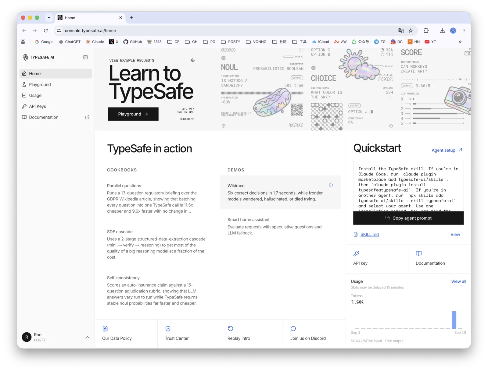
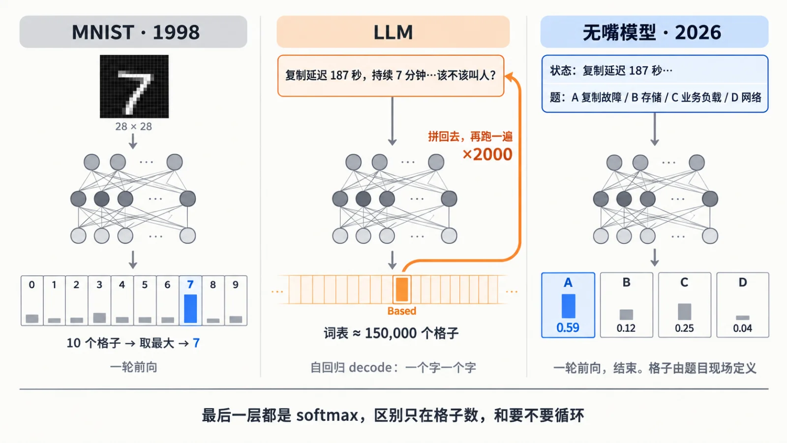
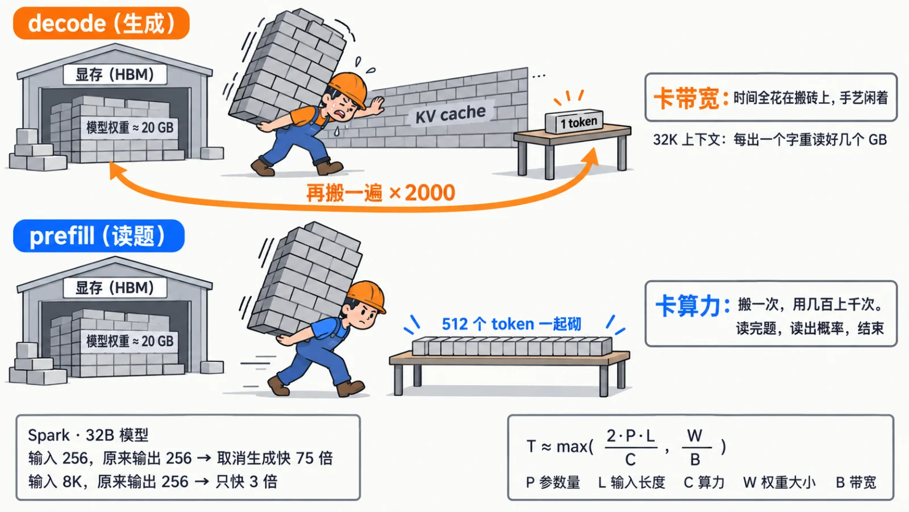
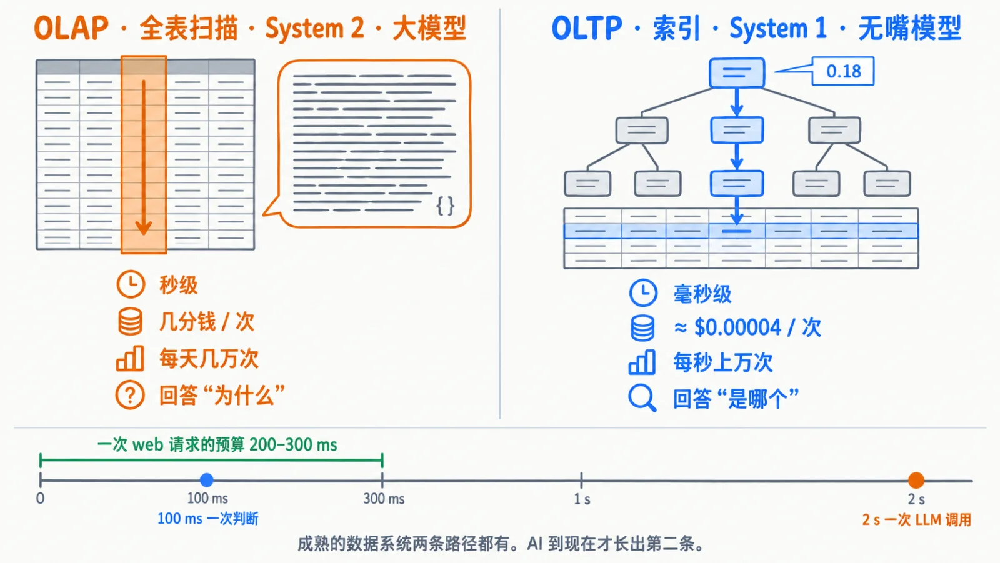
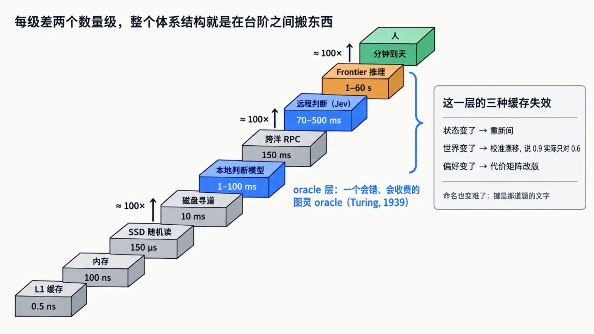
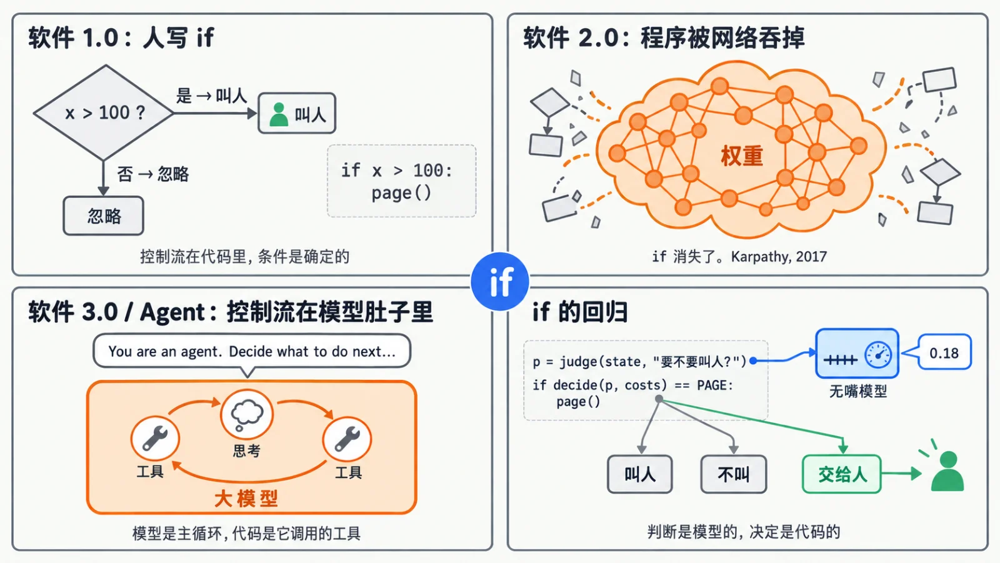
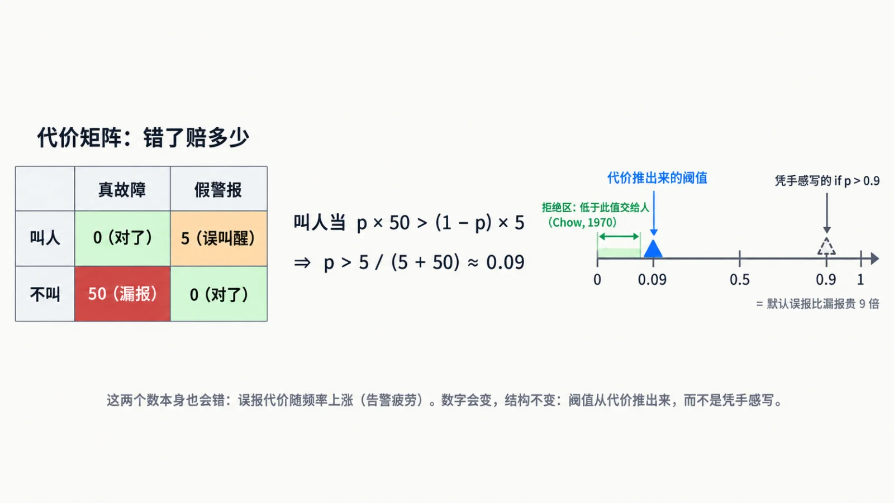
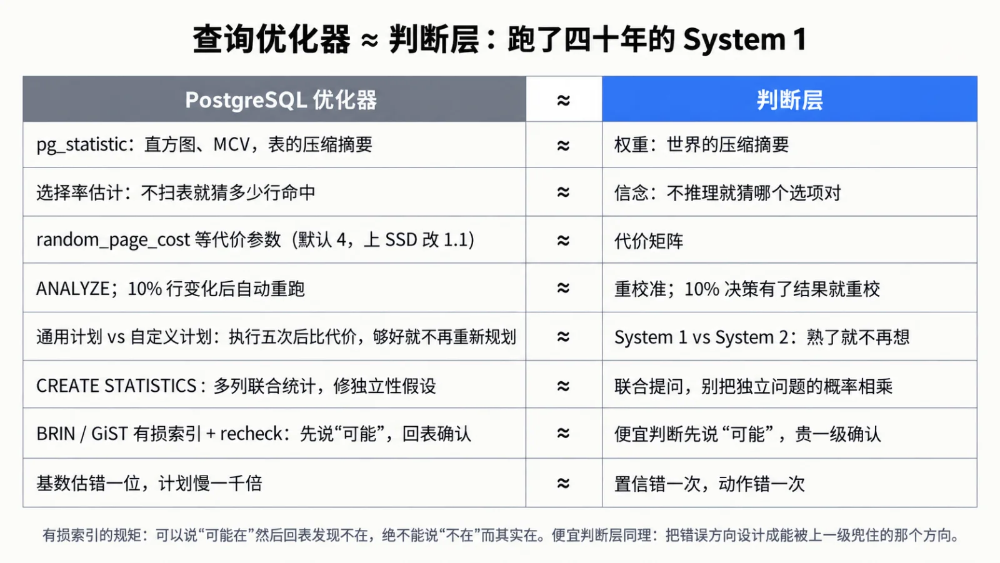
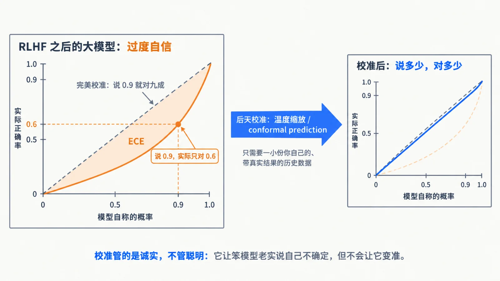

半夜三点，一条告警：复制延迟 187 秒，持续七分钟，生产集群，两个从库都活着。该不该把值班 DBA 叫醒？

这是一个 bit 的问题。

交给一个默认开着推理的大模型，常见的做法是：复述指标，分析原因，权衡误报，最后吐一段 JSON：`{"page": true}`。两秒，几分钱。程序只想拿个返回值，模型先开了一场答辩。

复杂事故值得这么想。但每一条工单、每一次路由、每一步工具调用都走这一套，就不对了。大量判断只要一个很短的答案，我们却给它套上了长篇生成的外壳。

9 月 15 日，一家叫 TypeSafe 的公司发布了 Jev，拿了 DCVC 领投的四千万美元种子轮。这个模型不会说话。你给它一段状态和一组题：哪类故障、几级严重、要不要立即关注。
它一次把所有题的概率分布吐回来。按官方口径，70 到 500 毫秒，输入 0.042 美元一百万 token，输出不收费。它不写作文，不生成代码，不解释自己，
只做一件事：看一眼，给每个选项一个概率。

第一反应：这不是残废吗。第二反应：这才是很多程序真正想要的形态 —— **无嘴模型**

这篇不是 Jev 的评测。它发布才几天，还在内测，我不会把一篇文章押在一家创业公司身上。它值得写，是因为它把一件早就能做、却一直没有成为通用接口的事，摆到了台面上。
下面回答三个问题：这东西是什么，值多少钱，该放在软件的哪一层。答案合起来是一句话：过去几年，我们一直在用 OLAP 的引擎跑 OLTP 的活。

--------

# 上篇 · 它是什么

## 一、用作文回答判断题

程序里很多需要“智能”的地方，不需要一篇文章。工单归哪个部门、输入有没有注入迹象、候选文档相关不相关、Agent 要执行的操作像不像误操作，
全是选择题、判断题、评分题，答案空间事先就知道。

可今天要从大模型手里拿到这几个 bit，流程往往是：写 prompt，让它生成一段合 schema 的 JSON，解析，校验，失败重试，再把字段抠出来。任务稍复杂一点，
还要加上推理和另一个模型的复核。一个 bit 穿着一身 token 的马甲。

公平地说，没有谁规定判断题必须先写作文。关掉推理、限制输出、直接读候选 token 的概率，都能省掉大量开销，后面我会拿它当基线来比。
问题在于主流的产品和工具链仍然习惯从“生成一段文本”出发，再把文本改造成程序需要的返回值。

聊天框太成功了。ChatGPT 是 2022 年 11 月的一个产品决定，在那之前 GPT-3 只是一个补全接口。那个聊天框把整个行业锁死在“AI 等于说话”上，之后几年后训练的两条主线服务的都不是程序：
RLHF 服务人，让模型说得让人舒服；RLVR 服务判题器，用可验证的奖励教模型推理。

程序不在乎模型说得舒不舒服。它想调用一个函数，得到一个类型明确的结果，最好还知道这份判断靠不靠谱。Structured Outputs 让 JSON 一定合法，但只要仍然靠逐 token 生成来构造答案，
就还在付生成路径的钱。根子在“一个字一个字”上。

## 二、嘴是怎么缝上的

学神经网络的人第一课都是 MNIST：给一张手写数字，判断是 0 到 9 里的哪个。网络最后一层是十个神经元，过一个 softmax，输出十个加起来等于一的数，取最大的那个就是答案。它不会说话，
也没人觉得它需要说话。没有人提议让它生成一句 “The digit appears to be a seven”，再用正则把 7 抠出来。

大语言模型的末端是同一个结构，只是格子从十个变成十几万个，词表里每个 token 一格。每跑一次前向，它给出“下一个字是什么”的分布；正常生成是挑一个字接在后面，再算下一个。
实际实现靠 KV cache 不重算前文，但后面的字依赖前面的字，路径是串行的，两千字的回答是两千步。那如果压根不要它说话呢？把题写成“A 复制故障 / B 存储 / C 业务负载 / D 网络”，
在该出答案的位置直接把四个格子的概率读出来。一步，结束。

这事一点不新。2020 年 MMLU 出来之后，评测大模型做选择题用的就是这个办法：读那个位置上 A/B/C/D 的 logprob，谁大选谁。
Qwen3-Reranker 的官方示例直接取 yes 和 no 的 logit 归一化成分数。我后面把这类办法统称为**读 logit 基线**：任何模型都能做，不需要新架构，
它已经拿走了“闭嘴”带来的相当一部分收益。

那 Jev 值得关注的是什么？它没有发明分类器，广告点击率模型、风控模型几十年来都在请求链路里毫秒级吐概率。它也不是第一个允许用自然语言定义判断标准的，
Llama Guard 能用提示改分类体系，Qwen3-Reranker 能自定义判断指令。它想做的，是把这件事做成一个完整的产品接口：题目在请求里定义，结果按类型返回，同一份状态上的多个问题一起处理，
概率校准是训练目标（他们叫 RLCD），而不是接口旁边附送的小数。

以前，这些能力跟着一个业务、一份数据集、一支机器学习团队走。现在它有机会变成普通程序员随手调用的通用零件。机制是旧的，改变软件的是交付形态。

打个比方：还是那个大脑，把嘴缝上，额头装一块压力表。题摆到它面前，读完那一刻，压力表就指到某个刻度。它省掉的是展开回答的过程，省不掉理解输入的成本，也变不出把难题变简单的魔法。
“这次切主安不安全”能用是或否回答，却可能需要大量分析。选择题只限制了出口，没有限制求解的难度。凡是要多步推导的结论，它不如一个带 CoT 的小模型；
凡是“看一眼就知道”的题，它接近最强的模型。

还有一条实操：给题目留一个出口，“其他”“信息不足”“需要进一步分析”。真实答案漏在选项之外，模型再类型安全，也只能在错误的世界里分配概率。

## 三、直觉是第零次革命，为什么是现在

我们习惯把这几年讲成“聊天 → 推理 → Agent”。但回头看机制：GPT-3 没有思维链，看一眼上文蹦一个字，用卡尼曼的话说就是 System 1。2022 年思维链、2024 年 o1，
做的都是往这台直觉机上焊 System 2，装草稿纸、工具箱和执行循环。顺序其实是：
直觉 → 聊天 → 推理 → Agent → 现在回头把不需要展开的那部分判断单独拿出来。直觉不是第三次革命，它是第零次。

System 1 和 System 2 在这里是比喻，一次前向也是几十层计算。但比喻抓住了一个有用的区别：有些题读完状态就能给出相当好的判断，有些题需要额外取证、推导、搜索。
分界线在任务需不需要额外的计算过程，跟回答有几个字无关。司马贺 1992 年那句话是理解这条线最好的钥匙：直觉，无非就是识别。象棋大师看一眼棋盘就知道走哪，不是算得快，
是这个局面被认出来了。识别的前提是答案在一个已知的集合里。选项已知的用它，分类、路由、打分、门控；选项未知的，写一段没人写过的代码、
解释一个没见过的故障，还得让模型开口，那是搜索。

这也不跟《[两个半球](https://vonng.com/ai/transformer-left-diffusion-righ/)》打架。那里押的右脑是 Diffusion，是生成式的直觉，直接提出一个候选方向；这里是判别式的直觉，
候选摆好，判断哪个更像。AlphaGo 的 policy network 和 value network，大师两样都有，Jev 只做了后一样。

既然读 logit 早就能做，为什么到今天才值得重新谈？需求侧，Agent 和工作流把语义判断带进了程序内部，每一步工具调用前后都有“相关不相关、完成没有、要不要继续”，
这类问题的数量涨了几个数量级，而且出现在以前没有分类器的地方。供给侧，几 B 到十几 B 的模型在判断类任务上跟最强模型的一致率已经到九成左右，
这个尺寸能在一台工作站甚至笔记本上一百毫秒跑完。再加上有人开始把“知道自己有多确定”当成训练目标。三件事凑齐之前，读 logit 是评测技巧；凑齐之后，它是一层基础设施。

--------

# 中篇 · 它值多少

## 四、搬砖：为什么它快、为什么输出不收费

想象 GPU 是一个工人，模型权重是一仓库的砖，每次干活得把砖搬到工位上。

低并发 decode 的时候，他每搬一遍砖只砌一块，生成一个 token，然后再搬一遍砌下一块。算得不多，搬得不少，时间花在等内存上，行话叫卡带宽，也是推理卡必须配 HBM 的原因。
上下文长了还有一笔账：每砌一块都要把之前砌好的墙，也就是 KV cache，摸一遍，32K 上下文出一个字要读好几个 GB。

prefill 的时候，把输入读一遍，几百上千个 token 一起处理，同一批砖被反复使用，搬砖的成本摊开了，矩阵算力才发挥出来。无嘴模型只做 prefill：读完题，读出概率，结束。
没有 decode 循环，没有 KV cache 重读，没有输出 token。它把这笔账从“低并发下反复搬权重”变成“一次集中的前向计算”。行业早承认这两种负载是两种生物，Mooncake、
DistServe 都在做 PD 分离；无嘴模型等于说，我只要 prefill 节点。

限定要写清楚。“卡带宽”是低 batch 才成立的，吞吐型服务攒一批一起出字也就不卡了；无嘴模型的优势是不用攒，单个请求自己带着几百上千 token 的并行度，所以红利在延迟上。
带宽也不会从此没用，输入很短、模型很大、实现不好的时候照样卡，宏观上 HBM 的需求更不会跌。准确的说法是：这一类负载对硬件的要求变了，
一些不擅长持续出字的设备，可以成为好用的判断服务器。

能快多少，取决于你取消了多少工作。一组以 DGX Spark、32B 模型为对象的情景估算：假设原来要生成 256 token，输入 256 时取消生成快约 75 倍，输入 1K 约 20 倍，输入 8K 只有约 3 倍。
这是负载模型下的估算，不是 Jev 实测，也不是它相对读 logit 基线的优势。规律很朴素：输入短、原来输出长，收益最大。

官方那个“便宜四百倍”拆开看：模型比 frontier 小得多；没有输出 token；同一段状态编码一次问十几个问题。乘起来两个数量级，不需要魔法。厂商不对输出收费，不等于输出不需要计算；
但多问题共享状态这一条对程序里的细粒度判断是实打实的：**成本花在读一遍 state 上，多问一题几乎不加钱。**

## 五、OLTP 时刻

做了十几年数据库，我看很多东西都有数据库的影子，但我觉得这不是职业病，反而提供了一个映射视角。

数据库有两种访问模式，从根上就不一样。点查：按主键取一行，走索引，毫秒级，每秒几十万次。扫描：整表读一遍算个聚合，秒到小时，一天几十个。前者叫 OLTP，后者叫 OLAP。
严格说 OLTP 的核心是事务，我借的是它的访问模式：短、频、快、并发高。两种模式可以放两个系统里，也可以像 PostgreSQL 这样一个引擎两条路径。但没人会拿全表扫描回答每一次用户登录。

过去几年，大模型一直是 OLAP。重、慢、贵，一天跑不了几万次。它做的事本质上也是全表扫描：把整个上下文读一遍，把推理过程写一遍，把结论从头推到尾。这个能力了不起，写代码、
分析故障、定计划，多想一会儿答案更好。但不是每个程序分支都该走这条路。

无嘴模型是 AI 的 OLTP。点查，毫秒级，便宜到随手调，回答“是哪个”而不是“为什么”。用数据库的话说：**System 2 是全表扫描，System 1 是走索引。** 它当然没有长出一棵神经 B-tree，
照样要读输入、跑网络；像索引的地方，是把学过的大量模式变成一条快路径，不必每次重新展开一篇论证。成熟的数据系统两条路径都有，AI 的第二条通用路径到现在才长出来。

OLTP 当年真正改变的不是报表变快，而是一整类应用得以存在：在线交易、实时库存、网上银行。共同点是把数据库放进了请求链路，用户点一下，几十毫秒内必须给答案。
一个 web 请求的预算两三百毫秒，两秒的模型调用永远进不了这个链路，只能异步：后台 Agent、批处理标注、聊天框。专用分类器一直在链路里，
新的是临时定义的题也能进去，不必每加一道题就开一个模型项目。

这不是快了一个数量级，是换了一个可以存在的位置。

OLTP 还带来可预估和纪律。一次生成的耗时取决于它想说多长，一次判断的耗时由模型和输入长度决定，能算出来；公式不是 SLO，排队、网络照样影响尾延迟，但至少有了预算的基础。
纪律是老规矩：行要短，查询要点查，别在事务里扫全表，翻过来就是 state 要精炼，选项要固定，问题要原子，超时要有退路。把几十页日志塞进去要求一眼判断，就是在 OLTP 库里跑报表。

OLTP 回答的是它在哪、守什么规矩。它怎么用，是下篇的事。

## 六、本地硬件：这次是真的

这条快路径也给本地 AI 找到了一个比“在家聊天”更清楚的位置。下面这张表是一份情景估算：512 token 输入、稠密模型、4-bit 量化、单请求、权重常驻，
锚点是 Spark 上公开的 llama.cpp 测试，其余按同一模型推算，不是端到端实测。

它说明不了哪个模型判断得准，也不能证明一个本地 8B 能替代 Jev。它只回答：假设能力够用，这个尺寸的前向计算落在哪个延迟档位。

装得下多大的模型，和能实时用多大的模型，差距很大。Spark 能装 120B，但一次判断两秒半；它的实时能力在 3B 到十几 B：3B 几十毫秒，8B 一两百毫秒，32B 亚秒级。
大统一内存也没有普遍击败独立 GPU：模型装得下时，有效矩阵算力依然是王，5090 跑 8B 约 45 毫秒，不到 Spark 的三分之一。独显的限制是容量，
统一内存的价值是容量、形态、功耗约束下的可用性。

整理状态往往比换更大的模型更划算。几百 token 的结构化摘要和几千 token 的原始日志不是同一个性能问题，先让确定性程序汇总关键指标、变更、证据，再交给模型。批处理也别想当然：
prefill 已经吃满算力时，攒批主要是在加等待，Spark 上 32B 从 batch=1 到 16，吞吐只涨 16%，等待从 0.67 秒变成 9.2 秒；输入特别短或设备吃不满时，攒批才有用。
最该看的指标是响应预算内每秒能完成多少个质量过关的判断，而不是峰值 QPS。

经济账也得这么算。按 Jev 标价，每次 1K 输入 token、每秒十次、连续三十天，输入费用约 1,089 美元。这个数说明的是量级，推不出“买台工作站几个月回本”：你得先证明本地模型够准，
机器在目标延迟内扛得住这份流量，再算利用率、电费、运维。本地真正有吸引力的场景，是判断足够频繁、状态又不适合离开本地：内部日志、工单、邮件、屏幕内容、运维指标。

苹果其实已经把这套架构造出来了：端侧模型，不够用升级到 Private Cloud Compute，再不够经用户许可才上第三方。三级级联，按需升级，只差把概率做成一等公民。
本地 AI 的叙事会从“在家跑一个聊天机器人”转向“身边放一个持续工作的判断器”。

--------

# 下篇 · 它放在哪

## 七、层级里的新一层

软件一直在按延迟和代价分层：能在内存解决的别去磁盘，能在本地解决的别绕半个地球。这个习惯可以往上延伸。

确定性规则先做，快模型判断，难题交给慢模型，重要分歧升级给人。每级差两个数量级，跟内存到磁盘到跨洋 RPC 的台阶间距一样。这一级我叫它 **oracle 层**：
程序把一个边界明确的问题交给黑盒，黑盒一步返回判断。这是图灵 1939 年 oracle machine 的形状，只差两点，它会错，而且它收费。它也像一层缓存，但不是按键存答案的那种：
一个模型没见过你这条告警，却把“这类局面通常意味着什么”压进了权重。更准确地说，是一层物化的推理。

于是 Karlton 那句老话回来了：计算机科学只有两件难事，缓存失效和命名。

经典缓存只有一种失效：底层数据变了。判断层有三种。状态变了，重新问。世界的规律变了，线上换了 PG 版本、业务改了流量模式，模型还说 0.9、实际只对六成，这叫校准漂移，
要重新检查模型表现。第三种经典缓存根本没有：你的偏好变了，去年漏报很贵，今年团队扛不住误报，同样的 0.7 从“叫人”变成“不叫”，这时要改的是决策策略，
不一定是模型。三种失效各管各的，别混着处理。

命名也变难了。缓存的键是那道题的文字，“这条告警紧急吗”和“这条告警需要立即处理吗”在人看来差不多，在系统里已经是两道题、两个分布、两套阈值历史。判断题需要注册、命名、版本化，
否则一个团队问十种写法，攒出十份互不相认的数据。Karlton 说命名难，说的是变量名；这回难的是给“问题本身”起名。

还有一件事是这一层真正的分量。传统接口努力提供确定的语义：底下可以丢包、重试、纠错，上面看到的是一次明确的成功或失败，`if` 就是 `if`。语义判断不能靠重试变成事实，
同一个模型重复十次可能十次都自信地错。这层接口不该把不确定性藏起来、硬塞给应用一个看似可靠的布尔值，它应该把判断和不确定性一起交上去。1984 年的端到端论证早就说过：
只有端点知道出错的代价，所以功能必须放在端点。翻过来说，**只有应用知道判断错了要赔多少，所以概率可以来自模型，代价必须写在应用层。**

## 八、if 的回归

概率传到应用层之后，软件长成什么样？

Karpathy 2017 年提出软件 2.0：1.0 是人写的代码，2.0 是训练出来的权重，整个程序被一张网络吞掉，if 消失了。后来他又提了 3.0：用英语写 prompt，控制流长在模型肚子里，
Agent 是这条路的顶点，模型控制循环，代码充当工具。判断层提供另一种结构：代码控制循环，模型是其中一个返回概率的函数。**if 回来了。** 程序员当然一直会写分支，变的是分支的归属：
模型不再包办“看见什么、怎么想、该做什么”，它只负责其中的估计。判断是模型的，决定是代码的。

落到 Agent 上很自然：终止检查、相关性过滤、初步校验先交给快层，真正需要规划和推导的岔路口再让大模型展开。一个推理者配一组便宜判断者，比一群互相聊天的 Agent 便宜，
也更容易追踪每一步为什么发生。但别借机把所有规则都换成概率：维护窗口、权限、对象是否存在、SQL 是否满足硬约束，能由程序确定的继续由程序确定，模型补的是规则难写的部分。

## 九、阈值是代价的影子

先纠正一个最容易犯的错。别直接问模型“要不要叫人”，拿到 0.18 就当客观概率。“要不要”已经掺进了代价，你再用代价矩阵算一遍，
等于把价值判断算了两次。更清楚的分工是：模型估计事实，
这是否符合我们定义的真实事故标准；程序结合误报、漏报、时间和权限决定动作。也别把接口里的 confidence、某个选项的概率和“这次动作正确的概率”当成同一个数，
前者是从输出分布归纳出来的统计量，能不能撑住你的动作要拿业务数据验。

假设手里已经有一个经过验证的、对真实故障的概率 p。所有人凭直觉写 `if p > 0.9`。这一行代码藏了一句没写出来的话：“我认为误报比漏报贵九倍”，而告警场景下这句话几乎肯定是错的。
1970 年 C. K. Chow 就证明了：阈值不是字面量，它是代价的影子。漏掉一次真实故障赔 50，误叫醒一次赔 5，叫人的条件是 5(1−p) < 50p，也就是 p 大于 5/(5+50)，约 0.09。
**不是 0.9，是 0.09。** 这两个数本身当然也会错，
误报太多会告警疲劳，等待有时间成本，有些动作不能撤销。但先把账写出来，总比把价值判断藏在一个 0.9 里强。当最大概率低于某个阈值，最优策略是拒绝判断、交给人，
那个阈值同样由拒绝的代价推出来。你的“置信门”，就是 Chow's rule。

于是程序员的活会变：决策层从过程式变成声明式。不再写“延迟大于 60 秒且持续 5 分钟就叫人”，而是写清楚问 oracle 什么、有哪些动作、哪种组合赔多少，阈值和升级路径由运行时推导。
这和 SQL 的跃迁同构：你声明要什么，优化器带着代价模型决定怎么做。八十年代的专家系统走过一遍，贝叶斯网络加效用函数，死在知识要专家手写、写不过来；现在知识不用手写了，
剩下给人的活恰好是当年剩下的那一样：写效用。

代价矩阵多半写不出来，只能引出来。人对数值效用的判断极差，实际会发生的是程序员给一堆例子，加上每一次人工推翻系统的记录，系统反推隐含的代价。系统按你写的代价优化，
你写的代价是真实目标的代理，写“减少误报”，它就学会该叫的也不叫。动作也不必只有做和不做：继续观察、补充取证、交给更强的模型、叫人，每一级都要算账，
多等两秒多花一笔钱预期能少多少错。一开始完全可以用固定的升级策略，攒够反馈再优化。

## 十、每个程序都要长出一个优化器

拿压缩过的信息做估计，结合代价选执行路径，在真正干活前决定怎么干活。数据库人应该很眼熟：这就是查询优化器每天干的事。它在生产里跑了四十年，失败模式和解药全有案可查。

`random_page_cost` 默认 4，DBA 上了 SSD 改成 1.1，这就是“编程变成写代价”在数据库里的具体形态，而且它暴露了同样的毛病：默认值对现代硬件是错的，没人知道该填几，
所以社区一直在试从执行反馈里学代价参数。“代价能不能写出来”，planner 早就给了答案：写不好，得学。有损索引是另一个思路：BRIN、GiST 先保守地说“可能”，再回表确认，
但它说“不在”就一定不在。神经判断器给不出这种单向保证，它能做的是把系统设计成偏向保守升级，多叫醒一次是能被上一级兜住的错，漏掉一次不是。这是一种设计偏好，给不了数学保证。

数据库留下的教训可以照抄。

第一，估计进入控制流，后果极不均匀。选择率估错一个数量级，可能只多花几毫秒，也可能选中一条慢一千倍的执行路径，嵌套循环 join 的惨状每个 DBA 都见过。判断层一样：
99% 的决策省了钱，1% 捅了大娄子。所以不能只看平均正确率，高风险动作要问：估计错了最坏会怎样，有没有一条没那么激进但不容易出大事的路。多问几个问题也不等于多几份独立证据：
同一份状态交给同一个模型问十种相近的题，很可能只是让它把同一个误判重复十遍。把不同维度加权成综合分数没问题，但别把综合评分当成概率，
更别把高度相关的判断当成十位互不认识的专家一致投票。planner 把相关列的选择率直接相乘吃过的亏，PG 10 才用多列统计补上。

第二，学习型估计器死在失效上。2019 年前后一批工作用神经网络替代直方图做基数估计，精度碾压传统方法；2021 年 VLDB 有一篇《我们准备好用学习型基数估计了吗》，结论是没有：
数据一更新模型就过时，重训太贵，偶尔的离谱错误比稳定的平庸错误更致命。这几乎是给判断层写的预告片。神经判断器进生产的瓶颈不在准确率，
在失效检测和重校的成本，活下来的是持续拿执行反馈修正的路子。

最后是审计。**审计表是决策的 WAL**：先记题目版本、模型版本、状态证据、输出分布、代价策略、实际动作，再动手，最终结果回填。状态要存可追溯的快照，哈希只能校验。
有了这些才谈得上追踪决策、比较策略、找出模型在哪些场景失效。但别顺手把 PITR 也搬过来：数据库能重放已经记录的变化，决策系统却不能凭日志知道没发生的世界。当时叫醒了 DBA，
故障修好了，不代表不叫人也没事；换阈值能重算当时会选什么，算不出换动作后的真实后果，那需要反馈数据和评估设计。日志是起点，不是时间机器。

## 十一、零幻觉的真相

写到这儿该泼冷水了，不然这篇就成了软文。

TypeSafe 最响的宣传是“不会幻觉”。翻译一下：它保证输出符合事先规定的类型和选项，不会编出一个不存在的类别；官方也承认那个“0%”是 schema 保证推出来的，没测过。
但从五个选项里选错一个，完全可能。格式保真，判断照样会错。输出受约束也不等于输入攻击失效：攻击者不需要让模型说一句越界的话，只要把它推向错误的合法选项。

“快 193 倍、便宜 444 倍”要放回比较口径里：那是特定工作流相对结构化 LLM 调用的结果，官方自己说属于“现实收益的高端”，
参考标签是强模型的判断而不是事实；他们用 DSPy 做的小 demo，
整条流水线只快了 15.9%、便宜了 30%。自家公布的 benchmark 准确率六成八，跟中档模型一个水平；一家做金融研报评分的团队跑了六千次对比，它跟最强模型的判断一致率九成出头，
一致率不是准确率。所以它是一个“便宜到可以多请一位读者”的东西，当不了最终裁判。

读 logit 基线已经拿走了相当一部分收益，所以 Jev 真正要证明的不是能不能闭嘴，而是闭嘴之后能否同时保住跨任务理解、判断质量、多问题效率、概率校准和服务稳定性。
比较对象不该只有最贵的推理模型，还得有单 token 判断、reranker、专用分类器、为业务蒸馏的小模型。

最值得追问的是它给出的概率有没有用。

校准的意思大致是：报九成的那一组预测，最终确实有约九成成立。它说的是一组预测整体上诚实，给不了单次的保证。而且诚实不等于聪明：在正负各半的数据上，
一个永远回答 0.5 的模型校准得完美，却毫无区分能力。所以要同时看两件事，它能分清多少问题，它对自己的错误有没有可靠的信号。落到自动化上就是：
在可接受的风险下，能让多少任务不再打扰人。

这一项今天零公开证据：没有论文，没有权重，没有 ECE、Brier、可靠性曲线。“calibrated” 是一个 claim，不是一个 result。不过校准可以后天做：
温度缩放这类方法能用带标签的数据调整概率；conformal prediction 则在相应统计条件下构造带覆盖保证的预测集合。两者都不是给一个小数盖个章，世界变了、数据漂了，效果还得重查。
这也接上了《[小脑](https://vonng.com/ai/cerebellum/)》：基础模型提供的是种群的经验，你自己的历史结果才决定它如何适应这套系统。真正值钱的是真实、
持续、可解释的反馈，日志的条数本身不算。

反方也得写。判别式 judge 有天花板，2025 年 GenRM、DeepSeek-GRM 都发现让评判模型先推理再打分在难题上更准。快层的价值是把容易的接走，把真正需要额外计算的交出去。

## 十二、脊髓里的依赖

一个总结功能坏了，通常只是少一份总结。一个进入控制流的判断服务坏了，影响的是整个业务怎么往下走。LLM 依赖在软件的皮肤上，这种依赖在软件的脊髓里。远程服务不是一概不能用，
但程序的基本行为不能绑死在一个你无法控制、无法替换的 API 上。它超时了怎么办？网络断了默认放行、默认拒绝，还是回到原来的规则？这些必须由你决定，不能留给一次 HTTP 请求的命运。
TypeSafe 是美国托管的闭源 SaaS，这条路它自己走不通，但会有人替它走通。

开源替代的接口门槛不高：reward model 本来就是不说话的模型，每家实验室手里都有一堆；vLLM 早就支持 classify、reward 模式；
TypeSafe 自己评测的参考答案是 GPT-6 Astra 和 Fable 5.1 的平均，把 frontier 的直觉蒸馏进小模型这条路对 Qwen 和 GLM 毫无障碍。难复制的是换任务、换语言、换选项之后判断还稳、
概率还有意义，那需要训练、数据和评测。所以价值不一定留在第一个把方向喊响的公司手里，它可能转移到各领域的结果数据、判断题库、校准流程和低延迟运行时。
TypeSafe 大概率是“发明了 embedding API 的那家”，而不是靠它赢的那家。

随之而来的是决策通胀。当判断足够便宜，系统会长成一锅概率分支汤，每个 if 后面一个模型，每个模型一个版本，每个阈值一段历史。谁判断的、看到了什么、为什么动手、最后对不对，
全得有地方查。监管迟早会像索要渗透测试报告一样索要校准报告。

对数据密集型应用，我认为数据库是这套决策平面的自然宿主：问题和策略需要版本，状态和证据需要保存，动作需要权限，结果需要回填，审计需要查询。但宿主不等于把模型调用塞进每个事务、
拿着锁等一次网络往返。数据库负责记账和治理，推理服务负责计算，执行系统守住动作边界。SQL 优化器知道一个函数很贵，却不会因为你填了 COST 就懂一次漏报值多少钱；
外部动作也不会因为事务回滚就跟着没发生。

明天开始做，顺序很朴素。先挑一道反复出现、边界清楚、错误可发现的问题。把状态、判断、人工处理和最终结果记下来，这张表比模型重要。写清楚动作代价与硬约束，哪怕写错，
写出来的错代价也比藏在 0.9 里的代价好。让模型跑影子模式，只看它会怎么判，不让它接管。等反馈覆盖了典型情况和足够多的异常，再从低风险、可逆的动作开始。别第一天就把值班电话拔了。

## 十三、预测

一篇讲校准的文章，作者该敢给自己的预测标概率。以下从 2026 年 9 月 18 日起算，是押注，到期逐项结算 Brier 分数。

| 预测                                              | 时限     | 概率 |
| ------------------------------------------------- | -------- | ---- |
| 可本地部署、多问题、带概率的开源判断模型出现      | 12 个月  | 0.9  |
| 主流工作流引擎加原生 judge 步骤                   | 2 年     | 0.85 |
| 主流 Agent 框架把终止/校验/路由下沉到快层成为默认 | 18 个月  | 0.75 |
| 判断力加校准的公开排行榜，如 MTEB 之于 embedding  | 12 个月  | 0.7  |
| 端侧持续判断成为语音/相机之后的主流 NPU 负载      | 3 年     | 0.6  |
| 监管开始索要校准报告或风险覆盖曲线                | 5 年     | 0.5  |
| TypeSafe 成为这个品类的长期赢家                   | 5 年     | 0.15 |
| HBM 总需求因此下降                                | 任何时限 | 0.05 |

八条从 0.9 排到 0.05，最看好开源判断模型一年内出现，最不看好 HBM 需求因此下降。会让这套判断缩水的情况有三种：快模型的能力天花板太低，只能接走很少的任务，
省下的调用抵不过升级和误判的成本；概率一换场景就失真、失效又难以发现，那这条路只能先在反馈快、可验证、风险可控的业务里成立；其他推理方式变得足够便宜、足够快，
让今天的经济差距迅速缩小。所以两根桩子先钉住：减少不必要的串行生成，是结构上的变化；便宜多少倍，是特定比较下的结果。靠“便宜四百倍”立论的都要打折，靠“一百毫秒、
进请求链路”立论的可以不打。最终算账要在质量过关的前提下，把正确率一起砍了，当然什么都能变快。

## 尾声：闭嘴是便宜的

绕回开头那条告警。

老 DBA 盯着监控说“这味儿不对”的时候，脑子里未必已经有一条完整推理链，CPU、IO、连接数、复制延迟、业务流量放在一起，某个组合让他心里一紧。
这类识别有机会被工程化成一个便宜的判断：
读一段状态，给一份分布，再由程序决定接下来怎么办。能用规则解决的，规则先做；规则说不清的组合信号，交给模型；模型拿不准或者动作代价太大，再取证、升级、叫人。

它可以给工单分类、过滤候选、标记风险，也可以在明确授权下处理低风险、可逆、可复核的动作。但 failover、恢复备份、DDL、删数据，
这些操作的最终授权不能只来自一个模型说自己“很有把握”，换成一个会写五千字解释的模型也一样。高风险动作需要事前证据、硬约束和责任边界。
**概率不能自行兑换成权限。** 人放在层级的顶端，
首要原因是责任必须有归属，准确率排第二：软件可以返回概率，组织必须承接后果。

《[两个半球](https://vonng.com/ai/transformer-left-diffusion-righ/)》讲架构，《[小脑](https://vonng.com/ai/cerebellum/)》讲身体和历史，这一篇讲接口和经济：
直觉怎么被定价、怎么被交付、怎么进入软件的请求链路。

大模型让机器学会了说话。Agent 让机器学会了动手。

这一波，让机器学会了闭嘴。

而闭嘴，是便宜的。

> 本文AI含量：70%，提示：如果 AI 辅助写作不合您的口味，不用评论 “AI 写的”，取消关注本号即可。