A couple of weeks ago, I just wanted a decent-looking documentation theme for a few new projects.

A couple of weeks later, I had **migrated all 18 of my websites to it**.

Pigsty's Chinese and English documentation, Silo, PIG, SOW, PG Exporter, the company homepage, my personal blog, and multilingual books such as *Designing Data-Intensive Applications* now all run on the same framework.

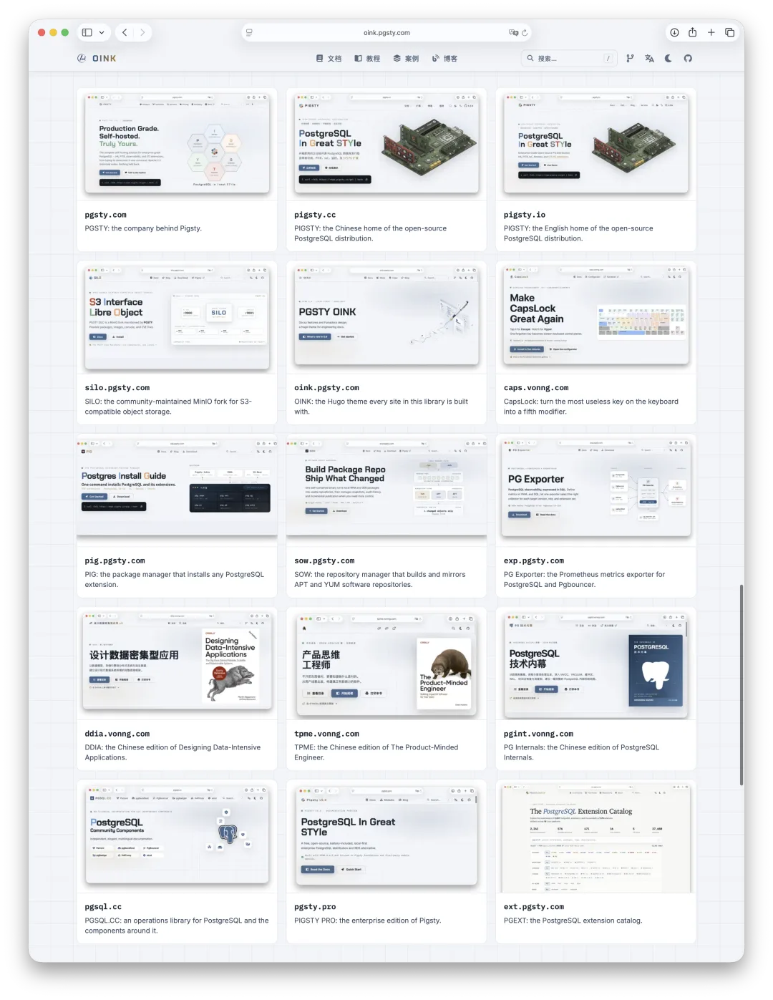

This was more than a fresh coat of paint. Those eighteen sites differ in structure, language, scale, and purpose: large technical manuals with over a thousand pages, small tools with just a few, blogs, books, download sites, and landing pages built purely to introduce a product.

Moving them all was a substantial undertaking.

But the strongest endorsement an author can give a tool isn't a list of features in its README or a pile of GitHub stars. It's **whether they're willing to put everything they run in production on it**.

I have. So I think Oink is finally ready for a proper release.

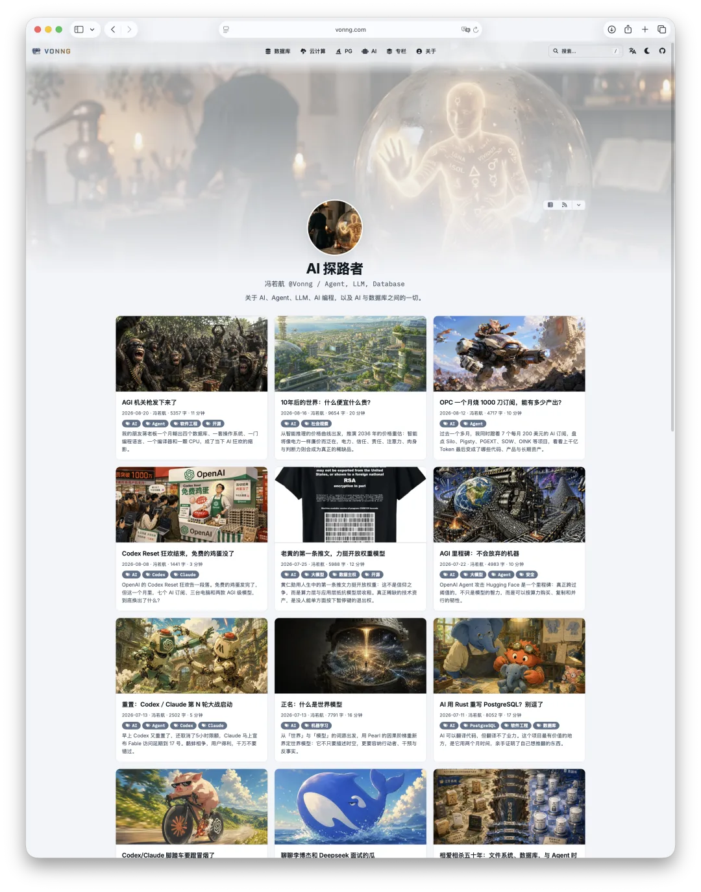

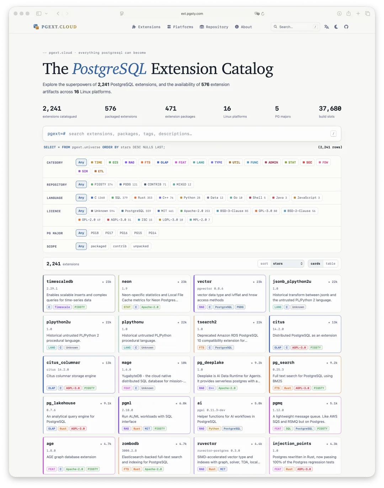

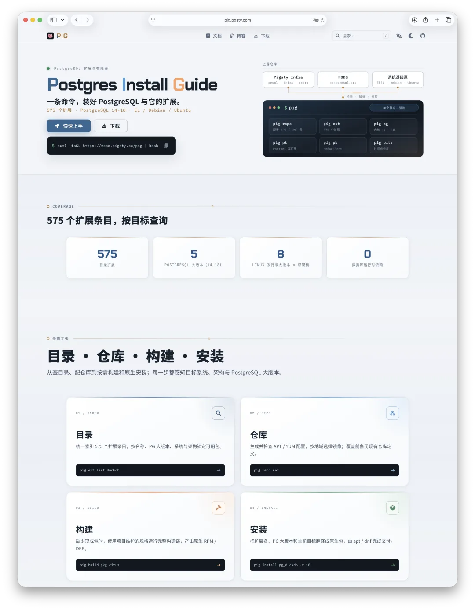

---

## What is Oink?

Oink is a local-first Markdown documentation framework that works out of the box.

You need three things:

Markdown.

A Hugo Extended binary.

A Git repository.

Together, they give you a complete, modern website with search, printing, light and dark modes, multiple languages, and versioned documentation. Deploy it to GitHub Pages, Cloudflare Pages, Nginx, or any static server, and publish updates with a Git push.

The build needs no Node.js, `npm install`, PostCSS, external CDN, or persistent backend service. Fonts, styles, icons, and interactive runtimes ship locally with the project. A single `hugo` command produces a complete directory of static files. You can build and serve it offline.

Of course, you can also leave all of that to Claude or Codex.

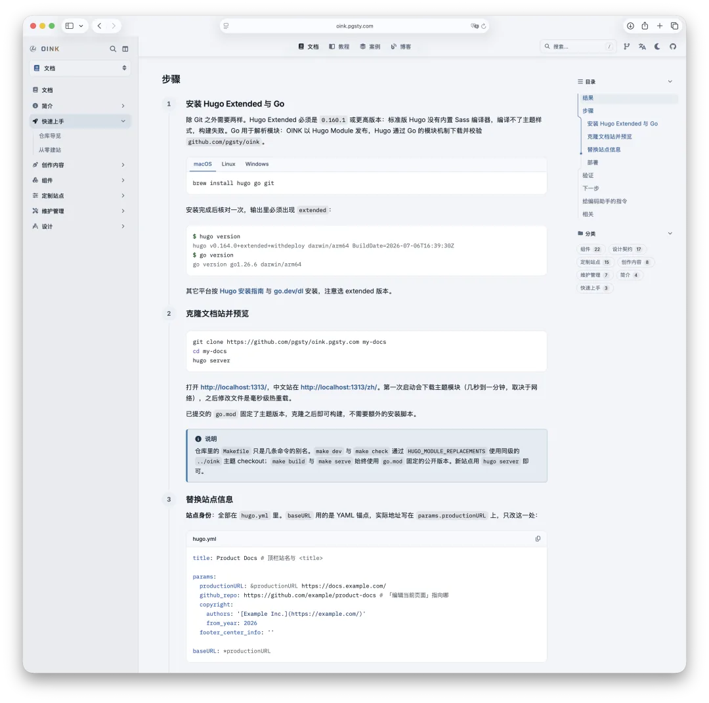

You can call it a Hugo theme, but I think that undersells it. I prefer **a documentation distribution**. A typical theme answers “What should the page look like?” Oink addresses the whole system:

- How to organize content.
- How documentation, blogs, and books can coexist.
- How to handle search, navigation, languages, and versions.
- How to author technical components.
- How to deliver the same content to browsers, printers, and AI agents.
- How to build, check, deploy, upgrade, and maintain a site over time.

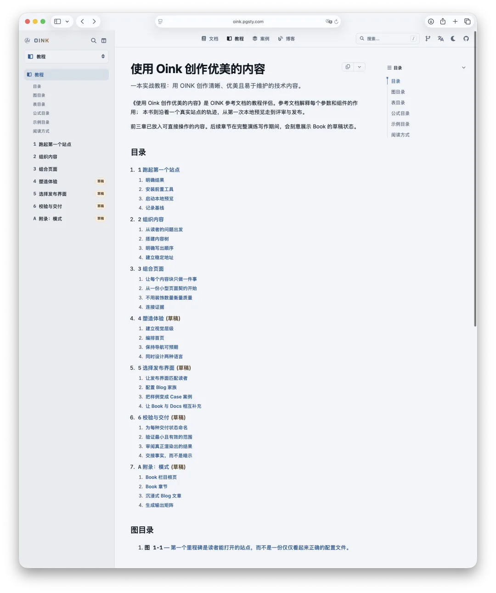

In other words, this is more than a new face for Docsy. It packages the lessons, judgments, and components I've accumulated over years of maintaining engineering documentation into a complete publishing workflow.

**Markdown in, Modern Docs out.**

That's Oink's core idea.

The name is simple, too: **Ink** for writing and documentation, **Oink** for the pigs in the Pigsty family. Treat the README's **Open, Indexed, Navigable, Knowledge** as a bonus backronym.

---

## Why now?

Because writing code has become remarkably fast.

Building the functionality used to take most of the time when starting an open-source project. With Codex, Claude Code, and other agents, a prototype can now emerge in an afternoon. Repositories, tools, components, and small products are multiplying.

But finishing the code is only the beginning.

You still need a README, installation instructions, configuration documentation, release notes, and API documentation. A blog and product homepage would help, too. Without them, the code exists, but people don't know what it is, what problem it solves, how to use it, or where to find answers when something breaks.

**AI has drastically reduced the cost of producing code. It hasn't removed the need for documentation. It has created more things that need explaining, organizing, and delivering.**

Documentation is shifting from an afterthought to an increasingly visible bottleneck in shipping a project.

Meanwhile, Markdown is taking on a new role.

We used to describe it as the common format programmers use for documentation. In practice, it has become a shared protocol between people and AI agents. READMEs, AGENTS.md, skills, task descriptions, project memories, design documents, knowledge bases: more and more information ends up in Markdown.

That is a significant change.

Earlier documentation frameworks focused mainly on rendering content for people in a browser. A modern documentation system also needs to ask:

- Can AI read the content directly?
- Can it be copied without losing information?
- Does each page have a clean Markdown version?
- Does the site have an index machines can discover?
- Are the source files cluttered with syntax that only matters to a particular frontend framework?

Oink generates a corresponding `.md` version of every page and an `llms.txt` index at the site root. It provides “Copy as Markdown,” “View Markdown source,” and optional “Open in ChatGPT / Claude” actions. These are static build outputs: they need no extra service and don't quietly upload your content anywhere.

So Oink does more than claim to “support AI.”

Its content model starts from one assumption: **the documentation must serve both human readers and machines**.

---

## I've had enough of modern documentation frameworks

There is another, simpler reason I built Oink: I was fed up with the available documentation frameworks.

They work, and some are excellent. But they tend to demand tradeoffs I'm unwilling to make.

### MDX: expressive pages, framework-specific content

First, there are the frameworks built heavily around MDX.

I understand the appeal. You can drop React components directly into Markdown and render almost anything you can imagine.

The cost is just as clear: content and presentation logic become entangled.

Component tags, attributes, nested containers, imports, and other framework-specific constructs gradually spread through the documentation. Eventually, it looks less like Markdown and more like JSX wearing a Markdown disguise.

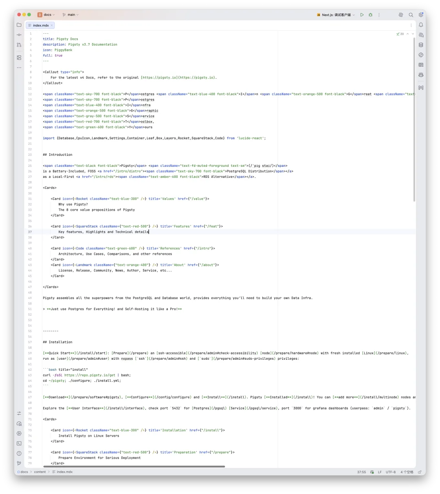

That creates three problems.

First, people reading the source have to wade through noise.

Second, AI agents waste context on presentation details unrelated to the content.

Third, when you want to change frameworks, the lock-in reaches into the content itself.

I've always believed that **presentation should have a light footprint in content**.

Content is a long-term asset; a theme is something it wears for a while. Encoding words that will still matter in ten years in a frontend framework's private DSL just to get a nice tab panel today is a poor trade.

### Node.js: maintain a frontend project before you can write docs

The second problem is the modern frontend toolchain.

You want to write a few pages of documentation. Instead, you first acquire a `package.json`, two lockfiles, hundreds of megabytes of `node_modules`, a bundler, plugins, theme packages, and a string of version constraints.

Even when the result is just static pages, building them increasingly feels like maintaining a frontend application.

This is no inherent fault of Node.js. These tools earn their place in complex web applications. For documentation, though, I often find them excessive.

Documentation should be the part of a project that is:

- Easiest to build.
- Easiest to move elsewhere.
- Easiest to preserve offline.
- Least likely to break after a dependency update.

Instead, the opposite happens.

The code still compiles, but the docs site breaks over a plugin, lockfile, or build environment. You want to fix a typo and first have to work out why today's build behaves differently from the one six months ago.

I don't enjoy that.

### Lightweight tools fall short; full-featured ones look dated

Lightweight tools such as Docsify are simple. But once you need extensive navigation, multiple languages and versions, printing, SEO, complex components, book cross-references, and a complete publishing workflow, you soon reach their limits.

Docsy has the opposite problem. Its content model and engineering are mature: Google started it, and many CNCF projects use it. But the default interface looks dated, and parts of the implementation still carry baggage from an earlier era of frontend development.

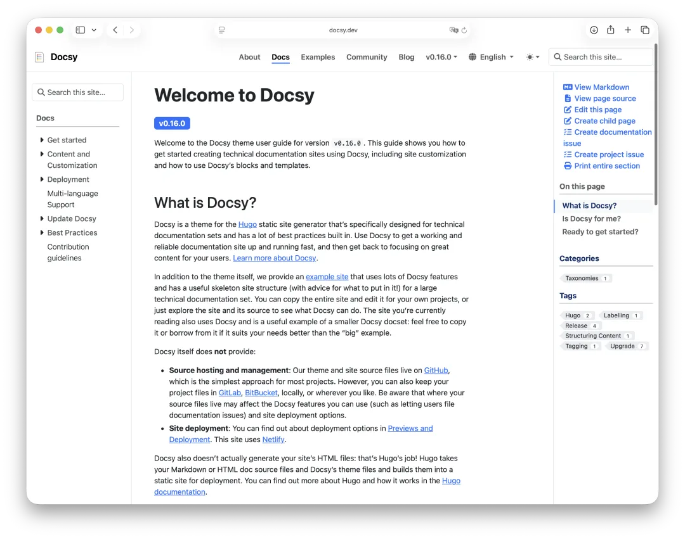

I've also used Hextra and Blowfish, and I like both. Hextra works well for documentation and books; Blowfish works well for blogs. But with more than a dozen sites to maintain, I don't want three content dialects, three configuration systems, and three sets of customization logic.

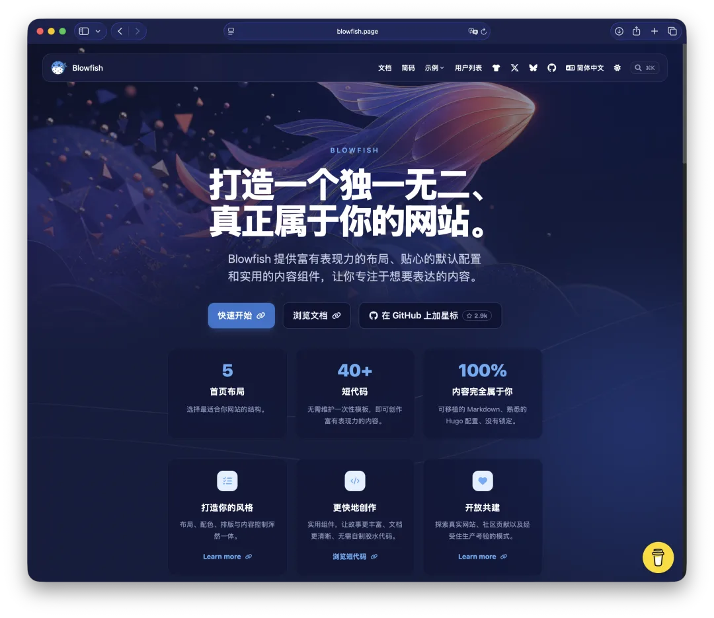

My requirements became clear:

> Is there one framework for documentation, blogs, books, product homepages, releases, downloads, and API references that still uses plain Markdown, builds static files, works locally, and remains maintainable over time?

Nothing quite fit.

So I built one.

---

## Oink's answer: keep content clean and put complexity in the framework

Oink began with the needs of more than a dozen real websites, rather than a visual mockup.

I collected the capabilities those sites actually needed, then looked for the simplest, most stable abstractions they could share.

A few clear principles emerged.

---

## First: prefer native Markdown

Oink's first principle isn't “no components.” It's this:

> **If native Markdown can express it, don't invent new syntax.**

A step list, for example, is still an ordinary ordered list. Add one line of attributes after it:

Outside Oink, it remains an ordered list that people and other Markdown tools can read.

File trees follow the same approach. Many frameworks require layers of nested components. Oink uses a fenced block that is close to plain text:

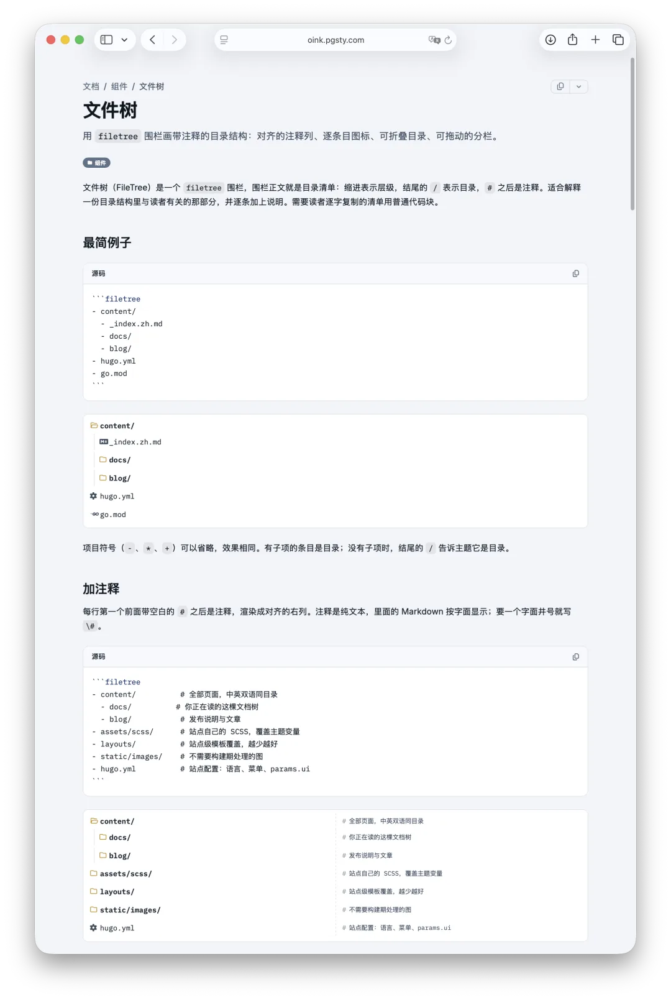

In Oink, it becomes a file tree with file icons, aligned comments, collapsible directories, and a draggable divider. Outside Oink, it remains immediately readable text.

Callouts use ordinary blockquotes, steps use ordinary lists, and field descriptions use ordinary tables. Images, code blocks, and data fences follow existing Markdown semantics wherever possible. Shortcodes are the fallback only when native Markdown cannot express a feature.

This is a practical engineering principle, not a matter of purity:

**Frameworks age. Content should outlive them.**

---

## Second: Hugo, and nothing else

Oink uses Hugo Extended to compile templates and styles.

Normal builds don't fetch fonts, JavaScript, or third-party assets from the network. Browser runtimes ship with the theme as well. The result is an ordinary `public/` directory of static files.

<!-- -->

    hugo --gc --minify

Once the build finishes, you're done.

You can put the output on:

- GitHub Pages.
- Cloudflare Pages.
- Netlify.
- Nginx.
- Caddy.
- Object storage.
- An internal server.
- An offline installation package.
- Anything that can host static files.

No database, application server, always-online SaaS, search-service account, or Node runtime to keep running after deployment.

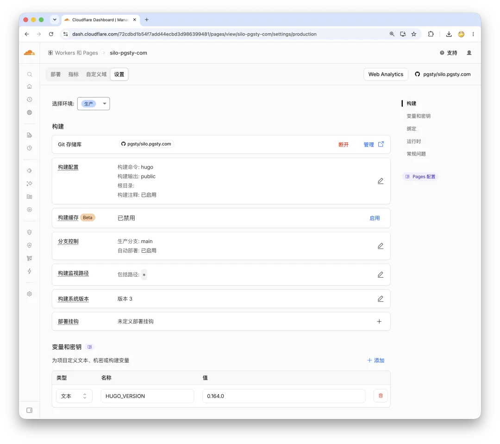

This is what Oink means by **local-first**.

It means more than “you can open it on localhost.” You control the system's essential capabilities:

- The content lives in your Git repository.
- The assets are in your build output.
- The search index is part of your site.
- Builds are reproducible.
- The site works offline.
- You can change hosting providers at any time.

Documentation, of all things, should work this way.

It shouldn't turn into a collection of empty shells because a CDN, font service, hosted search provider, or frontend dependency stops working.

---

## Third: one framework, six kinds of content

Real projects rarely have only “docs.”

As a project matures, it usually acquires:

- A product homepage.
- A blog and technical articles.
- Release notes.
- Packages and download pages.
- An API reference.
- Long-form books with chapters, figures, tables, and cross-references.

The traditional approach is to choose a separate tool for each, then try to make them look related.

Oink starts with a shared page shell, navigation, search, theming, and output system, then supports six kinds of content within it.

### Documentation

A navigation tree on the left, an on-page outline on the right, breadcrumbs, previous/next links, edit and history links, full-text search, and keyboard navigation are all included.

### Blogs

Blogs support author profiles, multi-author bylines, article series, tags, RSS, sharing controls, list/card/table indexes, and immersive pages with hero images for long-form reading.

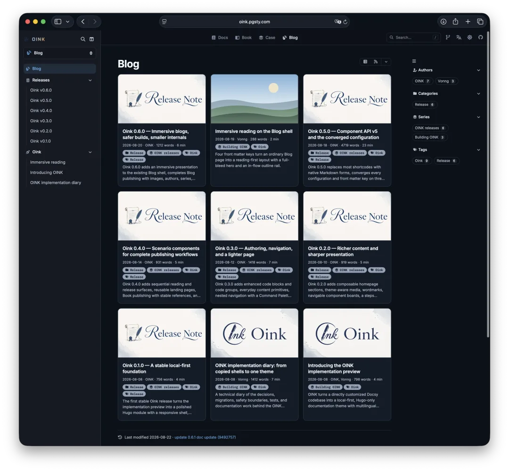

### Books

Books support chapter numbering, numbered figures and tables, equations, cross-references, tables of contents, and continuous printing of an entire book. Complex multilingual books such as DDIA are the main proving ground for this model.

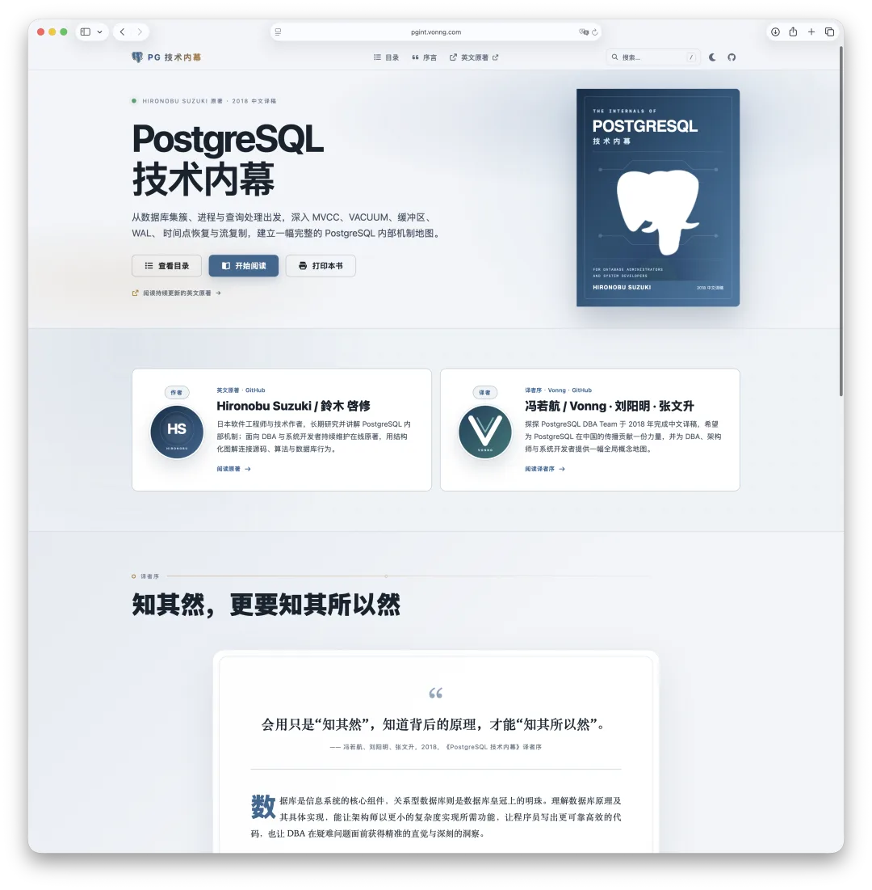

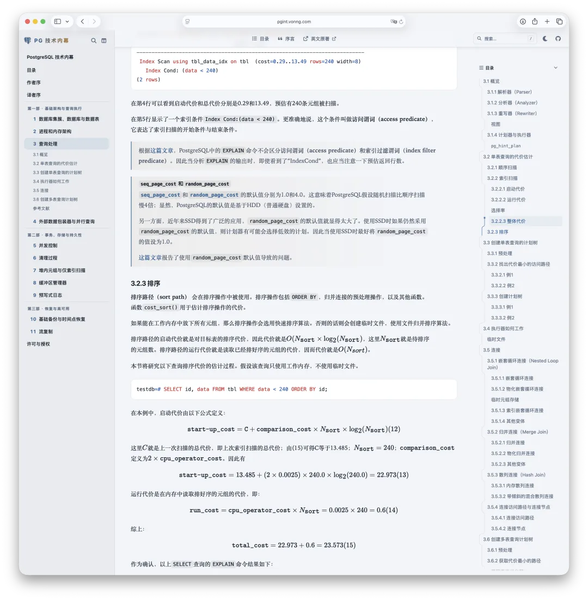

### Releases and downloads

A structured YAML file can generate release cards, download asset lists, checksums, and historical archives. Release information becomes data you can check and reuse, rather than fragments scattered through hand-written HTML.

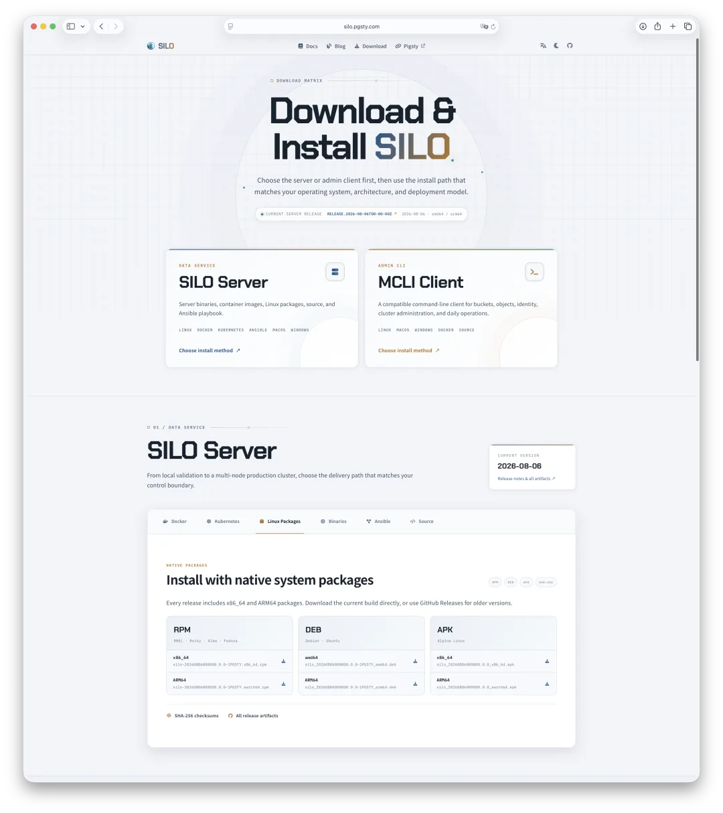

### Landing pages

Oink includes server-rendered homepage sections that combine data and Markdown into product introductions, feature sections, metrics, pricing, FAQs, team profiles, and calls to action.

Both the Oink homepage you see today and the PGSTY company homepage use this landing-page system.

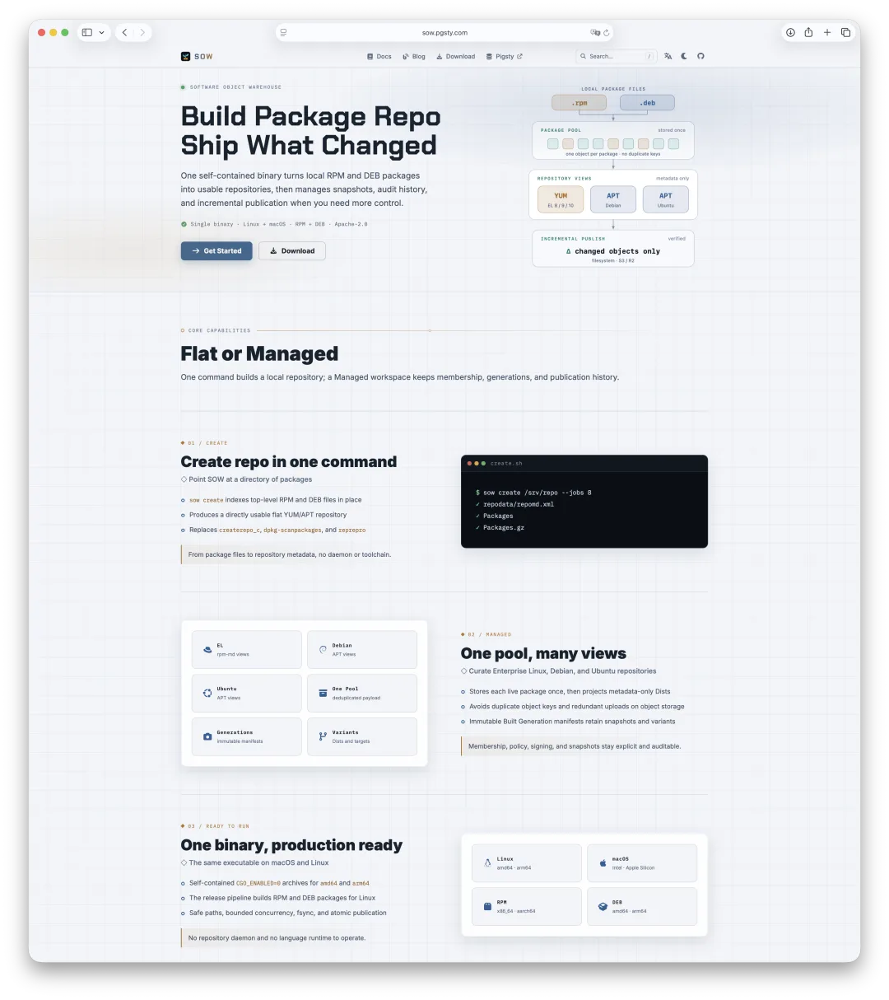

### API references

Swagger UI and Redoc ship as local runtimes. Keep the OpenAPI files in your repository, and the reference works offline or on a private network.

These six content types share one design language, search system, language switcher, version selector, set of output formats, and component system. Oink currently offers 21 kinds of technical content components, loading each runtime only on pages that use it.

That may sound like a way to configure fewer themes. The real benefit is larger:

**One set of skills lets you maintain everything your project publishes.**

---

## Fourth: powerful features shouldn't make every page heavier

Oink has plenty of advanced components:

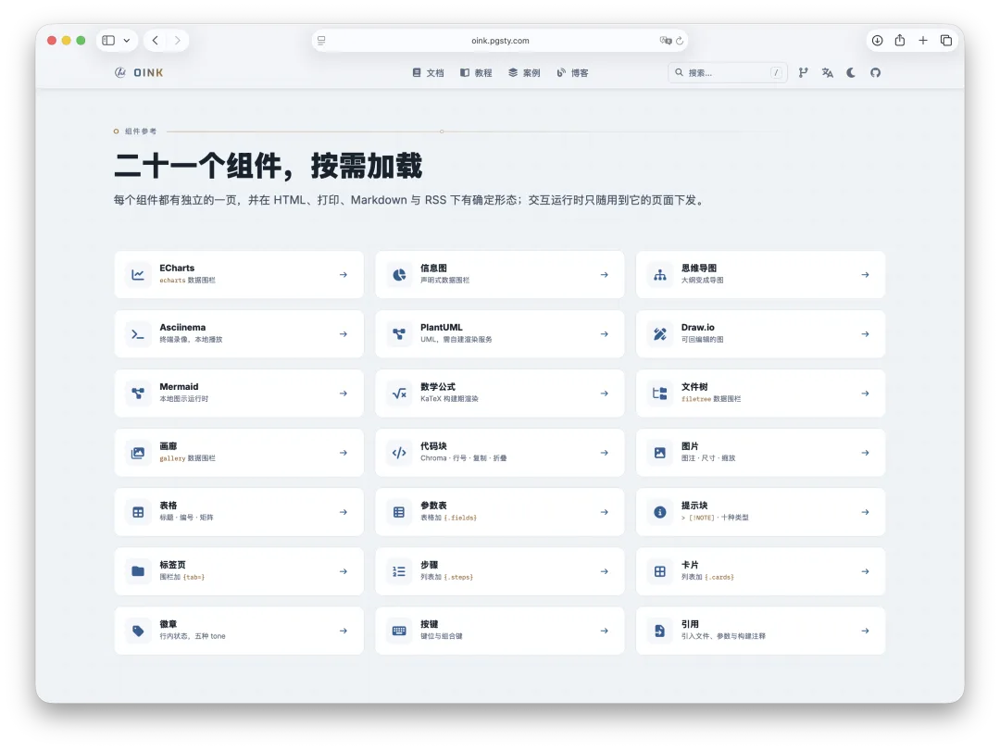

That doesn't mean every page should load all their JavaScript.

A page without charts shouldn't load ECharts. A page without Mermaid shouldn't load Mermaid. A page without a terminal recording shouldn't load its player. Component scripts are assembled according to what the page actually uses. Print, Markdown, and RSS outputs load none of these browser runtimes.

Oink calls this:

> **Content. On Demand.**
>
> Load the capability where it's needed. Keep the overhead there, too.

Just as important, every component needs a useful form outside the browser.

In HTML, a file tree can be attractive and interactive. In print, it should expand in full. In Markdown, it should preserve the original fenced block. In RSS, it should at least fall back to readable source.

Graceful degradation is part of Oink's content model, rather than an optional refinement.

A reliable documentation component has to work beyond the author's current browser and theme version.

---

## Fifth: design for people and agents

Oink's support for AI agents goes deeper than adding a ChatGPT icon to the navigation bar.

It begins at the output layer.

The same Markdown content can generate:

- HTML pages.
- Print pages.
- Raw Markdown pages.
- RSS.
- A site-wide `llms.txt` index.

Each HTML page declares the address of its Markdown counterpart. Agents and crawlers don't have to strip away navigation, buttons, scripts, and styles, then guess which part is the article.

Crucially, this Markdown is not a reverse conversion from HTML. It preserves what you actually wrote as closely as possible. Components such as callouts, tables, file trees, and code fences each have a defined Markdown representation.

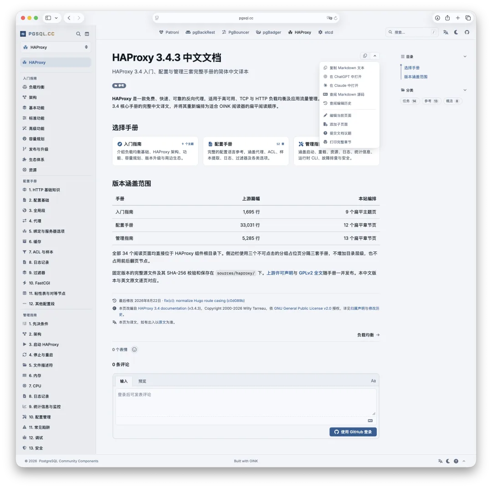

An Oink site can therefore serve as an engineering knowledge base that agents can work with, beyond simply producing summaries of it.

You can ask an agent to:

- Read the site structure.
- Find a specific configuration setting.
- Retrieve clean Markdown for the current page.
- Extend the existing documentation.
- Check Chinese and English translations.
- Update release notes.
- Edit source files directly in the repository.

I see this as a basic capability for future documentation frameworks, not an optional plugin.

**The browser is one consumer of documentation. AI agents are becoming another.**

---

## Search, languages, and versions, already integrated

These features rarely get top billing on a documentation framework's homepage, but in real projects they determine whether the system is usable.

Oink's full-text search runs entirely locally. Hugo generates a JSON index for each language at build time; the browser downloads it and searches locally. No crawler, account, external CDN, or hosted service is required. Latin-script text uses Lunr, while CJK queries, including Chinese and Japanese, have a substring fallback. Search shouldn't work in English while being useless in Chinese.

Search shares an interface with the command palette, opened with `⌘ K` or `Ctrl K`. Alongside documentation, you can search page actions, language switches, and version switches.

Multilingual support uses Hugo's native model, with translations alongside their source files. English, Simplified Chinese, and Traditional Chinese interface strings are fully maintained, and pages can have stable links to their translations.

Versioned documentation provides a version menu and notices for archived versions without dictating your deployment layout. Each version remains an independent, reproducible Hugo build, hosted on its own domain, subdomain, or path.

RSS, SEO, sitemaps, Google Analytics, Giscus comments, light and dark modes, print styles, image zoom, keyboard navigation, mobile layouts, and repository edit links are also included.

You could assemble all of this yourself.

I built Oink so you don't have to do it again.

---

## See fifteen production sites for yourself

Oink's public showcase currently lists 15 real sites: large Chinese and English documentation sites, a company homepage, open-source projects, small tools, knowledge hubs, and three books. They range from a two-page site to distribution manuals with over a thousand content files.

If you're starting a site, you don't need to study every setting in an empty directory. Find an existing site close to what you need and use it as your starting point.

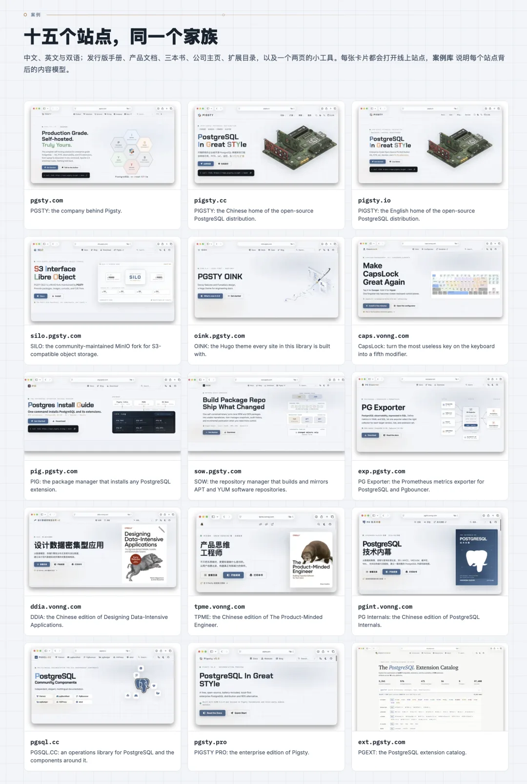

These are production sites I use and maintain every day, rather than demos made for screenshots.

That matters.

Many of Oink's design decisions came from specific problems encountered during real migrations. One survey informing the design documents covered 11 sites using the theme and more than 5,000 Markdown files. The public showcase extends that coverage from small tools to large distribution manuals.

The shared framework emerged from actual needs across those sites.

---

## More than a screenshot and a README

It's easy to build a Hugo theme with a nice-looking homepage, only for it to fall apart under complex content, mobile layouts, multiple languages, printing, or upgrades.

I won't claim Oink is bug-free. But it has more behind it than a screenshot and a README.

Alongside validation on real sites, version 0.6 covers 40 golden-output cases across HTML, print, Markdown, RSS, and LLMS. It includes 85 migration tests, 38 browser runtime tests, bilingual site builds, large-site performance measurements, and browser checks of real Chinese and English pages.

Development previews and production releases also handle errors differently.

When ordinary `hugo server` encounters bad configuration, it tries to warn and fall back safely, so a typo doesn't take down the entire preview. Production builds use `--panicOnWarning`: CI treats warnings strictly to keep broken output from being published.

The approach owes something to database systems:

- Provide as much diagnostic information as possible during development.
- Enforce strict checks before production releases.
- Don't let errors silently produce misleading results.
- Don't let a local input error take every page down with it.

It may be called Oink, but there is an engineer's sensibility underneath.

---

## Getting started doesn't require learning Oink first

To be honest, these days I don't write all this documentation expecting people to read every page themselves.

The simplest way to get started is to hand the task to Codex or Claude Code.

Oink's documentation site doubles as a complete example and regression test site, covering every page type and component. The recommended fast path is to clone it, remove what you don't need, and replace the rest with your own content.

For a human, it takes a few commands:

    git clone https://github.com/pgsty/oink.pgsty.com my-docs
    cd my-docs
    hugo server

Then change the site name, domain, and repository URL, and replace `content/` with your own material.

You don't even have to do that yourself.

You can give an agent the following prompt:

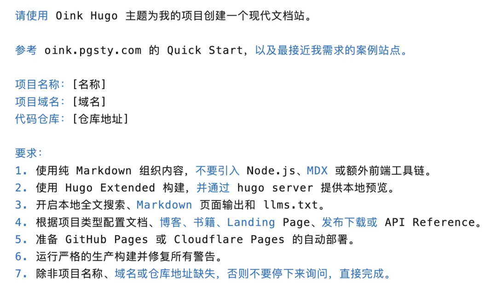

*English transcription of the prompt above:*

> Use the Oink Hugo theme to create a modern documentation site for my project.
>
> Refer to the Quick Start at oink.pgsty.com and the showcase site closest to my requirements.
>
> Project name: [name]\
> Project domain: [domain]\
> Code repository: [repository URL]
>
> Requirements:
>
> 1. Organize content in plain Markdown. Do not introduce Node.js, MDX, or an additional frontend toolchain.
> 2. Build with Hugo Extended and provide a local preview with `hugo server`.
> 3. Enable local full-text search, Markdown page output, and `llms.txt`.
> 4. Configure documentation, a blog, books, landing pages, releases and downloads, or an API reference as appropriate for the project.
> 5. Set up automated deployment to GitHub Pages or Cloudflare Pages.
> 6. Run the strict production build and fix every warning.
> 7. Unless the project name, domain, or repository URL is missing, complete the work without stopping to ask questions.

You have two responsibilities:

First, tell the agent what kind of site you want.

Second, write content worth reading.

Theme configuration, directory organization, build scripts, and deployment details are work for the tools. Documentation authors shouldn't each have to learn them all over again.

---

## Who is Oink for?

Oink is a particularly good fit for a few groups.

### Open-source project authors

You've built the project. You want a decent homepage, documentation, blog, and release pages quickly, without spending another few days learning a frontend framework.

### Infrastructure and engineering software teams

Databases, operations platforms, middleware, developer tools, distributions, and self-hosted software need plenty of configuration references, commands, architecture diagrams, file trees, terminal recordings, and versioned documentation. Oink's components and local-first delivery model are designed for this kind of content.

### Teams that need private networks, offline access, or long-term archives

When documentation must work on a private network, in a customer's environment, in an offline installer, or in an isolated environment, avoiding external CDNs, search services, and runtime backends removes a lot of friction.

### Book authors, translators, and maintainers of large knowledge bases

Chapter numbering, cross-references, figures, tables, equations, multiple languages, whole-book printing, and stable anchors all become real concerns in long-form content.

### People maintaining several projects

With five, ten, or more projects, the benefits of a shared framework add up quickly. You no longer have to remember each site's theme, component dialect, and deployment method.

My own migration of 18 sites is a straightforward example.

---

## Who is Oink not for?

Oink isn't a universal framework, and it doesn't need to pretend to be one.

If you need:

- A drag-and-drop WYSIWYG CMS.
- An online collaborative editing backend.
- A complex user account and permissions system.
- Extensive dynamic application state.
- A frontend platform for embedding arbitrary React applications.
- A web application dependent on real-time server-side computation.

Then Oink is the wrong choice.

Its scope is clear: **build modern, reliable, static content sites from Markdown and structured data**.

That boundary is what keeps it simple.

---

## Documentation should be the last thing to break

I've spent a lot of time wrestling with documentation over the past few years.

I've used Docsy, hosted books with Hextra, blogged with Blowfish, and tried various frontend frameworks. Each has its strengths. But as the sites multiplied and the content grew more complex, I came back to a simple approach:

- Write content in Markdown.
- Build with a single binary.
- Output ordinary static files.
- Ship as many assets locally as possible.
- Keep presentation and content separate wherever possible.
- Give people and agents the same source of truth.

New technology has its place. But a fashionable stack isn't what matters most for documentation.

What matters is:

- Can you still open it ten years from now?
- Can you deploy it on another platform?
- Does it work offline?
- Can people and machines still understand it?
- Can you maintain it as the project grows?

**Documentation should be the easiest part of a project to deploy and the hardest to break.**

Oink is an attempt to make that true again.

Oink is open source under Apache 2.0. It preserves Docsy's history and upstream attribution, and records the license of each third-party runtime distributed with the theme.

It is far from finished. But it is good enough for me to entrust all eighteen of my websites to it.

As long as those sites exist, I'll keep maintaining it.

You don't need to learn a pile of concepts or start with an empty directory.

Find the showcase site closest to what you need, copy it, replace the content, and let an agent handle the remaining details.

**Feed it Markdown. Let the pig do the rest.**

---

- Oink documentation and showcase[1]
- Oink GitHub repository[2]
- Oink documentation site source[3]

### References

- `[1]` Oink documentation and showcase: <https://oink.pgsty.com/>
- `[2]` Oink GitHub repository: <https://github.com/pgsty/oink>
- `[3]` Oink documentation site source: <https://github.com/pgsty/oink.pgsty.com>

*Follow along for more from a database veteran. ⭐️*

---

Published on [WeChat](https://mp.weixin.qq.com/s/MU5xKj-llGIyOP0pTsuxnA).
