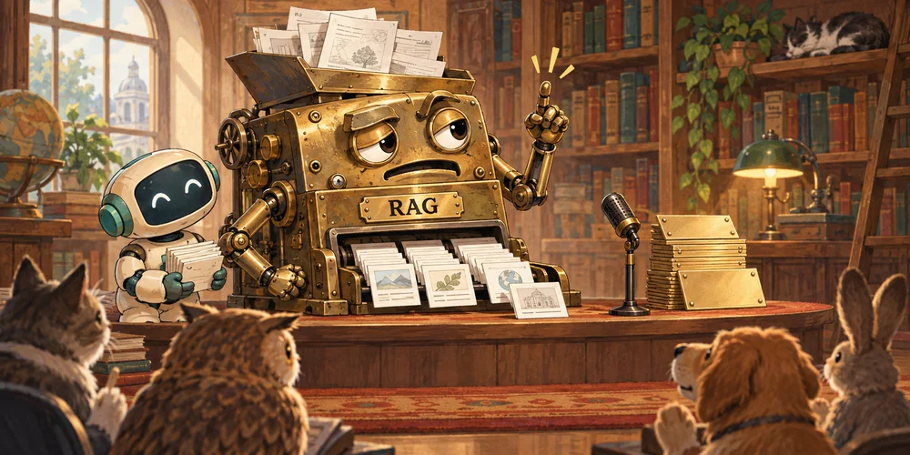

One of the people who helped invent RAG went out and bought a domain name to prove RAG isn't dead.

Episode seven of the Chinese PostgreSQL community's 30th-anniversary livestream series was about PG + AI. One of the questions on the host's cue card read:

> RAG has been hot for two years now — you let the model look things up in your private documents before it answers. What role does PG actually play in that architecture? Just storing vectors, or does it also cover metadata, permissions, and conversation memory?

I stared at that for a while and decided a different question comes first: is that architecture still worth building at all?

The word RAG is certainly still alive. But the pipeline everyone knows — chunk, embed, top-k — should no longer be the default answer. Vector search is settling back into its place as one ordinary tool among many, and more and more of the work is being picked up by tables of contents, full-text search, and agents that go look things up on their own.

Disclosure first: I build Pigsty, a PostgreSQL distribution, and pgvector was among the first extensions we packaged. Vector search is useful. That doesn't stop me from thinking it has been wildly oversold these past few years.

## Why Did the Inventor Have to Issue a Denial?

Douwe Kiela, a co-author of the 2020 RAG paper, went on to found Contextual AI. In 2025 he wrote "[RAG is dead, long live RAG!](https://contextual.ai/blog/is-rag-dead-yet)", pushing back on the claim that long context had made RAG obsolete. The company bought a domain for the occasion.

Later, in an interview with The New Stack, he explained it differently: people have simply repackaged RAG as context engineering. Retrieving documents over MCP counts as RAG too. The piece also notes that RAG is still in the company's stack — it just doesn't feature on the homepage anymore.

The inventor hasn't given up, so I'm certainly not going to pronounce it dead on his behalf. Still: when a piece of technical vocabulary needs its own rebuttal post, and has to keep widening its definition to prove it still matters, everyone can work out for themselves how things are going.

Taken literally, "retrieval-augmented generation" is indeed hard to kill. If the model fetches anything from outside before answering, that counts. But the RAG that most people learned in 2023, shipped in 2024, and are still maintaining today is a far more specific pipeline:

**Chunk the documents → embed → store in a vector database → embed the question → similarity search → pull the top-k → stuff it into the prompt.**

That's the thing this post is about.

## Claude Code Ended Up Picking grep

Boris Cherny, who built Claude Code, said on the Latent Space podcast in 2025 that they tried RAG early on, tried several search approaches, and settled on agentic search because it simply worked better. He added later that the early versions did use a local vector store, but letting the agent search for itself was simpler and got rid of headaches like stale indexes.

Anthropic's later methodology runs the same way. Files like CLAUDE.md go into the context up front; everything else is found on demand with glob and grep. Read a file, notice it references another file, keep reading. Agent Skills work the same way — a short description first, the body loaded only when it's needed, the attachments opened only when the details matter.

Put plainly: hand it the table of contents and let it turn the pages itself.

That's exactly what I did when I built the Skill for Pigsty. No chunking, no embeddings — I just wrote the documentation site's table of contents into AGENTS.md / CLAUDE.md. Which page installs PG, which page configures high availability, which section covers a given parameter. The agent reads the contents to find its entry point, and when that isn't enough, it follows the links and keeps reading.

In practice that has been enough to solve my problems. One side effect: agents have pushed the Pigsty docs site to hundreds of millions of page views a month. As for vector search, I haven't touched it in a long time — not because I can't, but because I have no use for it in my own scenarios.

There's one big difference between this and a fixed vector pipeline: **an agent can change its mind mid-search.**

A single top-k retrieval is a guess made in advance about which passages might be relevant, handed to the model to answer from. An agent can read the contents first and then the body; if it picked wrong, try a different word; if the conditions are incomplete, keep reading what comes before and after.

Granted, codebases and documentation sites come with structure already: function names, parameter names, and section headings are all searchable. That doesn't prove grep wins everywhere. But it does show this much — when there's structure sitting right there, shredding the content and computing embeddings first isn't necessarily the smartest move.

You can call this on-demand lookup RAG too, if you like. It just isn't the pipeline it used to be.

## Don't Keep Copying the Answers from the Small-Window Era

RAG was born in 2020; it wasn't invented for ChatGPT's 4K window. But its 2023 explosion had everything to do with how cramped context windows were at the time.

You have a three-hundred-page product manual and the model can swallow a few pages. What do you do? Pick a bit and stuff it in.

There are plenty of ways to pick. An inverted index works. BM25 works. But embeddings plus similarity search demo the best, have the most tutorials, and can be running by the end of an afternoon. So chunking, vector stores, and top-k became the standard answer.

Then context windows of several hundred thousand, even a million tokens showed up. Material that used to be too big to fit might now fit just fine.

Long context isn't free, of course, and putting something in front of the model doesn't guarantee the model uses it well. Cost, latency, lost-in-the-middle — none of that disappeared. But for a small knowledge base, before you start building a pipeline, you should at least count the tokens once: if the whole thing fits inside an acceptable budget, why insist on shredding it first?

Window size aside, pure vector recall has a few old problems of its own.

Chunking breaks context apart. "The following items are not reimbursable" gets split from the list that follows it, and you retrieve the conclusion without the premise. Small chunks match specific content well but lose the surrounding context; large chunks carry more context but match less precisely. Late chunking and contextual retrieval both take the edge off this, but you can't expect an arbitrary cut to land exactly on a semantic boundary.

Second, top-k gives you the most similar entries in the corpus, not the entries sufficient to answer the question. If the answer isn't in there at all, it will still happily produce a ranking. Similar-looking passages go into the prompt, the model is inclined to keep talking, and that's how the wrong answer comes out.

Thresholds, rerankers, and refusal logic all patch this. It's just that by the time you're done patching, what you've built is a retrieval system that needs serious design — not the breezy cosine calculation from the tutorial.

And the most fundamental one: **similar is not the same as relevant.**

Ask "which items can't be expensed" and you pull back "Expense Filing Procedure." Semantically that's very close; it may not answer the question at all. Negations, numbers, error codes, product model numbers — these are exactly the places where "roughly the same gist" doesn't cut it. And in an enterprise knowledge base, those details are precisely what users ask about.

grep is no silver bullet either. The user says "can't connect to the database," the docs say `connection refused`, and one search misses just the same. What the agent buys you is the ability to try another word and go read the source to check, rather than treating the first result as final evidence.

Vector search can go into that loop too. There's no need to set it against agents. What should be abandoned is the wishful idea that one pass of similarity ranking is enough to answer a question.

## Look at the Material First, Then Pick the Architecture

These days I look at what the material actually looks like first.

If there isn't much of it, try putting it straight into the context. When a simple approach solves the problem, there's no need to keep a whole retrieval system alive for the sake of architectural completeness. You do still have to do the math on per-call cost and latency.

For codebases, documentation sites, wikis, and API references, use the structure they already have. Tables of contents, file trees, cross-references, and full-text search are the tools people use to find things, and they can be handed to an agent. A few thousand pages of manual don't need to be read in one go; finding the relevant few pages each time is enough.

What's genuinely worth the effort here is the quality of the table of contents, how the pages are organized, and how good search is. A table of contents goes stale too, but if it's generated automatically as part of the docs build, that's usually less work than maintaining a separate chunking, embedding, and index-sync pipeline.

A hundred thousand contracts, years of email, messy group chats and scanned documents — that's not so easy. Here you really do need an index. But it still shouldn't come down to a single vector-recall path.

Full-text search handles keywords, model numbers, and error codes. Vectors cover synonyms, cross-language matches, and colloquial phrasings. Metadata narrows the scope, and permissions decide what's visible at all. Once the document is found, read the relevant sections, and search again if you need to.

Extra rounds of agent page-turning have a price: more calls, higher latency. For services with strict response-time and cost requirements, a fixed retrieval pipeline you have actually evaluated may still be the better choice.

So don't treat "RAG or no RAG" as an article of faith. The corpus, the permissions, the cost, and the latency are what you choose on.

## Vectors Are Still Useful, Just Not Magic

Vector search's day job is finding similar objects.

Long before LLM knowledge bases got hot, image search, recommendation, deduplication, and clustering were already using it. Text embeddings didn't start in 2023 either. That was just the year embedding APIs and LLM Q&A put them in front of every developer.

The problem is that "find similar content" got repackaged as "find the correct answer."

For finding similar images or similar support tickets, for recommendation and clustering, vectors are genuinely good. For synonyms and cross-language phrasing in text Q&A, a vector recall path is worth keeping around. But to work out the conditions under which some expense rule applies, you have to go read the source text. Cosine similarity is no substitute for evidence.

Which brings back what I said in 2023: **vectors are the JSON of the AI era.**

Used everywhere, worth supporting in every database. But supporting a data type and offering a way to search it doesn't mean users should keep a separate database alive just for it.

## The Problem with Specialized Vector Databases Is Where They Sit

When I wrote "[Are Specialized Vector Databases Dead?](/en/db/svdb-is-dead/)" back in 2023, the call was simple: vector storage and retrieval is a real need and will grow along with AI, but specialized vector databases won't necessarily get much of that growth.

I still think so today.

Databricks buying Neon and Snowflake buying Crunchy Data say at least one thing: general-purpose databases did not lose their value when AI showed up. PG doesn't have to rename itself an "AI-native database" to be a valuable asset.

Specialized vector stores stopped being just top-k a long time ago. Hybrid search, metadata filtering, multi-tenancy, backups — everyone is filling those in. Their trouble is that filling them in walks them straight onto general-purpose database turf.

Once a workload is in production, users want more than retrieval speed. High availability, backup and restore, transactions, permissions, monitoring, drivers — sooner or later someone has to own all of it. pgvector gets to use what PostgreSQL already has. An extension with an entire database standing behind it: that's PG fighting dirty.

The more practical problem is consistency.

If the primary data is in PG and the vectors are in another system, you own the synchronization. A user deletes a row, the copy in the vector store isn't deleted yet, and a search can turn up a record that shouldn't exist anymore. CDC, the outbox pattern, retries, reconciliation jobs — they all solve this, and every one of them is extra engineering.

Put the vectors and the source text in the same PG and they can be maintained in the same transaction: committed together, deleted together, rolled back together. It won't generate fresh embeddings for you, but it removes one cross-system consistency problem. That value tends not to show up in a vector search benchmark table.

Now look at the retrieval you actually need: full-text, vector, metadata filtering, permissions, and joins against your business tables. With the right extensions, PG can usually do all of it in one place. Splitting a separate system out for vectors, then syncing all of that over to it, has to buy you a great deal before it's worth the trouble.

None of which means pgvector has no weak spots. Index build time, write throughput, memory footprint, large-scale deployment — test all of it against a real workload. HNSW has inherent costs, PG's implementation makes its own trade-offs, and you can't pin every problem on one side or the other. Extensions like VectorChord are trying different index and quantization routes, and those need evaluating per scenario too.

If your scale justifies splitting out a dedicated retrieval system, split it out. Just don't take on the debt of distributed data synchronization before you have any data or any load.

As for whether vectors belong in the PG core, I don't see the rush. Retrieval approaches are still shifting, and extensions can each go their own way. What users need is capability that works, not a merit badge that reads "now in core."

## Closing

Back to the question on the cue card: what role does PG play in a RAG architecture?

Don't let RAG frame it in the first place.

PG can store the raw content, do full-text and vector search, manage permissions, and hold an agent's tasks, conversations, and execution state. Looking things up is only one part of that. Persistence, transactions, rollback, and auditing matter just as much.

If the context window is working memory, then an agent also needs a reliable place to keep its long-term state. PG's value there is a great deal more than "the cabinet where the vectors go."

Vector search is worth keeping. The habit of building everything around vector search can retire. Some systems are still paying the bill for a small-window-era constraint; others just followed a tutorial and bolted on a pile of parts they never needed.

Ten years ago the question was whether to adopt NoSQL. Five years ago, whether to adopt a cloud-native database. Two years ago, whether to adopt a vector database. Today it's whether to adopt an AI-native database.

My advice is the same as it has always been:

**Learn to use Postgres properly first.**

## References

- Feng Ruohang, "[Are Specialized Vector Databases Dead?](/en/db/svdb-is-dead/)", November 2023.
- Lewis et al., "[Retrieval-Augmented Generation for Knowledge-Intensive NLP Tasks](https://ai.meta.com/research/publications/retrieval-augmented-generation-for-knowledge-intensive-nlp-tasks/)", 2020.
- Douwe Kiela, "[RAG is dead, long live RAG!](https://contextual.ai/blog/is-rag-dead-yet)", Contextual AI Blog, 2025; Richard MacManus, "[RAG isn't dead, but context engineering is the new hotness](https://thenewstack.io/rag-isnt-dead-but-context-engineering-is-the-new-hotness/)", The New Stack, January 2026.
- Latent Space, "[Claude Code: Anthropic's Agent in Your Terminal](https://www.latent.space/p/claude-code)", May 2025; [Boris Cherny's follow-up on X](https://x.com/bcherny/status/2017824286489383315), February 2026.
- Anthropic, "[Effective context engineering for AI agents](https://www.anthropic.com/engineering/effective-context-engineering-for-ai-agents)", September 2025; "[Introducing Contextual Retrieval](https://www.anthropic.com/engineering/contextual-retrieval)", September 2024; [Agent Skills announcement](https://www.anthropic.com/news/skills), October 2025.
- [Databricks' announcement of the Neon acquisition](https://www.prnewswire.com/news-releases/databricks-agrees-to-acquire-neon-to-deliver-serverless-postgres-for-developers--ai-agents-302454992.html), May 2025; [TechCrunch on Snowflake's acquisition of Crunchy Data](https://techcrunch.com/2025/06/06/startups-weekly-its-buying-season/), June 2025.
