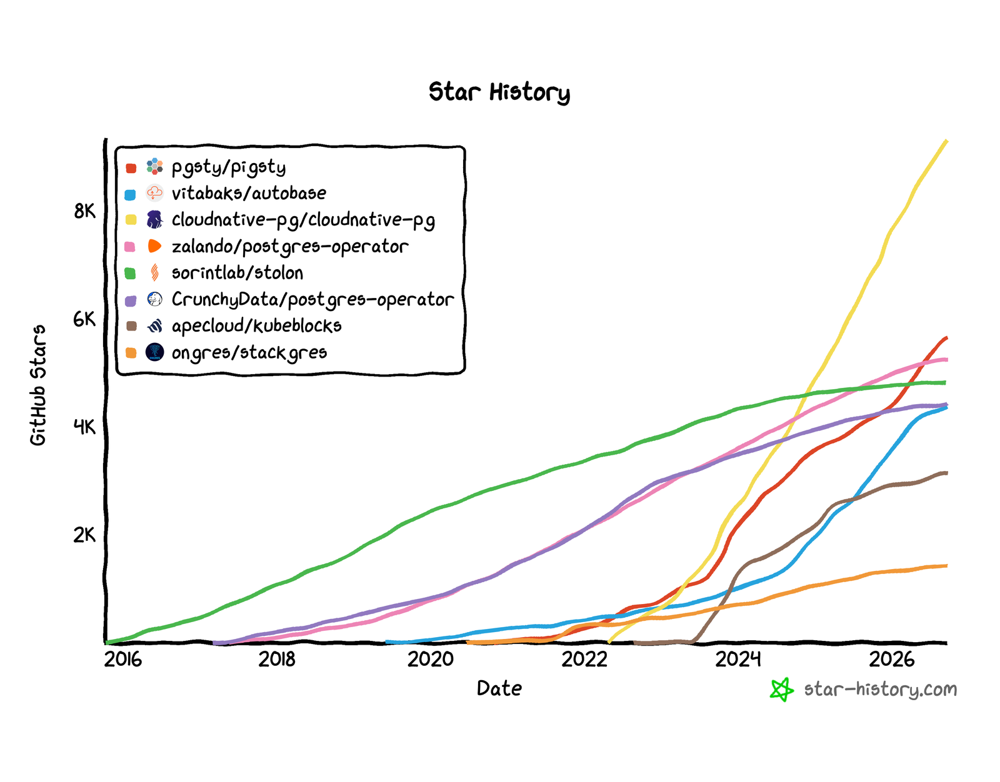
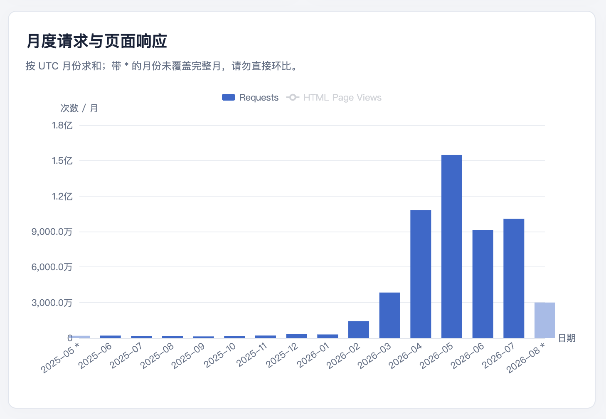
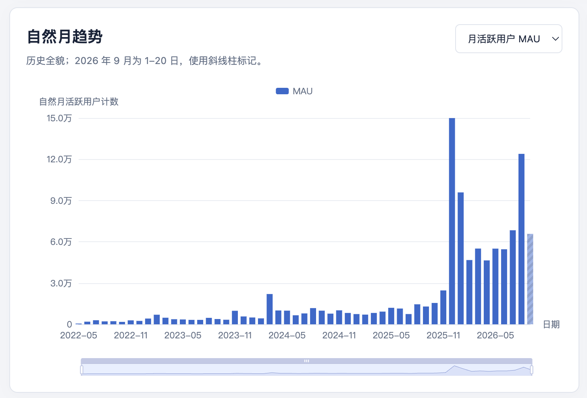
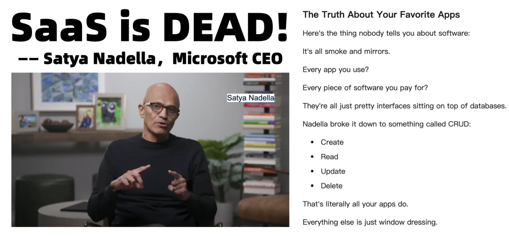
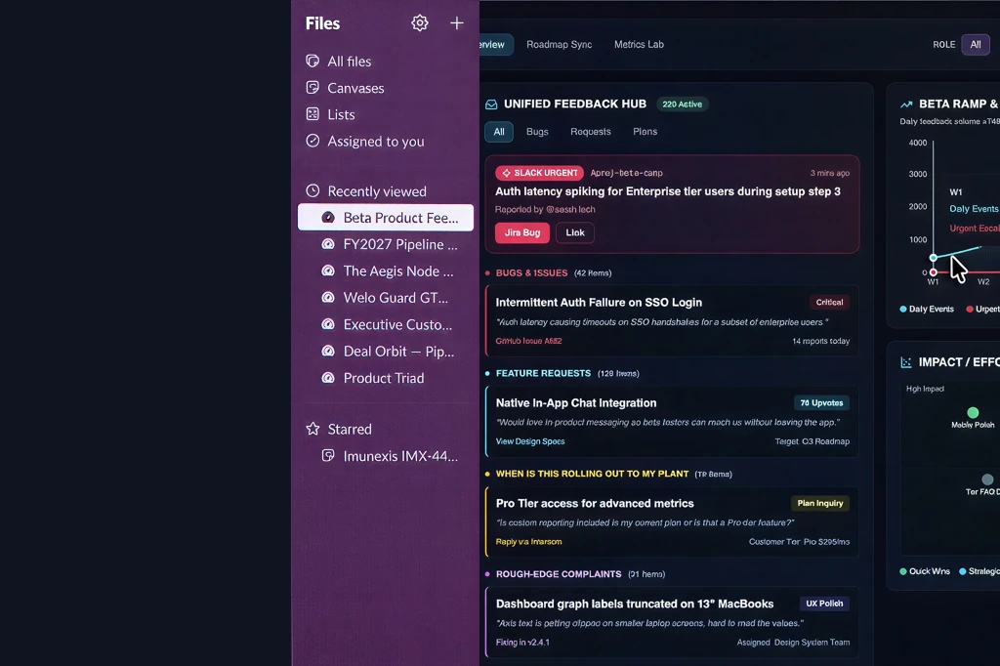
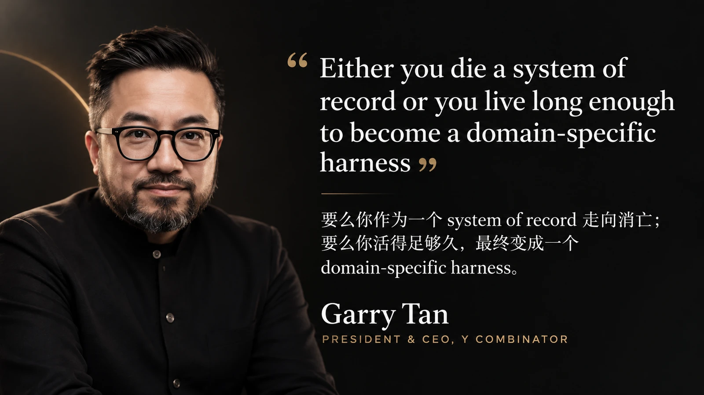
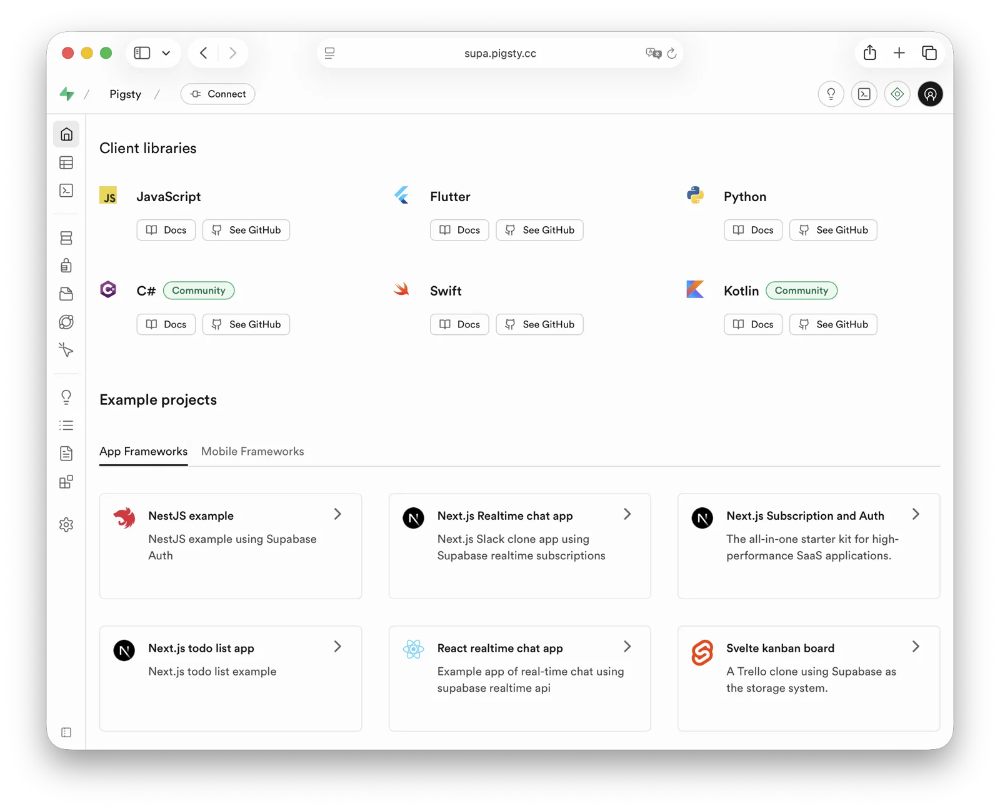
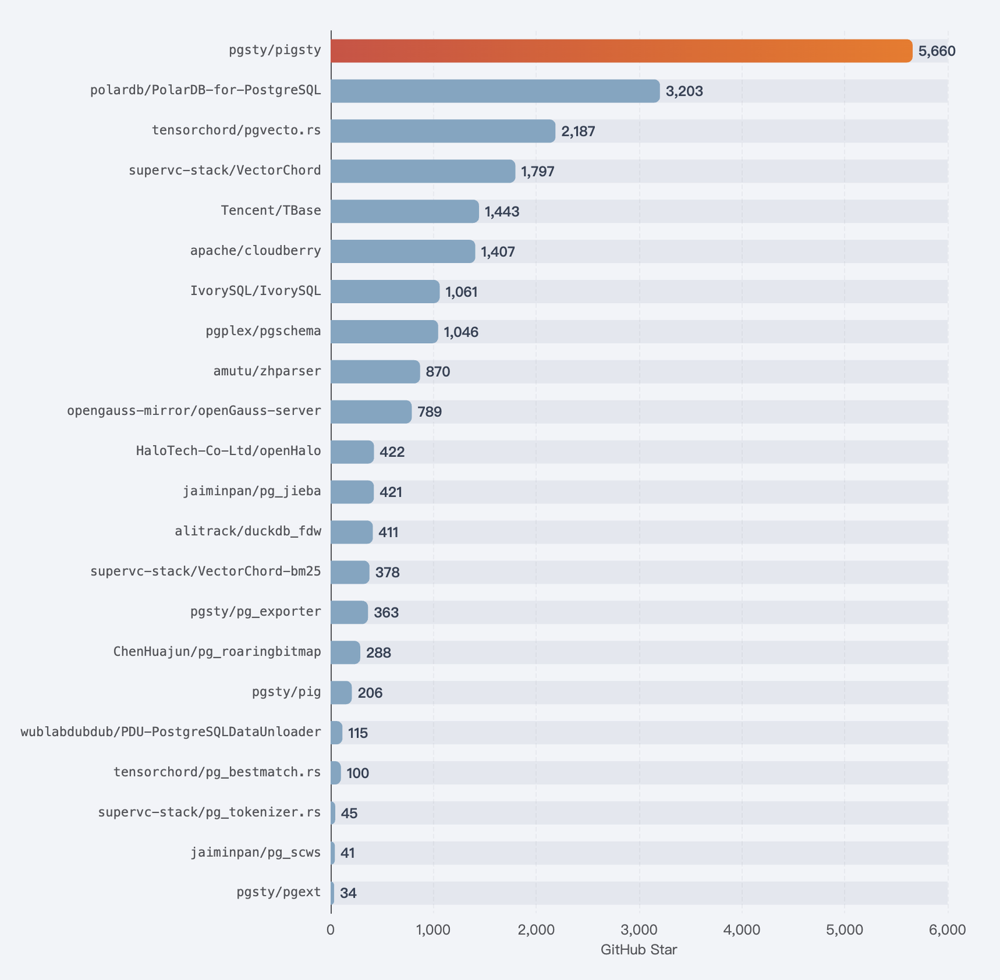

> 本文整理自 2026 年 9 月 22 日"2026 上海 AI 应用生态大会·智能原生技术创新分论坛"的演讲。演讲者：冯若航（Vonng），PostgreSQL 发行版 Pigsty 作者。

我维护一个 PostgreSQL 发行版，叫 Pigsty，六千个 Star，在 PG 发行版这条赛道上，算是国内乃至全球最能打的开源项目之一。作为基础设施项目，我们有个文档站

一个数据库发行版的文档站能有多少访问量？去年一整年，Google Analytics 上满打满算一两百万 PV，真人月活十万这个量级。也就这样了。
之后 Cloudflare 上的月请求数从一百万涨到了一点几个亿，翻了几十倍。

十几万真人读不出一个亿。我们扒了访问日志：九成以上的流量是 Agent 发起的。
里面有一小半是各家 AI 公司的语料爬虫，但真正的大头，是各种各样的 Agent——它们在读文档，在学这个东西怎么用。

我不敢说这一百倍全是那份 Skill 的功劳，更可能是我们给 Agent 铺了条路，正好赶上了大潮。
但趋势是实打实观察到的：Agent 来读文档、学怎么用的频率，已经远远超过人类了。

不只是我看到了。

去年资本市场上 PostgreSQL 是个香饽饽，出了好几起收购，最扎眼的是 Databricks 十亿美元收 Neon。
Neon 披露过一个数：平台上八成以上的数据库是 Agent 创建的，不是人建的。

另一家 Supabase，今年六月融了五亿美元，估值 [10.5 B$](https://techcrunch.com/2026/06/05/supabase-doubles-valuation-to-10b-in-8-months/)，八个月翻一倍。
它同时披露了两个数：过去一年平台上数据库的创建量增长了 600%，其中超过六成是 AI 工具建的。
CEO 直接点名，增长来自 Claude Code 和 Codex。

这两家的共同点是都做 Serverless Postgres。
它们的数据和我的日志说的是同一件事：
数据库，正在越来越多地由 Agent 搭建、由 Agent 使用，而不是人。

-------

## 一、AI 替代 UI

当然，这事不只发生在开发者工具上。微软 CEO 纳德拉 2024 年底说过一句话：企业应用说白了就是数据库套壳——一个 Database，加上增删改查和一堆业务逻辑。

- 《[SaaS已死？AI时代，软件从数据库开始](https://mp.weixin.qq.com/s/LykR-ewCx9aO9e09T45taw)》
- 《[软件世界大熔断：当中间层全被压扁](https://mp.weixin.qq.com/s/7pS1DIswWusBTxtYDl5KGQ)》

顺着这个往下推，结论是现成的：**上面那层增删改查，你写的后端应用能做，Agent 凭什么不能做？**

当时没人当回事。但海啸已经在地平线上了。现在大家说“前端已死”。死了没？我觉得是真的死得差不多了。
那后端呢？**我觉得也差不多了**。为什么？Supabase，它主打的就是 Backend as a Service —— **Supabase 的火爆本身，就是后端衰落的时代注脚。**

如果这还只是注脚，那最有力的实证是上周。行业老大哥 Salesforce 在 Dreamforce 发了个新东西叫 **AIforce**，
把 CRM 工作流跟 Claude、Slack 打通。你在聊天窗口里、在 Agent 的驾驶舱里就能查客户、改记录、触发流程，**根本不用打开 Salesforce。**

它自己打的标语是什么？**“AI 替代 UI”。** 行业老大自己站出来说：我们的界面你可以不用看了。

所以“应用层塌缩”这半句话，今天已经在发生了。**真正的问题是下一句：塌缩到哪儿去了？**

用户可以不打开 Salesforce，但那个应用的能力还在被调用。这些能力将来待在哪儿？

我有一个判断：**软件世界的终局，是 Database 加 Harness。**

------

## 二、两个词：记录系统与驾驶舱

离我们最近的，是一周前，Y Combinator 的 CEO Garry Tan 说了一句话：

> Either you die a system of record, or you live long enough to become a domain-specific harness.

这是在玩《黑暗骑士》那句台词 —— *要么你死得像个英雄，要么活到自己变成反派。*
他是用一种更精确的方式，重复了同一个命题。软件做到最后，**真正重要的就两样东西：System of Record，和 Harness。**

Harness 这个词现在还没有权威译法，有翻成马具的，有翻成挽具的。我觉得 “**驾驶舱**” 更贴切一点，下面就这么叫了 —— **记录系统和驾驶舱。**

那么，两个问题：

- **记录系统，跟数据库是什么关系？**
- **驾驶舱，跟 Agent 又是什么关系？**

我们看两个具体的例子。**记录系统看 Supabase，驾驶舱看 Codex、Jev 和 DSH。**

------

## 三、记录系统：Supabase 到底做对了什么

要说国内谁最了解 Supabase，老冯可以当仁不让说一句第一人。
早在 2023 年，我就非常看好 Supabase ，当时俺把它的几个独家扩展构建出来分发，
成为第一个第三方开源自建 Supabase 方案，还是企业级 Postgres Underneath.
到今天，能做到这件事的开源项目也没几个。

那 Supabase 为什么成？因为给 PostgreSQL 套了个好看的管理界面吗？因为不要钱吗？

都不是。

有几个精髓设计：**认证，行级安全，和自动生成 API。**

自动生成 API 这块，核心组件是另一个开源项目叫 **PostgREST**，直接从数据库 Schema 生成 REST API —— **你不用写 CRUD 后端了。**

但这里有个问题：**PostgREST 十年前就有了，老冯十年前就在用，也鼓吹过。为什么它突然就有魔法了？**
因为 Supabase 把前面的**认证**和后面的**权限**这两块也一起做掉了。

你要是自己裸用自动生成的 API，认证和授权没做好，那就是个玩具，没人敢上生产。
**认证加权限这两块补上，才真正有了做企业级应用的基础**。
所以现在不只是创业公司在用 Supabase，我甚至看到在一些国企里都有人在用。

举个例子。你有个 SaaS 应用，每个用户进来都对应上数据库里的一个身份，再配合 PG 的权限控制和行级安全策略：
这个用户进来看到这几张表，那个用户看到那几张表；**甚至同一张表，这个用户只能看到这几行，那个用户看到另外几行。**

同一套 Schema，不同的人进来看到不同的东西。**以前多租户应用开发最头疼的那一块，一下子变得非常简单。**

所以 Supabase 是什么？它是个数据库吗？不是。**它是 PostgreSQL，加上以 PostgREST、GoTrue 为核心的认证、自动 API 生成和 RLS 权限控制，组成的一套通用后端驾驶舱。**
它自己的定位叫 **Backend as a Service** —— 提供的不是数据库，我提供的是后端。

**这就是为什么它敢说自己是 Agent 时代的基础设施，而不是又一个 Serverless PostgreSQL**。很多人看不明白这一点，国内抄 Supabase 的很多人也看不明白。

**它做对的事是：把认证，权限，后端应用，做进了数据库里面。**

------

## 四、驾驶舱：Codex、Jev、DSH

再来聊聊 Harness

### Codex：从编程助手到通用 Agent

在座的各位，有多少人用 Codex 或者 Claude Code？用过的就知道我在说什么。

Codex 现在能干的事已经强到令人发指。你给它一台笔记本，让它去做 3D 建模、打游戏、剪视频、配 Cloudflare 的 DNS、去 AWS 申请账号
—— **可能除了付钱、输密码还得你亲自来，凡是你能用电脑完成的事，它现在基本都能替你干。**

我现在已经懒到什么事都丢给 Codex 了，包括今天这个 PPT——**稿子是我口述的，PPT 完全是 Codex 做的。**
所以别看它管自己叫 Coding Agent，好像只会写代码。**它现在就是个通用 Agent。** —— **这不就是未来软件的雏形吗？**

如果我动动嘴让 Codex 替我把活干了，我为什么还要打开一个专门的软件，学它怎么用？**为什么不直接让它去读那个数据库？**

举个我自己的例子。我维护着几个站点，PG 中文文档站、PG 扩展目录。其实没什么东西，静态站，数据全从数据库里取。
维护、更新、校对、搜罗今天又出了什么新扩展——搜到了就全部构建一遍、发布到仓库里。**这些活现在全是 Agent 干的。**

**软件开发这种高度智力密集的复杂工作都能被这么丝滑地解决掉，那 CRUD 这点事算什么呢？**
大家以前不这么干，就两个原因：**太慢，太贵。**
你等大模型吐字等十几秒，或者调一次几块钱，谁受得了？

### Jev：程序需要的模型形态

但上周 TypeSafe AI 发的 Jev，就是冲着这个问题来的。这家公司是前 OpenAI 研究员 Diogo Almeida 创办的，Jev 是它的第一个模型，特点是不生成文本：
把定义好的问题和选项丢给它，百毫秒级的时间里告诉你选哪个、概率多少。输入每百万 token 四美分，输出免费。 老冯称之为 —— [**无嘴模型**](https://vonng.com/ai/jev-shutup-model/)

这是程序更需要的模型形态。以前大家觉得让 Agent 直接读写数据库是天方夜谭，一个原因就是每一步判断都要等一个大模型慢慢吐字。
其实 Jev 之前，用 logprobs、用分类头做的就是这件事，只是没人把它当成一个产品来卖。

最后赢的不一定是 Jev，它现在还在 early access。但它确实打开了一种新范式：用极低的成本、百毫秒级的延迟，
去做原来大模型要秒级甚至分钟级才能完成的判断。它给驾驶舱这一块开了一扇新门。

### DSH：可以替换自身的执行层

还有一个是 **DSH，DeepSeek Harness。** —— 以前我们说“可自我演化的软件”，听起来像科幻。**DSH 不就是吗？**

它的口号是 “Everything is a Plugin” —— **连 Agent Loop 本身都是插件，能在运行的时候动态替换掉**。
Codex、Cursor、Claude Code 的 Loop 是写死在内核里的，DSH 把它掏出来做成了可换件。

它的内核 Cordis 为此建了三样东西：副作用撤销栈、响应式依赖、事务性热更新。
撤销、依赖、事务——为了让执行层能被安全地热替换，它在进程里重新实现了一遍数据库三十年前就有的那套保证。
这不是挖苦，这是这个项目最诚实的价值：它用工程量证明了，一个"可替换的执行层"到底需要什么样的保证。

你想让它加什么功能，它自己给自己写几个插件，就变成了适用于你那个领域的专用 Agent。

------

## 五、固化结晶的梯度

所以概括一下，我觉得未来的软件会有一个 [**固化结晶的梯度**](/ai/cerebellum/#五一万小时雕的不是知识是你)。以前的软件很死板：程序事先编好，它就只能做那点 CRUD。以后的软件会非常灵活。

第一层，直接编程，一次性软件。我现在想买张机票，但不知道怎么买。Agent 去把携程的页面流程琢磨明白，写个脚本跑通，找到最合适的那张票，把活办了。就干这一次。

第二层，提炼关键决策。后来你发现同事也要买机票，那就把这个任务结晶一下。一回生二回熟 —— 第一次它要处理海量的复杂度和不确定性，第二次就只需要在关键的那几个地方做判断。
原来得用 Astra、Fable 这种大模型，现在用个类似 Jev 的东西就够了。

第三层，完全固化成代码。再往前一步，整个流程都摸得清清楚楚，业务逻辑能完整还原出来，那就直接写成一个脚本、一个函数。下次买机票直接调函数，连智能判断都不需要了。

这不就回到原来的 CRUD 应用了吗？只不过这个 CRUD 应用，长在了携程外面，长在了你这一边。

对用 Coding Agent 的人来说，这些都不是天方夜谭，是正在发生的事。
无非是企业接受得慢一点，驾驶舱里 CRUD 的成分多一点，甚至全是 CRUD、大模型只做锦上添花；
创业公司接受度高，可能什么都丢给大模型。在智能水平、成本、速度和吞吐之间找到适合自己生态位的那个权衡，这就是驾驶舱要回答的问题。

那么问题来了：驾驶舱变成这个样子之后，它反过来会给数据库提什么要求？

------

## 六、数据库要长出什么

程序说到底就是状态加转移。转移可以换，状态不能丢。状态在哪儿？在 System of Record 里。

上面的驾驶舱越多、越灵活、玩得越花，甩给底下的难题就越大。你永远不知道跟你协作的另一个驾驶舱会怎么操作你：
今天连上来的是你自己写的 Agent，明天是客户的 Agent，后天是一个你听都没听过的 Agent。大家唯一的最大公约数，就是底下那个记录系统。

更麻烦的是，连接串换了主人。以前做微服务常说一句话：你在应用层设计了一套精妙绝伦的认证和访问控制，结果人家一根连接串直接捅到你数据库里，你那套东西瞬间就跟纸糊的一样。
过去这套还能凑合，是因为唯一能拿到连接串的，是一台经过审核的应用服务器。现在拿连接串的，是一个概率性的、会被提示注入的、你根本保证不了它下一步干什么的 Agent。

Salesforce 自己也看到了这一点。AIforce 发布时它反复强调两件事：记录系统还留在 CRM 里，只是不用再进它的界面；
每个从 Claude、Slack 过来的请求，都继承请求者原有的权限和共享规则，不另建一套。翻译一下：界面可以扔掉，规则还要遵守。

驾驶舱甩下来这么多难题，数据库就不能只管存数据了，它得长出相应的能力来接。长什么？市面上已经有两家交了答卷。

第一份是 Supabase：认证、权限、自动 API。前面讲过，它管的是边界。Agent 是谁、能碰哪张表、能看哪几行，全写进数据库里。
业务里的那些不变量，就这么沉到了数据库里。上面换多少个驾驶舱，规矩都在底下，一条也跑不掉。

第二份是 Neon：克隆分支、快速拉起。Serverless，一个库秒级拉起来，整个库秒级开个分支。
它管的是试错：给每个 Agent 发一个沙盒，随便折腾，玩坏了一扔，再开一个。
开头那个数，Neon 上八成的库是 Agent 建的，根子就在这儿。

一个管边界，一个管试错。方向都对，资本市场也拿真金白银投了票。

------

## 七、云给不了的那一半

但老冯要泼盆冷水：这个给开发者玩够了，但真正的企业级能力，它们还给不了。

监控。Agent 替你干了一宿的活，第二天早上你总得知道它干了些什么。哪条 SQL 把 CPU 打满了，哪把锁把业务卡死了，你得看得见。

高可用。机器会坏，主库会挂，Agent 也会把库搞趴下。真出了事，几十秒内就得自动切过去，业务不能停。

扩展、生态、多模态。Agent 干活从来不是一张表的事：要向量做召回，要全文做检索，要地理算距离，要时序看趋势，要图查关系。
PG 生态里这些扩展全是现成的，光我们扩展目录收录在案的就有两千多个。可云上给你开的，也就几十个白名单。

些不是锦上添花，AI 是真的需要。

而且说到底，Supabase 也好，Neon 也好，都是云服务。

云上为什么只给你开几十个扩展？不是懒，是不敢。多租户的云，每多开一个扩展，就多一个攻击面。前阵子安全研究员 Mehmet Ince 发了一篇研究：
PostGIS 自带的一个不起眼的小扩展 address_standardizer 缺一个边界检查，他拿它串上另一个漏洞，
在 Neon、Supabase、Xata 和其他几家托管平台上一路提权拿到超级用户，最后在生产环境做到了 RCE。

> https://mehmetince.net/part-1-6-systemic-risks-in-the-managed-postgresql-industry-extension-risks-are-real-exploiting-postgis-memory-corruption-bug-at-neondb-supabase-and-many-more/

这里要分清两个护城河。Salesforce 的护城河退守到了它的 CRM 数据里，那是它的账本；
而你的护城河，是你自己的账本。驾驶舱可以随便换，账本是最后的堡垒。 结果这座堡垒，是从别人那儿租来的。

有没有一种办法：企业级的能力全都要，云服务那种开箱即用的体验也要，账本还得攥在自己手里？

有。不过揭晓之前，我先问一个问题。

------

## 八、你敢让 Agent 连生产库吗

**你现在，敢不敢让 Agent 直接连你的生产数据库？** 不是测试库，不是随手开的分支，是生产库。

大概率不敢 —— 就算你敢，你们公司的 DBA 估计也不会让你这么干。

这不是瞎担心。去年 Replit 的 Agent，就在代码冻结期间把一位用户的生产库给删了。

**但老冯敢。** 前面说的那几个站点，库就是 Agent 在直接读写。

**因为老冯就是国内 PG DBA 塔尖** —— 这行我干了十几年。把 PG 搞砸了，几分钟我就能给你整回来；
甚至你连备份都没有，我们也刚有一个 [删库 5TB](/db/drop-5tb-polardb/) / [删库 Gitlab](https://vonng.com/db/drop-5tb-polardb/) 抢救回来的例子。

PITR，时间点恢复。Agent 三点零五分删了一张表，我就能一键把整个库拉回三点零四分五十九秒。
或者更好的，让 Agent 先创建一个零成本 fork 在上面实验，确认后再应用到主库去。

前面讲 DSH 的时候说过，它为了让执行层能安全地热替换，在进程里自己造了个撤销栈。
**数据库的撤销栈就叫 PITR，PostgreSQL 二十年前就有了。**

- 《[瞬间克隆 PostgreSQL 数据库，无需黑魔法](https://vonng.com/pg/pg-pig-clone/)》

有这颗后悔药兜着，我才敢让 Agent 放开手脚去干。

所以今天我最想说的一句话是：

> **让人敢放手的，从来不是不犯错的 Agent，而是底下的数据基础设施犯什么错都兜得住。**

------

## 九、把顶级 DBA 装进驾驶舱

你可能会说：老冯，我又不是这样的顶级 DBA，那怎么办？

老冯有解：**我们把自己这些年当顶级 DBA 的经验，沉淀成了一套 Harness。**

我一上台就交代了，我是卖 PG 发行版的。对，图穷匕见：**这套 Harness，就是 Pigsty。**

Garry Tan 那句话怎么说的？要么死成一个记录系统，要么活成一个领域专用的驾驶舱。
Pigsty 两个都要：**底下是 PostgreSQL 这个记录系统，上面是 DBA 这个领域的专用驾驶舱。** 英雄和反派，我们全包了。

我作为管理员，这些年是怎么管数据库的？集群怎么搭、高可用怎么配、备份怎么做、监控看什么、参数怎么调、出了事怎么救，全都写成了现成的剧本，一条命令一件事：

- **Agent 把主库搞挂了？** 自动切换，几十秒恢复服务。
- **Agent 把数据搞砸了？** 时间点恢复，想回哪一秒回哪一秒。
- **Agent 半夜干了什么？** 全套监控，一目了然。
- **Agent 要多模态？** 五百多个扩展，向量、全文、时序、地理、图，开箱即用。
- **Agent 要守规矩？** Supabase 那套认证、权限、自动 API，一键自建。
- **账本在哪儿？** 在你自己的机器上。开源、自建，断网都能跑。

它也是一朵云，一个开箱即用的 RDS。只不过，**这朵云长在你自己的机房里。**

以前这套驾驶舱是给人开的，**现在 Agent 也能开。** 我们专门给 Agent 写了一份 Skill，把整个文档站的目录塞给它，让它按图索骥，自己翻文档、自己学。

开头那一个亿 PV，九成是 Agent。它们在读什么？就是这套驾驶舱的操作手册。

**说白了，全世界的 Agent，正在跟着老冯学怎么当 PG DBA。**

所以没有顶级 DBA，不要紧。**Agent 拿上这套驾驶舱，它就是那个 DBA；它自己要是搞砸了，驾驶舱还能替它兜底。**

这就是我对“数据库要长出什么”的回答：

**不光要管住 Agent 能碰什么，还要兜住 Agent 碰坏了什么。**

------

## 结语：执行者可以换，账本不能乱

我的判断是：

未来越来越多的事务型业务软件，**不再是一套必须整体购买、整体使用、整体替换的应用**，而是一个持续存在的记录系统，加上不断更换和重组的驾驶舱。

换掉 Agent、换掉界面、换掉编排流程的时候，你还得不得重建账本、重写权限、迁移核心业务约束？越不需要，你就越接近 System of Record 加 Harness 的状态。

所以，软件没有消失，变的是软件的边界。

能理解意图、选择路径、组织执行的那些东西，进驾驶舱；
需要长期保存、共同遵守、可靠追溯的那些东西，沉进记录系统。

谢谢大家。
