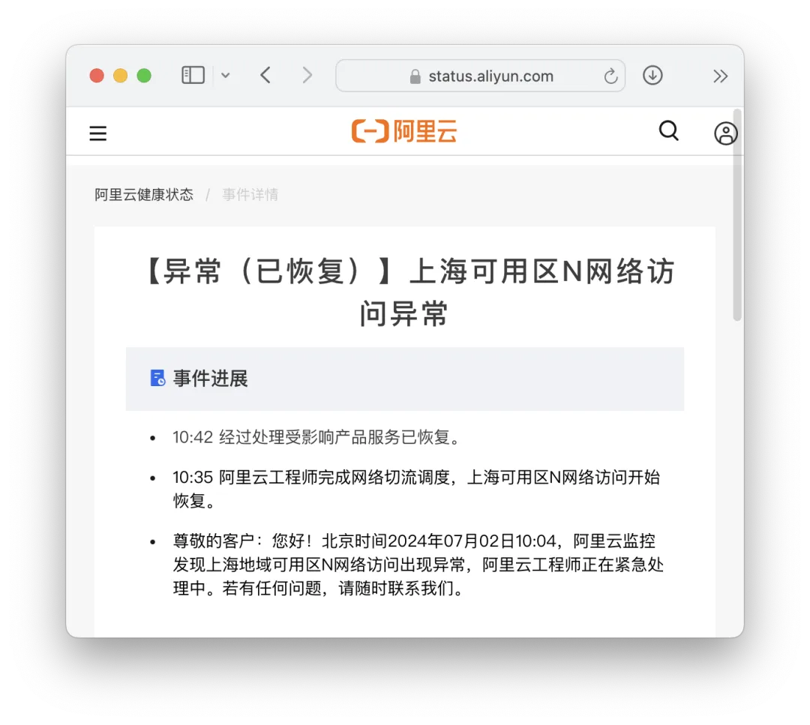
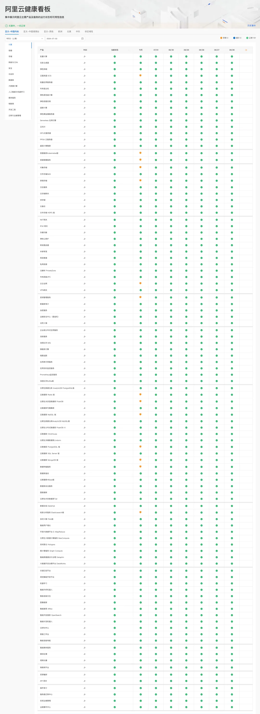

根据阿里云健康看板与公告，就在刚刚，上海可用区 N 出现网络访问异常。受到影响的服务包括：OSS，ECS，RDS，K8S，OTS，DTS，KMS，PolarDB，Redis，Mongo，ElasticSearch ；从发现故障到解决用时 31 分钟，从发现故障到影响恢复用时 38 分钟。

据知情人士透露，本次故障根因是：**专线被挖掘机挖断了**。（小道消息，请以官网通告为准）

阿里云故障公告地址：https://status.aliyun.com/#/eventDetail?eventId=20

------------------------------------------------------------------------

影响的服务范围看上去”不大“，但要命的核心服务一个都没拉下：对象存储，云服务器，云数据库，K8S……。

------------------------------------------------------------------------

据知情人士透露，本次故障根因是：**专线被挖掘机挖断了，**进而导致其他服务异常。不过，这次故障是单可用区故障，所以一些云数据库服务可以进行主备切换，将流量切换到其他可用区。

有不少使用该可用区的业务受到影响，比如 B 站实时弹幕功、小红书、恋与深空等。。

------------------------------------------------------------------------

### 下云老冯评论

公有云的高可用神话已经在一次又一次频繁发生的故障与响应表现中被打破了。前面有  [**阿里云全球服务不可用**](http://mp.weixin.qq.com/s?__biz=MzU5ODAyNTM5Ng==&mid=2247486468&idx=1&sn=7fead2b49f12bc2a2a94aae942403c22&chksm=fe4b39dfc93cb0c92e5d4c67241de0519ae6a23ce6f07fe5411b95041accb69e5efb86a38150&scene=21#wechat_redirect)  的史诗级故障，后有 **[Google云删除大基金的整个云账户](http://mp.weixin.qq.com/s?__biz=MzU5ODAyNTM5Ng==&mid=2247487552&idx=1&sn=799ae77dda3b80d2296070826142adea&chksm=fe4b259bc93cac8da2cc20f864e5a8b62ecb6f5dd57e7435db1d3fb2f2864a5d991b3a016358&scene=21#wechat_redirect)** 的传说级故障，各种中小故障更是此起彼伏。

尽管这一次故障并没有去年双十一  [**阿里云全球服务不可用**](http://mp.weixin.qq.com/s?__biz=MzU5ODAyNTM5Ng==&mid=2247486468&idx=1&sn=7fead2b49f12bc2a2a94aae942403c22&chksm=fe4b39dfc93cb0c92e5d4c67241de0519ae6a23ce6f07fe5411b95041accb69e5efb86a38150&scene=21#wechat_redirect)  那样惊天动地，但半个小时的单可用区核心服务故障仍然称得上是一次 “显著故障”。

公有云并非它们营销所宣称的数字化转型的万灵药，也不是可以买后真的甩手不管的运维外包魔法，希望用户在采购与技术选型时能认识到这一点，并审慎地进行决策。\

故障回顾：

[我们能从阿里云史诗级故障中学到什么](https://mp.weixin.qq.com/s?__biz=MzU5ODAyNTM5Ng==&mid=2247486468&idx=1&sn=7fead2b49f12bc2a2a94aae942403c22&scene=21#wechat_redirect "我们能从阿里云史诗级故障中学到什么")[阿里云周爆：云数据库管控又挂了](/cloud/aliyun-weekly-crash/)[【阿里】云计算史诗级大翻车来了](https://mp.weixin.qq.com/s?__biz=MzU5ODAyNTM5Ng==&mid=2247486452&idx=1&sn=29cff4ee30b90483bd0a4f0963876f28&scene=21#wechat_redirect "【阿里】云计算史诗级大翻车来了")

### [牙膏云？您可别吹捧云厂商了‍](http://mp.weixin.qq.com/s?__biz=MzU5ODAyNTM5Ng==&mid=2247487226&idx=1&sn=664377daf5242b8d5c832b11538e8cd8&chksm=fe4b3b21c93cb23764d8963375452fcd7c9b8c5ef5cf29e0474d5590d5d99a9503fc28baaeb6&scene=21#wechat_redirect)

[从降本增笑到真的降本增效](/cloud/smile/)

[罗永浩救不了牙膏云](http://mp.weixin.qq.com/s?__biz=MzU5ODAyNTM5Ng==&mid=2247487223&idx=1&sn=da885170d5d65a3c646d8b3d9da3aed3&chksm=fe4b3b2cc93cb23a5625e8c183860a9e1528eca0a1311439f1ec308a74d53f10cf5dbbb9a1d0&scene=21#wechat_redirect)

[互联网故障背后的草台班子们](/cloud/amateur-internet-outages/) [迷失在阿里云的年轻人](/cloud/lost-youth-at-aliyun/)\
[腾讯云/阿里云故障背后：投入不足](/cloud/cloud-outage-underinvestment/)[转载：从头到尾复盘腾讯云故障](http://mp.weixin.qq.com/s?__biz=MzU5ODAyNTM5Ng==&mid=2247487326&idx=1&sn=a19e6ee548fbe8bd6e899e582c63d31d&chksm=fe4b3a85c93cb393165cf2db37fb9d68dbd56139a5f40c5ac0a69e6aa5b1cd5ef4c057514054&scene=21#wechat_redirect)[故障不是腾讯云草台的原因，傲慢才是](http://mp.weixin.qq.com/s?__biz=MzU5ODAyNTM5Ng==&mid=2247487322&idx=1&sn=742491d10ec4f1538d38307fe0f8c625&chksm=fe4b3a81c93cb39701f9fed4e41f658643199848ea82cb28b50daf760e7d3c843d84d0965c71&scene=21#wechat_redirect)[腾讯云：颜面尽失的草台班子](/cloud/tencent-disgrace/)\
[云上黑暗森林：打爆云账单，只需要S3桶名](/cloud/s3-scam/)\
[删库：Google云爆破了大基金的整个云账户](/cloud/gcp-unisuper/)\
[为什么我们的云老是故障](/cloud/why-cloud-keeps-failing/)\
[你用的公有云都没做过测试](/cloud/public-cloud-untested/)

------------------------------------------------------------------------

[云计算泥石流](http://mp.weixin.qq.com/s?__biz=MzU5ODAyNTM5Ng==&mid=2247486813&idx=1&sn=ffb126fdd061c1e27626dd558f6fa26a&chksm=fe4b3886c93cb190e2acf7af6cfd25f298199f6ee73da566bed050c066b96753b913e3453d4f&scene=21#wechat_redirect)曾几何时，“上云“近乎成为技术圈的政治正确，整整一代应用开发者的视野被云遮蔽。就让我们用实打实的数据分析与亲身经历，讲清楚公有云租赁模式的价值与陷阱 —— 在这个降本增效的时代中，供您借鉴与参考。点一个关注 ⭐️，精彩不迷路[Ahrefs不上云，省下四亿美元](/cloud/ahrefs-saving/)\
