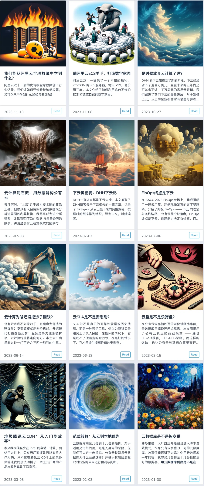

## 阿里云 [11. 12 大故障两周](http://mp.weixin.qq.com/s?__biz=MzU5ODAyNTM5Ng==&mid=2247486452&idx=1&sn=29cff4ee30b90483bd0a4f0963876f28&chksm=fe4b3e2fc93cb739af6ce49cffa4fa3d010781190d99d3052b4dbfa87d28c0386f44667e4908&scene=21#wechat_redirect) 过去，还没有看到官方的详细**[复盘报告](http://mp.weixin.qq.com/s?__biz=MzU5ODAyNTM5Ng==&mid=2247486468&idx=1&sn=7fead2b49f12bc2a2a94aae942403c22&chksm=fe4b39dfc93cb0c92e5d4c67241de0519ae6a23ce6f07fe5411b95041accb69e5efb86a38150&scene=21#wechat_redirect)**，结果又来了一场大故障：中美7个区域的数据库管控挂了近**两个小时**。

当然与上次 Auth故障类似，因为数据库这种 IaaS 资源类服务不会因为管控挂了就不能用了 —— 你确实无法通过 API 与控制台对数据库进行管理与变更，但是数据库本身是活着的，也可以正常使用访问。

这一次和 11.12 故障属于让官方发全站公告的显著故障，没记错的话，11月份还有两次较小规模的局部故障。这种故障频率即使是对于草台班子来说也有些过份了。某种意义上说，**阿里云这种周爆频率可以凭一己之力，毁掉用户对公有云云厂商的**托管服务**的信心：**只是单纯使用纯资源的 ECS / RDS ，不会因为管控挂了就不能用了。而那些听信云厂商布道师宣传，深度使用 IAM，托管服务，用云管控API凌空杂耍弹性创建销毁资源的用户，遇到管控面挂了那就真抓瞎了。

更进一步说，作为云服务的核心 —— 管控服务如果是这个稳定性水平，那么高价值客户为什么要 [花十几倍到上百倍的资源溢价](http://mp.weixin.qq.com/s?__biz=MzU5ODAyNTM5Ng==&mid=2247485269&idx=1&sn=a46b8b218331ece956c336b5c2a8df79&chksm=fe4b328ec93cbb98434b258ed1bfa6c63aecd0f3675002db75520edd21456eb39e97455fe995&scene=21#wechat_redirect) 来买云上的托管资源。而不是直接去移动联通机房租个机柜，雇两个大厂SRE，买服务器用[开源软件](http://mp.weixin.qq.com/s?__biz=MzU5ODAyNTM5Ng==&mid=2247485518&idx=1&sn=3d5f3c753facc829b2300a15df50d237&chksm=fe4b3d95c93cb4833b8e80433cff46a893f939154be60a2a24ee96598f96b32271301abfda1f&scene=21#wechat_redirect)自建？这是阿里云应当认真思考与回答的问题。（《[重新拿回计算机硬件的红利](/cloud/bonus/)》）\

阿里云上次 11.12 的故障，到今天都没有一份像样的复盘分析报告，对于 Auth不可用这样的顶级故障来说是完全说不过去的，这一次又是管控面的问题，可谓雪上加霜。这会对品牌形象产生致命打击 —— 吹过的牛逼会像回旋镖一样打回到自己身上，而专业用户的印象会最终停留定格在草台班子的滑稽画像上。

## 参考阅读

[重新拿回计算机硬件的红利](/cloud/bonus/)\

[我们能从阿里云史诗级故障中学到什么](http://mp.weixin.qq.com/s?__biz=MzU5ODAyNTM5Ng==&mid=2247486468&idx=1&sn=7fead2b49f12bc2a2a94aae942403c22&chksm=fe4b39dfc93cb0c92e5d4c67241de0519ae6a23ce6f07fe5411b95041accb69e5efb86a38150&scene=21#wechat_redirect)

[是时候放弃云计算了吗？](http://mp.weixin.qq.com/s?__biz=MzU5ODAyNTM5Ng==&mid=2247486366&idx=1&sn=c28407399af8b1ddeadf93e902ed23cc&chksm=fe4b3e45c93cb753dfd3cdbdd4eacd05ae6ce7d83eadf3105718cfa20180d6c3244652d88cc7&scene=21#wechat_redirect)\

[下云奥德赛](http://mp.weixin.qq.com/s?__biz=MzU5ODAyNTM5Ng==&mid=2247485760&idx=1&sn=97096da1077a4fbb4c43452a3c4983c7&chksm=fe4b3c9bc93cb58d5724454f0210c13362393a4abb05f9b9fbc0146a9b188b4520f6211bc891&scene=21#wechat_redirect)

[FinOps的终点是下云](http://mp.weixin.qq.com/s?__biz=MzU5ODAyNTM5Ng==&mid=2247485745&idx=1&sn=6109bb1be67f9e7e02124c4fc3b47ea3&chksm=fe4b3ceac93cb5fc4f492e0a0b9e13bc5bc0bec1b0970a129d3959e3051d04913cef7bfc6f34&scene=21#wechat_redirect)

[云计算为啥还没挖沙子赚钱？](/cloud/profit/)

[云SLA是不是安慰剂？](/cloud/sla/)

[云盘是不是杀猪盘？](/cloud/ebs/)

[云数据库是不是智商税？](http://mp.weixin.qq.com/s?__biz=MzU5ODAyNTM5Ng==&mid=2247485745&idx=5&sn=a7d610ea37c3f3fa78ee4ba0ee705962&chksm=fe4b3ceac93cb5fc6f1975f94be04424e7b3690eedd1658951deb8d016f5f19ade8806d86417&scene=21#wechat_redirect)

[范式转移：从云到本地优先](/cloud/paradigm/)

[腾讯云CDN：从入门到放弃](http://mp.weixin.qq.com/s?__biz=MzU5ODAyNTM5Ng==&mid=2247485363&idx=1&sn=8622b25fd2309d4fc969d22964a04129&chksm=fe4b3268c93cbb7efb8757e876574bebf5d615bdd3c4ceb76e48b2bd907d78faeb450ca1e825&scene=21#wechat_redirect)

