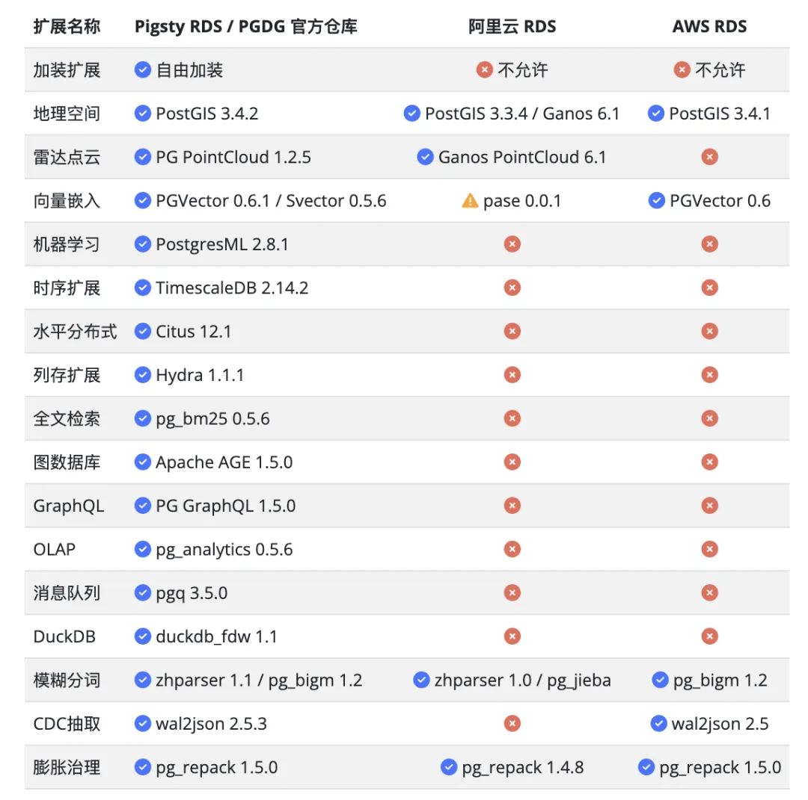
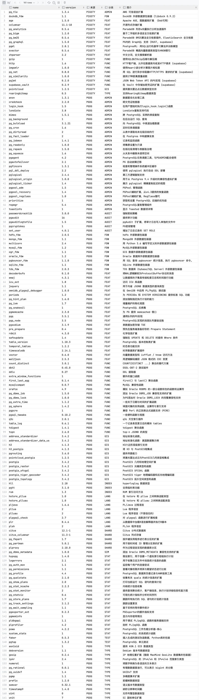
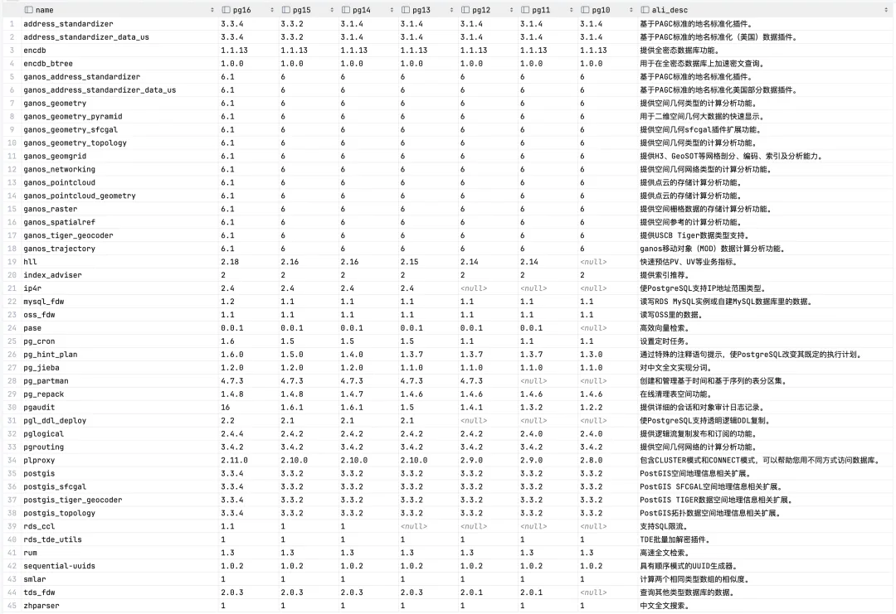
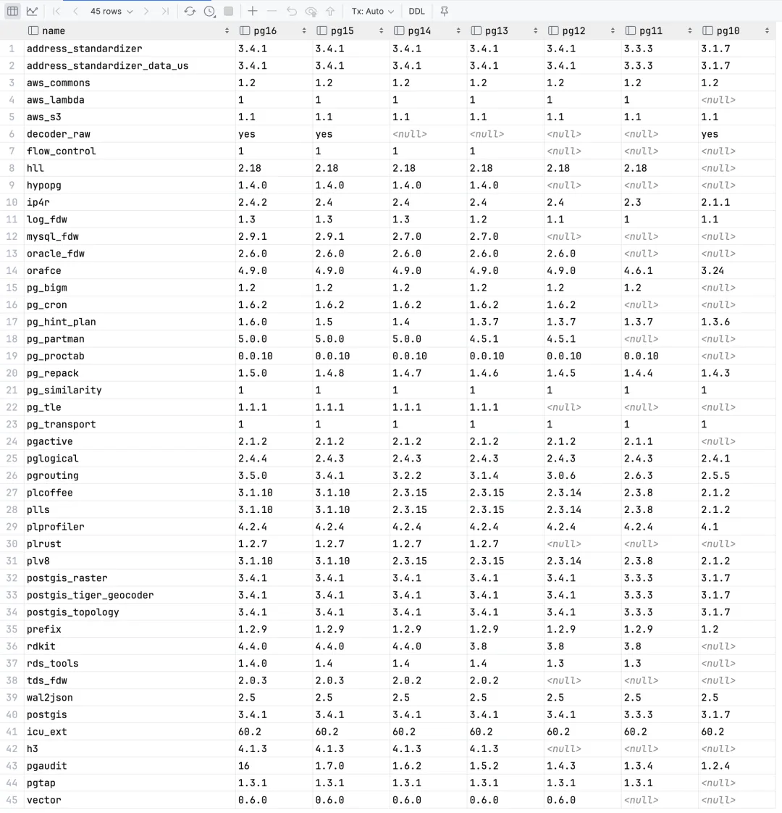

在上一篇《[**PostgreSQL正在吞噬数据库世界**](/pg/pg-eat-db-world/)》中，我们提到，尽管 PostgreSQL 是世界上最先进的开源关系型数据库，但其独一无二的特点在于其**极致可扩展性，与繁荣的扩展生态**！

不幸地是，**云上的 RDS 阉割掉了 PostgreSQL 的灵魂** —— 用户无法在 RDS 上自由加装扩展，而一些强力扩展也注定不会出现在 [**RDS**](http://mp.weixin.qq.com/s?__biz=MzU5ODAyNTM5Ng==&mid=2247485745&idx=5&sn=a7d610ea37c3f3fa78ee4ba0ee705962&chksm=fe4b3ceac93cb5fc6f1975f94be04424e7b3690eedd1658951deb8d016f5f19ade8806d86417&scene=21#wechat_redirect) 中。使用 RDS 无法发挥出 PostgreSQL 真正的实力，而这是一个对云厂商来说无法解决的缺陷。

## RDS 缺失重要扩展

在 PostgreSQL 生态中有着**上千**[1]的扩展插件，为 PostgreSQL 在各种方向上添加可选的功能模块。其中不乏一些超级强力的扩展（例如地理空间扩展 PostGIS 有170万行代码，而 PostgreSQL 内核只有一百万行）

我们为最新的 PostgreSQL 16 选出了 16 个具有代表性功能的生态扩展 —— 或者是提供某个细分领域的强力特性，或者是对于生产运维必不可少。并观察云厂商 RDS 对其支持的状态，而结果只能用惨不忍睹形容：

> 本地RDS / 阿里云RDS / AWS RDS 对16个主流扩展的支持情况

对于 PG 的杀手级特性 PostGIS，两家云厂商都有支持，阿里云海提供了自己的时空扩展 Ganos，把生态里其他一些相关的能力比如 PointCloud 也弄了进去。最近的当红炸子鸡向量数据库扩展 pgvector AWS 有跟进，但阿里云用的还是自家土法手搓的 pase。

作为本土云厂商，阿里云 RDS 提供了中文分词的扩展 `zhparser` 和 `pg_jieba`。最后是运维必不可少的两个扩展：治理膨胀的 pg_repack 和 wal2json AWS RDS 都齐全，但阿里云RDS依然没有提供 PG 16 的 wal2json 扩展。

然而，两家云厂商都只提供了 5/16 的重要扩展，其他一些重要的功能，比如时序数据库扩展 TimescaleDB，分布式数据库扩展 Citus，列式存储扩展 Hydra，库内机器学习 PGML，ElasticSearch全文检索扩展 pg_bm25，图数据库扩展 AGE，库内 GraphQL 查询扩展 PG GraphQL，OLAP 加速扩展 pg_analytics，消息队列 PGQ，嵌入式分析 DuckDB 支持全部缺位了！

更重要的是，云 RDS 不可能给用户自行加装扩展的能力。而这些缺失的扩展，也基本上不太可能出现在 RDS 中

------------------------------------------------------------------------

## 为什么RDS不提供扩展？

RDS 不提供这些重要扩展的原因，也许与多租户安全策略与开源协议有关。因为这些扩展大多采用了 AGPLv3 开源协议。AGPLv3 协议的特点就是专治云厂商白嫖开源 —— **如果云厂商将这些扩展纳入 RDS 中，他们就必须将 RDS 管控软件开源**。

在《[**DBA会被云淘汰吗？**](/cloud/dba-vs-rds/)》我们已经深度讨论过云 RDS 的商业模式，沉淀了 DBA 经验的管控软件，是云数据库的核心生产资料与[**摇钱树**](https://mp.weixin.qq.com/s?__biz=MzU5ODAyNTM5Ng==&mid=2247485292&idx=1&sn=4f650c3f5c3fb5207c55ff67e44d7d8a&scene=21#wechat_redirect "摇钱树")。核·月单位成本20块钱的硬件资源，套上管控软件，就能卖出 300～400（Aliyun），甚至 400～ 800（AWS）这样几十倍的天价——云厂商也许会把自己魔改的数据库内核与扩展开源，但是绝不可能把自己的真正核心软件 —— 管控开源的。

AGPLv3 是专门用于遏制云厂商和同业白嫖的开源协议，**对于终端用户来说，AGPLv3 却没有什么影响** —— 终端用户既没有兴趣去魔改软件，也几乎没人会把数据库作为托管服务对外提供。而用户通过客户端、命令行、脚本使用、管理这些 AGPLv3 组件的代码并没有任何开源义务，作者也压根没有对云/同行之外的用户进行追索的兴趣。

不过从另一个角度来说，现在已经出现了开源的 RDS 管控 —— [**Pigsty**](http://mp.weixin.qq.com/s?__biz=MzU5ODAyNTM5Ng==&mid=2247485518&idx=1&sn=3d5f3c753facc829b2300a15df50d237&chksm=fe4b3d95c93cb4833b8e80433cff46a893f939154be60a2a24ee96598f96b32271301abfda1f&scene=21#wechat_redirect)， 那么云厂商开不开源管控其实也不重要了。正好比弹性算力调度有了 K8S 这个标准后，大家已经不在意底下到底是物理机、虚拟机，EC2还是 ECS 了。

> [范式转移：从云到本地优先](/cloud/paradigm/)

------------------------------------------------------------------------

## 附录：RDS提供的扩展

上面我们列了16个重要扩展的支持情况，如果我们拉一个完整的扩展清单，这里面缺少的插件还要更多。

Contrib 模块作为 PostgreSQL 本体的一部分，已经包含了 73 个扩展插件，加上 PostgreSQL 官方仓库 PGDG 收录的约 100 个扩展，Pigsty 作为PG发行版自身维护打包了20个强力扩展插件，在 EL/Deb 平台上总共可用的扩展已经达到了 234 个 —— 覆盖了 PG 生态的主要有生力量。

然而云上的 RDS 却在这一方面存在极大的缺陷。例如，AWS RDS 只提供了 94 个扩展，阿里云 RDS 提供了 104 个扩展。在 PG 自带的 73 个扩展中，阿里云保留了23个阉割了49个；AWS 保留了 49 个，阉割了 24 个。

进一步刨除 PGDG 仓库里原本就有的扩展，阿里云独有的扩展仅有：ganos, tde，index-adviser, pasee, rds_ccl 等。AWS 独有的扩展稍微多一些：pg_transport, pgactive, pg_tle, log_fdw, flow_control, aws_s3, aws_lambda, aws_commons, rds_tools。

下面是刨除 PostgreSQL 16 自带的 73 个扩展后，开源本地优先的 Pigsty RDS ，阿里云 RDS ，AWS RDS 提供的扩展列表：

### Pigsty 开源RDS 提供的扩展清单

完整清单：https://pigsty.io/zh/docs/reference/extension/

### 阿里云 RDS 提供的扩展清单

完整清单：https://help.aliyun.com/zh/rds/apsaradb-rds-for-postgresql/extensions-supported-by-apsaradb-rds-for-postgresql

### AWS RDS 提供的扩展清单

完整清单：https://docs.aws.amazon.com/AmazonRDS/latest/PostgreSQLReleaseNotes/postgresql-extensions.html

### References

`[1]` 1千个PG扩展列表: *https://gist.github.com/joelonsql/e5aa27f8cc9bd22b8999b7de8aee9d47*
