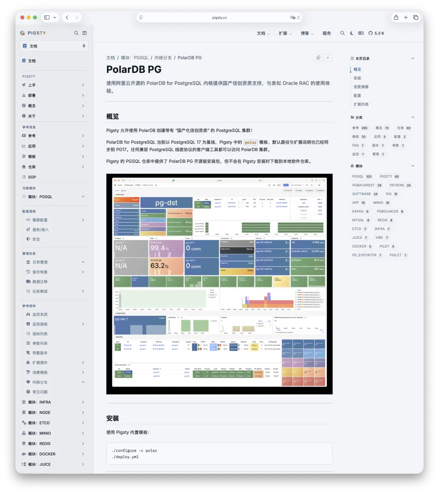
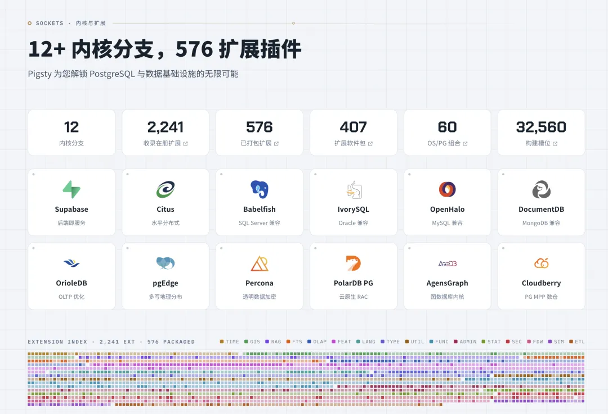

A couple of days ago, I ran into a spectacular database drop. A friend from the community came to me: something had gone wrong. A PolarDB for PostgreSQL instance, running in Docker on a single production host—several terabytes of data, gone. It supported a fairly important business system. There were no backups. The damage was severe.

Two or three years ago, I did a [PostgreSQL data recovery](/en/pg/pg-filedump/) job for a startup founded by a MiraclePlus alum (the fund formerly known as YC China). That one was a GitLab database on a machine running BCache. A power outage corrupted the files, and a few rounds of Reset WAL then amplified the damage.

At the time, I also went around looking at the companies on the market that did PostgreSQL data recovery. None of them seemed particularly trustworthy. With my friend out of options, I rolled up my sleeves and did it myself.

The method was `pg_filedump` doing page carving—plainly put, picking data pages off the disk one by one, figuring out which ones still look like they belong to some table, then prying the tuples out row by row and piecing the data back together. It sounds cool. In practice it is nothing but grunt work—it practically blinds you. The data did come back. But that database was only 1 GB. This one is several terabytes—and this time, even the data dictionary is gone.

I've been pedaling flat-out on AI work every day lately and couldn't spare myself for this one, so I made a point of asking a few friends at Alibaba Cloud: does the original vendor offer a data recovery service for your PolarDB for PG kernel? Nope. The vendor doesn't offer that either.

---

## Calling in the Cavalry

As it happened, I knew exactly the right old hand for PostgreSQL data recovery: Zhang Chen, the author of [PDU](https://github.com/wublabdubdub/PDU-PostgreSQLDataUnloader). Very few people in China take on the hard problem of PostgreSQL data recovery at all, and Zhang is without question among the best. So I rang him up and brought him in. Recovery is still underway, and more than 70% of the data is already out. Given the preconditions—no backups, a lost data dictionary, several terabytes, and a niche kernel fork—that is a genuinely impressive score.

I won't go into how exactly he did it. This is the trade he lives by, and it's not mine to present here as a tutorial. All I can say is that watching from the sidelines was more thrilling than any TV drama. As for who the client is or what the business is—I won't breathe a word. Still, the incident itself left me with two observations worth pulling out on their own.

---

## Bian Que's Eldest Brother Doesn't Get Paid

There is a particularly famous anecdote in *Heguanzi*, an ancient Chinese text.

King Wen of Wei asks the physician Bian Que: all three of you brothers practice medicine—who is the best? Bian Que answers: my eldest brother is the best, my second brother comes next, and I am the worst. The king is puzzled: then why is yours the only name the world knows?

Bian Que explains. His eldest brother treats disease by "perceiving the illness in the spirit and removing it before it takes form"—he cures you before the ailment has even shaped up, so his fame never gets past the family gate. His second brother treats disease while it is still as fine as a hair—pinning it down the moment it sprouts—so his fame never gets past the mouth of the alley. As for me, I needle the blood vessels, dose out fierce drugs, and cut into skin and flesh, stepping in only when the patient is nearly gone—which is why my name is known among the lords of every state.

The database business is exactly the same.

Over the years, I have [seen more than a few database drops](/db/database-really-exploded/), and the script is nearly identical every time: spin up a single PostgreSQL instance in Docker, get it working, take it to production. And not just to production—it runs merrily, for years on end, without a single incident. It reminds me of that song "Kill That Man from Shijiazhuang": living like this for thirty years, until the edifice collapses.

Three years without incident does not mean the architecture is right; it only means the luck held for three years. For a production business system—never mind standing up a standby for high availability—the bare minimum of professional hygiene is to periodically take a `dump` and put it on another machine. The cost is one `cron` entry plus a few dozen lines of script. When disaster actually strikes, it is the only paper-thin barrier between you and the abyss.

And anyone who has already adopted a niche kernel like PolarDB for PostgreSQL clearly has a taste for tinkering—so why not, while you are at it, stand up high availability and PITR with Pigsty? [Pigsty can manage PolarDB for PG](/db/domestic-db-any-good/).

Years ago, Alibaba Cloud came around asking whether I could support it, promising to bring me some business. In the end, not a single deal ever materialized—but the support got built, honestly and completely. The code is sitting right there, open source and free.

Everything upstream PostgreSQL has—high availability, monitoring, PITR—PolarDB for PG has as well: the full set, all usable, not one cent charged. Deploy with Pigsty, and out of the box you get an enterprise-grade database service with high availability and point-in-time recovery. Of course, if you ask me, the vast majority of people should simply use vanilla PostgreSQL and be done with it. But if you insist on these forks, I have a ready-made, free solution waiting right here.

What's that—you don't know how to set it up? Spend 2,000 yuan on a consultation, and I can at least spell out exactly which things you need to do. With a 50,000-yuan-a-year subscription, I will fill these pits in for you before you fall into them; you won't need a dedicated full-time DBA, most failures will heal themselves, and backups—off-site backups included—stop being your problem. Fifty thousand yuan a year won't even hire an intern in a tier-1 city.

The other road is to hand-roll a crude setup yourself, then wait for the crash and spend hundreds of thousands of yuan on data recovery while forfeiting deals worth millions to tens of millions. And here is the subtle part: it is only after the crash that the vast majority of people start taking the database seriously. In all my years, I have seen extremely few companies that understood on Day 1 how much the database mattered. That understanding is not a free commodity on a shelf; it is beaten into you, head against a wall—and usually the head has to bleed first.

The business of "treating the disease before it arises" is inherently thankless. You resolve things at the stage where nothing has yet happened: there is no drama, and there is nothing much to bill. The other guy saves a patient who was already at his last breath; you have prevented countless incidents that, in the client's mind, "would never have happened anyway." In the client's heart, those two things are two orders of magnitude apart in value.

Bian Que's eldest brother has a hard time making money.

---

## Don't Haggle over the Bandages While You're Bleeding

My second point: when the moment calls for a decision, make it—no dithering. The first two days after an incident are often spent not on recovery, but on the question of whether to spend the money. I am not singling anyone out; I have seen it before, and the script hardly varies. Could you take a free look first? Could you first assess how much is recoverable? Could you get the data out first and talk money afterward? We need to discuss internally, run it through the process—and just like that, two days are gone.

Suppose you are sitting on seven- or eight-figure deals—"A7/A8+" in the local deal-size slang—and the database is gone, with recovery priced in the hundreds of thousands. What is my call? Pay on the spot; the faster, the better. Get the contract signed and the money through immediately, and the person on the other side can work overnight for you, around the clock, 24/7. But if you hedge and stall, why exactly should they burn the midnight oil for you with no guarantee of anything? And what slips through the gap in between may be second-order damage that was entirely avoidable. The losses from downtime and lost data make the recovery bill look like pocket change. The arithmetic here is truly simple. But under stress, people tend to run a different calculation:

Am I being ripped off?

It is like being rushed to the ER after a midnight car crash, and haggling over the fare with the driver from the stretcher.

At bottom, most companies lack not money but the instinct to escalate—no playbook saying: for an incident of this severity, this person commits this much money within this many minutes. When something actually breaks, the report climbs the hierarchy layer by layer, and every layer waits for a reply. By the time whoever can sign off finally understands what has happened, the best rescue window has already closed.

---

## I'd Rather Do Less of This Business

Data recovery is work with a high professional bar, heavy investment, and irreducible uncertainty in the outcome. The people who can genuinely do it deserve to be paid accordingly.

Two thousand yuan for a consultation. Fifty thousand yuan a year for a subscription. Hundreds of thousands for the recovery. Seven- and eight-figure business on the line. Anyone can do this arithmetic—most people simply refuse to pick up the pencil until the day the edifice collapses. What saddens me is that a lot of this business should never have existed at all.

What could have been a restore from backup, following the playbook, ends up as an expert doing archaeology on the surviving data files. What could have been a response channel settled in advance ends up as a desperate scramble for help across incident chat groups. It looks like a hero arriving to save the day; behind it sits a pile of trouble that was entirely avoidable.

So don't make "we can always find an expert to fish the data out at the end" your disaster recovery plan. The expert should be the last line of remedy, not your only copy of the backup. I would much rather help people fill in what is missing while their systems are still healthy. Fewer legends, more routine; fewer all-night rescues, more going home on time.

I hope the next time a friend comes to me, it is to say the business has grown and they need a few more databases—not that the database is gone again, there are still no backups, and could I please hurry up and call in the cavalry.

As for "spectacular database drop" stories as a topic—**I would rather stay permanently out of stock.**

---

## Further Reading

- [How Do You Call in the Cavalry When Your Database Explodes?](/db/db-emergency-help/)
- [This Time the Database Really Exploded, and Even the Cavalry Couldn't Help](/db/database-really-exploded/)
- [How to Use pg_filedump for Data Recovery?](/en/pg/pg-filedump/)
- [Cloud RDS: From Database Drop to Exit](/en/cloud/drop-rds/)
- [Rumor: Jiangxi Education Department's Gaokao Score Site Dropped Its Database and Ran](/cloud/jiangxi-drop-db/)
