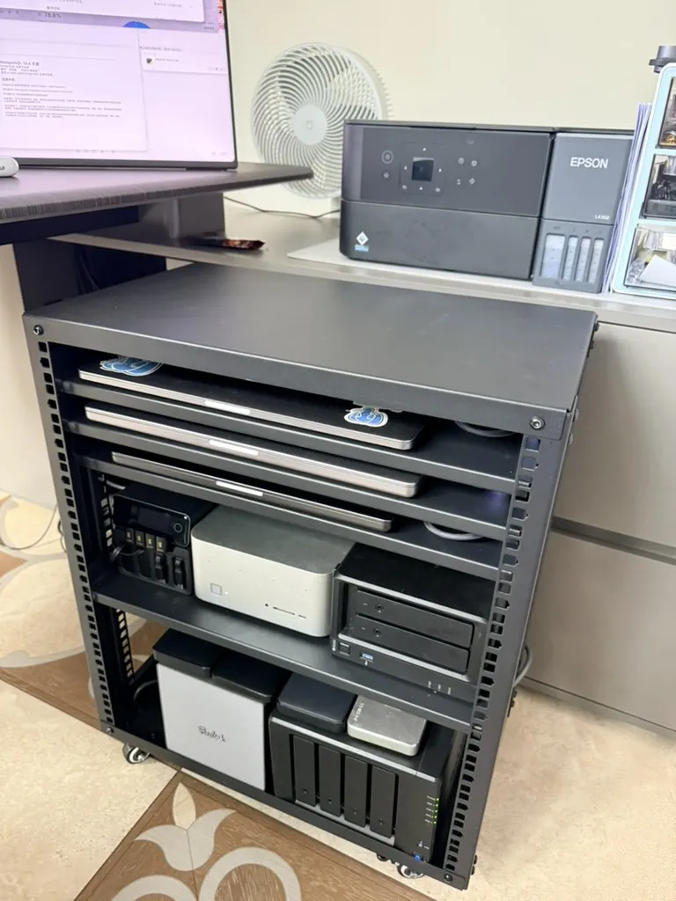
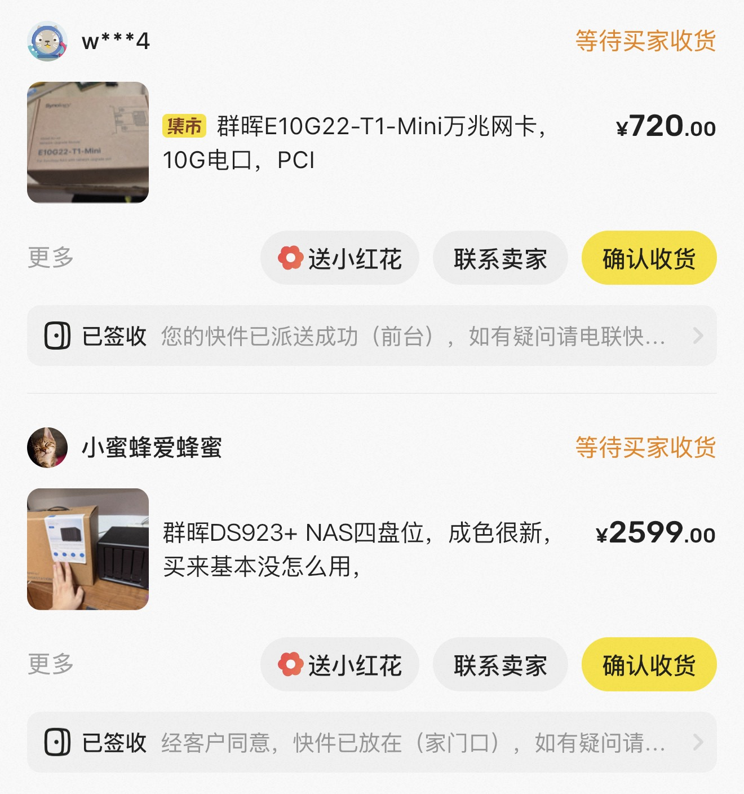
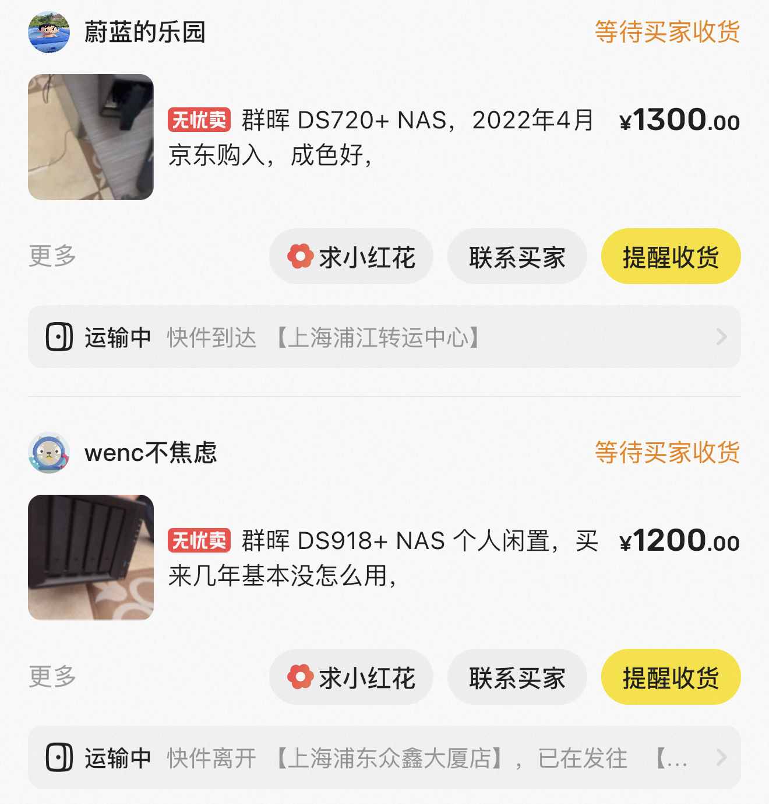
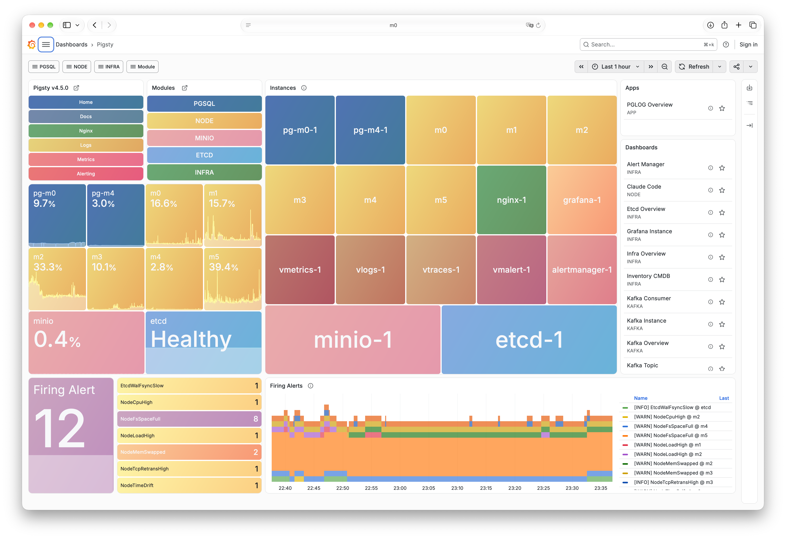

The joke goes that a middle-aged man has three hobbies: **NAS boxes, routers, and chargers**.

I stayed home for all seven days of China’s National Day holiday. I had no desire to fight the crowds, so I put my head down and worked.

That week wasn’t all work, though. I also overhauled my home network: bought two NAS boxes, sold the two old ones, added a 10GbE switch and a few 10GbE adapters, and built a complete 10GbE LAN in a small, rolling 12U rack.

All three hobbies, in one go.

## Why Now? AI Agents Ate My Disk Space

Why the sudden interest in NAS and networking? Funnily enough, agents forced my hand. My two main laptops, an M1 Max and an M5 Max, each have 8 TB of storage. That ought to be plenty. But once you start using agentic coding to wish software into existence, 8 TB disappears fast.

This keeps happening: I have 2 TB free, ask an agent to build something, and come back to a full disk and a stalled task. Infuriating. Enough was enough: I needed a NAS to hold all that accumulated stuff.

## Choosing a NAS: The Compact Beelink ME Pro

I already had two Synology units:

- A **DS918+**, bought in 2018: four bays, with four 10 TB HGST hard drives.
- A **DS720+**: two bays, with two 16 TB Seagate IronWolf hard drives.

I had recently pulled two 4 TB NVMe SSDs from my desktop and had a few other spare SSDs lying around. Why not put them to work in a NAS with 10GbE?

I read plenty of reviews, including options such as fnOS. The five-bay Minisforum N5 series caught my eye first. Then I found Beelink’s compact four-bay **ME Pro**, which even has a two-bay version. That got my attention.

<!-- source-image: 2 -->

I was already fond of Beelink. A year ago, I bought its [GTR9 Pro AMD mini PC](/ai/local-200b/) for a little over 10,000 yuan. It now costs 24,000. I love that little machine: it builds many of the extensions in PGEXT and handles most of my x86 builds.

Compared with the bulky Minisforum N5, the ME Pro is much more compact and presentable. It is exactly the same height as my two Synology units, so they line up neatly. Better still, it has a **replaceable motherboard**. There are several Intel and AMD CPU options, and even a Loongson version. Want an upgrade later? Just swap the board. I’ll probably look for this design again next time.

It arrived with Windows 11 Pro. Obviously, that wouldn’t do: I wiped it immediately and installed Ubuntu 26.04. The built-in 10GbE port worked straight away. I also installed the old NVMe SSDs I had salvaged. Now I can put it to more interesting use, such as testing Silo object storage across multiple disks on a single machine.

<!-- source-image: 3 -->

The barebones unit was cheap at just 2,000 yuan. Add 32 GB of RAM and a 512 GB boot drive, though, and the bill jumps by another 2,000–3,000 yuan. Memory and storage prices are frightening right now, especially NAS hard drives. Four years ago, a 16 TB hard drive cost me 3,000 yuan. Instead of getting cheaper, they now cost 5,000–6,000 each. Absurd.

<!-- source-image: 4 -->

It’s a likable little machine. I’ll give it an article of its own later.

## Upgrading Synology: 10GbE for a Little over 800 Yuan

I did hesitate over replacing the old DS918+.

It was still a good machine. It only had two gigabit ports, but a USB 5GbE adapter could get it to 5 Gbps—plenty of bandwidth for four hard drives. Then again, if I was upgrading everything to 10GbE, why leave it as the bottleneck?

So I bought a used **DS923+** on Xianyu, China’s secondhand marketplace, for around 2,600 yuan. I passed on the newer DS925+ because the DS923+ still takes Synology’s own 10GbE card. That card cost another 700-plus yuan. Synology’s pricing is shameless: a USB 10GbE adapter costs just 200–300. The NAS and card came to 3,319 yuan.

Next, I recouped some of the cost:

- I listed the DS918+ on Xianyu for 1,400 yuan and eventually sold it to a friend for 1,200.
- I listed the DS720+ for 1,400 yuan and sold it outright for 1,300.

Both were gone within half an hour of listing. I got 2,500 yuan back. **The net cost was a little over 800 yuan**, and my Synology setup was on 10GbE.

## Storage Pools: Three Pools, Three Jobs

Once all the drives were in place, I divided the storage into these pools:

<!-- source-image: 8 -->

## 10GbE Networking: A Switch for 1,300 Yuan

My home network had been running on an ASUS ROG “Magic Box” Wi-Fi router with eight 2.5GbE ports. The whole 2.5GbE setup always felt a little lacking.

So I bought a 10GbE switch from the Chinese brand XikeStor for around 1,300 yuan.

That gave both NAS boxes and the GTR9 Pro 10GbE ports. My three MacBooks still needed them: the two main laptops and an old Intel model from 2018. Conveniently, XikeStor also sells USB 10GbE adapters for 300 yuan each, with a Thunderbolt 4 cable included. One on each laptop completed the 10GbE LAN. Access is now blazing fast.

## Power and Rack: Three Cables, All under the Desk

For the charger, I chose a 240 W Hagibis model with USB PD 3.2 AVS support that can charge an iPhone 18. It has four retractable cables, three of which connect to the three MacBooks. Their combined rated power exceeds 300 W, but they rarely run flat out at the same time, so the charger can cope. Besides, my main M5 Max gets power separately through its dock. The charger actually supplies only two laptops, an easy load for it.

For power distribution, I used a BULL PDU with surge protection and a digital display.

With the equipment sorted, I needed something to put it in. I had planned to build a rack from aluminum extrusion. After working out my requirements, I bought a ready-made 12U rack on Taobao for a little over 200 yuan and assembled it myself. Everything fits neatly:

- **Bottom 5U**: the two NAS boxes, power bricks, and PDU.
- **Middle 4U**: the switch, charger, and GTR9 Pro, with room to add a Mac Studio later.
- **Top 3U**: one MacBook per shelf, usually running as a server with the lid closed.

Only three cables leave the rack: one power cable, one network cable, and one cable to the dock for my desktop monitor. It has wheels, rolls around easily, and fits right under the desk. Much tidier than having everything scattered across the desktop.

<!-- source-image: 10 -->

For 7,000–8,000 yuan all told, I had a little 10GbE rack. Chargers, NAS, routing and switching: all three midlife pleasures accounted for.

<!-- source-image: 11 -->

## The Days of the PC-Building Guru Are Over

The most interesting part of the whole process was how much AI contributed.

Which rack size? How wide and deep? I handed it all to Claude Opus 5.5. Give it the name of every device, and it works out the dimensions, cooling, and power layout, then gives you a diagram to follow.

Network adapters, drivers, partitioning and formatting, OS installation, SSH setup—all the tedious parts of setting up a machine now take little more than telling an agent what you want. Once a machine boots and accepts SSH connections, I can leave the rest to Codex and Claude. Add an IP KVM, and I think they could handle the whole process.

**The days of needing a PC-building guru are gone for good.**

<!-- source-image: 12 -->

## What It Takes to Leave the Cloud

This brings me to an interesting topic: **leaving the cloud**.

There are prerequisites. Many engineers who grew up on the cloud have never handled a server, rack, power supply, or network hardware. Now, without spending much money, you can get hands-on experience with all of it at home: learn how it works, then make it run yourself. That is fun in its own right.

Take my six local machines. Four run Linux and host a complete Pigsty environment with:

- PostgreSQL databases and Silo object storage.
- Internal systems and dashboards.
- Monitoring, build coordination, and task queues.
- Git repositories and internal CI/CD.
- Business and financial data in Odoo.

All of it runs locally on my own hardware. It’s small, but everything is there: one person can build a complete, modern platform for a company. **One person can do the work of an infrastructure team.** It’s a fascinating experiment, and if you want to leave the cloud, it’s excellent practice. With agents helping, you can do on your own what once took a whole infrastructure team.

Production infrastructure has long since moved beyond this scale, of course: 25GbE is the starting point, and 100G and 400G optical transceivers are everywhere. Who still uses 10GbE copper ports? But the fundamentals carry over: rack dimensions, power distribution, cable routing. And honestly, this craft may be more resistant to AI replacement than coding. **AI still can’t grow a pair of hands and plug in that network cable for you.**

## One Last Thought

No wonder people joke about these being middle-aged men’s hobbies. The tinkering itself is the fun.

That’s the broad outline for now. In a few days, when I have some time, I’ll go into the specific equipment and why I chose each piece.
