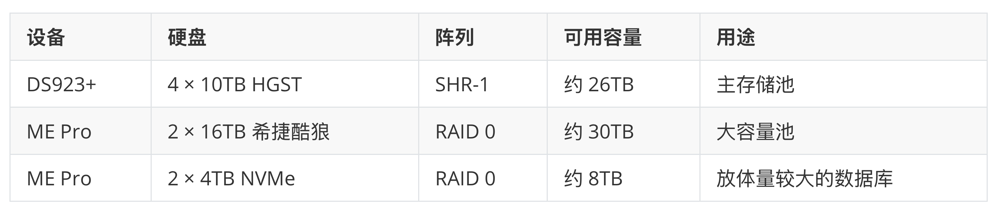

俗话说，中年男人有三大爱好：**NAS、路由器、充电头**。

国庆长假，老冯哪儿也没去。实在不想跟人山人海挤在一块儿，干脆在家闷头干了七天活。

不过，这七天也不是光蹬车，还顺手把家里的局域网从头到尾梳理了一遍：新购两台 NAS，卖掉两台老的，再配上一台万兆交换机和几块万兆网卡，整出了一套完整的万兆内网，外加一个能推着走的 12U 小机柜。

三大爱好，一次集齐。

## 起因：硬盘被 Agent 吃光了

为什么突然折腾起 NAS 和网络？说来好笑，是被 Agent 逼的。老冯手上两台主力笔记本，M1 Max 和 M5 Max，都有 8 TB 存储。按理说绰绰有余，但一旦你开始“许愿式”的 Agentic Coding，就会发现 8 TB 根本经不起霍霍。

最近经常碰到这种事：明明还剩 2 TB，许个愿让它去做点东西，回来一看——磁盘满了，任务停了，让我大为光火。于是痛下决心：不行，得整台 NAS，把这些鸡零狗碎的东西统统丢上去。

## 选型：小巧玲珑的零刻 ME Pro

老冯原本有两台群晖：

- 2018 年买的 **DS918+**：四盘位，插着 4 块 10 TB 的 HGST 硬盘。
- **DS720+**：两盘位，插着 2 块 16 TB 的希捷酷狼硬盘。

最近又从台式机上拆下来两条 4 TB 的 NVMe SSD，加上手头零零碎碎的几块 SSD，就琢磨着把这些闲置物件利用起来，攒一台带万兆的 NAS。

评测看了一大圈，包括飞牛这类方案。最先心动的是铭凡（Minisforum）的 N5 系列五盘位 NAS，后来发现零刻（Beelink）有一款小巧玲珑的四盘位 **ME Pro**，甚至还有个两盘位版本，一下子就被吸引住了。

<!-- source-image: 2 -->

对零刻，老冯本来就有好感。一年前买过它家的 [AMD 迷你主机 GTR9 Pro](/ai/local-200b/)，那会儿才一万出头，现在涨到了两万四。这台机器我爱不释手，现在 PGEXT 的很多扩展，以及 x86 的主力构建，都是在这台小主机上跑出来的。

相比铭凡 N5 那个大箱子，ME Pro 的尺寸讨喜、体面得多，高度和两台群晖正好一样，摆在一起整整齐齐。更吸引我的是**可更换主板**的设计：Intel、AMD 的几款 CPU 可选，甚至还有龙芯版本，以后想升级，直接换主板就行。以后再买，我大概还会选这种设计。

机器到手，自带 Windows 11 专业版——这当然不能忍，第一时间格掉，装上 Ubuntu 26.04。它自带万兆网口，插上就能用。那几条老的拆机 NVMe SSD 也顺手装了进去，接下来正好拿它做点有意思的事，比如测测单机多盘对象存储 Silo。

<!-- source-image: 3 -->

价格方面，准系统才 2000 块，很便宜。但内存和系统盘一加（32 GB／512 GB），一下子又要多花两三千。现在内存和硬盘的价格实在吓人，尤其是 NAS 机械硬盘：四年前买一块 16 TB 机械盘才 3000 块，现在不仅没跌，还涨了，一块要五六千，简直离大谱！

<!-- source-image: 4 -->

这台机器挺讨喜，后面我单独写一篇聊聊。

## 群晖换代：净花八百多块上万兆

老的 DS918+ 要不要换，我其实纠结了一下。

它本身还不错，虽然只有两个千兆口，但插个 USB 的 5G 网卡，也能跑到 5 Gbps，喂四块机械盘完全够用。可转念一想：既然都要上万兆了，怎么能让瓶颈卡在它身上？

于是上闲鱼花 2600 块左右收了台 **DS923+**。没选更新的 DS925+，是因为 DS923+ 还能插原装万兆网卡。只是这块原装卡又要七百多块——群晖是真黑心，USB 万兆网卡明明两三百就能搞定。两样加起来，一共 3319 块。

然后是回血环节：

- DS918+ 挂闲鱼 1400 块，最后 1200 块出给了朋友。
- DS720+ 挂 1400 块，1300 块直接出掉。

挂上去半小时就卖光了，一共回血 2500 块。**里外里只花了八百多块**，群晖这边就升级到了万兆。

## 存储池：三个池子，各司其职

盘都归位之后，存储池是这么划分的：

<!-- source-image: 8 -->

## 万兆网络：一千三的交换机

原来家里用的是华硕 ROG 魔盒 Wi-Fi 路由器，有八个 2.5G 口。整套 2.5G 网络，用起来总觉得差点意思。

于是干脆上了一台国产兮克的万兆交换机，才 1300 块左右。

这样，两台 NAS 和 GTR9 Pro 都有了万兆口，但三台 MacBook 没有：两台主力，外加一台 2018 年的 Intel 老款。正好兮克也有配套的 USB 万兆网卡，送一根雷电 4 线，300 块一个。三台电脑各插一块，内网万兆就彻底打通了，访问速度飞快。

## 供电与机架：三根线收进桌底

充电头选了海备思的 240 W 款，支持 PD 3.2 的 AVS，能给 iPhone 18 充电，还能拉出四根伸缩线，其中三根接三台 MacBook。三台本子的额定功率加起来有 300 多瓦，但平时极少同时满载，完全扛得住。况且主力 M5 Max 另外走扩展坞供电，这个充电头实际只带两台，跑得相当轻松。

接入插排用的是公牛的防雷数显 PDU。

设备齐了，还得套个壳子。本来想自己用铝型材搭，后来算了算需求，直接在淘宝花 200 多块买了个 12U 成品机架，自己组装。空间分配刚刚好：

- **底层 5U**：两台 NAS、电源砖和 PDU。
- **中间 4U**：交换机、充电头和 GTR9 Pro，后面再塞一台 Mac Studio。
- **顶层 3U**：一层一台 MacBook，平时合盖当服务器用。

整个机柜对外只有三根线：一根电源线、一根网线，还有一根接桌面显示器扩展坞的线。底下带轮子，能推着走，正好收进桌子底下。比以前散落在桌子上整洁多了。

<!-- source-image: 10 -->

里外里七八千块钱，一个万兆小机柜就成了。充电头、NAS、路由交换，中年男人的三大乐趣，全齐了。

<!-- source-image: 11 -->

## “装机仙人”的时代，结束了

整个过程里最有意思的，是 AI 的参与感。

机架买什么规格，宽度、深度怎么定，直接丢给 Claude Opus 5.5，一条龙搞定：把每台设备的名称告诉它，它自己去精算尺寸、散热和电源布局，最后给你一张图，照着装就行。

插网卡、装驱动、分区格式化、装系统、配 SSH……以前装机最繁琐的这些活儿，现在动动嘴就完事了。基本上，只要机器能开机、能连上 SSH，剩下的丢给 Codex 和 Claude 去配明白就行。我觉得再配个 IP KVM，就能一条龙全干了。

**“装机仙人”的时代，一去不复返了。**

<!-- source-image: 12 -->

## 下云的先决条件

这里其实引出了一个有意思的话题：**下云**。

下云是有先决条件的。很多在云上原生长大的工程师，根本没摸过服务器、机架、电源和网络。而现在，你在家花不了多少钱，就能把这些东西从头到尾摸一遍：搞清楚它们是怎么工作的，再亲手让它们真正跑起来。这件事本身就充满乐趣。

就拿老冯本地这 6 台机器来说，其中 4 台 Linux 机器跑着一套完整的 Pigsty 环境，上面部署了各种组件：

- PostgreSQL 数据库与 Silo 对象存储。
- 各种内部系统与 Dashboard。
- 监控、构建协调、任务队列。
- Git 仓库与内部 CI/CD。
- 业务与财务数据跑在 Odoo 上。

全都跑在自己的本地环境里。麻雀虽小，五脏俱全——一个人就能搭起一套完整、先进的公司级平台，**一个人顶一个基础设施团队**。这是个非常有趣的实验。如果你想下云，这更是一次难得的演练：在 Agent 的帮助下，过去整个基础设施团队才能干的活，你一个人就能独立完成。

当然，生产环境早就不是这个量级了：25G 起步，100G、400G 的光模块满天飞，谁还玩万兆电口？但底层知识是相通的：机架多宽多深、供电怎么配、线怎么走，道理都一样。而且说句实话，这门手艺抗 AI 替代的能力，可能比写代码还强一些——**毕竟 AI 还没法替你长出一双手，去插那根网线。**

## 写在最后

也难怪大家把这些戏称为中年男人的爱好：折腾的过程本身，就是乐趣。

今天先聊个大概。过几天有空，老冯再细讲这套方案用到的具体设备，以及每一项选型背后的考量。
