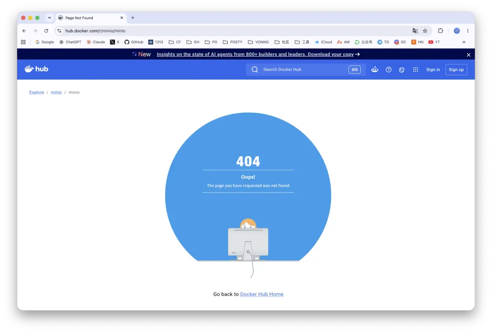
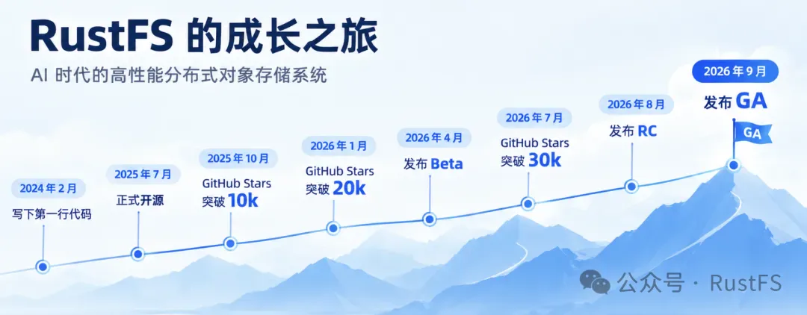
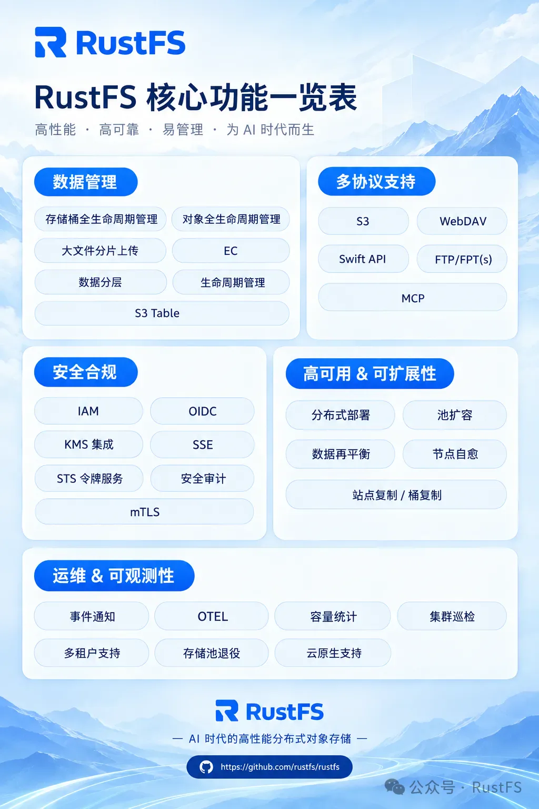
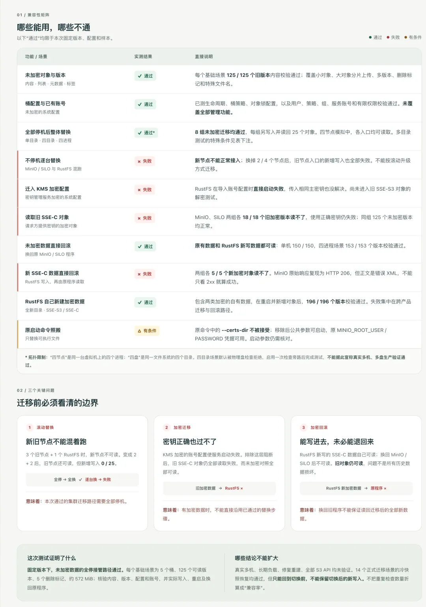
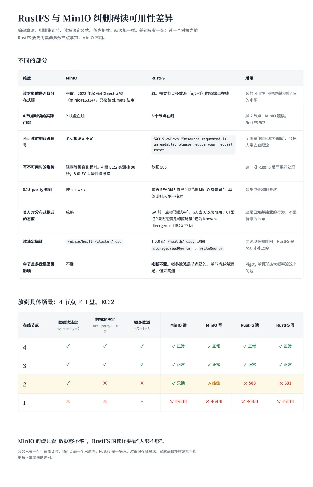

Li Wenkai, who runs RustFS — an S3-compatible object store written from scratch in Rust — is a friend of mine and a fellow alum of MiraclePlus (the fund formerly known as YC China); his batch was S26, mine was S22. Last night they shipped 1.0 GA, and he asked me to write something today to help get the word out, with one specific instruction: Feng, make it a little controversial or nobody reads it, and say a few nice things about us while you're at it.

Before I start, let me put my conflicts of interest on the table. I maintain a PostgreSQL distribution called Pigsty, which uses MinIO for object storage. When [MinIO bailed](/en/db/minio-resurrect/), I started maintaining my own fork — [Silo](/en/db/long-live-silo/) — which makes me, in that sense, a RustFS competitor. On the other hand, I'm genuinely not married to any particular object store, so Pigsty also supports swapping MinIO out for RustFS: I build the RPM/DEB packages for RustFS and ship the deployment playbooks, which makes me one of its distribution channels too.

Alum, competitor, packager — several relationships tangled together. So what follows contains nitpicking and congratulations, and in places the two are inseparable. Take it as one perspective and judge for yourself.

---

## MinIO Handed Them the Opening

On the evening of September 11 UTC, the `minio/minio` and `minio/mc` repositories vanished from Docker Hub. 404 on access, images unpullable — a repository with more than two billion pulls, just gone, with no explanation from the company while it was happening. Milvus, Grafana Mimir, DataHub, Plane, OpenCTI — one project after another that depended on it started throwing errors. Some repointed at `quay.io` overnight; others just ripped it out.

The MinIO repo on GitHub is still there, still carrying its sixty-thousand-odd stars, but the README now says the repository is no longer maintained and steers users toward AIStor Free and AIStor Enterprise. The "Free" one is not the open-source distribution everyone remembers either — it's a product under a proprietary EULA.

Five days later, on September 16, the Silo I maintain shipped its stable release. At nine that evening, RustFS shipped 1.0 GA. Both projects are picking up work MinIO dropped, but not the same work.

### Installed Base vs. Greenfield

Silo exists to solve the incumbent user's problem. You have a few petabytes sitting in MinIO, a handful of Ansible playbooks, and a pile of `mc admin` scripts with everything hardcoded. Somebody telling you "we've redesigned a more advanced object store from scratch" is not necessarily good news. What you probably want is one sentence: **don't change anything, fix the CVEs and the correctness bugs, and give me back my images.**

The users RustFS is talking to are more willing to take a step forward. New project, new cluster, wanting out from under AGPL, or wanting an object store that's under active development with a roadmap and commercial support — all good reasons to take a look. The two audiences overlap, of course, as the migration test below shows. But I built Silo first and foremost to keep my own MinIO and my users' MinIO running well. I never set out to go head to head with every new object store.

If RustFS genuinely pulls this off, I'd happily switch over and have one less thing to worry about.

---

## They Have Genuinely Shipped a Lot

By the company's own numbers: first line of code in February 2024, open-sourced in July 2025, Beta in April 2026, RC in August, GA in September. Fourteen months of open source, 6,600-plus commits, 135 releases, 180-plus contributors, 32k stars. They claim 2.7 million installations worldwide, more than seventy percent of them in Europe and North America, over ten million Docker Hub pulls, and paying customers in AI, energy, finance, and cloud.

Nice numbers, but the pull counts have to be read side by side: the MinIO repo that just vanished was over two billion; RustFS has just crossed ten million. Two orders of magnitude apart. Pull counts don't prove reliability, but the hours in production and the variety of workloads behind them can't be skipped. "MinIO replacement" is a heavy phrase. RustFS has only just gotten a hand on it, and 1.0 is where the testing starts.

They offered a few case studies: TwinLabs, a French AI company running a 4×2 topology on NixOS, whose CTO has been filing issues since the Alpha; HyperApp, an Uzbek cloud provider using it to carve out instances for customers; plus a financial firm in Bangladesh and a national bank in Tanzania.

The capacities in the cases I saw run from tens to a few hundred TB. Early users willing to put an Alpha into production and then file careful issues when they hit trouble are precious. But running well at tens of TB does not extrapolate to several PB. Capacity is only one axis: object count, failure rate, rebuild time, multi-pool expansion, long-running mixed workloads — every one of them magnifies problems. On the petabyte question, the public material is still short on evidence.

I weigh that one heavily because I actually built a 25 PB pool on MinIO — at the time probably the largest MinIO deployment in China — and ran it in real production for years, so I have a decent sense of what breaks at that scale. It's also why, when MinIO bailed, I'd rather fork it than stop using it. I no longer have the hardware to test at that scale, of course.

For a team willing to dig in, though, petabyte scale is only a matter of time. Wenkai wrote a book, *From MinIO to Enterprise Cloud Storage*. Write the textbook on MinIO first, then build the replacement for it — turning your research subject into your competitor.

---

## Credit Where It's Due

**Apache 2.0 is a real reason.** If you want to embed an object store in your own product and ship it to customers, and AGPL gives you pause, that one fact alone is enough to take RustFS seriously. But a permissive license and staying open long-term are two different things, and I'll come back to that.

**S3 Tables, fully open source.** They say RustFS ships a built-in Iceberg REST Catalog, and they spell out that the feature is fully open source. For comparison: MinIO's AIStor Tables went GA in February this year, inside the enterprise edition. I haven't tested this one, but the choice to put it in the open-source build is a concrete point in their favor — worth more than another round of "we embrace the community."

**The feature list is already pretty complete.** IAM, OIDC, KMS, SSE, STS, mTLS, audit; distributed mode, pool expansion, rebalance, self-healing, site replication, bucket replication; lifecycle, tiering, event notification. Most of the usual capabilities are there. Their claim to have "essentially caught up with the MinIO open-source release on features" isn't outrageous if you're just reading the list. How far each "supported" actually goes is something you verify item by item.

**And the last one, the thing I most want to praise: the compatibility with MinIO's on-disk format is real work, and it delivers.** They say MinIO users can migrate by swapping the binary outright. I put that claim through a round of testing, and it isn't hot air.

### Migrate by Swapping One Binary?

Conclusion first: **unencrypted data survives a full stop-and-swap, and you can roll back to MinIO even after writing new data.** Much better than I expected.

The tests used the official RustFS 1.0.0 binaries, three builds: `x86_64 GNU`, `x86_64 musl`, `ARM64 GNU`. The source side was MinIO `RELEASE.2025-09-07` and Silo. Three topologies: single node single disk, single node four disks, and four processes simulating four nodes. Each scenario got 5 buckets, 125 object versions, 5 delete markers, roughly 600 MB of data, covering multipart, gzip, awkward keys, version chains, object lock, lifecycle, policies, and IAM. Object contents were compared SHA-256 by SHA-256 — seeing an HTTP 200 does not count as a pass.

| Scenario                     | Existing objects read | New writes | Rollback to MinIO |
| ---------------------------- | --------------------- | ---------- | ----------------- |
| Single node, single disk     | 125/125               | 25/25      | 150/150           |
| Single node, four disks      | 125/125               | 25/25      | 150/150           |
| Four nodes, full-stop swap   | 125/125               | 25/25      | 153/153           |

MinIO as source and Silo as source gave identical results, and so did all three official builds. IAM users, policies, groups, and service accounts imported as-is.

The rollback surprised me most. I've always thought the part that matters about a drop-in isn't how you get in, it's whether you can get back out when something goes wrong. Reading the old data isn't the whole job. You write a batch of data on the new software, decide it isn't working out, swap back — does the old one still recognize it? This round, they did it: switch to RustFS, write new objects, swap the binary back to MinIO, and everything reads, with every SHA-256 matching.

#### Where the Migration Stops

The same round turned up three limits, and they should be stated plainly.

**First, no rolling replacement.** Swap one node out of four and run 3+1 mixed; swap two and run 2+2 mixed — the RustFS nodes uniformly report `erasure read quorum` and cannot read the test objects. At 2+2, the two remaining MinIO nodes can no longer write either: the whole cluster has lost write quorum. So the "just swap the binary and you've migrated" picture needs one more word next to it: **downtime.** Stop everything, swap everything, start it back up — that works. Swapping one machine at a time and expecting old and new to run side by side through a transition does not. Fortunately, that's usually an acceptable price.

**Second, encrypted data does not make it across.** On a cluster with KMS enabled, RustFS exits outright while importing the IAM configuration, and it won't come up even when handed the same master key. With SSE-C, which doesn't go through KMS, RustFS does start — but even with the correct key it cannot read MinIO's sealed format; the error points at a feature called `rio-v2`, which none of the three official builds enable. The reverse doesn't work either: SSE-C objects newly written by RustFS come back as `XMinioObjectTampered` after a rollback to MinIO. So that all-green table above **does not cover encrypted data.**

**Third, the startup configuration doesn't carry over verbatim.** The `MINIO_ROOT_USER` and `MINIO_ROOT_PASSWORD` environment variables work — log in with the original credentials and all five buckets are there. But the moment the unit file carries `--certs-dir`, RustFS exits while parsing arguments. Essentially every TLS-enabled production deployment has that flag, so how certificates get configured and how your existing security boundary is preserved both need a fresh pass, done the RustFS way.

So the official line — "MinIO users can migrate simply by replacing the binary" — needs at least three conditions written beside it: **unencrypted, full stop-and-swap, adjusted startup configuration.** Spelled out, the claim holds, and it's genuinely impressive. Left unspelled, it's a 3 a.m. surprise.

#### Lose Two Nodes — Can You Still Read?

This round also turned up a behavioral difference that deserves its own section. A MinIO read only asks whether there's enough data; a RustFS read also asks whether there's a quorum. In a four-node, one-disk-each (4N1D) deployment, take down two nodes and MinIO degrades to read-only, while RustFS bricks outright. That's probably the biggest surprise waiting on the other side of a migration: you see no difference day to day, and you find out when nodes go down. For a backup store, that is the difference between getting your backups out on the worst day and not. It may not be a bug — it may well be deliberate design — but at a minimum it belongs in the migration docs.

Let me be equally clear about the scope of what I tested: a single erasure set, four processes on one machine, a static sample. Real multi-machine multi-pool setups, network partitions, heal and rebuild, sustained load, external KES, replication and tiering, S3 Tables — none of that was tested. The conclusions answer for this version, this sample, and this topology only.

**Compatibility taken this far is enough. Don't chase it further.** Encryption compatibility means chasing MinIO's sealed format and key wrapping; rolling replacement means chasing its inter-node protocol. Go deeper than that and you end up patching whatever MinIO changes, which amounts to locking MinIO's shackles onto your own wrists.

The part of the installed base that's unencrypted and can take a maintenance window, RustFS can absorb today. The part that's encrypted and can't go down can keep evaluating compatibility routes like Silo, or plan a separate migration over the S3 API — there's no need to dump every piece of historical baggage onto a from-scratch rewrite. What RustFS should be working on is RustFS.

---

## RustFS's Own Homework

That settles the compatibility ledger. The next two items have nothing to do with MinIO's format or protocol. They're RustFS's own business.

### Monitoring Needs Filling In

I've raised this one privately. RustFS metrics go out over OTel push; there is no Prometheus-compatible `/metrics` endpoint. Wenkai's answer is to run Prometheus with `--web.enable-otlp-receiver` and take the push directly. That connects, but it's some distance from "production monitoring is solved."

In a serious deployment there is never one Prometheus. There are at least two replicas, each scraping independently and verifying independently — whether the scrape succeeded is itself one of the most important health signals you have. A push model means you can only push to one; pushing to two or three means standing up a fan-out layer in the middle, and when that link breaks, whose fault is it? This isn't RustFS's fault. It's the fundamental difference between push and pull. But it's a real blocker on the ops side: a team running Prometheus or VictoriaMetrics just wants to add an object store, not re-architect its monitoring along the way.

One more nitpick. The feature table lists six protocols — S3, WebDAV, Swift, FTP, SFTP, MCP — and the one thing missing is `/metrics`. Breadth and depth are different things. You might not touch the Swift API once a year; metrics, alerts, and health checks you use every day. MinIO got that endpoint right early, and it's one reason it grew into the cloud-native stack the way it did. If RustFS wants to take over that job, this is a lesson worth learning sooner rather than later.

### A 1.0 Owes More Than a Feature List

A few months ago I asked Wenkai when the Alpha label was coming off. He said a few bugs weren't sorted out yet, and he didn't dare call it GA. I liked that answer. A 1.0 in storage software should be something you were afraid to ship.

Now 1.0 GA is out, and the announcement says the core object storage capabilities are stable enough. The swap test above counts as me verifying one small piece on their behalf. The parts I didn't test are the parts a 1.0 really owes people: real multi-machine multi-pool deployments, network partitions, heal and rebuild after a node dies, sustained load, external KMS, site replication, and tiering. Every one of those is a place where object storage blows up in production. What was tested, how it was tested, what the results were, and which known limitations remain — publish it. That I didn't test something doesn't mean the team didn't; but if users can't see it, they can't make a decision on it.

That's the trouble with object storage. Reads and writes work fine day to day, which makes it very easy to conclude the thing is already solid. The real test is when a bad disk, a network drop, a rebuild, and an expansion all land at once. By the time a user hits that on your behalf and you start explaining what the version number was supposed to mean, it's too late.

### The Real Thing to Watch Is Commercialization

Everything above is a technical problem: fixable, patchable, testable. The next one I care about more. The back half of the official announcement lays out the 2.0 roadmap: AI at the center, DPU-accelerated data paths, RDMA, S3 Vector, "keeping the GPUs continuously fed with data."

Nothing wrong with the direction. But reading it, it's hard not to think of another press release. MinIO has been telling this story for two years — AIStor, RDMA, GPUDirect, Tables — selling "the data foundation for the AI data center." If RustFS 2.0 tells the same story, why would a user switch again?

Performance, features, price: all fair ground to compete on. But for me, the difference that carries the most weight is whether it can stay open source over the long haul, and keep the open-source build worth using.

Wenkai told me there is currently no split between the open-source and commercial editions, and that feature differentiation will begin after GA. A company has to make money; that's entirely reasonable. What to watch is where the line gets drawn, and whether it keeps getting walked back once it is.

MinIO's path is worth laying alongside for comparison. It started on Apache 2.0 too, and that license is what earned it its first cohort of users and its ecosystem. In 2021 it switched to AGPL. In March 2024 it released Enterprise Object Store, the first time the commercial edition was a separate binary. Everything after that, everyone watched: console features cut, some distributions no longer shipped, the open-source repo moved to maintenance mode, and finally the Docker Hub repositories disappearing.

One license change, or one separate commercial build, doesn't mean everything that followed was fated from that day. But every step took a little back, and a few years on, users looked up and found very little of what they knew still there. Every subtraction MinIO made was a quiet one; users found out by falling into the hole themselves.

What Apache 2.0 protects is the code already released under it. It does not guarantee the next version's code will be public, it does not guarantee the license won't change, and it does not guarantee anyone will keep building your packages, publishing your images, or maintaining your docs. That's exactly the lesson MinIO left behind: the code was there the whole time, and they still cut off the supply chain and pulled the ladder up behind them, and users still got put through the wringer. RustFS has an Apache 2.0 license today. So did MinIO, once.

**The biggest risk for RustFS isn't failing to become MinIO. It's becoming MinIO.**

So my advice is one line: **write the boundary down.** Which capabilities stay in the open-source build and which belong to the enterprise edition. Whether the license can change, and what happens to older versions if it does. Where binaries, images, and historical releases are published, and how long they're kept. And what users and the community get to take over if the company someday stops maintaining it. Put it in a public document, date it, and announce it publicly whenever it changes.

"S3 Tables, fully open source" is already a good opening. What users need to know next is whether that was an isolated decision or a principle the whole product will follow. A public commitment isn't blanket insurance, but it beats making users dig through issues guessing what the next release will take away. MinIO never wrote a document like that. That's the first bit of daylight RustFS can put between itself and MinIO.

### Don't Turn Into MinIO

The official announcement has a section titled "RustFS Is Not Another MinIO." I'm willing to believe it, and I'd like to make the sentence more concrete.

First, don't treat MinIO's past as the finish line. On-disk format compatibility caught a cohort of users, and that's enough. The feature set of MinIO's open-source build is whatever was left after a company hacked it down under commercial pressure. Matching it is table stakes at best, not a long-term goal.

Second, don't walk MinIO's present back through step by step. AI, DPU, RDMA are all fine things to build. But telling a new story with one hand while clawing things back out of the open-source build with the other is a routine everyone just lived through. Rewriting it in Rust will not make users forget the last time.

So who should they be watching? The S3 ecosystem, and what users need next. S3 is already the de facto standard for object storage, but AWS holds the pen on what the standard means, and on the on-prem side somebody has to keep up with it in the open. Tables, Vectors, Express — pick the ones worth building, and when you build them, put them in the open-source edition. MinIO walked half that road and then bailed, and that is precisely RustFS's opening. S3 Tables is one step taken; what comes after it matters more than how the press release reads.

### Last Word

I told Wenkai a while back: the day the Alpha label comes off, I'll find a way to swap MinIO out. 1.0 is here, and I stand by that. But actually putting it into production still requires answers to the questions above. I'll add RustFS as an alternative engine option in Pigsty, but whether it can be the default has to be proven over time. A friend is a friend, and data safety is not something you hand out as a favor.

As a competitor, I want RustFS to nail the greenfield half, so I can work the installed-base half with a clear head. As a fellow alum, I want it to skip the detours. As the person who packages it, I want it, a year from now, to be carrying the flag for open-source object storage — the default answer in the object storage world when somebody needs to replace MinIO.

Congratulations on 1.0.

**Aim at MinIO. Don't turn into MinIO.**
