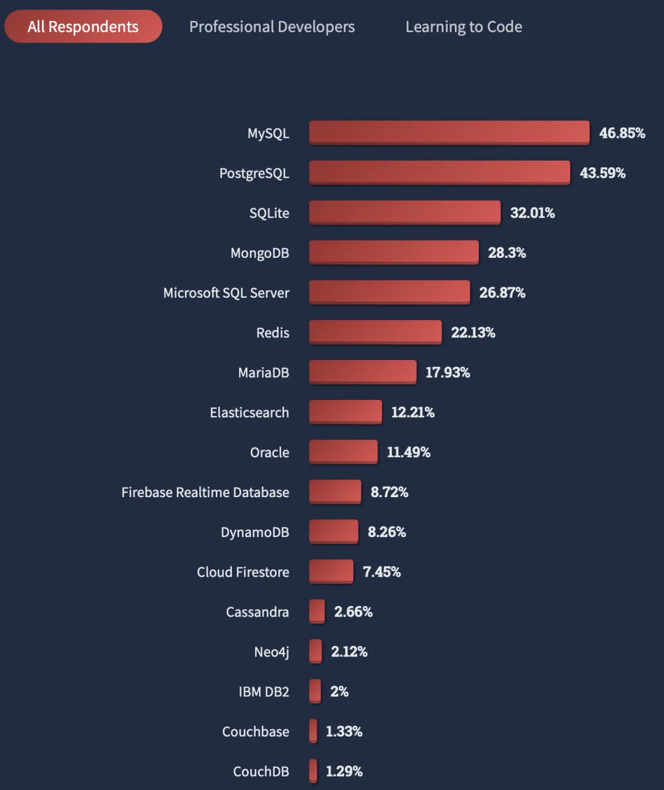
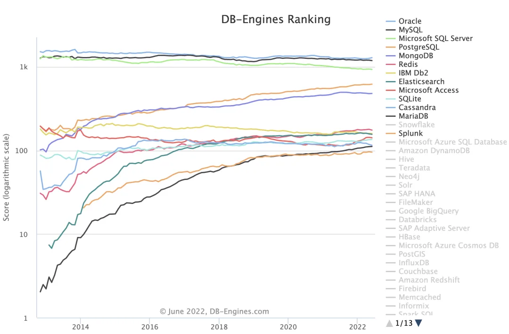

什么，PostgreSQL已经成为最流行，最先进，开发者最想学习使用的数据库了？

最近，StackOverflow公布了在5月份进行的一次开发者调研报告。其中PostgreSQL获得了三连冠：

**PostgreSQL成为专业开发者中最流行的数据库！超越MySQL攀升至第一！**

**PostgreSQL成为开发者最喜爱，且最想学习的数据库，超越Redis攀升至第一！**

**PostgreSQL成为现有其他数据库用户最感兴趣的数据库！**

StackOverflow是享誉全球的开发者社区，其用户调研覆盖7万名开发者（77%为职业开发者），具有非常强的代表性，代表了先进技术的发展方向，对于技术选型极具参考价值。

## 最流行的数据库

https://survey.stackoverflow.co/2022/#section-most-popular-technologies-databases

在总共63,327份样本中，48,788 (77%) 位 职业开发者使用的数据库如下图所示。

PostgreSQL与MySQL的流行度与其他数据库显著拉开距离：其中，PostgreSQL以 46.5% 的使用率位居第一；MySQL以 45.7% 的使用率位居第二。SQLite, SQL Server, MongoDB, Redis次之（25%～30%）。

**在专业开发者中，PostgreSQL以0.8%的优势，第一次超过MySQL，成为最流行的数据库！**

在初级程序员（占总样本数的8%，自我认知为“学习编程中”）中，MySQL目前仍然使用率最多的数据库，显著超过其他数据库。

从整体上看（所有开发者），MySQL在流行度上以微量优势（3.25%）领先 PostgreSQL。

做一个有品味的开发者，请选择**PostgreSQ**L

## 最喜爱的数据库

最流行的数据库反映了当前的现状，而**开发者的喜爱则代表未来**。在此项中，PostgreSQL第一次击败Redis，成为最受开发者喜爱的数据库！（在所有数据库中！）

PostgreSQL与Redis一骑绝尘，以70%+ 的喜爱率高居榜首。MongoDB 与 SQLite表现不俗，以60%左右的喜爱率位居第三第四。只有50%左右的人喜欢与MySQL和SQL Server打交道，而Oracle，CouchDB，IBM DB2的喜爱率则排名倒数，只有35%的开发者喜欢Oracle。

反过来说，高达一半开发者讨厌反感 MySQL，高达三分之二的开发者反感 Oracle，而高达四分之三的用户讨厌IBM DB2。

另一个问题是开发者**最想要**（Most Wanted）的数据库，PostgreSQL是所有开发者最想使用的数据库(19%)。PGSQL，MongoDB，Redis位列开发者最想要数据库的前三甲，并与其他产品显著拉开了距离，特别是 MySQL (8%) 与 Oracle（2%）。

## 现在用什么以及想用什么？

根据用户过去一年在用的数据库类型与下一年准备用的数据库，Stackoverflow绘制了数据库流向和弦图。**它反映了某个数据库的用户群体，对什么样的数据库感兴趣。**

在职业开发者中（77%），PostgreSQL占据了最大的流入通量，大量使用其他数据库的开发者对使用PostgreSQL感兴趣。其中以来自MySQL开发者居多。

一部分PostgreSQL用户对使用 Redis (7000)，MongoDB ( 6033 ) 、SQLite（5275） 感兴趣，但基本没有对MySQL感兴趣的PG用户。

相反，MySQL的用户对PostgreSQL最感兴趣（11,185），其次是MongoDB(9520) 与Redis (8124)。

除此之外，高达一万六千名正在使用PostgreSQL数据库的用户计划明年继续用，在所有数据库的自我流向数中稳居榜首：不难看出，PostgreSQL已经成为专业开发者的青睐之选，让用户爱不释手，牢牢守住了自己的基本盘。

在使用 MySQL 的开发者中，28%的用户准备继续用MySQL，23%的用户准备去使用PostgreSQL（首要流出），18%的用户准备去使用MongoDB（第二位流出）。在初学者中，约有27%的MySQL用户准备使用PostgreSQL，而基本上没有PostgreSQL用户准备去用MySQL。倒是有一些MongoDB的用户准备去使用MySQL，给MySQL带来了一些流入。

## DBEngine

另一个可以作为数据库流行度相对参考的权威数据源是 DB-Engins Trending，里面提供了基于多种数据来源计算得到的相对流行度：网页，岗位，Google Trending，StackOverflow，Twitter，LinkdeIn等等。在最近一年，PostgreSQL的流行度上升了52.32，同比上升 9.2%，MySQL的流行度下降了38.65，同比下降3%。

https://db-engines.com/en/ranking_trend

今天下三分，然Oracle ｜ MySQL ｜ SQL Server 疲敝，日薄西山。PostgreSQL紧随其后，如日中天。前四的数据库中，前三者都在走下坡路，唯有PG增长势头不减，此消彼长，前途无量。

从DBEngin-Trending上看，基本上到 2028 - 2029 年，PostgreSQL就可以成为所有数据库中的流行度王者！ 拳打Oracle，脚踢MySQL指日可待。

为什么 PostgreSQL 如此牛逼？请参考 《[为什么说PostgreSQL前途无量？](http://mp.weixin.qq.com/s?__biz=MzU5ODAyNTM5Ng==&mid=2247484591&idx=1&sn=a6ab13d93bfa26fca969ba163b01e1d5&chksm=fe4b3174c93cb862899cbce4b9063ed009bfe735df16bce6b246042e897d494648473eea3cea&scene=21#wechat_redirect)》
