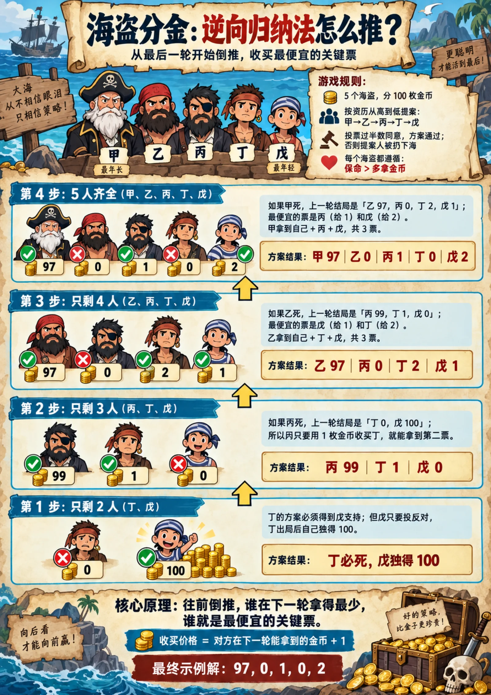
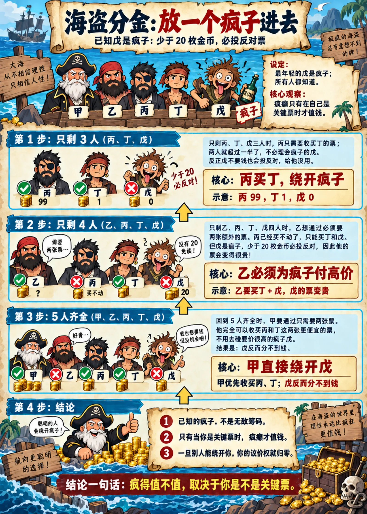
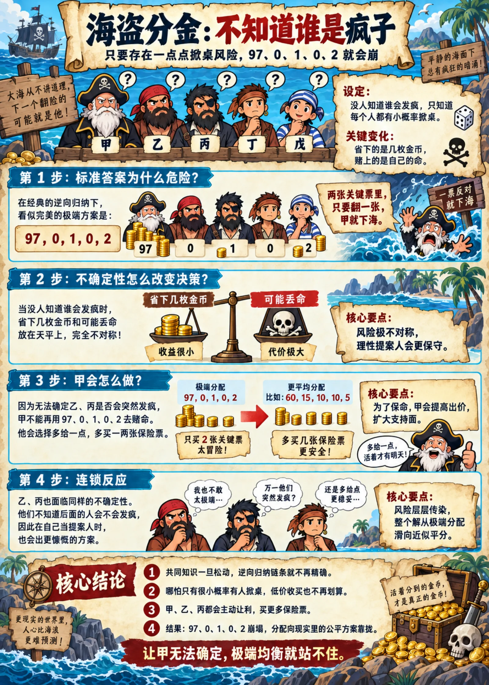
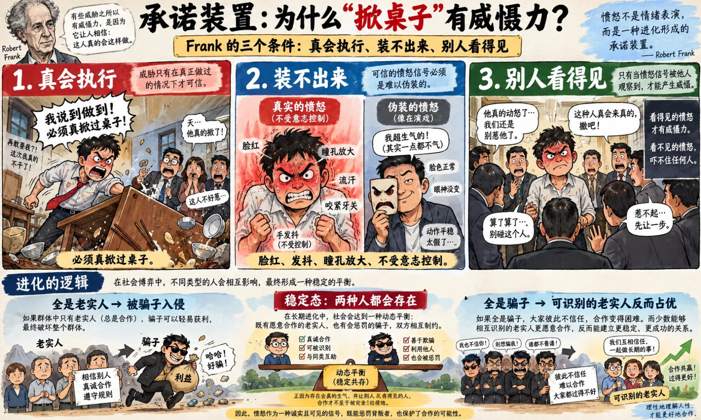
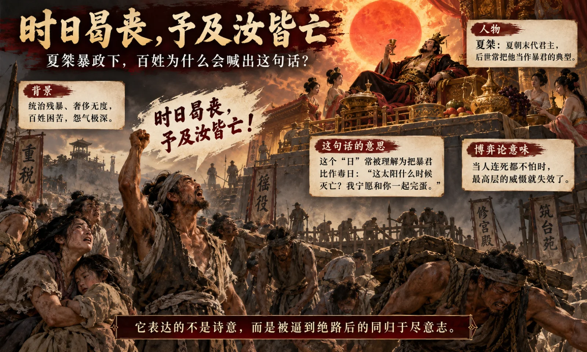

I took a game theory course in college, and one of the classic problems the professor set was the pirate game. Five pirates — call them A through E, oldest to youngest — divide a hundred gold coins. The most senior one proposes a split, everyone votes, and a majority passes it. If it fails, the proposer goes over the side and the next one proposes. All five are brilliant, perfectly rational, greedy, and fond of their own lives. Question: what should A propose?

The standard answer is 97, 0, 1, 2, 0 (or 97, 0, 1, 0, 2). The man at the top walks off with ninety-seven, the rest split three, and two of them get nothing at all. The method is called **backward induction**: work out what happens with two pirates left, then back up to three, four, five. Every step fits flush. Logically it is airtight.

My first reaction was that it's wrong. In the real world, anybody who proposed that split would have the other four jump him and beat him to death first, and sort the money out afterward. If a theory produces a conclusion that far from the facts, something is wrong with the theory.

I didn't chase it down at the time. It took me a while to understand that the pirate game was never a model meant to describe reality. It's a puzzle — one Ian Stewart set in [*Scientific American*][pirates] in 1999 to show how sharp and how counterintuitive backward induction is. The more absurd the conclusion, the more the sharpness of the tool stands out. Once I saw that, I let it go. It's the same move as the frictionless spherical cow in a vacuum from physics class: it's showing off a tool, not describing the world.

But one question stayed with me. Why do real people flip the table? Why would the pirate in line for one coin rather take nothing at all than let the vote pass? What is that apparently idiotic behavior actually doing inside the game?

I thought about it for years. When it finally clicked, I found it far more interesting than the puzzle itself, and it explains a lot: why a line written three thousand years ago — *when will this sun expire? We will perish together with you* — is still quoted today, why every organization needs a few people nobody wants to cross, and why the decent ones are always the ones who can't get out of the trap.

> Note: AI content in this article: 70%. And a disclaimer — what follows is about irrationality in the game-theoretic sense. It is not encouragement to hurt anybody. Quite the opposite: hurting the innocent is the worst option on the board.

--------

## I. Retaliation That Doesn't Pay Is the Load-Bearing Beam Under Every Fair Split

Start with where the pirate game is actually fragile.

Most people assume it's the "everyone is rational" assumption. It isn't. The load-bearing assumption is that **rationality is common knowledge** — not just that everyone is rational, but that A knows B is rational, and knows that B knows C is rational, and knows that B knows that C knows D is rational, layer on layer all the way down. [Aumann proved in 1995][aumann] that given this common knowledge, the backward-induction solution necessarily holds. Which means the converse: one flicker of doubt anywhere in that chain and the whole derivation comes apart.

That is a far harsher requirement than "somebody is irrational." All five pirates being rational isn't enough — if A merely suspects that E might not be, the answer changes.

So let's put an irrational player aboard and see what happens. For the rest of this piece I'll call him a **madman**, which here is a term of art rather than a diagnosis. It names exactly one disposition: retaliating when you know the retaliation costs you more than it gains. It has nothing to do with anyone's mental health.

Say the youngest, E, is a madman: he votes no on anything under twenty coins, consequences be damned, and everybody knows it. Work backward. When it's B's turn to propose, B needs two more votes. C can't be bought — C cleans up in the next round. D is satisfied with one coin. That leaves E, and E wants twenty, so B pays it. The madness paid. But when it's A's turn, A also needs two more votes, and one coin for C plus two for D covers it. A simply routes around E. A well-behaved E still had a fifty-fifty shot at two coins; a madman E is guaranteed nothing.

So known madness is a conditional chip. It's worth something only when you are the pivotal vote and nobody can replace you; otherwise people route around you. Life works the same way. The guy with the temper either gets catered to or gets cut out of the game, and there is rarely a middle state.

The interesting case is the second one: nobody knows who the madman is, only that every person carries some probability of turning on you.

Now A's bet is wildly asymmetric. What he saves is a few coins; what he loses is his life. Even at a 5% chance of madness per pirate, an offer of 97, 0, 1, 2, 0 puts him over the side if either of his two bought votes flips — call it close to one chance in ten of dying. What does an A who is even slightly attached to living do? He gives away a great deal more and buys an extra vote or two as insurance. The number 97 collapses on the spot. And it spreads up the chain: B is just as afraid of dying, so B can't get 98 in the next round either, which changes the price A has to pay for votes, and so on. The whole solution slides from an extreme split toward something close to an even one.

That is what actually happens in the world. The pirate game is a multi-round ultimatum game at heart, and the ultimatum game has been slapping the rationality assumption in the face since [the first experiment in 1982][ultimatum]: [proposers offer forty to fifty percent on average, and offers below twenty percent get rejected all the time][ultimatum-results]. People would rather have nothing than let you have something.

Notice how cheap the self-destruct move is in the pirate game: one coin. You give up one coin and you get to replace the man holding ninety-seven. The puzzle assumes nobody is willing to spend that coin, which is a far more absurd assumption than "everyone is rational." Real people will spend the coin, and they will spend a great deal more than one.

Which raises the question: is the impulse to retaliate when you know you'll lose by it a defect in the human design, or part of it?

I only worked it out when I read Robert Frank's [*Passions Within Reason*][frank]. His starting point is something the rational-actor model cannot explain: the commitment problem.

A purely rational person cannot do three things. His threats aren't credible — when the moment comes to pay for punishing you, he runs the numbers and drops it. His promises aren't credible — only an idiot passes up a free advantage. His loyalty isn't credible — he leaves when something better shows up. And because everyone knows he's rational, he can't frighten anyone, and nobody dares trust him or commit to him for the long haul. Rationality has become a liability.

Emotion is the solution to that problem. Anger makes you retaliate when you know the trade is a loss. Guilt keeps you from cheating when nobody is watching. Love keeps you from walking out when a better option appears. The crucial part is that emotion hijacks your rational calculation at the exact moment of decision — you can still negotiate with a man who is "rationally angry," you cannot negotiate with a man who is genuinely furious, and only the second one is frightening.

**Irrationality isn't a side effect of the device. It is the function.**

Frank calls this a commitment device, and three conditions make it work. It has to really fire: somebody has to have actually flipped a table. It has to be unfakeable: flushing, shaking, dilated pupils lie outside voluntary control, which is what makes them credible signals. And it has to be visible: anger nobody sees deters nobody. The evolutionary logic is frequency-dependent. A population of nothing but honest cooperators gets invaded by cheats; inside a population of nothing but cheats, honest types who can recognize one another do better. So the stable state contains both.

Twenty years of experiments since have largely borne this out. [Fehr and Gächter's public-goods experiment in *Nature* in 2002][punishment]: people will pay out of their own pocket to punish free riders, and it is precisely this money-losing punishment that holds cooperation together. [A 2004 paper in *Science*][brain] put people in a scanner and watched the striatum's reward circuitry light up while they punished defectors — revenge genuinely feels good, which is what the commitment device looks like at the neural level. [Nowak and colleagues ran the ultimatum game through evolutionary simulation in 2000][fairness] and found that as long as there is a reputation mechanism, an apparently idiotic strategy like death before dishonor grows on its own and stays stable.

So the fact that people are so often unreasonable is not a bug. It's a feature. A population of nothing but rational, well-behaved people gets exploited to death by 97, 0, 1, 2, 0.

The [*Book of Documents*][tang] preserves one line: *when will this sun expire? We will perish together with you.* The last king of the Xia had likened himself to the sun; his subjects answered that they would gladly burn with it. Whoever said it held nothing in his hands but one asset: the willingness to pay any price. The reason it is still quoted three thousand years later isn't that it's satisfying. It's that it describes a bargaining position exactly — the moment one side stops caring what things cost, every calculation the other side has built on cost stops working.

**The willingness to do something that doesn't pay is the load-bearing beam under every fair split.** While it is there, nobody gets 97. Once it is genuinely gone, 97, 0, 1, 2, 0 stops being a puzzle and becomes the equilibrium.

--------

## II. The Stickler Is a Public Good

Push the logic one step further and you land somewhere slightly counterintuitive.

Go back to the ship where nobody knows who the madman is. If five out of a hundred are madmen and A doesn't know which five, he has to raise his offer to everybody. The other ninety-five rational pirates did nothing whatsoever and got a raise. And the madman? On the day he actually goes off, he loses — he forfeits the coins he could have had, sometimes his life along with them. He pays the cost and everyone collects the benefit. Economics has a name for that: a public good.

**The madman is a public good.**

And an exceptionally cheap one: a little madness changes the behavior of every rational person in the room. Schelling called it the rationality of irrationality in [*The Strategy of Conflict*][schelling] in 1960 — being believed when you say you'll flip the table is itself the hardest currency there is. In the eighties, [Kreps, Wilson][reputation] and that crowd proved it mathematically: give the game the tiniest probability of a crazy type and rational players change strategy across the board, and will even act crazy on purpose to build the reputation. [Nixon's madman theory][nixon] and the Cold War doomsday machine are the same move.

The logic isn't confined to the ship.

[Nisbett and Cohen][honor] studied the culture of honor in the American South. Herding societies, where property is easy to take and the state won't protect it, grow a culture in which an insult must be answered with violence, and Scots-Irish settlers carried that package into the South. In their experiments, Southern students who were insulted in a hallway showed spikes in cortisol and testosterone and refused to yield the right of way. The interesting part is that the South is simultaneously the most polite place in America — sir, ma'am, please, thank you. That is not a coincidence. Politeness and violence are two faces of one system: when anyone might go off, everyone is courteous. This is exactly what Heinlein meant in 1942: [an armed society is a polite society][heinlein].

I followed that road for a while myself. Are Americans so careful about civility because the man across from you might actually pull a gun? Is the liberty that country keeps invoking rooted in the right to bear arms — a card an ordinary person can always play at a loss, which keeps the stronger party from pushing too far?

The hypothesis has serious ancestors. The civic-republican tradition from [Machiavelli][discourses] to Harrington always treated bearing arms as the mark of a free man: slaves and serfs do not carry weapons, and a republic relies on a citizen militia rather than mercenaries. The anthropologist [Boehm][boehm] argued that human egalitarianism, as against chimpanzee hierarchy, exists precisely because projectile weapons let any weak individual kill a strong one from a distance, which is what makes a coalition of the weak suppressing the would-be alpha possible at all. Most agrarian empires ran the program in reverse, and Hideyoshi's [Sword Hunt][sword] of 1588 was the most thorough version of it: every blade in Japan confiscated, on the stated grounds that the metal was needed to cast a Great Buddha.

But I eventually found three places where the hypothesis breaks.

First, person against person is not person against institution. A gun is an equalizer one on one; against an institution it is nothing at all. American labor history is the best test available. [Homestead][homestead] in 1892, [Ludlow][ludlow] in 1914, ten thousand armed miners at [Blair Mountain][blair] in 1921 — the armed decent people lost every single time to company gunmen and government troops. What American workers eventually won, they won by organizing, bargaining, and voting, not by shooting. In the other direction, the right to bear arms didn't stop Jim Crow either; an armed majority using guns to hold down a minority is the normal case. Guns do not flow to decent people. They flow to whoever is already strong and whoever is most willing to use them. In Yemen, Somalia, and the favelas of Rio everybody has a gun, and what grows there isn't civility. It's warlords.

Second, the counterexamples pile up. Japan has been thoroughly disarmed for more than four hundred years since the Sword Hunt, is polite to the point of pathology, and has a homicide rate around one twentieth of America's. Scandinavia, Germany and Canada are also disarmed, courteous, egalitarian societies. Guns are not a necessary condition for civility.

Third, and this is the one that matters: the madman's function is not violence, it's deterrence — and what makes deterrence work is not firepower, it's credibility and precision.

Which brings us to the other form the madman takes, and by far the more common one in real life.

The guy who spends a year in court with the property management company over a five-dollar parking charge is a madman in the economic sense: he burned a thousand dollars of his own time chasing five. But everybody in the building pays fewer junk fees because of him. The one who turns a department's ten years of cooked books into a thirty-thousand-word file. The one who says "there's a problem with this plan" in the meeting knowing exactly what it will cost him later. The one who escalates every delayed flight until somebody answers. Every one of them is a madman of the public-good variety. So, by any commercial logic, is anybody doing fundamentalist open source.

The madmen a society needs are almost never the ones who pull a gun. They're the ones who make an issue of something when making an issue of it doesn't pay. Their function is exactly E's function on the ship: making sure A can never be certain he gets to keep 97.

And the stickler has a second, less obvious function. He is the smoke alarm.

The sociologist [Granovetter][threshold] has a threshold model: everyone carries a private number for how many other people have to move before he moves, and the distribution of those numbers decides whether something avalanches. The low-threshold people go first. Their existence is what lets the people upstairs read where the red line is before the avalanche arrives. A system that gets everyone at the bottom of that distribution to shut up or leave looks much quieter in the short run, and has also ripped out its own alarm.

--------

## III. A System With No Degradation Path

So who are the decent people?

Correct one misconception first: the decent man is not an unconditional cooperator. Unconditional cooperators went extinct a long time ago, because they get exploited to death. Behavioral economics experiments keep finding that roughly half of any population are [conditional cooperators][conditional] — I cooperate if you cooperate, and I turn on you if you screw me. The pure pushover barely exists.

A decent man is just a conditional cooperator with a very high threshold and a very long fuse. It isn't that he won't turn. It's that it takes a long time. So why is he always the one stuck in the trap?

The obvious answer is "because his threshold is high." That's wrong. A high threshold is a virtue in itself — people who can absorb a lot and don't blow up a relationship at the first provocation are the ballast of any organization. The problem is not the man. It's the system.

Anyone who builds systems knows this logic cold. A well-designed system has a whole set of graceful-degradation paths: rate limiting, circuit breakers, fallbacks, bulkheads, retries, each layer absorbing part of the pressure. A call times out, so you retry. The retry fails, so you degrade to default data. That fails, so you trip the breaker and cut the dependency loose. Only when all of that is exhausted do you start refusing requests. Every level bleeds off pressure inside a small blast radius, which is why a system like that rarely fails all at once.

A system with no degradation path at all has exactly one failure mode: total collapse. And everything looks fine right up to the second it goes, with no warning at all, because every pressure signal was absorbed in silence and no relief valve ever made a sound.

**The decent man's trap is a system with no degradation path.**

A healthy organization hands people a whole ladder of escalation: grumble privately, raise it to someone's face, file it through the formal process, take it one level up, say it in public, take it to a lawyer, walk out. Every rung is a small controlled release — cheap, reversible, and pointed at the right person. One of [Axelrod's][axelrod] conditions for why tit-for-tat wins is that it's provocable: when you get burned you hit back immediately and proportionally, instead of banking it. As long as the low rungs are all in place, nothing accumulates to the point of detonation.

Tear out the low rungs and only the top one is left. Three things then happen at once: the fuse gets longer, the explosion goes to full yield, and it lands off target.

Lin Chong, in the classic Chinese outlaw novel [*Water Margin*][water-margin], is exactly this man. Drill master of the emperor's eight hundred thousand guards, a model son of a respectable family, a model decent man. A powerful official's son harasses his wife: he swallows it. He's framed for carrying a blade into a forbidden hall: he swallows it. He's sentenced to exile: he swallows it. He's nearly murdered on the road, and when the monk Lu Zhishen moves to kill the two guards escorting him, Lin Chong is the one who stops him: he swallows it. He swallows all of it right up to the night in the snowstorm at the mountain shrine, when he overhears three men outside discussing how to burn him alive — and finally understands that swallowing it to the end also ends in death. Then he stops swallowing.

Sima Qian recorded something more precise: [*"Desertion is death. Rebellion is death. If we die either way, why not die for a kingdom?"*][chen-she] Qin law held that missing your deadline was punishable by beheading, full stop, which flattened the cost of following the rules and the cost of breaking them into the same number. Once the gradient in the cost disappears, every deterrent built on cost fails at the same instant. That isn't one man going mad. That's the failure mode you necessarily get after the last relief valve in the system has been welded shut.

It's clearer read from the other side of the table. [Machiavelli's advice to the prince][prince]: treat men well or destroy them utterly, and never leave a half-dead enemy standing, because a man who has been lightly wounded will take his revenge. Management has a far more pedestrian version: either keep someone properly or part on good terms. The thing you never want is to have thoroughly wronged a person and left him sitting in a critical seat.

The "lands off target" part deserves its own passage, and it's the one thing in this essay I most want to underline.

The anger module evolved for groups of a few dozen people: the man who screwed you is standing right there, and a fist settles it. Drop it into a modern society and the thing that screws you is usually a system — a company, a process, a policy — with no face on it. The retaliation has nowhere to land, so it lands on a random passerby, or on a symbol.

Landing on a passerby is the worst outcome on the board. It solves nothing whatsoever. Its only effect is to destroy the life of someone who had no part in any of it, and then to push the whole society toward tightening everything. The commitment device fails completely here: it points at nobody responsible, it transmits no readable signal, and it produces pure loss. A madman who can't aim isn't a public good. He's a public hazard.

Which is exactly why the low rungs of the ladder matter more than anything else on it. They aren't just somewhere for a decent man to let off steam. They're the mechanism that aims the anger at the right target. The man suing over a five-dollar parking charge is useful not because he's angry, but because his anger lands precisely on the property manager.

Then there's the signaling layer. Frank is explicit: anger has to be seen to deter. Compress the expression itself and the commitment device's signaling function is dead — the people upstairs can't read where the red line is, and they step over it without ever knowing they did.

The economist [Kuran][kuran] calls this preference falsification: everyone is sitting on a fire, nobody knows how big anybody else's fire is, so the system looks immovable right up until the day the whole thing comes down.

Anyone who has run a company has seen the miniature version. Everybody privately knows a project is doomed. Nobody says it in the meeting. The boss asks whether there are any problems and is told there are none — right up to the month when the three people who mattered hand in their notice one after another, and he finds out something is wrong. Nobody lied to him. Everyone simply didn't say.

--------

## IV. Exit

There's a phrase going around the Chinese internet lately: *liangjiazi tuichang*, the yeomanry leaving the field. It has touched a nerve.

The *liangjiazi* of the Han dynasty's six frontier commanderies were free farmer-soldiers with land, horses and weapons — a yeomanry. Han's great generals, [Zhao Chongguo][zhao] and Li Guang among them, came out of that class, and it carried the dynasty's military. Then land consolidation bankrupted the free farmers into vagrants, private retainers and paid recruits took over, and the dynasty started downhill. The yeomanry leaving the field is not a metaphor in Chinese history; it has happened several times over. And the class that left, every single time, was the one willing to pay out of its own pocket for public business.

Exit is another form of pressure relief.

The economist Hirschman wrote a book called [*Exit, Voice, and Loyalty*][hirschman]: when you're unhappy with an organization, you either speak up or you walk. Voice is climbing the ladder. Exit is declining to play.

Inside an organization, exit is easy to recognize. The people who matter resign one after another. The ones still there stop saying a word beyond what's asked, do what they're told, and never raise a problem on their own. The person who used to volunteer for the mess now walks the other way. Hiring gets harder, because word is already out. It is far more dignified than turning on somebody, and it does no less damage to the system — A looks around the ship and finds fewer and fewer pirates willing to board it at all.

And exit has one especially nasty property: it is silent. Voice leaves a record; exit leaves nothing. By the time management notices there's a problem, the people who could have told them what it was are gone.

When both voice and exit are blocked, only the third option is left: Lin Chong's night in the snow.

At this point I can restate the gun hypothesis from earlier.

Draw a two-by-two. One axis is the conventional options: process, arbitration, courts, public opinion, the ability to choose. The other is the nuclear option, the last resort taken regardless of cost. A system with both is stable and has some give in it. A system with only the conventional options and no nuclear one — Japan, Germany — runs perfectly well, because the conventional rungs are packed densely enough. A place with only the nuclear option and no conventional ones is Yemen, is Somalia, is warlords. A system with neither has exactly two exits left: everybody leaves, or one day the whole thing goes off at once.

So when decent people get pushed around hard, the missing variable was never the gun in the hand. What pushes them around is never the neighbor — person-on-person violence rates are in fact vanishingly low — it's institutions. And institutions are not afraid of guns. They're afraid of exposure, of lawsuits, and of not being able to keep anyone.

**What protects decent people is not the nuclear option. It's the conventional ones.** The nuclear option is the most expensive rung on the ladder, and a system that has to reach for it often is telling you every rung below it is already broken.

One layer deeper, there's something more worth noticing.

Really skilled suppression never works by forbidding people to speak. For any manager trying to hold down internal dissent, the most effective tool is not making people shut up — it's making sure the people who are complaining don't know about each other. One-on-ones beat all-hands. Handling grievances separately beats handling them together. "You're the only person who has ever raised this" does more work than any reprimand.

Same principle as the pirate game. Resistance is a coordination game: my being angry accomplishes nothing. I have to know that you're angry too, and I have to know that you know that I know. The load-bearing assumption in the pirate game was common knowledge from beginning to end, and the madman's deterrent works the same way — he is only frightening when other people know he's a madman and he knows they know.

**Taking away the capability is expensive. Taking away the common knowledge is cheap.** The second one requires touching nobody at all. It only requires that each person believes he is the only one.

--------

## Coda

Writing this, I find I've come the whole way around on the pirate game.

It is obviously not a model of reality. But it is good for one thing: it describes with precision what a world looks like when everybody knows that nobody will ever turn. In that world the man at the top takes 97, two men get nothing, and this is an equilibrium — nobody has an incentive to deviate, nobody has an incentive to resist, and everything is very quiet.

How far a system sits from that world does not depend on how many rational people it contains. It depends on whether A can be sure.

As long as A can't be sure there is nobody aboard who refuses to do the arithmetic, he has to give ground. As long as every relief valve is still in place, that person never has to actually go mad — making an issue of it is enough. As long as discontent can be seen, and seen by the others who share it, the red line doesn't get crossed in silence.

So don't roll your eyes at the people around you who make an issue of something when making an issue of it doesn't pay. The one who spent a year in court over five dollars, the one who says "there's a problem with this plan" in the meeting, the one who turned a decade of cooked books into thirty thousand words — they are the load-bearing beam, the smoke alarm, the public good, and they are the ones eating the loss.

A normal system doesn't need everyone to be a madman. It only needs to guarantee one thing:

**That A can never be sure there isn't one.**

[pirates]: https://www.scientificamerican.com/article/a-puzzle-for-pirates/
[aumann]: https://doi.org/10.1016/S0899-8256(05)80015-6
[ultimatum]: https://doi.org/10.1016/0167-2681(82)90011-7
[ultimatum-results]: https://doi.org/10.5334/jeps.an
[frank]: https://wwnorton.com/books/9780393960228
[punishment]: https://doi.org/10.1038/415137a
[brain]: https://pubmed.ncbi.nlm.nih.gov/15333831/
[fairness]: https://pubmed.ncbi.nlm.nih.gov/10976075/
[tang]: https://ctext.org/shang-shu/speech-of-tang
[schelling]: https://www.hup.harvard.edu/books/9780674840317
[reputation]: https://doi.org/10.1016/0022-0531(82)90030-8
[nixon]: https://press.jhu.edu/newsroom/nixons-madness-act-or-reality
[honor]: https://www.anderson.ucla.edu/faculty/keith.chen/negot.%20papers/CohenNisbettEtAll2_SouthCultureHonor96.pdf
[heinlein]: https://www.baen.com/beyond-this-horizon.html
[discourses]: https://www.gutenberg.org/ebooks/10827
[boehm]: https://www.hup.harvard.edu/books/9780674006911
[sword]: https://afe.easia.columbia.edu/main_pop/ps/ps_japan-tokugawa-edicts-swords.htm
[homestead]: https://ehistory.osu.edu/exhibitions/HomesteadStrike1892/PennMilitiaInField/pennmilitiainfield
[ludlow]: https://home.nps.gov/articles/000/war-in-the-coalfields-the-ludlow-massacre-and-its-impact-on-the-eight-hour-workday.htm
[blair]: https://home.nps.gov/articles/000/the-battle-of-blair-mountain.htm
[threshold]: https://snap.stanford.edu/class/cs224w-readings/granovetter78threshold.pdf
[conditional]: https://doi.org/10.1016/S0165-1765(01)00394-9
[axelrod]: https://www.des.ucdavis.edu/faculty/lubell/Teaching/Axelrod.pdf
[water-margin]: https://ctext.org/wiki.pl?if=en&res=47184
[chen-she]: https://ctext.org/shiji/chen-she-shi-jia
[prince]: https://www.gutenberg.org/files/1232/1232-h/1232-h.htm#chap03
[kuran]: https://www.rochelleterman.com/ComparativeExam/sites/default/files/Bibliography%20and%20Summaries/Kuran%201991.pdf
[zhao]: https://ctext.org/text.pl?node=66801&if=en
[hirschman]: https://www.hup.harvard.edu/books/9780674276604
