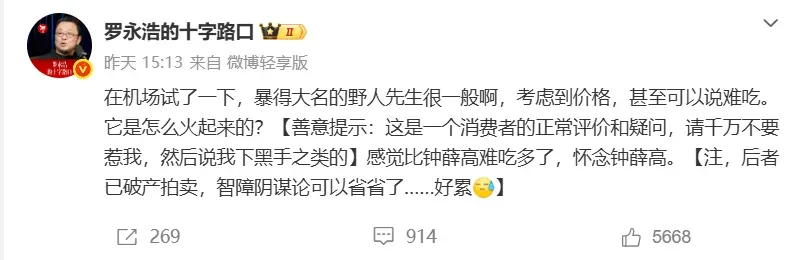
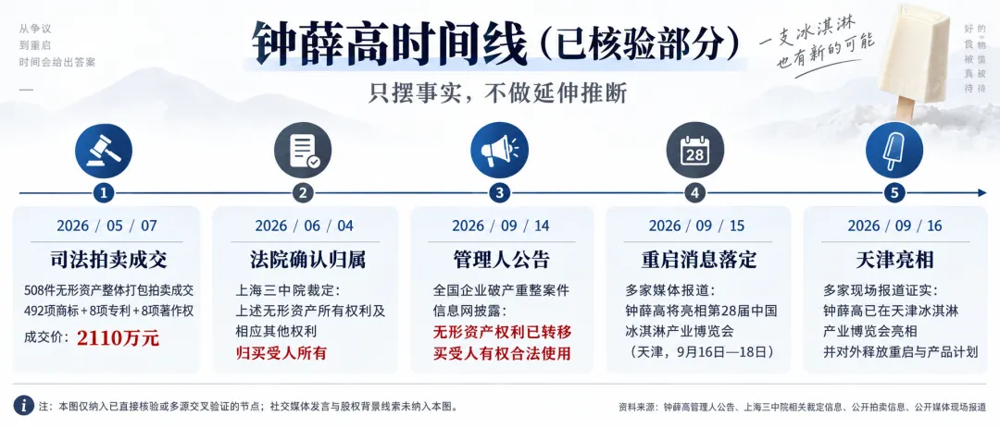
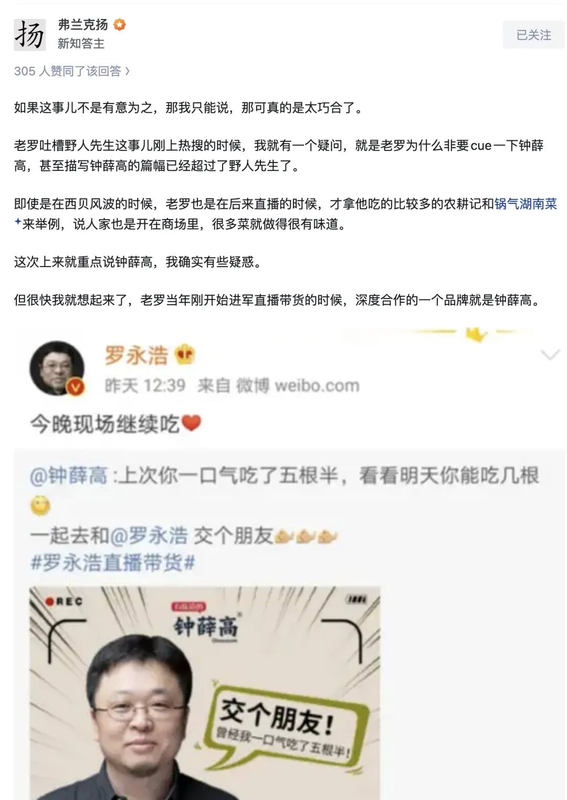

## 一

九月十二日，一位以维权成名的老师在机场吃了份冰淇淋，觉得不好吃，发了条微博。

微博里有个括号，括号里七个字：**请千万不要惹我。**

一个普通消费者吃到难吃的东西，发微博骂两句，是不需要提前警告商家别还手的。因为他压根没有被还手的资格——你骂你的，人家该卖还卖，多半连看都看不到。

会先打招呼说“千万别惹我”的，心里门儿清自己手上拿的是什么。

## 二

他说，这是一个消费者的正常评价。

这句话是整件事的机关，值得拆开看。

法律和常识给“难吃”两个字极大的豁免：不用举证，不用复核，不用负责。为什么？**因为一个普通人说“难吃”杀不死任何人。** 这是一份给弱者的保护性豁免。它便宜，是因为它无效。

而当同一句话由一个能让它上全网热搜的人说出来，它在物理上已经不是同一个行为了。

那家冰淇淋一千七百多家店、铺了三十个省，全平台一个字没敢回，热搜挂着“冷处理”，评论区一遍遍教品牌方：不要回答，不要回答。上一个没听劝的，去年九月接了同一位老师的一条微博，四个月后一次性关了一百零二家门店。

这不是表达。这是**分配**——分配的是全国这一周有限的公共注意力。

传播学有句老话：媒体也许决定不了你怎么想，但它极擅长决定你想什么。这项权力有个名字，叫**议程设置**（agenda setting）。

所以“我只是一个消费者”，翻译过来是：**我借用弱者的豁免权，来行使强者的权力。**

## 三

议程设置有三层。

**第一层，决定谈什么。** 让全国这周谈冰淇淋。

**第二层，决定怎么谈。** 同样一句难吃，后面接的是什么？接的是“感觉比钟薛高难吃多了，怀念钟薛高”。于是这周所有谈冰淇淋的人，脑子里自动挂上了两个坐标：一个难吃，一个被怀念。

**第三层，决定不谈什么。** 注意力是零和的，热搜的席位是有限的。这周的公共注意力放在了一份冰淇淋上，那没被放上去的是什么？没人知道，因为它们没上去。

议程设置权真正的形状，不在它说了什么，在于**那些它没选的议题，这周因此没有人说。** 而筛选标准从来不是重要性，是可传播性。一份冰淇淋能上，是因为它够具象、够有画面、人人能代入自己那一口。

## 四

现在把一条时间线摆出来。

某财经媒体在报道里用了一句很克制的话：不知道是巧合还是别的原因。

我也不知道。我甚至愿意相信是巧合——一个人怀念一个牌子，然后那个牌子恰好复活了，这种事是会发生的。

**但请注意那个括号。** 九月十二日，在没有任何人提出质疑之前，他先替一个还不存在的阴谋论写好了驳斥：后者已破产拍卖。这句话字面上是真的。而在他写下这句话的那一刻，那批商标已经易主三个月，新公司已经注册，离重启公告还有三天。

他知不知道，我不知道。**这正是问题所在。**

一个消费者的动机不需要审计，因为没人在乎他为什么说难吃。一个议程设置者的动机必须能被审计，因为它决定了这一周十四亿人想什么。当他把自己降级为消费者，他顺手把自己的动机也从“公共问题”降级成了“私事”。

这才是那句偷换真正的收益。不是躲开了责任——是躲开了**被追问**。

## 五

老冯主业是数据库发行版，自媒体连副业都谈不上，但也算个数据库云计算 KOL。所以我很清楚设置议程这一套，我也设置议程：云数据库是不是智商税，云计算是不是杀猪盘，互联网大厂是不是草台班子。这些标题是我起的，我知道它们起到什么效果。

但我也大大方方承认这一点，我不会一边批评云厂商，一边说自己只是个用户。而“我只是一个消费者”这句话的功能，恰恰是让人没法评——你总不能要求一个消费者为他的口味举证。

## 六

所以问题从来不是他能不能说难吃。他当然能。

问题是：**你可以设置议程。但你不能一边设置议程，一边说自己只是在吃冰淇淋。**

议程设置是一项权力。设置议程不是问题，这项权力取消不了，也不该取消：正门全焊死的地方，它是唯一还能撬动一点东西的杠杆。去年那场风波逼出了一份预制菜国标草案，这是事实。

权力也许不受约束，但至少得承认自己是权力。

这周关于冰淇淋的议程已经设置完了：一个难吃，一个被怀念，一个今天亮相博览会。至于这周本来该谈却没谈的那些事——不好意思，席位满了。

## 七

利益相关：野人先生，我还是吃过很多次的，味道还是挺不错的。甚至办了个会员卡，充了大几百块钱。有时候还会专门为了吃一次，骑个自行车十分钟出趟门。

至于它到底好不好吃——这恰恰是那种不该由任何一个人替所有人回答的问题。
