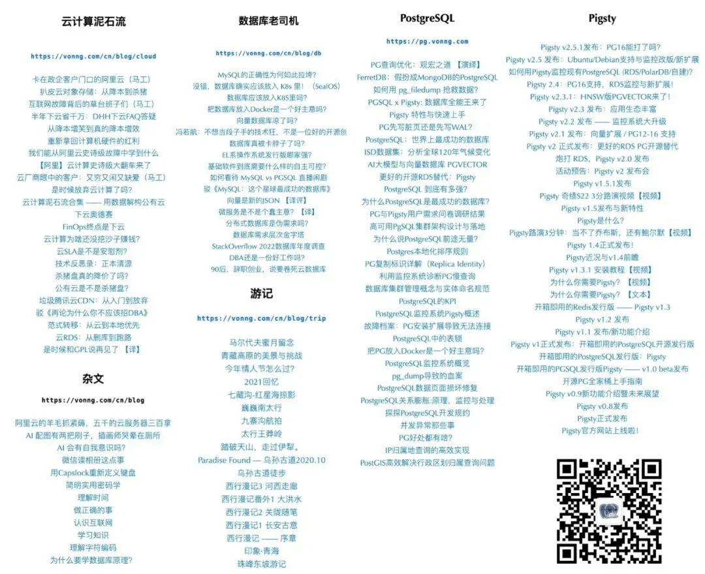
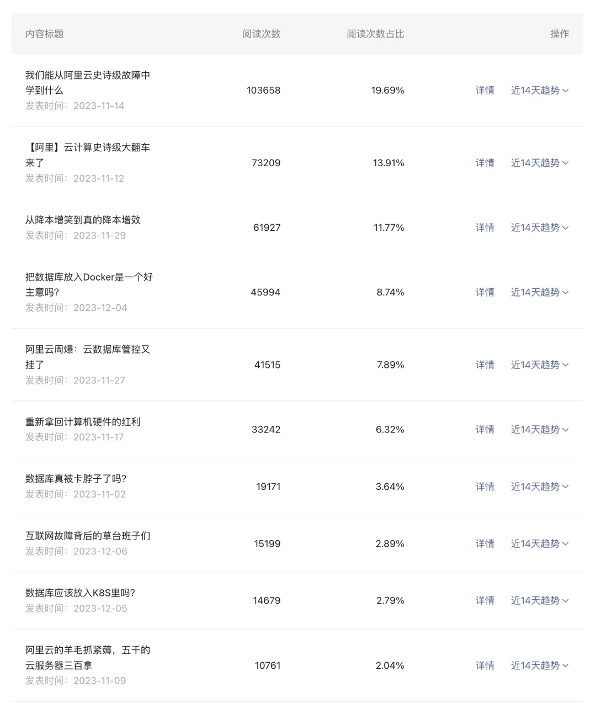
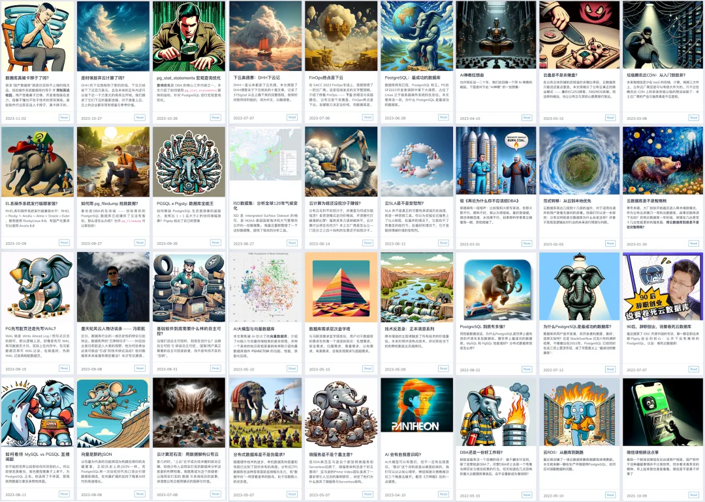

最近收到了微信公众号的《2023年公众号创作回顾》，挺有意思。我打算把这份数据公开分享出来，也算是本号的年度总结，也顺便分享一些公众号运营心得。

关键数据：原创文章69篇，32万字，总阅读量 75万，读者35万，4万次分享，关注数1.8万，常读用户6064，留言数量1538，赞赏人数 132。2023用户增长12倍，总赞赏收入 2428¥。

关注并星标⭐️《[非法加冯](http://mp.weixin.qq.com/s?__biz=MzU5ODAyNTM5Ng==&mid=2247486611&idx=1&sn=658ded908f5e8a24d01a7ccc87df5bbc&chksm=fe4b3948c93cb05ee0023eba7687ce91018a3971304229c983eeb22bc52e13128ebce73421a9&scene=21#wechat_redirect)》，老司机带逛[云计算](http://mp.weixin.qq.com/s?__biz=MzU5ODAyNTM5Ng==&mid=2247486813&idx=1&sn=ffb126fdd061c1e27626dd558f6fa26a&chksm=fe4b3886c93cb190e2acf7af6cfd25f298199f6ee73da566bed050c066b96753b913e3453d4f&scene=21#wechat_redirect)与数据库。

------------------------------------------------------------------------

过去一年里写了83篇文章，其中原创69篇，约32万字。

在数量上，32万字基本上够出两本书了，内容基本都是关于云计算、数据库、以及 PostgreSQL 与 Pigsty 的文章。其中，《[云计算泥石流](http://mp.weixin.qq.com/s?__biz=MzU5ODAyNTM5Ng==&mid=2247486813&idx=1&sn=ffb126fdd061c1e27626dd558f6fa26a&chksm=fe4b3886c93cb190e2acf7af6cfd25f298199f6ee73da566bed050c066b96753b913e3453d4f&scene=21#wechat_redirect)》与《[数据库老司机](http://mp.weixin.qq.com/s?__biz=MzU5ODAyNTM5Ng==&mid=2247486611&idx=1&sn=658ded908f5e8a24d01a7ccc87df5bbc&chksm=fe4b3948c93cb05ee0023eba7687ce91018a3971304229c983eeb22bc52e13128ebce73421a9&scene=21#wechat_redirect)》是今年新开的两个系列，重点关注“下云”，以及自建PG RDS 这两个主题。

在数量上，32万字基本上够出两本书了，内容基本都是关于云计算、数据库、以及 PostgreSQL 与 Pigsty 的文章。其中，《[云计算泥石流](http://mp.weixin.qq.com/s?__biz=MzU5ODAyNTM5Ng==&mid=2247486813&idx=1&sn=ffb126fdd061c1e27626dd558f6fa26a&chksm=fe4b3886c93cb190e2acf7af6cfd25f298199f6ee73da566bed050c066b96753b913e3453d4f&scene=21#wechat_redirect)》与《[数据库老司机](http://mp.weixin.qq.com/s?__biz=MzU5ODAyNTM5Ng==&mid=2247486611&idx=1&sn=658ded908f5e8a24d01a7ccc87df5bbc&chksm=fe4b3948c93cb05ee0023eba7687ce91018a3971304229c983eeb22bc52e13128ebce73421a9&scene=21#wechat_redirect)》是今年新开的两个系列，重点关注“下云”，以及自建PG RDS 这两个主题。

今年全部12个月都有文章产出，其中 11 月和 12 月最为高产，有本号第一篇 10w+ 的[阿里云故障复盘](http://mp.weixin.qq.com/s?__biz=MzU5ODAyNTM5Ng==&mid=2247486468&idx=1&sn=7fead2b49f12bc2a2a94aae942403c22&chksm=fe4b39dfc93cb0c92e5d4c67241de0519ae6a23ce6f07fe5411b95041accb69e5efb86a38150&scene=21#wechat_redirect)。以及几篇几万阅读的。

我一般选择提前一天写好，预约在早上 8:20 分发布。因为这个时间点很多读者都在上班/地铁路上，正好没事可以刷刷公众号文章。另外还有个原因是有个著名的梗 —— “大概8点20分发”。

年阅读量约 75 万，读者 35 万今年全部12个月都有文章产出，其中 11 月和 12 月最为高产，有本号第一篇 10w+ 的[阿里云故障复盘](http://mp.weixin.qq.com/s?__biz=MzU5ODAyNTM5Ng==&mid=2247486468&idx=1&sn=7fead2b49f12bc2a2a94aae942403c22&chksm=fe4b39dfc93cb0c92e5d4c67241de0519ae6a23ce6f07fe5411b95041accb69e5efb86a38150&scene=21#wechat_redirect)。以及几篇几万阅读的。

从阅读来源看，大部分是来自阅读后转发到朋友圈/微信群里的。直接从订阅号进来的读者并不多，落在“其他”里面。因为公众号改版之后，变成 Feed 流推荐的方式，所以推荐的权重变高了。

写了不少文章之后，我发现一个有趣的规律。纯技术类，特别是有关 PostgreSQL 的文章，阅读量一般在 1000～3000 左右。我问过几个也在公众号里写 PostgreSQL 技术文章的朋友，基本上这类技术干货的阅读量上限也都在 1000 ～ 3000 左右。因此我们推测国内和 PostgreSQL 有关的技术人员差不多就是这个数量级。

更为宽泛的技术讨论文章，阅读量一般在 1～3万左右。能超过这个量级的，基本上都是技术圈的时事热点。但我也不是专门写公众号的，所以很多热点，我也有些想法，不过没时间去蹭，还是有点可惜哈哈。

关于粉丝的数量，从年初的 1373 增长到年末的18359，翻了十倍，增长了 **1237%** 。其中有 1/3 是常读用户，还有 76 人是铁粉和亲友。69 篇原创文章，平均每篇涨粉 250 个左右。

现在（2024-01-23）的关注数量是 19503，估计过年前涨到两万不成问题，总体来说还是很让人开心的。

今年有过打赏的朋友有 132 人，全歼总计 2428.88 ¥，人均18块钱。虽然不多，但读者的心意是沉甸甸的～。

最后是互动与评论，四万次分享，与 1538条留言，还是很活跃的。俺这个号注册的比较早，有个评论区功能，有时候一些评论里也会有很有意思的内容。

------------------------------------------------------------------------

## 写公众号的动机

经常有朋友问我说写公众号能赚钱吗 —— 哈哈，根据去年的打赏数据 ¥2428.88，广告收入累计也是 2443.85¥，加起来总共 5000块钱不到。公众号平均每天十几块钱，在北京够买油条、馒头和榨菜了。虽然有一些找我写软文发广告的，不过我现在基本懒得接。—— **写公众号主要还是为了输出自己的**愿景**、**理念**与**观点**。**

以前，我是一个喜欢踏实搞技术的工程师；今年，我又多了一个写文章的新爱好。因为我觉得技术即使做的再好再牛逼，如果讲不出来推不出去，那也是白瞎。所以我也开始写一些文章，一年来反响还不错：主要是两个新的系列 《**数据库老司机**》与《**云计算泥石流**》。

《[数据库老司机](http://mp.weixin.qq.com/s?__biz=MzU5ODAyNTM5Ng==&mid=2247485576&idx=1&sn=d13184a3cbbf756ee0c2ed0d0a288d7a&chksm=fe4b3d53c93cb445b226c46223f21913775682dc679d564dc592fb55eac33c19a1fc8b4a4c8f&scene=21#wechat_redirect)》系列聚焦在我自己的首要专业领域上，并尝试为DB技术圈设置**议程**：[云是在白嫖开源吗](http://mp.weixin.qq.com/s?__biz=MzU5ODAyNTM5Ng==&mid=2247485402&idx=2&sn=eaa19e09c22febd05adc6f71b3667333&chksm=fe4b3201c93cbb17f32e9f0c4cbdee4c4ec527d8e11017d6e3d4f6e474d752e8d446053deab5&scene=21#wechat_redirect)？[RDS能让DBA失业吗](http://mp.weixin.qq.com/s?__biz=MzU5ODAyNTM5Ng==&mid=2247485335&idx=1&sn=c37c2ee787fe4fc1b6909500c5f05583&chksm=fe4b324cc93cbb5a4e75f47746b7370e7cab3d3795b57e720c34db29c1e6d706b3f9f4e0bedd&scene=21#wechat_redirect)？[分布式数据库是不是伪需求](http://mp.weixin.qq.com/s?__biz=MzU5ODAyNTM5Ng==&mid=2247485549&idx=1&sn=7c34439d82431129c57aba211202b5ca&chksm=fe4b3db6c93cb4a0423daf3a226e04867821e34ba3c6b5a8145bd5319c728fb08d63b2544a43&scene=21#wechat_redirect)？[PG vs MySQL 哪家强](http://mp.weixin.qq.com/s?__biz=MzU5ODAyNTM5Ng==&mid=2247486710&idx=1&sn=261e4754df6c85954b50d8f68f277abe&chksm=fe4b392dc93cb03bf26554a7a232f6217b8aa78d7e35ce0566d9404dc9526d3776141e628a2b&scene=21#wechat_redirect)？[国产数据库真卡脖子吗](http://mp.weixin.qq.com/s?__biz=MzU5ODAyNTM5Ng==&mid=2247486379&idx=1&sn=b751c51a2b73e43e61487abfdc073da3&chksm=fe4b3e70c93cb766625f9e18a92eabe31af437eb0fd7ed9d38b95750c743ce44934433c4dd66&scene=21#wechat_redirect)？[向量数据库能不能打](http://mp.weixin.qq.com/s?__biz=MzU5ODAyNTM5Ng==&mid=2247486505&idx=1&sn=a585c9ff22a81a8efe6b87ce9bd66cb1&chksm=fe4b39f2c93cb0e4c5d46f54e7ba9309dc0d66b5ac73bfe6722cc39f3959e47ae78210aeea1f&scene=21#wechat_redirect)？[数据库该不该放入容器](http://mp.weixin.qq.com/s?__biz=MzU5ODAyNTM5Ng==&mid=2247486572&idx=1&sn=274a51976bf8ae5974beb1d3173380c1&chksm=fe4b39b7c93cb0a14c4d99f8ffd1e00c36b972a8058fd99e9d06e6035c4f378b6d327892260b&scene=21#wechat_redirect)？[数据库该不该上K8S](http://mp.weixin.qq.com/s?__biz=MzU5ODAyNTM5Ng==&mid=2247486587&idx=1&sn=16521d6854711a4fe429464aeb2df6bd&chksm=fe4b39a0c93cb0b6d57c1345b79a6c87972e58eeed65831bc6ba8cf73d2a99d6a11d48d2f706&scene=21#wechat_redirect)？有几个主题还搞了直播**辩经**，效果相当炸裂。数据库领域其实有许多陈词滥调、刻板印象、过时教条、皇帝的新衣。自己创业的一个好处就是，有着充分的自由进行表达。不讲假话，不讲废话，相信常识的力量，讲出自己的故事，你会发现许许多多的用户都有着一样的共鸣，这是很有乐趣的一件事。

《[云计算泥石流](http://mp.weixin.qq.com/s?__biz=MzU5ODAyNTM5Ng==&mid=2247485781&idx=1&sn=c139a77e53572cb538d3fd087eb80c8b&chksm=fe4b3c8ec93cb598addd3d013657008d9778484c3cdaf74174d685f389ce2a5d289934848db1&scene=21#wechat_redirect)》则是用数据剖析解构了公有云的方方面面：各项基础云服务的[成本与价值](http://mp.weixin.qq.com/s?__biz=MzU5ODAyNTM5Ng==&mid=2247486366&idx=1&sn=c28407399af8b1ddeadf93e902ed23cc&chksm=fe4b3e45c93cb753dfd3cdbdd4eacd05ae6ce7d83eadf3105718cfa20180d6c3244652d88cc7&scene=21#wechat_redirect)，[SLA承诺](http://mp.weixin.qq.com/s?__biz=MzU5ODAyNTM5Ng==&mid=2247485745&idx=3&sn=3d771a3b11b74fe9f5e8d11bb3c623a0&chksm=fe4b3ceac93cb5fcd9604c0c2ba5adb6772472dab560f71e0e77547e49076eb00a5b58ef4869&scene=21#wechat_redirect)，[商业模式](http://mp.weixin.qq.com/s?__biz=MzU5ODAyNTM5Ng==&mid=2247485391&idx=1&sn=4cec9af2b58160eb345a6b12411f0b68&chksm=fe4b3214c93cbb023c13a89133c75bf1e88e1543de9359df7447498e4a9d5ec555313a954566&scene=21#wechat_redirect)，[利润率](http://mp.weixin.qq.com/s?__biz=MzU5ODAyNTM5Ng==&mid=2247485745&idx=2&sn=d4addba49da35115263238d155f6acc9&chksm=fe4b3ceac93cb5fccb866c0aaeba6168c652ab2a476aa14a6682a30f1e27f4fd09eb1392f94f&scene=21#wechat_redirect)，[大故障复盘](http://mp.weixin.qq.com/s?__biz=MzU5ODAyNTM5Ng==&mid=2247486468&idx=1&sn=7fead2b49f12bc2a2a94aae942403c22&chksm=fe4b39dfc93cb0c92e5d4c67241de0519ae6a23ce6f07fe5411b95041accb69e5efb86a38150&scene=21#wechat_redirect)，[未来的发展](http://mp.weixin.qq.com/s?__biz=MzU5ODAyNTM5Ng==&mid=2247485745&idx=1&sn=6109bb1be67f9e7e02124c4fc3b47ea3&chksm=fe4b3ceac93cb5fc4f492e0a0b9e13bc5bc0bec1b0970a129d3959e3051d04913cef7bfc6f34&scene=21#wechat_redirect)。有不少用户受此鼓舞，迈出了独立自主运营的第一步，并向我分享他们的激动与喜悦。比起数据库主业而言，倡导下云/自建的理念更像是一种**娱乐**与**冒险** —— 而我很高兴能看到理念的力量转变为一些现实的影响 ：

 *“不要弄些小打小闹的计划，它没有激发人们热血的魔力，本身也可能无法实现。要绘制宏伟蓝图，志存高远，并竭尽所能”。*

以上就是我分享的内容。2023 年的具体文章内容，请参阅《[非法加冯文章导航](http://mp.weixin.qq.com/s?__biz=MzU5ODAyNTM5Ng==&mid=2247486611&idx=1&sn=658ded908f5e8a24d01a7ccc87df5bbc&chksm=fe4b3948c93cb05ee0023eba7687ce91018a3971304229c983eeb22bc52e13128ebce73421a9&scene=21#wechat_redirect)》与《[云计算泥石流](http://mp.weixin.qq.com/s?__biz=MzU5ODAyNTM5Ng==&mid=2247486813&idx=1&sn=ffb126fdd061c1e27626dd558f6fa26a&chksm=fe4b3886c93cb190e2acf7af6cfd25f298199f6ee73da566bed050c066b96753b913e3453d4f&scene=21#wechat_redirect)》。\
