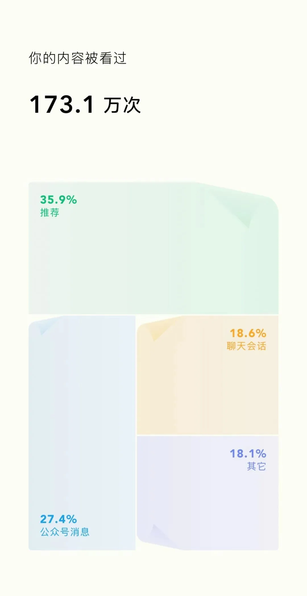

一年一度的微信公众号总结又发布了，2024 年发布了 166 篇内容，30 万字。关注者增加了 1.7 万，达到 36300。在这里，非常感谢读者朋友们对本号的支持 🙏。

扫码观看本号的 2024 年创造回顾

## [云计算泥石流专栏](https://mp.weixin.qq.com/s?__biz=MzU5ODAyNTM5Ng==&mid=2247488410&idx=1&sn=e44705fce4221458244e7705258ca254&scene=21#wechat_redirect)

2024-01-13 [花钱买罪受的大冤种：逃离云计算妙瓦底](/cloud/patsy/)2024-12-14 [OpenAI全球宕机复盘：K8S循环依赖](/cloud/openai-failure/)2024-11-11 [支付宝崩了？双十一整活王又来了](https://mp.weixin.qq.com/s?__biz=MzU5ODAyNTM5Ng==&mid=2247488632&idx=1&sn=dba2c78f37bb4af2421677e842b57fdd&scene=21#wechat_redirect "支付宝崩了？双十一整活王又来了")2024-11-10 [草台回旋镖：Apple Music证书过期服务中断](/cloud/apple-music-cert/)2024-10-19 [DHH：下云超预期，能省一个亿](https://mp.weixin.qq.com/s?__biz=MzU5ODAyNTM5Ng==&mid=2247488498&idx=1&sn=9950b036d3ed6ed5880592bd2ce6c8f7&scene=21#wechat_redirect "DHH：下云超预期，能省一个亿")2024-10-17 [WordPress社区内战：论共同体划界问题](/cloud/wordpress-drama/)2024-10-07 [记一次阿里云 DCDN 加速仅 32 秒就欠了 1600 的问题处理（扯皮）](https://mp.weixin.qq.com/s?__biz=MzU5ODAyNTM5Ng==&mid=2247488466&idx=1&sn=21a77c9076643f723038047b8c14ba59&scene=21#wechat_redirect "记一次阿里云 DCDN 加速仅 32 秒就欠了 1600 的问题处理（扯皮）") 转2024-09-17 [阿里云：高可用容灾神话的破灭](https://mp.weixin.qq.com/s?__biz=MzU5ODAyNTM5Ng==&mid=2247488376&idx=1&sn=3c403495f5282f469a50e4fbe09ae0c7&scene=21#wechat_redirect "阿里云：高可用容灾神话的破灭")2024-09-15 [阿里云故障预报：本次事故将持续至20年后？](https://mp.weixin.qq.com/s?__biz=MzU5ODAyNTM5Ng==&mid=2247488361&idx=1&sn=c84e7f9ff09f9f5042d990ee2ea9a105&scene=21#wechat_redirect "阿里云故障预报：本次事故将持续至20年后？")2024-09-14 [阿里云盘灾难级BUG：能看别人照片？](/cloud/aliyun-drive-bug/)2024-09-10 [阿里云新加坡可用区C故障，网传机房着火](https://mp.weixin.qq.com/s?__biz=MzU5ODAyNTM5Ng==&mid=2247488345&idx=1&sn=684398668bdddc05d4218c42f5a383b0&scene=21#wechat_redirect "阿里云新加坡可用区C故障，网传机房着火")2024-08-21 [这次轮到WPS崩了](https://mp.weixin.qq.com/s?__biz=MzU5ODAyNTM5Ng==&mid=2247488215&idx=1&sn=34bedcf01169facd0207200b3e018989&scene=21#wechat_redirect "这次轮到WPS崩了")2024-08-20 [草台班子唱大戏，阿里云RDS翻车记](https://mp.weixin.qq.com/s?__biz=MzU5ODAyNTM5Ng==&mid=2247488205&idx=1&sn=2c45a521d50a60e9644b95c974bb2949&scene=21#wechat_redirect "草台班子唱大戏，阿里云RDS翻车记")2024-09-19 [我们能从网易云音乐故障中学到什么？](/cloud/netease/)2024-08-15 [GitHub全站故障，又是数据库上翻的车？](/cloud/github-outage/)2024-07-23 [全球Windows蓝屏：甲乙双方都是草台班子](https://mp.weixin.qq.com/s?__biz=MzU5ODAyNTM5Ng==&mid=2247488036&idx=1&sn=7bbcc3e8979a5f97a519a7a1684caa06&scene=21#wechat_redirect "全球Windows蓝屏：甲乙双方都是草台班子")2024-07-02 [阿里云又挂了，这次是光缆被挖断了？](/cloud/aliyun-fiber-cut/)2024-06-22 [性学家，化学家，软件行业里的废话文学家](/misc/nonsense-writers/) 马工2024-05-23 [Ahrefs不上云，省下四亿美元](/cloud/ahrefs-saving/)2024-05-11 [删库：Google云爆破了大基金的整个云账户](/cloud/gcp-unisuper/)2024-04-30 [云上黑暗森林：打爆云账单，只需要S3桶名](/cloud/s3-scam/)2024-04-23 [赛博菩萨Cloudflare圆桌访谈与问答录](https://mp.weixin.qq.com/s?__biz=MzU5ODAyNTM5Ng==&mid=2247487400&idx=1&sn=cf5b94165d2791030e0e874dca8383c7&scene=21#wechat_redirect "赛博菩萨Cloudflare圆桌访谈与问答录")2024-04-22 [云计算：菜就是一种原罪](/cloud/cloud-incompetence/)2024-04-20 [taobao.com证书过期](https://mp.weixin.qq.com/s?__biz=MzU5ODAyNTM5Ng==&mid=2247487367&idx=1&sn=d6e4abd2b2249d27bd8b8146b591b026&scene=21#wechat_redirect "taobao.com证书过期")2024-04-17 [腾讯真的走通云原生之路了吗？](/cloud/tencent-cloud-native/) 马工2024-04-14 [我们能从腾讯云故障复盘中学到什么？](https://mp.weixin.qq.com/s?__biz=MzU5ODAyNTM5Ng==&mid=2247487348&idx=1&sn=412cf2afcd93c3f0a83d65219c4a28e8&scene=21#wechat_redirect "我们能从腾讯云故障复盘中学到什么？")2024-04-12 [云SLA是安慰剂还是厕纸合同？](https://mp.weixin.qq.com/s?__biz=MzU5ODAyNTM5Ng==&mid=2247487339&idx=1&sn=fce4c0d415d87026013169c737faeacb&scene=21#wechat_redirect "云SLA是安慰剂还是厕纸合同？")2024-04-09 [腾讯云：颜面尽失的草台班子](/cloud/tencent-disgrace/)2024-04-08 [【腾讯】云计算史诗级二翻车来了](/cloud/tencent-epic-fail-2/)2024-04-03 [吊打公有云的赛博佛祖 Cloudflare](/cloud/cloudflare/)2024-04-02 [牙膏云？您可别吹捧云厂商了](/cloud/toothpaste-cloud/)2024-04-01 [罗永浩救不了牙膏云](https://mp.weixin.qq.com/s?__biz=MzU5ODAyNTM5Ng==&mid=2247487223&idx=1&sn=da885170d5d65a3c646d8b3d9da3aed3&scene=21#wechat_redirect "罗永浩救不了牙膏云")2024-03-26 [Redis不开源是“开源”之耻，更是公有云之耻](/db/redis-oss/)2024-03-25 [公有云厂商卖的云计算到底是什么玩意？](/cloud/what-public-cloud-sells/) 马工2024-03-21 [迷失在阿里云的年轻人](/cloud/lost-youth-at-aliyun/)2024-03-14 [RDS阉掉了PostgreSQL的灵魂](/cloud/rds-castrates-pg/)2024-03-13 [云计算反叛军联盟](https://mp.weixin.qq.com/s?__biz=MzU5ODAyNTM5Ng==&mid=2247487102&idx=1&sn=6785547e975ed6fac3e6d7aa3208bbf1&scene=21#wechat_redirect "云计算反叛军联盟")2024-03-10 [剖析云算力成本，阿里云真的降价了吗？](https://mp.weixin.qq.com/s?__biz=MzU5ODAyNTM5Ng==&mid=2247487089&idx=1&sn=ca16c2e7e534380eadcb3a3870d8e3b4&scene=21#wechat_redirect "剖析云算力成本，阿里云真的降价了吗？")2024-02-02 [DBA会被云淘汰吗？](/cloud/dba-vs-rds/)2024-01-16 [单租户时代：SaaS范式转移](/cloud/single-tenant-saas/)2024-01-09 [互联网技术大师速成班](/misc/internet-tech-masterclass/) 马工2024-01-04 [门内的国企如何看门外的云厂商](/cloud/state-owned-enterprise-cloud-view/) Leo2023-12-29 [卡在政企客户门口的阿里云](/cloud/aliyun-enterprise-market/) 马工2024-01-12 [云计算泥石流](https://mp.weixin.qq.com/s?__biz=MzU5ODAyNTM5Ng==&mid=2247486813&idx=1&sn=ffb126fdd061c1e27626dd558f6fa26a&scene=21#wechat_redirect "云计算泥石流")

------------------------------------------------------------------------

## [数据库老司机专栏](https://mp.weixin.qq.com/s?__biz=MzU5ODAyNTM5Ng==&mid=2247488417&idx=1&sn=11ac37347fd159a1949da015b2cf57c7&scene=21#wechat_redirect)

2025-01-14 [PostgreSQL荣获2024年度数据库（5冠王）](https://mp.weixin.qq.com/s?__biz=MzU5ODAyNTM5Ng==&mid=2247488977&idx=1&sn=a9db4e94d5001419578094033d567c22&scene=21#wechat_redirect "PostgreSQL荣获2024年度数据库（5冠王）")2025-01-11 [PII数据安全合规与PG Anonymizer最佳实践](/pg/pg-anonymizer/)2025-01-07 [第七届PG生态大会：一些感想](/pg/pgconf-china-7th/)2025-01-01 [Andy Pavlo: 2024年度数据库回顾](/db/pavlo-2024-review/)2024-12-31 [Pigsty@2024：今年没啥财运，但事儿整的还不赖](/pigsty/year-2024/)2024-12-23 [小猪骑大象：PG内核与扩展包管理神器](/pg/pig/)2024-12-18 [PostgreSQL 2024 社区现状调查报告](/pg/pg-survey-2024/)2024-12-03 [七周七数据库 @ 2025](https://mp.weixin.qq.com/s?__biz=MzU5ODAyNTM5Ng==&mid=2247488759&idx=1&sn=06dc42658fe354708122226b05d64973&scene=21#wechat_redirect "七周七数据库 @ 2025")2024-11-30 [你为什么不用连接池？](/db/why-no-connection-pool/)2024-11-26 [创业出海神器 Supabase 自建指南](https://mp.weixin.qq.com/s?__biz=MzU5ODAyNTM5Ng==&mid=2247488737&idx=1&sn=0bc6d0532addb19f70517cd8f8dcb098&scene=21#wechat_redirect "创业出海神器 Supabase 自建指南")2024-11-21 [面向未来数据库的现代硬件](/db/future-hardware/)2024-11-18 [这么吹国产数据库，听的尴尬癌都要犯了](/db/domestic-db-hype/)2024-11-17 [20刀好兄弟PolarDB：论数据库该卖什么价？](/db/cheap-polar/)2024-11-15 [不要更新！发布当日叫停：PG也躲不过大翻车](/pg/pg-faint/)2024-11-14 [PostgreSQL 12 过保，PG 17 上位](/pg/pg12-eol-pg17-up/)2024-11-05 [PZ：MySQL还有机会赶上PostgreSQL的势头吗？](https://mp.weixin.qq.com/s?__biz=MzU5ODAyNTM5Ng==&mid=2247488604&idx=1&sn=984fbec240098d6cc4d7c45d078631ac&scene=21#wechat_redirect "PZ：MySQL还有机会赶上PostgreSQL的势头吗？")2024-11-02 [PostgreSQL神功大成！最全扩展仓库](https://mp.weixin.qq.com/s?__biz=MzU5ODAyNTM5Ng==&mid=2247488596&idx=1&sn=d60c8b73d154fd07201b5a81bc106805&scene=21#wechat_redirect "PostgreSQL神功大成！最全扩展仓库")2024-10-28 [YC教父Paul Graham：写作者与非写作者](/misc/writes-and-writenots/)2024-10-25 [开源皇帝Linus清洗整风](https://mp.weixin.qq.com/s?__biz=MzU5ODAyNTM5Ng==&mid=2247488558&idx=1&sn=2840b0809a101cc14275c19b5348ca8a&scene=21#wechat_redirect "开源皇帝Linus清洗整风")2024-10-01 [第二批数据库国测名单：国产化来了怎么办？](/db/db-national-test-2/)2024-09-27 [PostgreSQL 17 发布：摊牌了，我不装了！](/pg/pg-17/)2024-09-26 [PG系创业公司Supabase：\$80M C轮融资](https://mp.weixin.qq.com/s?__biz=MzU5ODAyNTM5Ng==&mid=2247488395&idx=1&sn=f7d487024f2dec771e51f9b480a73b4a&scene=21#wechat_redirect "PG系创业公司Supabase：$80M C轮融资")2024-09-07 [先优化碳基BIO核，再优化硅基CPU核](/db/bio-core-cpu-core/)2024-09-05 [PostgreSQL 17 RC1 发布！与近期PG新闻](https://mp.weixin.qq.com/s?__biz=MzU5ODAyNTM5Ng==&mid=2247488327&idx=1&sn=cbe6e67d543fea1bed6f6533a18184c3&scene=21#wechat_redirect "PostgreSQL 17 RC1 发布！与近期PG新闻")2024-09-04 [MongoDB没有未来：“好营销”救不了烂芒果](https://mp.weixin.qq.com/s?__biz=MzU5ODAyNTM5Ng==&mid=2247488318&idx=1&sn=06a982682b23ea956067441f424517b2&scene=21#wechat_redirect "MongoDB没有未来：“好营销”救不了烂芒果")2024-09-03 [《黑历史：Mongo》：现由PostgreSQL驱动](https://mp.weixin.qq.com/s?__biz=MzU5ODAyNTM5Ng==&mid=2247488292&idx=1&sn=a9a1cf86027fff620fcc478240865391&scene=21#wechat_redirect "《黑历史：Mongo》：现由PostgreSQL驱动")2024-09-02 [PostgreSQL可以替换微软SQL Server吗？](https://mp.weixin.qq.com/s?__biz=MzU5ODAyNTM5Ng==&mid=2247488287&idx=1&sn=50f068767c6faab8c8f9ca01128090b9&scene=21#wechat_redirect "PostgreSQL可以替换微软SQL Server吗？")2024-08-30 [ElasticSearch又重新开源了？？？](/db/elasticsearch-reopen/)2024-08-22 [GOTC 2024 BTW采访冯若航](https://mp.weixin.qq.com/s?__biz=MzU5ODAyNTM5Ng==&mid=2247488229&idx=1&sn=613dcc5db276442755f77b1a16b92000&scene=21#wechat_redirect "GOTC 2024 BTW采访冯若航：Pigsty作者，简化PG管理，推动PG开源社区的中国参与")2024-08-13 [谁整合好DuckDB，谁赢得OLAP数据库世界](https://mp.weixin.qq.com/s?__biz=MzU5ODAyNTM5Ng==&mid=2247488131&idx=1&sn=9dc6a377d0b24fb7b92cac840b229433&scene=21#wechat_redirect "谁整合好DuckDB，谁赢得OLAP数据库世界")2024-08-09 [PostgreSQL小版本更新，17beta3，12将EOL](/pg/pg-17beta3/)2024-08-06 [PG隆中对，一个PG三个核，一个好汉三百个帮](https://mp.weixin.qq.com/s?__biz=MzU5ODAyNTM5Ng==&mid=2247488113&idx=1&sn=1dfbaec151e98d67aeb66a94a72fca0a&scene=21#wechat_redirect "PG隆中对，一个PG三个核，一个好汉三百个帮")2024-08-03 [最近在憋大招，数据库全能王真的要来了](https://mp.weixin.qq.com/s?__biz=MzU5ODAyNTM5Ng==&mid=2247488097&idx=1&sn=b94c9e2464cf416103d164e3b70b45fd&scene=21#wechat_redirect "最近在憋大招，数据库全能王真的要来了")2024-07-31 [ClickHouse收购PeerDB：这浓眉大眼的也要来搞 PG 了？](/pg/clickhouse-peerdb/)2024-07-25 [StackOverflow 2024调研：PostgreSQL已经超神了](https://mp.weixin.qq.com/s?__biz=MzU5ODAyNTM5Ng==&mid=2247488057&idx=1&sn=6733b62b5cd48c62acd798fc48db1c92&scene=21#wechat_redirect "StackOverflow 2024调研：PostgreSQL已经超神了")2024-07-15 [机场出租车恶性循环与国产数据库怪圈](/db/airport-taxi-db/)2024-07-12 [MySQL新版恶性Bug，表太多就崩给你看！](https://mp.weixin.qq.com/s?__biz=MzU5ODAyNTM5Ng==&mid=2247488014&idx=1&sn=727b1e3e9077af728a243854ea1c2cb3&scene=21#wechat_redirect "MySQL新版恶性Bug，表太多就崩给你看！")2024-07-09 [MySQL安魂九霄，PostgreSQL驶向云外](/db/mysql-is-dead/)2024-06-28 [CentOS 7过保了，换什么OS发行版更好？](/misc/centos7-eol/)2024-06-26 [用PG的开发者，年薪比MySQL多赚四成？](/pg/pg-dev-salary/)2024-06-20 [Oracle最终还是杀死了MySQL！](https://mp.weixin.qq.com/s?__biz=MzU5ODAyNTM5Ng==&mid=2247487841&idx=1&sn=07ce183e7f5eafb34551438df963fe6d&scene=21#wechat_redirect "Oracle最终还是杀死了MySQL！")2024-06-19 [MySQL性能越来越差，Sakila将何去何从？](/db/sakila-where-are-you-going/)2024-06-18 [让PG停摆一周的大会：PGCon.Dev参会记](https://mp.weixin.qq.com/s?__biz=MzU5ODAyNTM5Ng==&mid=2247487796&idx=1&sn=0d8c900fd5e2a0edbd9419eebb4ed234&scene=21#wechat_redirect "让PG停摆一周的大会：PGCon.Dev参会记")2024-05-29 [PGCon.Dev 2024 温哥华扩展生态峰会小记](https://mp.weixin.qq.com/s?__biz=MzU5ODAyNTM5Ng==&mid=2247487665&idx=1&sn=7792bc69e14bdcd606ec7780ed087101&scene=21#wechat_redirect "PGCon.Dev 2024 温哥华扩展生态峰会小记")2024-05-24 [PostgreSQL 17 Beta1 发布！牙膏管挤爆了！](https://mp.weixin.qq.com/s?__biz=MzU5ODAyNTM5Ng==&mid=2247487626&idx=1&sn=4c7662f5506259ab00ed7fcfa32360a3&scene=21#wechat_redirect "PostgreSQL 17 Beta1 发布！牙膏管挤爆了！")2024-05-16 [为什么PostgreSQL是未来数据的基石？](https://mp.weixin.qq.com/s?__biz=MzU5ODAyNTM5Ng==&mid=2247487577&idx=1&sn=e217c7addb57e6f8d45368b969cdf398&scene=21#wechat_redirect "为什么PostgreSQL是未来数据的基石？")2024-04-25 [国产数据库到底能不能打？](/db/db-china/)2024-03-28 [PostgreSQL 主要贡献者 Simon Riggs 因坠机去世](/pg/simon-riggs/)2024-03-26 [Redis不开源是“开源”之耻，更是公有云之耻](/db/redis-oss/)2024-03-24 [PostgreSQL会修改开源许可证吗？](/pg/pg-license/)2024-03-16 [PostgreSQL is eating the database world](https://mp.weixin.qq.com/s?__biz=MzU5ODAyNTM5Ng==&mid=2247487156&idx=1&sn=dea8abae114716013dbc4f5fb978064d&scene=21#wechat_redirect "PostgreSQL is eating the database world")2024-03-14 [RDS阉掉了PostgreSQL的灵魂](/cloud/rds-castrates-pg/)2024-03-04 [PostgreSQL正在吞噬数据库世界](/pg/pg-eat-db-world/)2024-02-19 [技术极简主义：一切皆用Postgres](/pg/just-use-pg/)2024-02-18 [PG生态新玩家ParadeDB](https://mp.weixin.qq.com/s?__biz=MzU5ODAyNTM5Ng==&mid=2247486913&idx=1&sn=3b7d8cf3f0e323932aba52c897f3c7a4&scene=21#wechat_redirect "PG生态新玩家ParadeDB")2024-02-02 [DBA会被云淘汰吗？](/cloud/dba-vs-rds/)2024-01-14 [快速掌握PostgreSQL版本新特性](/pg/pg-version-features/)2024-01-13 [令人惊叹的PostgreSQL可伸缩性](/pg/pg-scalability/)2024-01-11 [国产数据库是大炼钢铁吗？](/db/great-leap-db/)2024-01-08 [中国对PostgreSQL的贡献约等于零吗？](/pg/china-pg-contribution/)2024-01-05 [展望PostgreSQL的2024 (Jonathan Katz)](https://mp.weixin.qq.com/s?__biz=MzU5ODAyNTM5Ng==&mid=2247486752&idx=1&sn=b10354a0cee5b0ccd88df606787e1297&scene=21#wechat_redirect "展望PostgreSQL的2024 (Jonathan Katz)")2024-01-03 [2023年度数据库：PostgreSQL (DB-Engine)](/pg/dbengines-2023/)\
