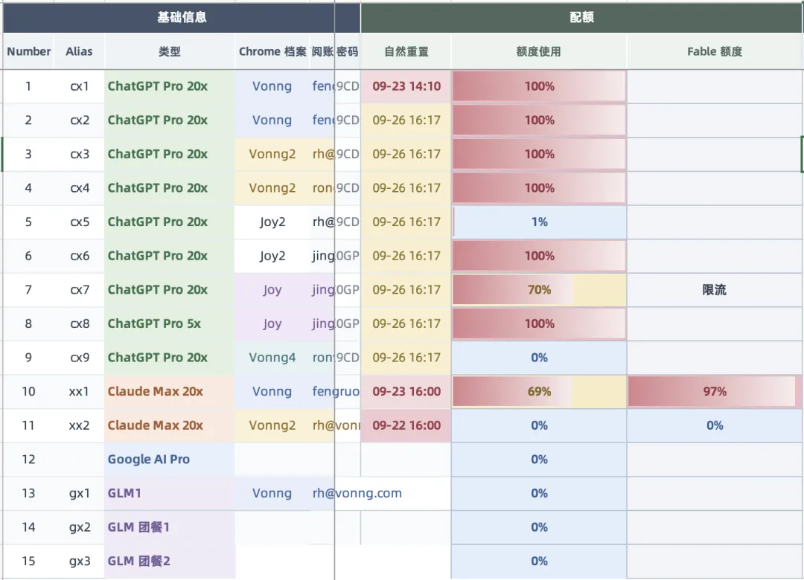
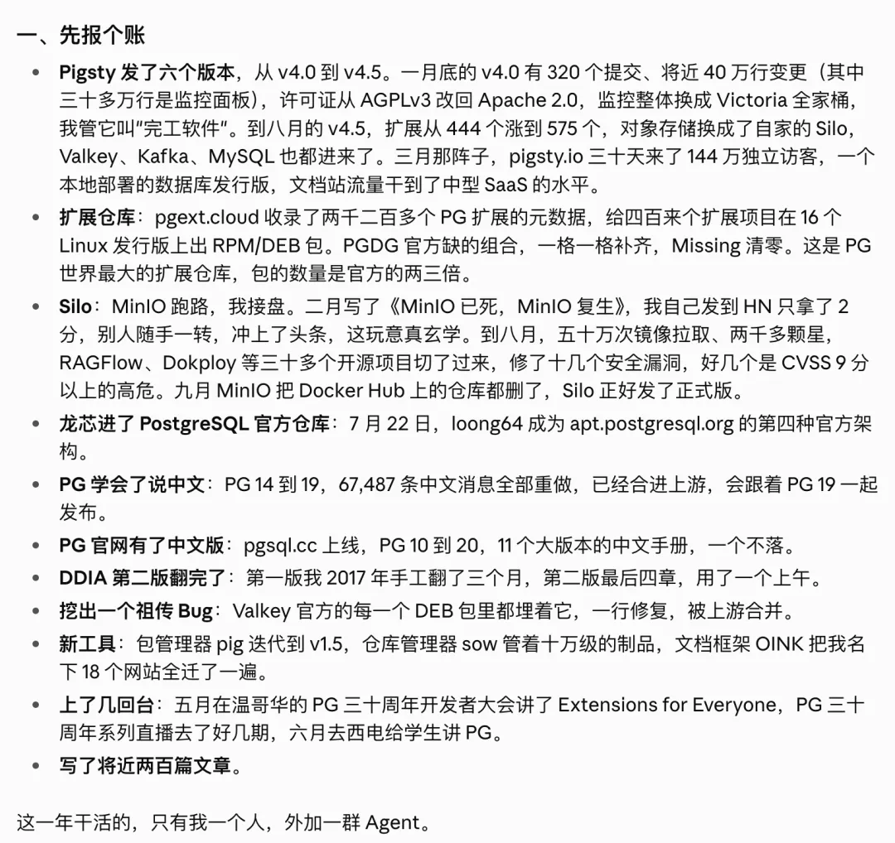
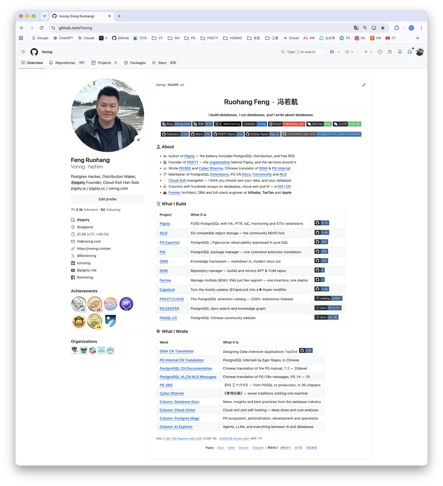
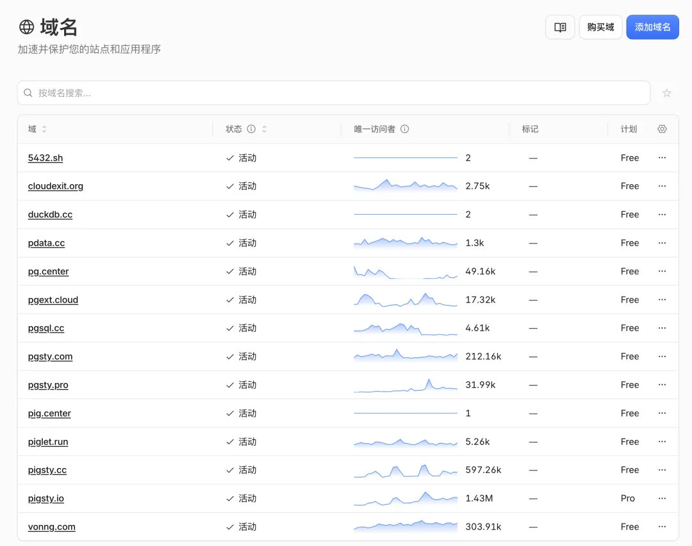
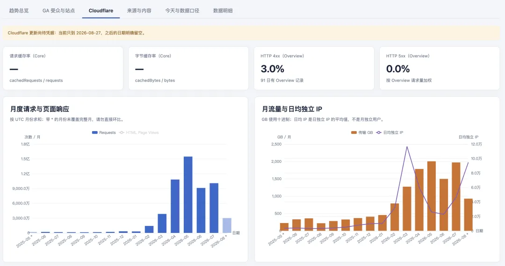
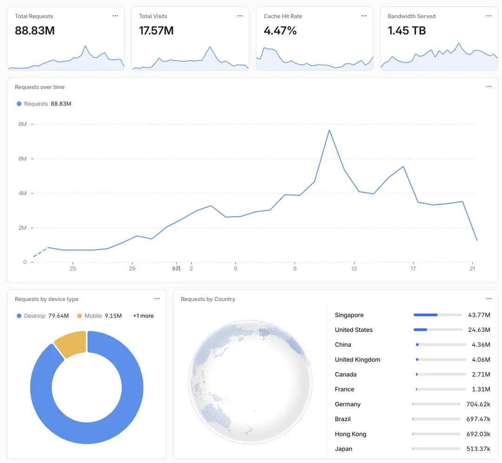
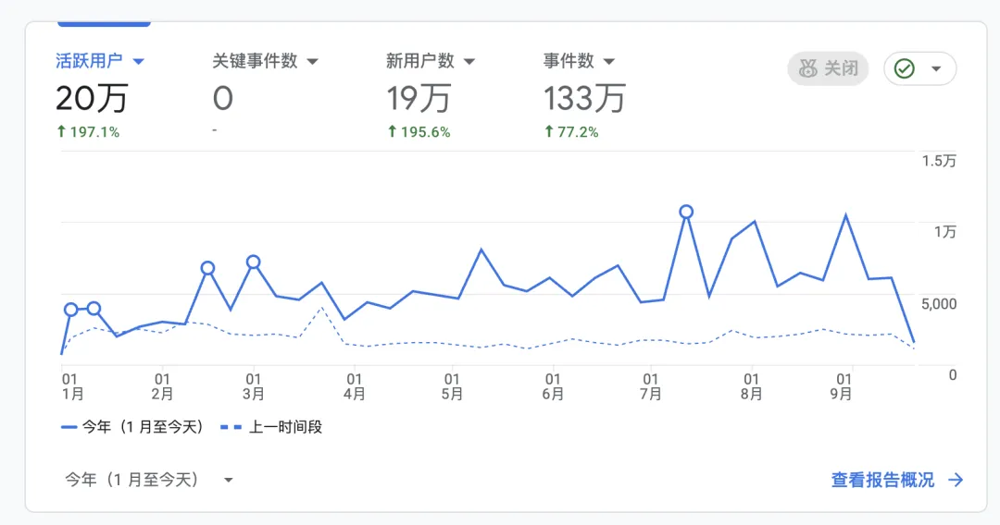
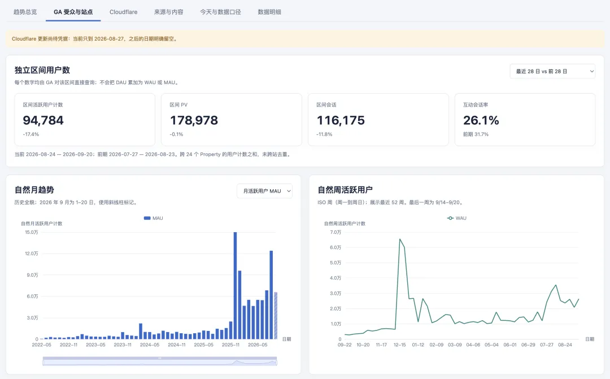
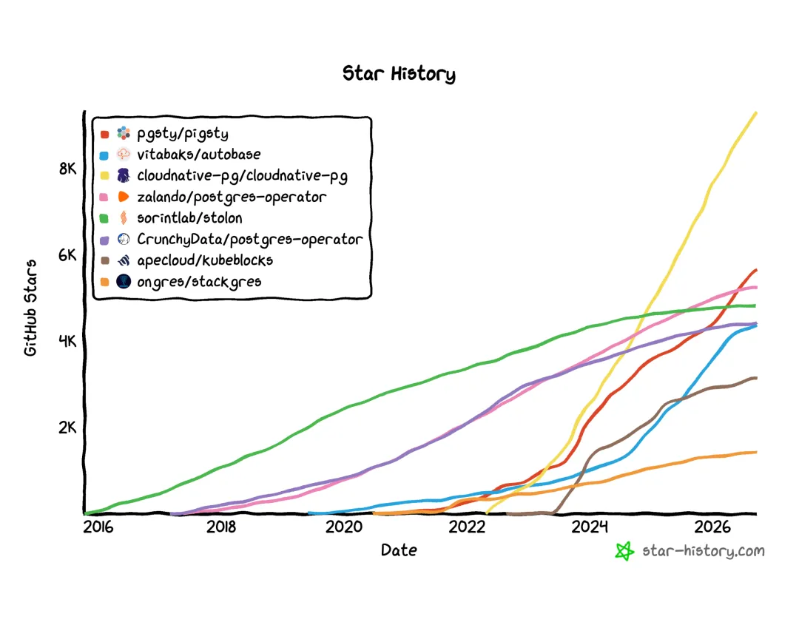
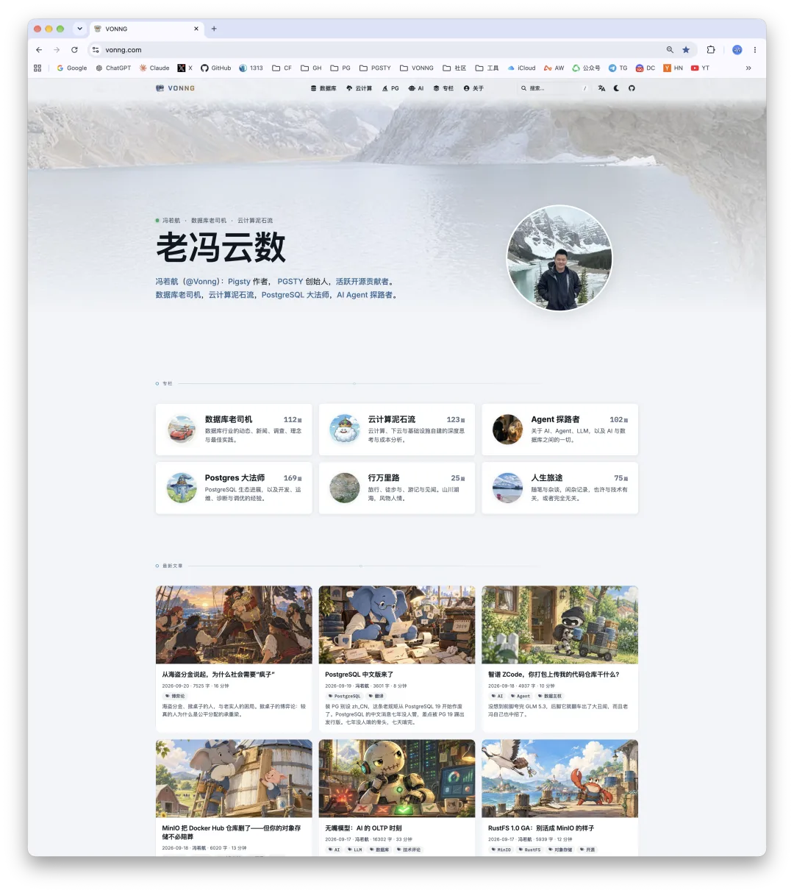

今天是老冯 33 岁生日，眨眼之间，又是一年。

有人说，过了三十岁，人对时间的感知会变迟钝，一眨眼一年就没了。我确实有这种感觉，但又不太一样。

我还听过另一个说法，算是另类版本的相对论：坐在火炉边，一分钟都度日如年；干自己喜欢的事，一眨眼时间就过去了。所以我也说不清，这种感觉到底是因为上了年纪，还是因为一直在干喜欢的事。我倾向于后者。

这一年，大概是老冯过得最舒服的一年。可以放开手脚，心无旁骛地在 AI 最前沿折腾。说实话，指挥一支 AI 军团大杀四方、到处抢地盘，是件非常有意思、也非常有成就感的事，要我说，比打游戏还爽。有时候我都觉得自己折腾得太狠了：早上 6 点起来开蹬，中午睡一觉，一直干到晚上 12 点收工。

- [AGI 机关枪发下来了](/ai/ai-machinegun-for-everyone/)
- [如何蹬掉 10 个 200 美元的 Codex 订阅？](/ai/10x-subscription/)
- [OPC 一个月烧 1000 刀订阅，能有多少产出？](/ai/yield-with-agents/)

话是这么说，其实也没那么累。任务分派下去之后，大部分时间我在上网冲浪、写写文章、刷刷短剧，甚至打两把王者，整体感觉居然还挺清闲。这得感谢 AI，让老冯这样的个体能把杠杆拉满，活儿推得飞快，还奇妙地实现了 work-life balance。

Pigsty 现在铺开的这摊子事，放在几年前，大概是上百人的工作量：十几款内核、四百多个扩展项目，在 16 个 Linux 平台上的打包、分发和测试；软件仓库的维护，可观测性基础设施；PostgreSQL 十一个大版本的中文文档和六个大版本的[中文本地化消息](/pg/pg-nls/)；[中文社区网站](/pg/pgsql-cc-online/)，PG 扩展大全；还顺手接盘了 MinIO 跑路后留下的[对象存储](/db/long-live-silo/)，而且做得有模有样。更多花里胡哨的东西，老冯都没来得及写、没来得及说。

从 2022 年开始，老冯基本就是以一人公司的模式在跑。这种感觉其实挺好。确实会有客户担心我的巴士因子，有些生意也因此做不了，但一人公司带来的那种极致灵活，是真的爽。我觉得在时代换挡的关键节点，保持这种极致的灵活性是非常有必要的。

当然，老冯这种 OPC 能一直搞下去，也离不开客户的信任和支持，也离不开用户们的热心鼓励。俺也会继续努力，对得起这份信任，担得起这份责任。

## 这一年的主要进展

最后聊聊这一年的主要进展吧。

（懒得写了，Claude 去总结一下吧。）

Claude 总结的文字版

一、先报个账。

- **Pigsty 发了六个版本**，从 v4.0 到 v4.5。一月底的 v4.0 有 320 个提交、将近 40 万行变更（其中三十多万行是监控面板），许可证从 AGPLv3 改回 Apache 2.0，监控整体换成 Victoria 全家桶，我管它叫“完工软件”。到八月的 v4.5，扩展从 444 个涨到 575 个，对象存储换成了自家的 Silo，Valkey、Kafka、MySQL 也都进来了。三月那阵子，pigsty.io 三十天来了 144 万独立访客，一个本地部署的数据库发行版，文档站流量干到了中型 SaaS 的水平。
- **扩展仓库**：pgext.cloud 收录了两千二百多个 PG 扩展的元数据，给四百来个扩展项目在 16 个 Linux 发行版上出 RPM／DEB 包。PGDG 官方缺的组合，一格一格补齐，Missing 清零。这是 PG 世界最大的扩展仓库，包的数量是官方的两三倍。
- **Silo**：MinIO 跑路，我接盘。二月写了《MinIO 已死，MinIO 复生》，我自己发到 HN 只拿了 2 分，别人随手一转，冲上了头条，这玩意真玄学。到八月，五十万次镜像拉取、两千多颗星，RAGFlow、Dokploy 等三十多个开源项目切了过来，修了十几个安全漏洞，好几个是 CVSS 9 分以上的高危。九月 MinIO 把 Docker Hub 上的仓库都删了，Silo 正好发了正式版。
- **龙芯进了 PostgreSQL 官方仓库**：7 月 22 日，loong64 成为 apt.postgresql.org 的第四种官方架构。
- **PG 学会了说中文**：PG 14 到 19，67487 条中文消息全部重做，已经合进上游，会跟着 PG 19 一起发布。
- **PG 官网有了中文版**：pgsql.cc 上线，PG 10 到 20，11 个大版本的中文手册，一个不落。
- **DDIA 第二版翻完了**：第一版我 2017 年手工翻了三个月。第二版最后四章，用了一个上午。
- **挖出一个祖传 Bug**：Valkey 官方的每一个 DEB 包里都埋着它，一行修复，被上游合并。
- **新工具**：包管理器 pig 迭代到 v1.5，仓库管理器 sow 管着十万级的制品，文档框架 OINK 把我名下 18 个网站全迁了一遍。
- **上了几回台**：五月在温哥华的 PG 三十周年开发者大会讲了 Extensions for Everyone，PG 三十周年系列直播去了好几期，六月去西电给学生讲 PG。
- **写了将近两百篇文章。**

这一年干活的，只有我一个人，外加一群 Agent。

GitHub Star 总数即将破 4 万（个人 2.7 万，一人组织 1.1 万）。

过去一年，代码提交 9418 次，位列中国前 10、世界前 100。

微信公众号关注人数从 45000 增长到 64200。

今年依然保持了零商单记录，写东西可以纯粹一点。老冯也没放广告，还特意把公众号广告关了，省得文章里出现狗皮膏药，看着烦。

今年搞了不少自然流量，各种网站加起来月 PV 过亿了，同样没放广告，哈哈。

从 Google Analytics 上看，真人用户、访客大概有十几二十万吧。

Pigsty 在 PG 发行版的赛道，跑到第二的位置了。

如果不看 K8s 发行版，就是第一了。

大体就是这些，如果你想了解老冯这一年干了啥，欢迎来俺的[个人站点](https://vonng.com/)逛逛。

生日也懒得过了，蹬了一天 Codex，赶在明天重置前又挥霍一空。特意点了个野人先生的冰淇淋蛋糕，插根蜡烛就算过完了。

