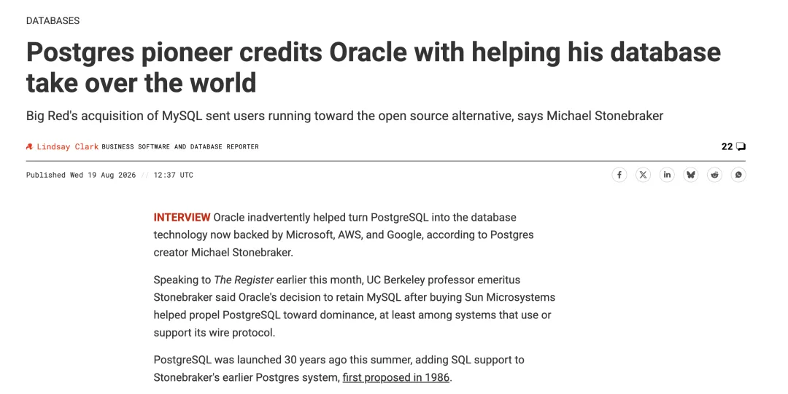
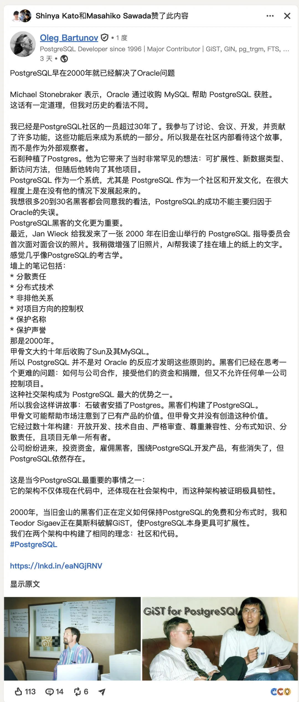
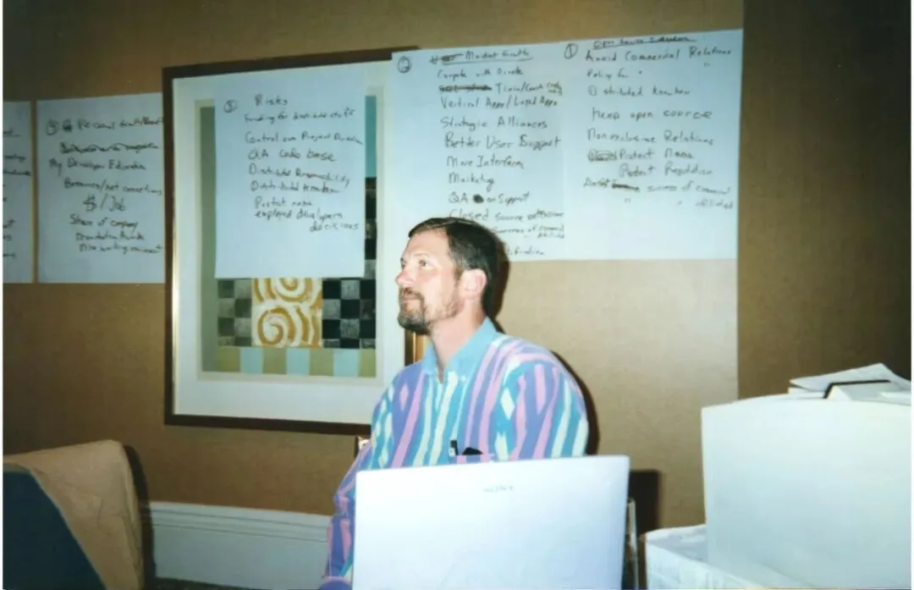
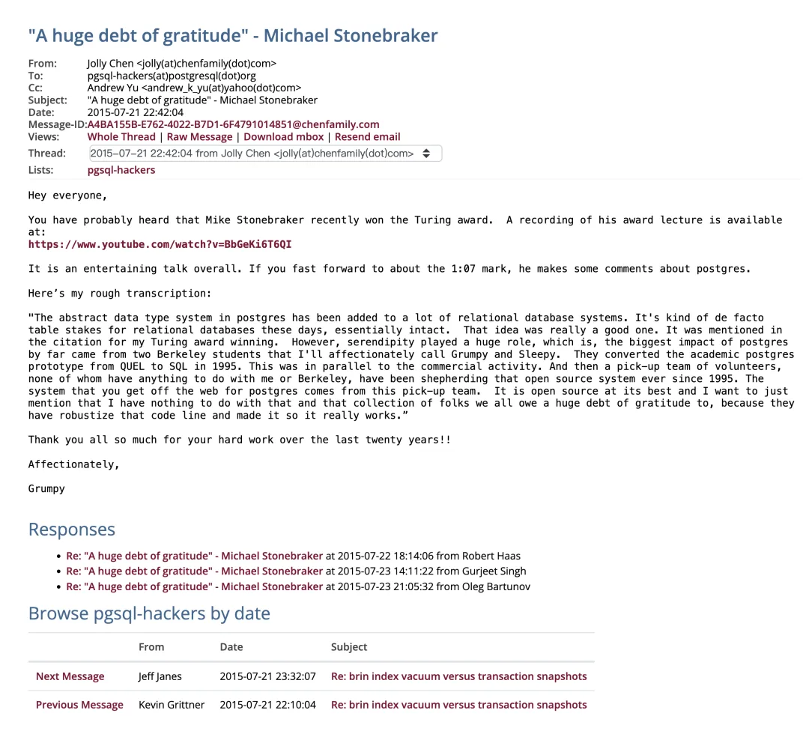
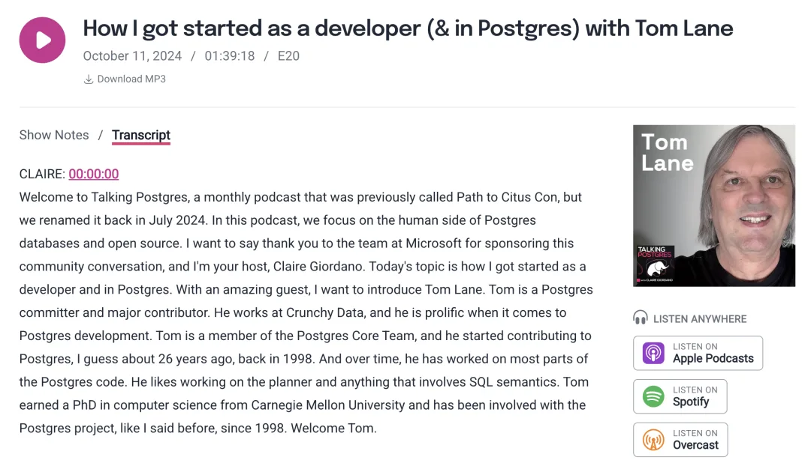
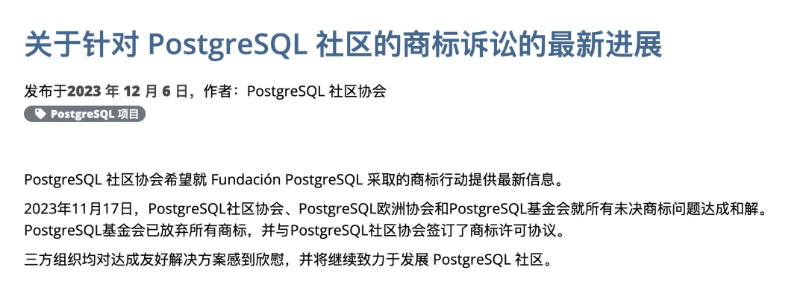
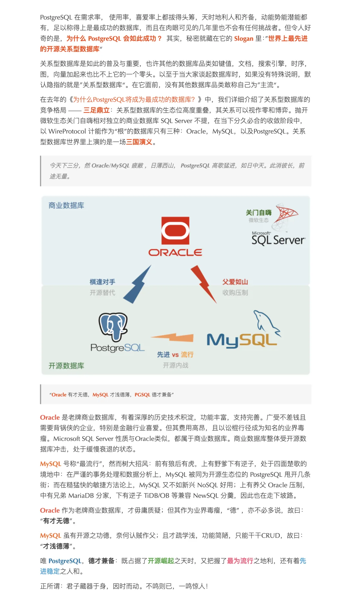
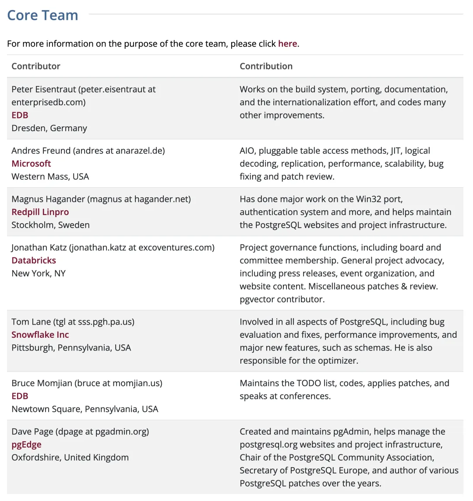
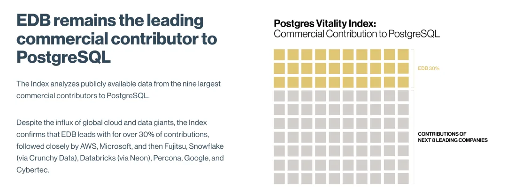
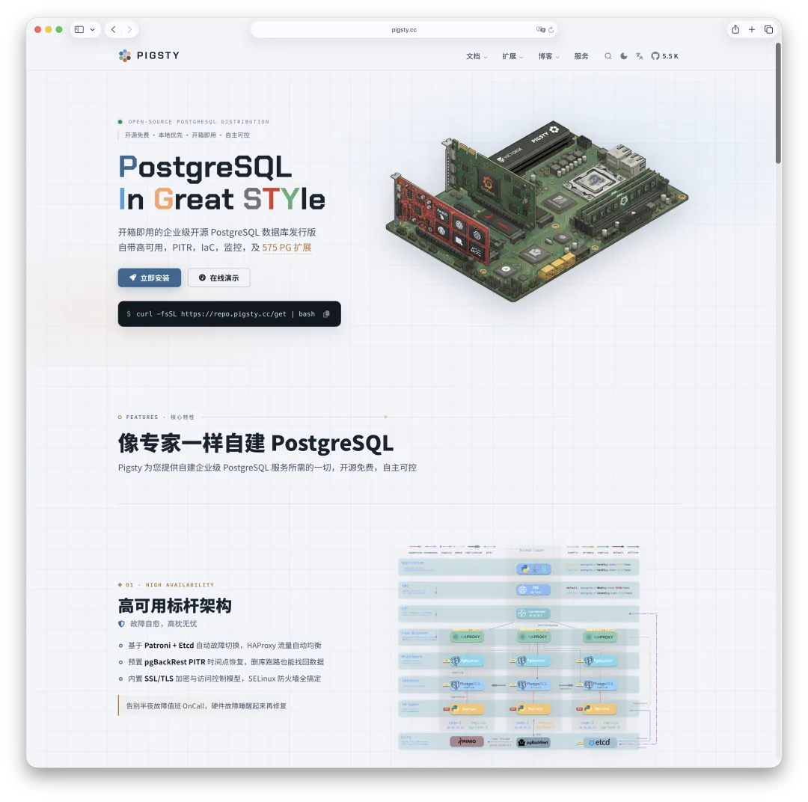

On August 19, 2026, The Register published an interview with Michael Stonebraker. The Turing Award winner who started the Berkeley Postgres project—and is still founding companies in his eighties—was asked why PostgreSQL had won. His answer was a little unexpected:

> We have to thank Oracle.

We have to thank Oracle, he said. After Oracle acquired MySQL, everyone began to worry that it would dictate MySQL's future. That was the beginning of PostgreSQL's rise.

In the same passage, he said that no vendor controls PostgreSQL. It is run by twenty or thirty first-rate programmers, and he expects it to remain outside the control of any single company indefinitely. That, he said, is open source at its best.

Today, Oleg Bartunov published a blunt rebuttal on LinkedIn: "PostgreSQL Had Already Solved the Oracle Problem in 2000."

Oleg runs Postgres Pro. He has spent more than thirty years in the community and is one of the key people behind PostgreSQL's JSON and full-text search systems.

Bartunov's evidence is an old photograph. Jan Wieck recently sent it to him. It shows the first in-person meeting of the PostgreSQL Core Team, held in San Francisco in March 2000. After restoring the image, Bartunov made out six principles written on sheets of paper taped to the wall:

- Distributed responsibility
- Distributed technical knowledge
- Non-exclusive partnerships
- Control over the project's direction
- Protect the name
- Protect the reputation

**This was 2000. Oracle would not acquire Sun—and MySQL with it—for another ten years.**

**Before any large commercial vendor entered the community, PostgreSQL's core developers were already treating vendor control, concentrated knowledge, ownership of the brand, and project independence as problems that required deliberate solutions.**

On the surface, this is an argument about who deserves the credit. Underneath it lies a more interesting question:

**What makes an open-source project succeed: a rival's mistakes, its founder's architectural foresight, decades of volunteer labor, or a system of governance that never appears anywhere in the query executor?**

---

## 1. How the Story's Center of Gravity Shifted

Stonebraker's account of this history has quietly changed emphasis over the past decade.

When he received the Turing Award in 2015, he spoke about Postgres. Jolly Chen transcribed the passage on the pgsql-hackers mailing list. Stonebraker called the people who took over the code "a pick-up team of volunteers"—a makeshift group with no connection to him or Berkeley that had kept the system alive since 1995.

He went out of his way to say that this had nothing to do with him. We all owed those people a huge debt of gratitude: they hardened the codebase and made it work. In that version of the story, the community was unquestionably the protagonist.

By the end of 2023, in another interview with The Register, the language had changed. After Oracle bought MySQL, Stonebraker said, developers grew suspicious and moved to PostgreSQL in droves. "It was another happy accident." The commercial success was wonderful, but much of it came down to good fortune.

At PGDay Boston in June 2026, he still gave the community the highest possible praise: Postgres was the model of open-source software because nobody owned it. By August 2026, however, Oracle had become the subject of the sentence.

These accounts do not contradict one another. In the same interview, Stonebraker still acknowledged the community's independence and vendor neutrality. What changed was the focal point of the causal story:

- In 2015, he explained who turned the code into a working system.
- In 2023, he explained where the market opening came from.
- In June 2026, he explained what made PostgreSQL's governance unusual.
- In August 2026, he compressed the inflection point into a headline-ready phrase: "thank Oracle."

There is another piece of context. In 2021, PostgreSQL committer Peter Geoghegan was asked on a mailing list how much weight Stonebraker carried in the community. His answer was direct: apart from appearing at a few EDB-sponsored events, Stonebraker had almost no involvement with the project after the university-era POSTGRES and had never spoken publicly on any of its mailing lists. Geoghegan himself had already been working on Postgres full time for ten years.

In other words, the person telling this history was absent from the history he was describing. That is the subtext of Bartunov's line: "I am looking at this story from inside the community, not as an outside observer."

---

## 2. The Photograph Is Not the Only Evidence

Bartunov's evidence is a photograph. On its own, that is weak evidence. The notes on the wall could have come from any brainstorming session, and twenty-six years later it is hard to tell how much the story has been polished by hindsight.

But another participant independently described the same period and told the same story.

On the Talking Postgres podcast, Tom Lane recalled what happened around 1999 and 2000. A company called Great Bridge approached the project and asked how it could become involved "in a tasteful way."

At the time, the Core Team had only four members. Their first response was not to negotiate terms. It was to expand the team. The thinking was roughly: "We had better bring in more people so that when we talk to them, we represent a broader community." Tom Lane and Jan Wieck joined, bringing the Core Team to six, and only then did the talks begin.

Notice the order: **before the company's money arrived, the project changed its organization.**

That is what two of the principles on the wall—"non-exclusive partnerships" and "control over project direction"—looked like in practice. They were not aspirations. They were a concrete organizational response to a specific company.

What happened next makes the point even clearer. Great Bridge was founded in July 2000 and hired Tom Lane, Bruce Momjian, and Jan Wieck. Community records from the time say it was Great Bridge that first allowed Lane to work on PostgreSQL full time rather than as a hobby. It also gave Momjian the freedom to travel and evangelize. Then the dot-com bubble burst, and the company collapsed.

The people remained. The project remained. The company did not.

Bartunov closes his article by saying that companies came, invested money, hired hackers, and sometimes disappeared—but PostgreSQL remained. Great Bridge was the first example, and it happened in the very same year: 2000.

---

## 3. The Real Moat Is Written at the Top of Every Source File

Bartunov briefly makes a point whose importance is easy to miss: the project has no single owner.

For PostgreSQL, that is not a statement of values. It is a legal fact.

PostgreSQL has never required contributors to sign over their copyrights. After thirty years, copyrights are spread across hundreds or even thousands of contributors. No central legal entity owns the whole work. The practical consequence is simple: **nobody has the authority to sell PostgreSQL.** It is not that someone could sell it but chooses not to. The entity capable of signing that transaction does not exist.

The contrast is MySQL AB. It centralized copyright: contributors assigned their rights to the company, which owned the whole codebase and could dual-license or sell it. Sun acquired MySQL in 2008. Oracle acquired Sun, and therefore MySQL, in 2010. The community's only escape was to fork the code. That is where MariaDB came from.

So Stonebraker is right to expect PostgreSQL to remain outside any single vendor's control indefinitely. But the reason is not that those twenty or thirty programmers are exceptionally wise. **The reason is that the transaction is structurally impossible.**

This is where the claim that PostgreSQL had "solved the Oracle problem" by 2000 really holds up. The solution was not written on the wall. It was written at the top of every source file.

The only exception is the name. A trademark has to be held by a legal entity or someone else can register it. PostgreSQL therefore placed the trademark with the nonprofit PostgreSQL Community Association in Canada, which completed the registration in 2003. That is the real-world counterpart to "protect the name" on the wall.

---

## 4. The Governance Model Has Been Put to the Test

In 2020, a Spanish nonprofit called Fundación PostgreSQL applied in the European Union and the United States to register the trademarks "PostgreSQL" and "PostgreSQL Community," having already registered them in Spain. The Core Team and PGCA sent legal demands and filed a formal opposition with EUIPO. In 2021 they sued in Madrid, and Fundación filed an additional application for "Postgres." The dispute did not settle until November 17, 2023. Fundación PostgreSQL returned all the trademarks and became an authorized user of the community's marks.

Three years, over a name.

Incidentally, someone has registered the mark in China too.

To anyone unfamiliar with open-source governance, this may look like an overreaction. But if "protect the name" had been nothing more than a nice phrase on a wall in 2000, nobody would have fought that case in 2020. **The force of an institution lies not in having it written down, but in having it enforced.**

The Core Team's steady habit of giving away its own power matters too. In his 2024 history of the Core Team at pgconf.dev, Tom Lane described how responsibility for security response was delegated in 2007 and infrastructure in 2011; the 2015 developer meeting decided to delegate committer selection as well. Asked why the early core members were those particular people, he gave the plainest answer possible: "Because they were the ones doing the work."

An organization built on the principle that the people doing the work should have a voice will naturally keep distributing power, because the number of people doing the work keeps growing. This is what Bartunov means by "distributed responsibility" and "distributed knowledge." Its opposite is easy to imagine: a project in which every decision converges on a handful of people, or on one company, can collapse all at once when that company is acquired.

---

## 5. But Stonebraker Is Not Wrong—He Planted the Seed

The two men are explaining different things. **Stonebraker is describing demand:** when and why large numbers of users began looking for an alternative. **Bartunov is describing supply:** why, when that door opened, there was a project on the other side that could neither be bought nor easily broken. These are two different questions. Both answers are correct, and each depends on the other.

The demand shock was real, and it continues. Percona's analysis of the MySQL repository found that annual commits fell from more than 22,000 in 2010 to just over 4,700 in 2024—less than a quarter of the earlier level. The number of active contributors was about 75 in the third quarter of 2025, fewer than the 82 present when Oracle completed the acquisition in 2010. In September 2025, Oracle laid off about 70 core MySQL engineers. MySQL creator Monty Widenius said he was "heartbroken." Percona founder Peter Zaitsev called it another possible step toward slowly killing the Community Edition.

[Peter Zaitsev: Can MySQL Still Catch Up with PostgreSQL?](/db/can-mysql-catchup/)

[Oracle Finally Killed MySQL](/db/oracle-kill-mysql/)

But something else matters more: **governance is a moat, not an engine.**

Good governance does not automatically produce market share. Plenty of well-governed open-source projects never find an audience. PostgreSQL languished outside the spotlight for years before 2015. If community culture were sufficient, it would not have needed twenty years to break out.

What was the engine? I think the answer is clear: **extensibility. And Stonebraker planted that seed himself in 1986.**

### [PostgreSQL Is Eating the Database World](/en/pg/pg-eat-db-world/)

**Oracle is advanced. MySQL is open source. PostgreSQL is both advanced and open source. Its openness lives in its community governance; its technical edge comes from extreme extensibility. [PostgreSQL: The World's Most Successful Database](/en/pg/pg-is-no1/)**

The most counterintuitive choice in the 1986 POSTGRES design paper was not any particular feature. It was this: instead of putting every feature into the kernel, make adding features to the kernel a first-class capability. Users could define their own data types, operators, functions, and even index access methods, then plug them into the system like modules.

At the time, everyone else was adding features to databases. Stonebraker added **the ability to add features**. It was a decision about how future features would be built. It immediately made the kernel more complex, while the payoff took thirty years to arrive.

This is what that payoff looks like:

- With a single extension, **PostGIS** turned PostgreSQL into the de facto standard in the geospatial field, pushing an entire category of commercial GIS databases into a corner.
- **TimescaleDB and Citus** addressed time series and distributed workloads as extensions, without forking the kernel.
- **pgvector** used a few thousand lines of C to turn PostgreSQL into a credible vector database, cutting the valuation thesis of more than a few vector-database startups in half along the way.
- **pg_duckdb, Apache AGE, pg_cron, and the many FDWs** are only the beginning. The extension repository I maintain now contains more than 1,600 extensions.

The extensible indexing frameworks GiST, GIN, and SP-GiST were built by Bartunov, Teodor Sigaev, and their collaborators. In other words, **Stonebraker designed the sockets; Bartunov and his peers built what plugs into them.** In this argument, their contributions are two sides of the same story.

Extensibility produced a second consequence, and it may be even more important: **the wire protocol accidentally became an industry standard.** To borrow Stonebraker's phrasing, several "elephants" bet the farm on it. Even CockroachDB and YugabyteDB, systems with no ancestry in the PostgreSQL kernel, chose to support its protocol. A protocol usually becomes a standard not because it is perfect, but because the surrounding ecosystem grows so large that nobody can afford incompatibility.

How does Stonebraker judge the result? At PGDay Boston, he said abstract data types had taken root and nearly every relational database now supports that kind of extensibility. "We basically got it right." He considers it the main reason he received the Turing Award. The rule engine and crash-recovery ideas planned at the same time, by contrast, did not work out.

If Stonebraker deserves credit for one thing, then, it is not that Oracle helped. It is the architectural decision he made forty years ago—the very point Bartunov acknowledges when he says that Stonebraker planted Postgres.

What grew from that seed also leads into the second half of the story. When an ecosystem's value is spread across thousands of extensions, dozens of companies, and countless independent authors, acquiring one company cannot give you control. **PostgreSQL is hard to strangle at a single choke point because of both its governance and its architecture.**

---

## 6. The Real Test Is Not Oracle. It Is the Cloud

The problem written on the wall in 2000 was how to work with companies, accept their money and contributions, yet prevent any one of them from controlling the project.

The imagined adversary was concrete: **a company that wanted to buy you outright.**

Today the problem has changed shape. Open the contributor list on postgresql.org and look at the employers of the seven Core Team members:

Five of the seven now draw salaries directly from tech giants. Notice why Tom Lane's employer now reads Snowflake: he did not leave for a data-warehouse company; Snowflake acquired Crunchy Data. Jonathan Katz, meanwhile, moved from AWS to Databricks. **For Lane, the person never moved. Only the logo above his head changed.**

The Major Contributors list makes the picture clearer. Counting the employers shown on the official site gives ten at AWS, ten at Microsoft including Andres Freund, three at Snowflake including Tom Lane, and four between Databricks and the Neon team it acquired. One more works at Apple and another at Yandex Cloud. Between the Core Team and major contributors there are roughly sixty people, and nearly half are paid by that handful of companies. The largest remaining bloc is EDB's eight—and private equity stands behind EDB.

Now compare that with the "Postgres Vitality Index" EDB published in March 2026. EDB ranks itself first among commercial contributors, claiming more than 30 percent of contributions. It is followed by AWS, Microsoft, Fujitsu, Snowflake through its acquisition of Crunchy Data, Databricks through its acquisition of Neon, Percona, Google, and Cybertec. The index covers only the nine commercial contributors EDB considers the largest.

Put that ranking next to Stonebraker's claim that no vendor controls PostgreSQL.

Both statements are true. No single company controls the project: copyright is distributed, the trademark belongs to a nonprofit, and decision-making authority keeps being delegated. **But the danger is hiding inside the phrase "no single company."**

The old adversary was one company trying to kill you. It had to do something wrong before you had a reason—and a target—for fighting back. Today, nobody has to do anything wrong. Every engineer is diligently writing code, fixing bugs, and reviewing patches. Every company is investing real money. And every person will naturally prioritize the problems that matter to their employer.

Priorities drift. Problems that matter in the cloud—I/O performance, logical replication, backup efficiency, storage tiering—attract people eager to solve them. The things self-hosted users need most, such as high availability out of the box and a built-in connection pooler, still have no official answer from the community. Bruce Momjian included these items in his "what is still missing" list at PGDay Boston. Nobody is sabotaging them. **Nobody is paid to build them.**

The distribution of value is even more troubling. Aurora, AlloyDB, and Microsoft's Azure HorizonDB, which entered public preview in May 2026, all sell "PostgreSQL compatibility." Their kernels benefit from the community, but their revenue does not flow back to it. The community gets a few dozen salaries. Cloud vendors get billions of dollars in revenue. Most of the commercial value in the ecosystem is accumulating in a proprietary "compatibility layer" that the community can neither see nor govern.

The structure that makes PostgreSQL impossible to sell also makes it unable to mount a counterattack.

Open-source projects pushed hard enough by cloud vendors have reached for remarkably similar weapons. MongoDB adopted SSPL in 2018. Elastic followed in 2021. HashiCorp switched to BUSL in 2023, and Redis changed licenses in 2024. They could change the rules overnight precisely because they held all the copyrights: contributors had signed CLAs, and the company decided. **Concentrated copyright was their weapon against the cloud vendors.**

PostgreSQL cannot wield that weapon. The copyrights accumulated over thirty years are scattered among thousands of contributors. No entity can announce that cloud vendors may no longer offer PostgreSQL as a managed service. Nobody can sell PostgreSQL, and nobody can close that door on its behalf. **The moat and the vulnerability are the same thing.**

This is not a design flaw. It is the price of a choice, and I think the price is worth paying. The projects that reached for that weapon got OpenTofu, Valkey, and OpenSearch in return, while burning through community trust in one stroke. PostgreSQL has avoided a split for thirty years precisely because nobody can change the rules unilaterally.

If you cannot stop them upstream, what can you do?

**The answer has to come downstream.**

Cloud providers do not really sell the PostgreSQL kernel. The kernel is free; anyone can download it. They sell the layer around it: high availability, backup and recovery, monitoring and alerting, connection pooling, parameter tuning, extension distribution, and automated failure recovery. The community has never produced an official answer for this layer. Every cloud vendor built a proprietary one and now rents it by the hour.

That layer can be open source.

This is what I am building with Pigsty: an open-source distribution that reproduces the RDS layer—high availability, backups, monitoring, an extension repository, and object storage—and lets anyone run it on their own machines. This is not an attempt to steal the cloud vendors' business; one person could not do that anyway. The point is to make opting out of a managed cloud database a viable **option** again.

You have bargaining power only when you retain the right to exit. Without the ability to self-host, "multi-cloud" and "hybrid cloud" are illusions. Your only choice is which vendor will lock you in. The governance problem cannot be solved outright, but it can be hedged: as long as the self-hosted road stays open, a cloud vendor's proprietary layer remains one option rather than the only possible destination.

---

## Conclusion: The Enemy of the New Era

Twenty-five years ago, open source's enemy number one was Microsoft. There were the Halloween documents in 1998, Steve Ballmer calling Linux a cancer in 2001, and the "embrace, extend, extinguish" playbook. The enemy was easy to recognize because it wanted to kill you.

What about today? A Microsoft employee sits on the PostgreSQL Core Team. Microsoft employs around ten major PostgreSQL contributors and is one of the project's largest contributors. It is hard to call the company an enemy now.

**That is the real problem of the new era: today's opponent does not want to kill you. It wants to keep you well fed.**

It uses your work and funds it with real money. It writes code, fixes bugs, sponsors conferences, and pays salaries—by every measure, it behaves like a model citizen. At the same time, it captures most of the ecosystem's commercial value. There is no villain in this relationship, nobody to sue, and no case to win. At least the 2020 trademark dispute had a defendant. This time there is none.

I believe managing the relationship between open-source communities and cloud vendors is a new class of problem for open-source governance. The six lines written in 2000 solved "how do we avoid being bought by one giant company?" That was a legal problem. It could be addressed by refusing copyright-assignment CLAs and placing the trademark with a nonprofit. Twenty-six years later, the question is "how do we avoid being domesticated by ten dominant companies?" That is a political problem. No clause can solve it. It demands continuous, collective vigilance.

Still, I am not pessimistic.

Monopolizing the PostgreSQL ecosystem remains extraordinarily difficult because its very shape resists monopoly. Copyright is spread across thousands of people. The trademark belongs to a nonprofit. The extension ecosystem belongs to countless independent authors. The protocol is completely open. You can buy every PostgreSQL startup one by one, but you cannot buy that shape.

And there will always be a few stubborn people. Even if every PostgreSQL company is eventually absorbed by a cloud giant, independent developers like me will still use the cloud vendors' machines while pushing back against their business model, open-sourcing the capabilities behind RDS one by one. As long as someone keeps doing that, self-hosting remains an open road—and there is still a floor under freedom in the PostgreSQL world.

Bartunov still has the best summary of this history:

> Stonebraker planted Postgres. The hackers built PostgreSQL.

The hackers built more than PostgreSQL. They built the institution that makes PostgreSQL impossible to sell. Code can be forked. Architecture can be copied. What cannot be copied is twenty-six years of consistently enforcing the rules.

---

### References

- `[1]` : <https://www.theregister.com/databases/2026/08/19/postgres-pioneer-credits-oracle-with-helping-his-database-take-over-the-world/5289087>
- `[2]` : <https://www.theregister.com/databases/2026/06/22/the-database-that-refused-to-die-how-postgres-survived-its-own-creators/5259716>
- `[3]` : <https://www.theregister.com/2023/12/26/michael_stonebraker_feature/>
- `[4]` : <https://www.postgresql.org/message-id/A4BA155B-E762-4022-B7D1-6F4791014851@chenfamily.com>
- `[5]` : <https://wiki.postgresql.org/images/c/c1/CoreTeam_Update_pgconfdev_2024.pdf>
- `[6]` : <https://talkingpostgres.com/episodes/how-i-got-started-as-a-developer-in-postgres-with-tom-lane/transcript>
- `[7]` : <https://www.postgresql.org/about/news/trademark-actions-against-the-postgresql-community-2302>
- `[8]` : <https://www.postgresql.org/about/news/updates-on-trademark-actions-against-the-postgresql-community-2762/>
- `[9]` : <https://www.postgresql.org/community/contributors/>
- `[10]` : <https://www.percona.com/blog/analyzing-the-heartbeat-of-the-mysql-server-a-look-at-repository-statistics/>
- `[11]` : <https://www.percona.com/blog/separating-fud-and-reality-has-mysql-really-been-abandoned/>
- `[12]` : <https://www.theregister.com/software/2025/09/11/monty-widenius_heartbroken_over_oracles_mysql_job_cuts/1169295>
- `[13]` : <https://techcommunity.microsoft.com/blog/adforpostgresql/whats-new-with-postgres-at-microsoft-2026-edition/4526963>
- `[14]` : <https://www.enterprisedb.com/company/postgres-vitality-index>

---

Published version: [WeChat](https://mp.weixin.qq.com/s/-xbCSmcYT-fIGXgQuQQUow)
