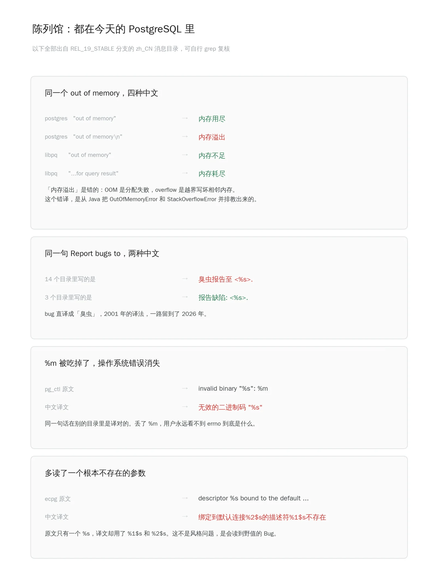
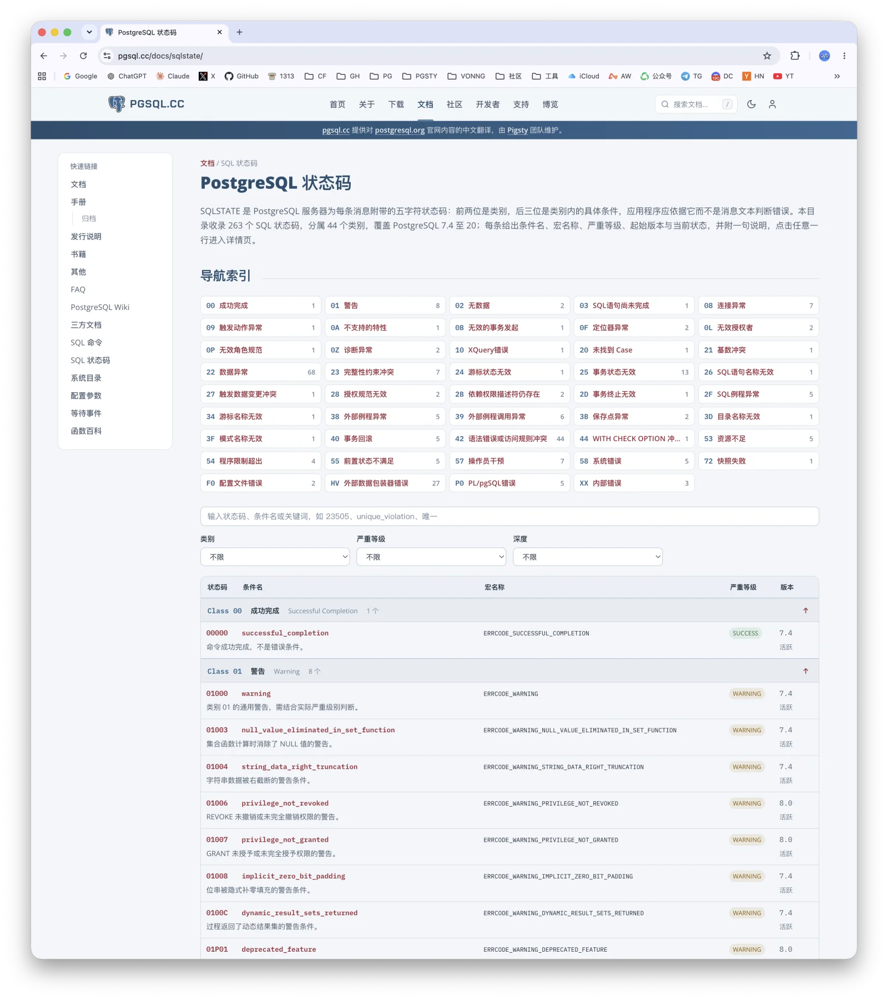
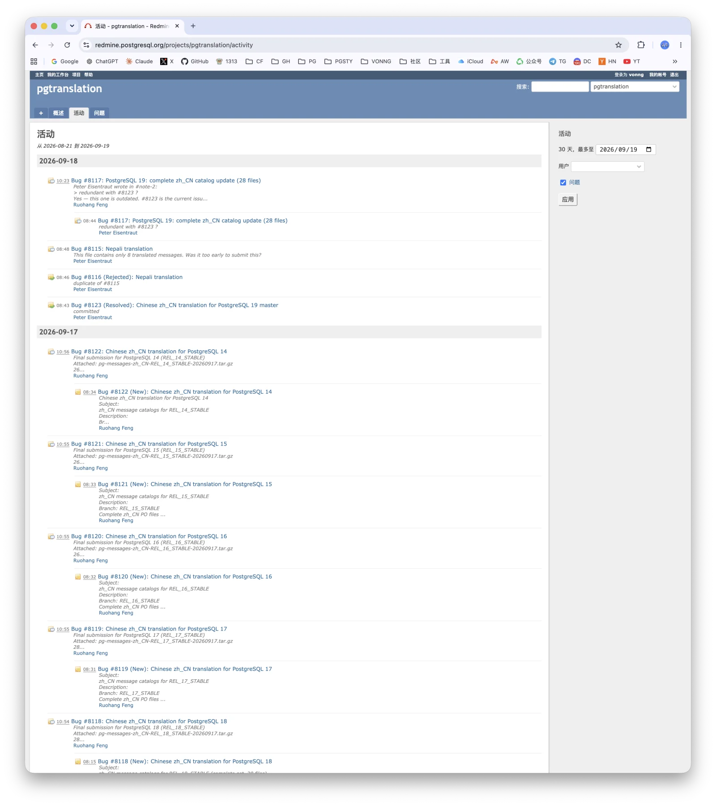
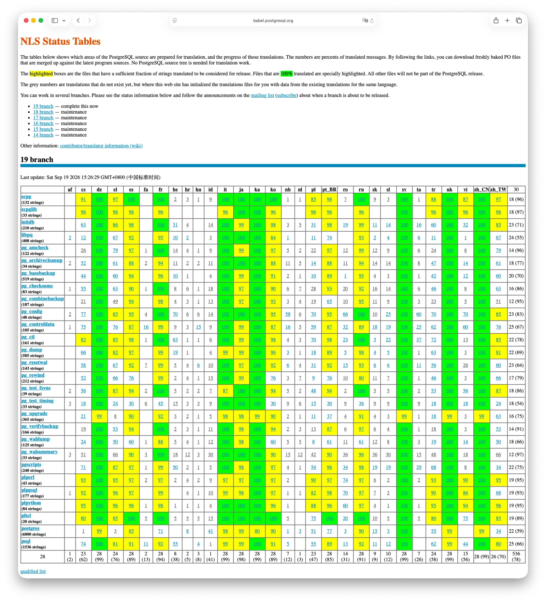
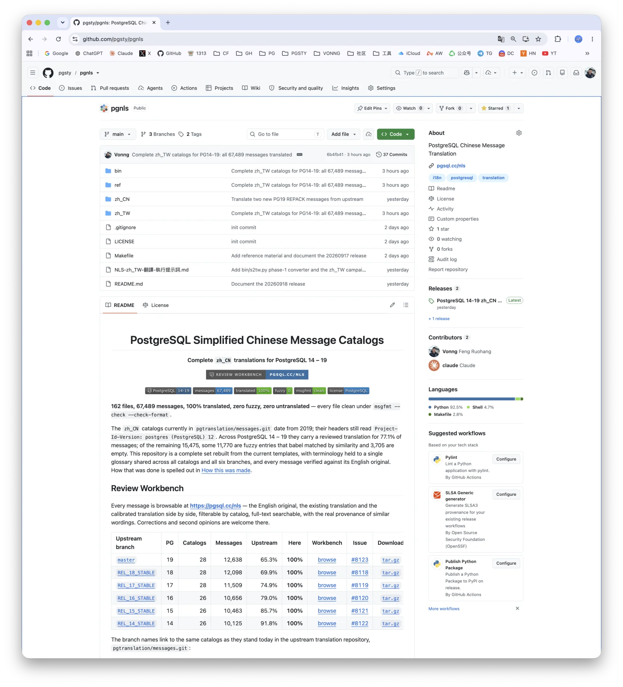
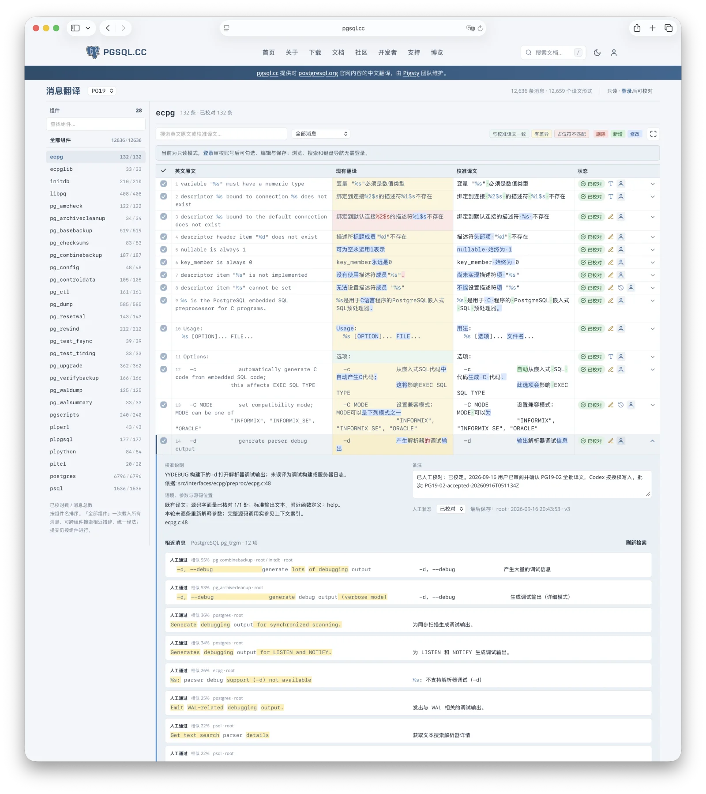
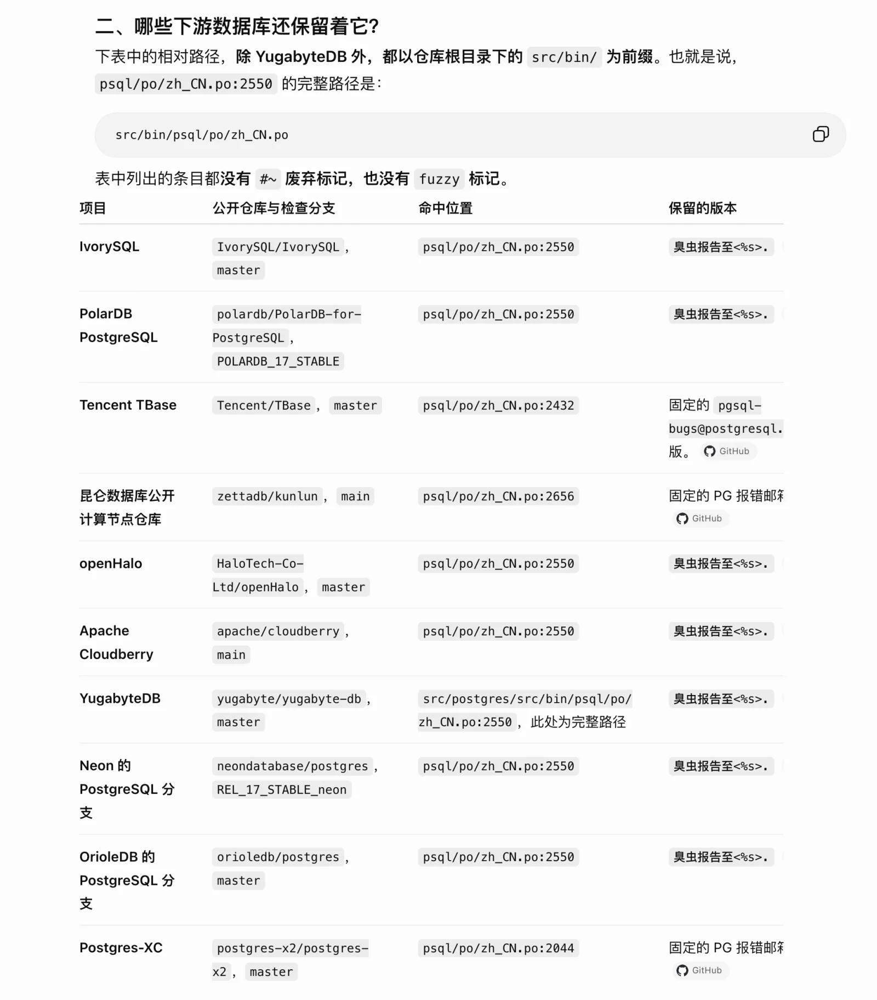

如果你用 PostgreSQL 有些年头，大概听过一条不成文的规矩：装数据库的时候，本地化语言 locale 千万别设 zh_CN（简体中文），老老实实用 en_US。

这条规矩不是玄学，是一代人踩出来的。但它真正的意思是：一个中国用户，为了让自己的数据库能好好说话，得先把系统里的母语关掉。

从 PostgreSQL 19 开始，这条规矩作废了。

老冯把 PostgreSQL 的简体中文本地化消息重做了一遍。
PG 14 到 19 六个大版本，28 本消息目录，67,487 条消息，100% 覆盖。
9 月 18 日已由 Peter Eisentraut 合入上游翻译仓库，将随 PostgreSQL 19 正式发布。

--------

## 中文支持差点就没了

PostgreSQL 原生支持多语言本地化，服务端吐出来的每一句英文消息，背后都有一套官方消息目录（message catalog）负责翻译，这套东西叫 [NLS](https://www.postgresql.org/docs/current/nls.html)。

但机制支持不等于具体的语言实现能用。

今年 7 月 24 日，Thom Brown 在 pgsql-translators 邮件列表发了封信：
有六种语言的翻译，照现在的状态进不了 PG 19 —— 捷克语、希腊语、意大利语、巴西葡语、简体中文、繁体中文。

原因是这样的，PostgreSQL 有个硬规矩：一门语言的本地化支持，只有消息目录翻译覆盖比例超过 80% 才有资格进发行版，
低于这条线的直接不打包。[babel.postgresql.org](https://babel.postgresql.org/) 上有张状态表，一目了然。

简体中文 66%，繁体中文 70%。都在线下。

 

先看横向。德语、瑞典语、乌克兰语、格鲁吉亚语 99%，日语 98%，俄语 91%，韩语 89%。格鲁吉亚人口 370 万，比上海一个区多不了多少，28 本目录全部译到 99%。

再看纵向，更难看。简体中文 28 本目录，过线的只有 9 本，而且越是要紧的越烂：

服务端 `postgres`，6826 条消息，占全部消息量一半以上，你平时看到的绝大多数 ERROR 都出自这里 —— 61%。`libpq`，各种语言的驱动都压在它上面，408 条 —— 12%。

66% 不是「中文有点糙」的意思。gettext 找不到译文就回退英文原文，所以真实体验是这样的：
一条报错前半句中文后半句英文；同一次升级里，A 工具说中文 B 工具说英文；同一个概念在两个地方是两个词。

不是中文差，是中文一半一半。对任何严肃环境来说，这比纯英文更糟。
所以老 DBA 会告诉你：把中文本地化关掉。

--------

## 七年没人管

为什么会这样，打开文件头就知道了。

这是今天 [REL_19_STABLE 分支上的文件](https://github.com/postgres/postgres/blob/REL_19_STABLE/src/backend/po/zh_CN.po)，master 分支上也一模一样。
从 PG 12 到 PG 19，七年零三个月，八个大版本，这个文件头一个字节都没变过。

PG 12 两年前就已经 EOL 脱离支持生命周期了，整整七年时间，没人管。

客户端那几本还有人零星修补过 —— 2021 年补了一轮 psql 和 libpq，2023 年 pg_ctl，2024 年 initdb —— 
但最大的那本一直躺在那儿没动。PG 12 本身两年前就 EOL 了，翻译还停在它那一年。

七年里新写进 PostgreSQL 的消息，逻辑复制的、JIT 的、并行查询的、异步 IO 的，中文那一栏全是空的。
服务端这一边，大约 2660 条从来没有过中文；当年译好的 5213 条里，又有大约 1000 条因为源码改了对不上今天的 msgid，成了死条目
—— 它们还躺在文件里，但永远不会再被匹配到。

--------

## 错译陈列馆

比没翻译更麻烦的，是翻错了。

`Report bugs to` 被译成「臭虫报告至」，14 个目录里都是这么写的。这是 2001 年的译法，第一位译者留下的，一路活到了 2026 年。

`out of memory` 在今天的代码里有四种中文：内存用尽、内存不足、内存耗尽，还有一个**内存溢出**。前三个都对，第四个是错的。OOM 是想申请内存没申请到，干干净净地失败；overflow 是写越界，把相邻的内存写坏了。这两件事在排障时的指向完全相反 —— 一个让你去加内存、查连接数、调 work_mem，一个让你去查代码。这个错译是从 Java 那边传染过来的，`OutOfMemoryError` 和 `StackOverflowError` 老被并排着教，教着教着就混成一个词了。

还有两条，是真的 Bug。

`pg_ctl` 里的 `invalid binary "%s": %m`，中文把 `%m` 整个吃掉了。出了错你只知道哪个文件不对，永远不知道 errno 是什么 —— 而这条消息一大半的价值，恰恰就在那个 `%m` 上。

`ecpg` 里更狠：原文只有一个 `%s`，译文写成了 `%1$s` 和 `%2$s`。中文环境下，这句话会去读一个根本不存在的第二个参数。

所以老司机那条规矩是有道理的。而且踩这个坑的人比想象中多 —— 只要你用中文语言环境的 macOS 或 Linux 桌面装 PostgreSQL，locale 默认就跟着系统走，是中文。不是特意调教过，很容易在这上面翻车。

--------

## 那就我来吧

老冯为什么突然想到要搞这个事儿呢？

前段时间我把 PostgreSQL 从 9.0 到 20 共 18 个大版本的文档全部翻成了中文，放在 [pgsql.cc](https://pgsql.cc)，顺手还维护了一份 PG 的百科全书知识图谱。图谱里有一项是错误消息和它在源码里的出处，做着做着就发现，这批消息的中文实在不成样子。

既然都做到这份上了，那就一起做了吧。

9 月 11 日，我给 [pgsql-translators 发了封信](https://www.postgresql.org/message-id/CA1188D8-97A4-4F09-9E7F-42207C43BC34@vonng.com)，大意是：我志愿认领简体中文消息的翻译。

信里把方法交代得很清楚：底稿是大模型翻的，用的是 pgsql.cc 那套术语表；它只是工作材料，我不会照这个样子提交；每一条都会人工对照英文原文和现有译文过一遍，只有校完、`msgfmt` 干净的结果才会发到列表上。我给了两个选项 —— 全量重做，或者只补空缺、修明显错误 —— 并说明我倾向前者：大部分不一致是跨文件的，一遍对着固定术语表的校对能解决的事，零碎补丁解决不了。

列表上没人反对。那就干。

9 月 13 日，PG 19 的 28 本目录先交了一批，12,702 条，Redmine 上开了个 issue。

9 月 17 日，PG 14 到 19 六个分支的全部目录提交完毕：162 个文件，67,487 条消息，100% 译完，零 fuzzy，零空条目，`msgfmt --check --check-format` 全绿。

9 月 18 日，Peter Eisentraut 把它们合进了 PostgreSQL 19 的翻译仓库。

七年没人动的东西，前后七天。

烧了 8 个 20x 的订阅。

PG 19 还没最终 Freeze，上游消息还在变 —— 这两天 postgres 那本又动了几条，覆盖率就从 100% 掉到了 99%。所以我另外维护了 [pgsty/pgnls](https://github.com/pgsty/pgnls) 实时跟进上游变动，Releases 每天发一版，等 Freeze 之后再提交一份最终的 100%。

繁体中文 zh_TW 也顺手做了一份，目前基本完成。到时候不只简体，繁体也会是 100%。

--------

## 这七天是怎么过的

我丝毫不避讳：主力是 Fable 5.1、Cloud Fable 5.1 和 Codex Astra 6。

多亏了 AI，现在的翻译已经比以前容易很多了。但这个翻译也不是张嘴说 “请你帮我把这些都翻译成中文” 那么简单。我搭进去的时间保守估计也有几十个小时，中间还专门写了个 Workbench，就为了人工比对审校方便一点。

https://pgsql.cc/nls

翻译这活儿，难的从来不是把句子从一种语言搬到另一种，难的是一致性。67,487 条消息，跨 28 个组件、跨 6 个大版本，同一个英文必须是同一个中文，相似的英文得有相似的中文。这件事人做会累死，模型做会飘。所以关键不在翻，在于先把规矩立死：

第一遍先做全量试翻，目的不是要译文，是把所有术语抽出来。然后几个模型分头给术语建议，交叉比对，整理出一份初始术语表，我再人工逐条核定 —— 不确定的严格推敲，包括助动词，cannot、shall not、must not 这种必须一个萝卜一个坑，不允许临场发挥。术语表定死之后，写翻译风格指南和规约，里面塞满正例和反例。拿这套规约做初翻。初翻完再做一致性校验：跨组件对一遍，跨版本对一遍，把所有不一致挑出来重过。

术语表是专业翻译的灵魂。翻《设计数据密集型应用》第一版第二版、翻《PostgreSQL Internals》、翻 18 个大版本的 PG 文档，攒下来的就是这份东西。专业翻译里，术语表定了，质量的天花板就定了一大半。

AI 确实把这活儿的成本砍掉了一个数量级，七年没人啃得动的骨头，现在七天能啃完。但反过来看 —— 正因为现在只要七天，七年没人做才更说不过去。

--------

## 「国产」到底产了什么

动手之前我第一个念头是：这么多号称基于 PostgreSQL 的国产数据库，会不会早有人做过了？毕竟国产 —— 汉化有没有现成的可以捡？

我去翻了一圈。一堆国产数据库的 zh_CN.po 跟 PG 上游一毛一样，用「臭虫」和「内存溢出」一找一个准。

这就有点绷不住了。做一个中国的国产数据库，最基本的两样东西是什么？一个是中文文档，一个是中文本地化。把 PG 的英文报错翻成像样的中文，让中国用户看得懂自己的数据库在说什么 —— 这是最低的那一档，总得做一下吧？

上游这份中文翻译，文件头上留下过名字的：2001 年是何伟平，2019 到 2023 年是富士通的张杰，还有 Cloudberry 的王殿进。

靠 PostgreSQL 吃饭的国产数据库厂商，没有一家的名字在上面，最后还是老冯这个个体户去搞定。

确实有些事情，政策补贴做不到，热爱能做到。

--------

## 最后

开源世界里没有分配任务的人，只有认领任务的人。这个位置空了七年，谁都能坐，只是没人。格鲁吉亚 370 万人口，28 本目录 99% —— 不是他们更强，是他们那边有人举了手。

而现在，这件事多了一个时限。

那些错译不会老老实实待在 `.po` 文件里。它们跟着各种 PG 分支开枝散叶，跟着博客、问答、工单流到网上，进训练语料，被模型学走，再被无数人当成标准答案复读回来。「内存溢出」本来只是某个人多年前顺手按下的四个字，再过几年，它可能就成了整个中文技术世界对 OOM 的共识 —— 到那时候再想改，就不是改一个文件的事了。趁现在还来得及，把源头洗干净，比将来在下游堵一万次都便宜。

「臭虫报告至」活了二十五年。到 PostgreSQL 19，它不会再活下去了。

所以，下个月装 PostgreSQL 19 的时候 —— 把 locale 设成 `zh_CN` 试试吧，这回它真的能用了。

