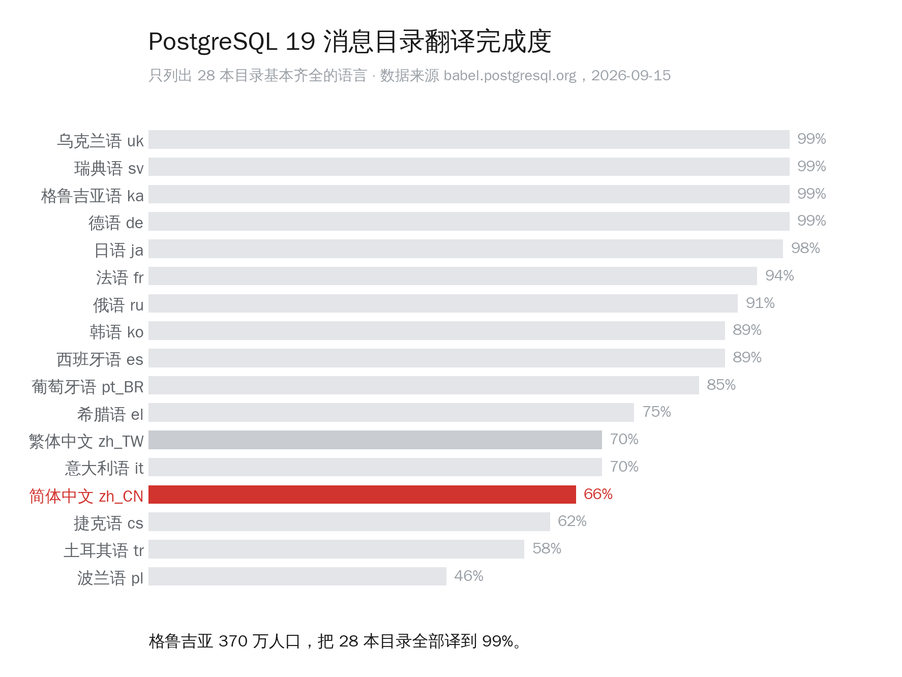
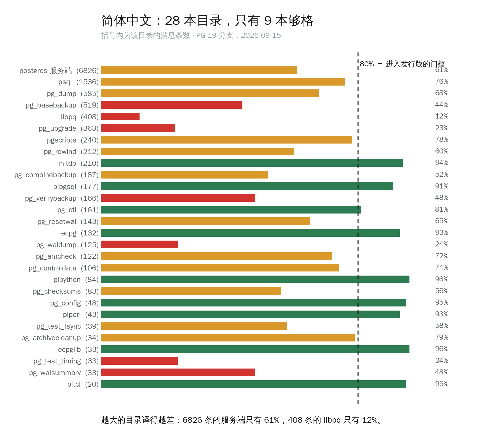
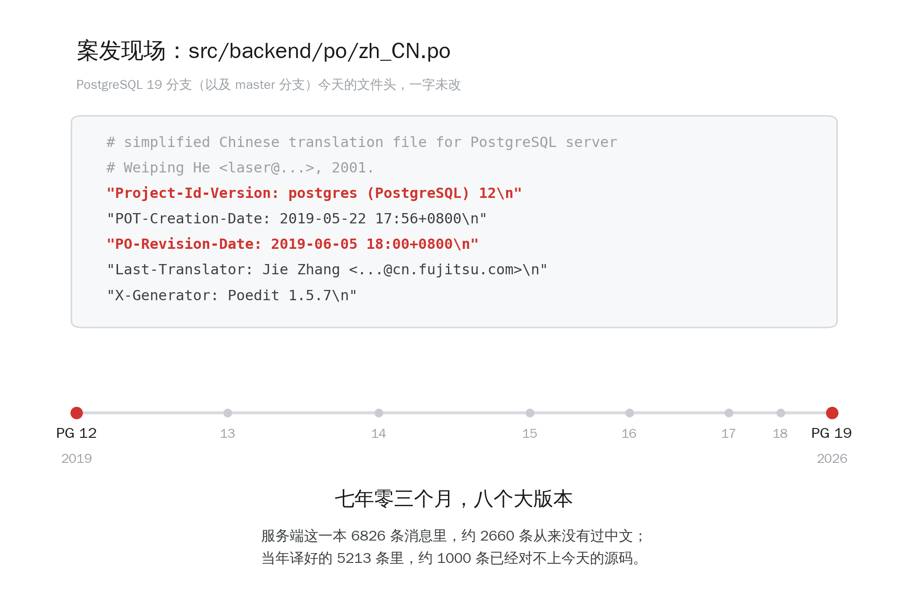
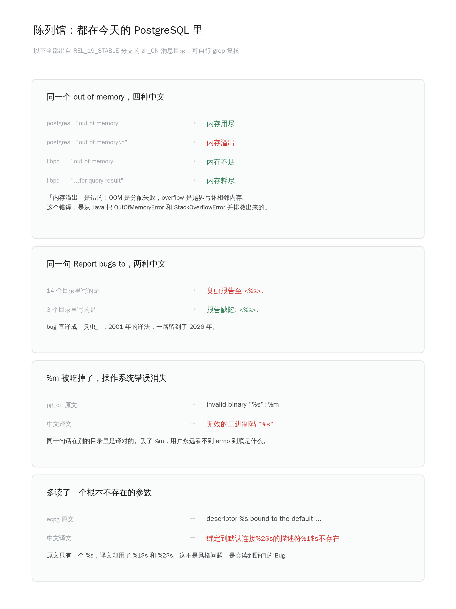

> 你在 psql 里看到的每一句中文报错，最后一次更新是 2019 年 6 月 5 日。

PostgreSQL 是有官方中文界面的。`initdb`、`psql`、服务端抛出来的每一句 ERROR，都有一套官方消息目录（message catalog）负责翻译。
这套东西叫 [NLS](https://www.postgresql.org/docs/current/nls.html)，跟文档是两回事：文档是给你看的，消息是机器吐给你的。

今天顺手查了一下这套东西在 [babel.postgresql.org](https://babel.postgresql.org/) 上的现状，结果比我预想的难看。

先看横向。28 本消息目录，德语、瑞典语、乌克兰语、格鲁吉亚语都是 99%，日语 98%，俄语 91%，韩语 89%。简体中文 66%，排在希腊语和意大利语后面。

格鲁吉亚共和国，人口 370 万，比上海一个区多不了多少，把 28 本目录全部译到了 99%。

再看纵向。PostgreSQL 有个硬规矩：一本目录译到 80% 才有资格进发行版，低于这条线的直接不打包。简体中文 28 本目录里，过线的只有 9 本。

而且是越重要的越烂。服务端 `postgres` 那一本，6826 条消息，占了全部消息量的一半以上，你平时看到的绝大多数 ERROR 都出自这里——61%。libpq，
所有语言的驱动都在它上面，408 条消息——12%。`pg_upgrade`，升级大版本全靠它，你最需要看懂报错的时候——23%。

为什么会这样，打开文件头就知道了。

`PO-Revision-Date: 2019-06-05`。`Project-Id-Version: postgres (PostgreSQL) 12`。生成工具是 [Poedit](https://poedit.net/) 1.5.7，2013 年的版本。

这不是历史存档，这是今天 [REL_19_STABLE 分支上的文件](https://github.com/postgres/postgres/blob/REL_19_STABLE/src/backend/po/zh_CN.po)，master 分支上也一模一样。
从 PG 12 到 PG 19，七年零三个月，八个大版本，这个文件头一个字节都没变过。

七年里新写进 PostgreSQL 的那些消息——逻辑复制的、JIT 的、并行查询的、`REPACK` 的、异步 IO 的——中文那一栏全是空的。服务端这一本里大约 2660 条从来没有过中文；
而当年译好的 5213 条，因为源码变了，又有大约 1000 条已经对不上今天的 msgid，变成了死条目。

比没翻译更麻烦的是翻译错了。

同一个 `out of memory`，在今天的代码里有四种中文：内存用尽、内存不足、内存耗尽，还有一个**内存溢出**。前三个都对，第四个是错的——OOM 是想申请内存没申请到，
干干净净地失败；overflow 是写越界，把相邻的内存写坏了。这两件事在排障时的指向完全相反。这个错译是从 Java 那边传染过来的，
`OutOfMemoryError` 和 `StackOverflowError` 老被并排教，教着教着就混成一个词了。

`Report bugs to` 被译成「臭虫报告至」，14 个目录里都是这么写的。这是 2001 年的译法，第一位译者留下的，一路活到了 2026 年。

还有两条是真 Bug，不是风格问题：

`pg_ctl` 里 `invalid binary "%s": %m`，中文把 `%m` 整个吃掉了。出了错你只知道哪个文件不对，永远不知道 errno 是什么。同一句话在别的目录里是译对的。

`ecpg` 里那句更狠：原文只有一个 `%s`，译文却写成了 `%1$s` 和 `%2$s`。也就是说，中文环境下这句话会去读一个根本不存在的参数。

---

## 顺手做了个东西

这活儿得有人接。我起了个头，把 PG 19 的 zh_CN 消息目录整个过了一遍，放在这里：

**[https://pgsql.cc/nls/](https://pgsql.cc/nls/)**

说清楚它是什么、不是什么：

- **底稿是机器翻译的。** 这一点我会在给上游的邮件里明写，不藏着。但机器翻译只是底稿，每一条都要人过一遍才会提交。
- **配了一张完整的 PostgreSQL 术语表和一份例外规则。** 上面那些不一致，根子都在没有统一术语：同一个词在 28 本目录里各译各的，每个译者凭手感。术语表定死了，剩下的才是文字功夫。
- **跨版本一致。** 同一条 msgid 在 PG 10 到 PG 20 里必须译成同一句中文。这件事听起来理所当然，做起来是全站里最麻烦的工程问题。
- **页面上可以按目录浏览、原文译文对照、直接搜。** 看到哪句不对，欢迎直接拍给我。

改完的东西会按 PostgreSQL 的正常流程走 [pgsql-translators 邮件列表](https://www.postgresql.org/list-pgsql-translators/)，进上游，不另立山头。

---

最后说一句多的。

以前这件事的影响面很小——用中文 locale 跑数据库的人本来就不多，看不懂就切回英文。

现在不一样了。这些消息是语料。中文技术圈搜出来的每一篇排障文章、大模型学到的每一条 PostgreSQL 知识，源头都是这些字符串和它们的二手转述。一句「内存溢出」错在这里，
会以一种你追查不到的方式，在几百万次对话里被复述出去。

翻译债是要还的，而且现在利滚利。

<!--
数据核对说明（都是 2026-09-15 现拉的，可复核）：
- 语言完成度与目录完成度：babel.postgresql.org，19 branch，Last update 2026-09-15T12:57:57Z
仅取 28 本目录基本齐全的 17 种语言作横向对比，避免只有 1-3 本目录的语言拉高排名
- 66% 为 28 本目录完成度的算术平均；按消息条数加权是 62%
- 9 本过线：zh_CN ≥80% 的目录为 initdb 94、plpgsql 91、ecpg 93、plpython 96、pg_ctl 81、
pg_config 95、plperl 93、ecpglib 96、pltcl 95
- 文件头：raw.githubusercontent.com/postgres/postgres/REL_19_STABLE/src/backend/po/zh_CN.po
- 2660 / 1000 两个数字是推算：6826×(1-61%)≈2662 未译；仓库内旧文件 5213 条 -
babel 口径已译 ≈4164 ⇒ ≈1049 条失配。措辞上都用了"大约"
- 四组错译：均在 REL_19_STABLE 分支实测 grep 得到，原文已在图中给出可复核
- 正文里关于 pgsql.cc/nls 的四条特性（机翻底稿、术语表、跨版本一致、页面功能），
是按你之前说过的做法写的，发之前你自己核一下跟站点现状是否一致
- 建议再补一张 pgsql.cc/nls 的页面截图，放在「顺手做了个东西」一节开头
-->
