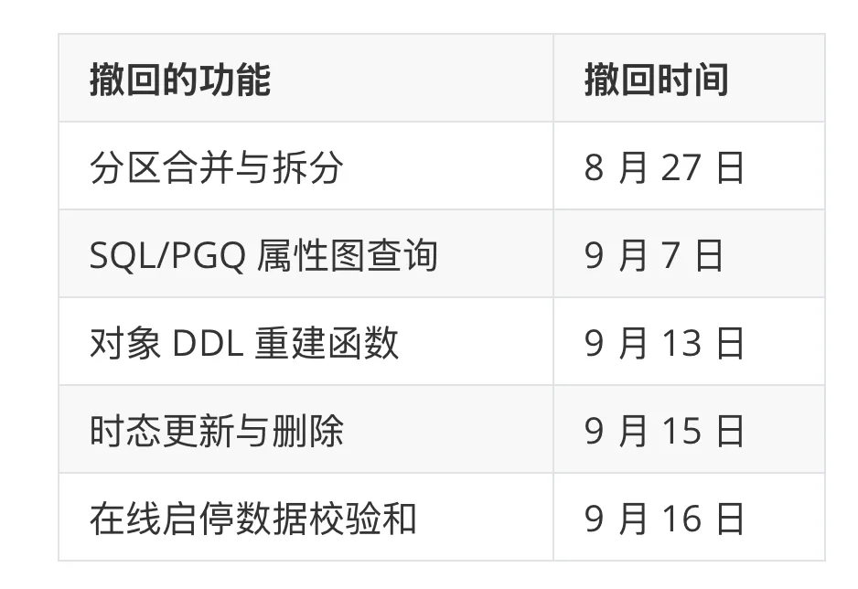

> [Original article on WeChat](https://mp.weixin.qq.com/s/qAt4LBJh1pWXprsK7bLSXg)

Today is the Mid-Autumn Festival. Happy holidays to everyone celebrating.

It is a holiday for reunions, but today's news is about parting ways: [PostgreSQL 19 Beta 4](https://www.postgresql.org/about/news/postgresql-19-beta-4-released-3386/) came out yesterday.

That should be good news. This time, it is a little bittersweet.

I maintain the [Chinese documentation](/en/pg/pgsql-cc-online/) for PostgreSQL releases on [pgsql.cc](https://pgsql.cc/). For every beta, I diff the upstream documentation and update the translations. This time, the diff showed 618 lines added and 5,021 deleted. One beta removed more than eight times as much as it added.

The reason is simple: **PostgreSQL 19 cut five major features in its final beta.**

## What Got Cut

Three other changes were reverted too: two extensions to `CREATE SCHEMA`, and a change that forced `LC_COLLATE` to `C` in the `postmaster` process.

These were substantial features. SQL/PGQ, the property graph query feature in SQL:2023, lets you run graph queries directly over relational tables. It was set to be one of PostgreSQL 19's headline features. DBAs have wanted to enable and disable checksums online for years. Partition merging and splitting are among the first maintenance operations Oracle users ask about when migrating. And this is the second time they have been pulled: they were merged for PostgreSQL 17, then reverted before that release too.

## Why They Were Cut

Read the diffs, commit history, and mailing lists together, and a common problem emerges: **a new feature has to do more than work on its own. It has to obey the database's existing rules.** Those rules must still hold when objects change, transactions run concurrently, and data needs to be recovered.

- **SQL/PGQ:** Creating a property graph requires primary keys on the underlying tables. But after creating the graph, you can drop a primary key and leave the graph intact. Robert Haas's example does not even need concurrency: the requirement is checked when the graph is created, then forgotten. For some behaviors, there was not even agreement on what the correct behavior should be. The Release Management Team (RMT) chose to revert the feature before backward compatibility made those decisions harder to change.

- **Temporal updates and deletes:** `FOR PORTION OF` lets you change just part of a validity period, such as adjusting the third-quarter price in a yearlong contract. But if two sessions concurrently change different periods of the same contract, the second can return `UPDATE 0`, leaving its intended change unapplied, even though the periods do not overlap. By mid-September, the debate over the semantics was still unresolved, and Peter Eisentraut decided to revert the feature. Only this DML syntax was removed; range types and temporal constraints remain.

- **Partition merging and splitting:** When the parent table and its partitions have different expressions for generated columns, a merge can change the generated values in existing rows. Logical decoding also sees inserts but no deletes. What you thought was a change to data layout ends up changing the data itself. That is unacceptable.

- **DDL reconstruction functions:** Generating a `CREATE ROLE` statement is easy; fully recreating a role is harder. The dependencies between roles, databases, and database-level settings were all left for callers to handle. In effect, this was another implementation of `pg_dump`, this time on the server. Every new object attribute would need support in both implementations.

- **Online checksums:** Several rounds of fixes during the beta did not give the community enough confidence. Checksums exist to tell you whether your data is corrupt. If you cannot even trust the state of the checksum mechanism itself, it defeats the purpose. The offline `pg_checksums` tool remains available.

I support these reversions. **PostgreSQL's greatest asset has always been its reliability, not its feature list.** A feature arriving one release later is no great loss. Ship a feature with flawed semantics, though, and users will shape their applications, data, and operational procedures around it. Changing it then costs far more than waiting another year.

A reversion is not a death sentence. Temporal primary keys (`WITHOUT OVERLAPS`) were pulled from PostgreSQL 17 and returned in PostgreSQL 18: a reunion delayed by a year. That does not mean these reverted features are guaranteed a place in PostgreSQL 20. Do not put them on your PostgreSQL 20 roadmap yet.

## What Is Still in PostgreSQL 19

Five features are gone, but several things DBAs have been waiting for remain:

- **`REPACK` and `REPACK CONCURRENTLY`** are both still in. The concurrent form still needs strong locks at certain stages, though, so do not advertise it as "entirely lock-free."
- **`WAIT FOR LSN`** remains. It can help applications implement "read your writes" on standbys, provided they follow the documented requirements for transactions and snapshots.
- **Importing remote statistics with `postgres_fdw`** remains. The option has been renamed from `restore_stats` to `import_stats`.
- Also still in: sequence value synchronization through logical replication, logical decoding on demand with `wal_level = replica`, query plan advice (`pg_plan_advice`), autovacuum scoring, and SIMD optimizations for `COPY FROM`.

Beta 4 also fixes plenty of bugs, including:

- Crashes in `REPACK`.
- A deadlock in `WAIT FOR`.
- Problems with initial table synchronization when logically replicating from older versions to v19.
- Bugs in logical replication conflict detection.
- Crashes when accessing partitions whose concurrent detach did not complete.

The plan is for a release candidate in early October, followed by the final release in October if all goes well. If you are making plans around PostgreSQL 19, remember: **a feature appearing in a beta does not guarantee it will ship. The final [release notes](https://www.postgresql.org/docs/19/release-19.html) are what count.**

## Five Features Out, One Contribution In

Beta 4 was not all deletions. On September 23, my [Simplified Chinese translations of PostgreSQL messages](/en/pg/pg-nls/) were merged upstream and included in Beta 4.

<!-- 原文第 2 张配图待恢复：粘贴内容仅包含透明占位图。 -->

Install PostgreSQL 19 with your system language set to `zh_CN`, and the errors and other messages you see will be my translations. Give them a try, and let me know if anything is inaccurate or awkward.

<!-- 原文第 3 张配图待恢复：粘贴内容仅包含透明占位图。 -->

So far, only the Simplified Chinese translations for PostgreSQL 19 have landed. The Traditional Chinese (`zh_TW`) translations and backports for PostgreSQL 14 through 18 are also ready and should be included in the official releases.

## pgsql.cc Now Covers 28 Years of Manuals

[pgsql.cc](https://pgsql.cc/) is a Chinese translation of the entire postgresql.org website. It previously included complete Chinese manuals for PostgreSQL 10 through 19, plus the development version. Along with the Beta 4 documentation updates, I have now archived manuals for the 24 unsupported releases from 6.3 through 13, available both online and as PDFs.

<!-- 原文第 4 张配图待恢复：粘贴内容仅包含透明占位图。 -->

Version 6.3 came out in 1998. From 6.3 through 19, the manuals for 30 major PostgreSQL releases, spanning 28 years, are now available in Chinese on pgsql.cc.

Why translate old, unsupported releases? I am working on a PostgreSQL knowledge graph that traces the full history of every parameter, message, system catalog, and function. For that, I need accurate Chinese documentation to build on. The project has not launched yet; it needs one more proofreading pass. Stay tuned.

## An Aside: GLM's New Job

There is also a more practical reason for all this translation: I needed a use for my GLM subscription quota. After [the ZCode repository upload incident](/en/ai/zcode-upload/), I stopped using ZCode for any development work. But GLM 5.3 is quite capable, and wasting the quota seemed a shame. Translating, checking, and proofreading documentation was a good fit.

<!-- 原文第 5 张配图待恢复：粘贴内容仅包含透明占位图。 -->

I have seen reports that newer versions of ZCode are still uploading data. Hardly reassuring. Well, if Zhipu can stomach it, I have more than enough PostgreSQL documentation to keep it fed.

<!-- 原文第 6 张配图待恢复：粘贴内容仅包含透明占位图。 -->

<!-- 原文第 7 张配图待恢复：粘贴内容仅包含透明占位图。 -->

So ZCode / GLM did most of the work, with Codex handling the final review. I put Codex in charge of keeping ZCode working around the clock on one machine, continuously reviewing and proofreading the Chinese PostgreSQL documentation for a week. The v1 plan has a quota for each five-hour window, but no weekly cap. Each document went through roughly seven or eight passes, until none of the agents could find anything left to pick apart.

<!-- 原文第 8 张配图待恢复：粘贴内容仅包含透明占位图。 -->
