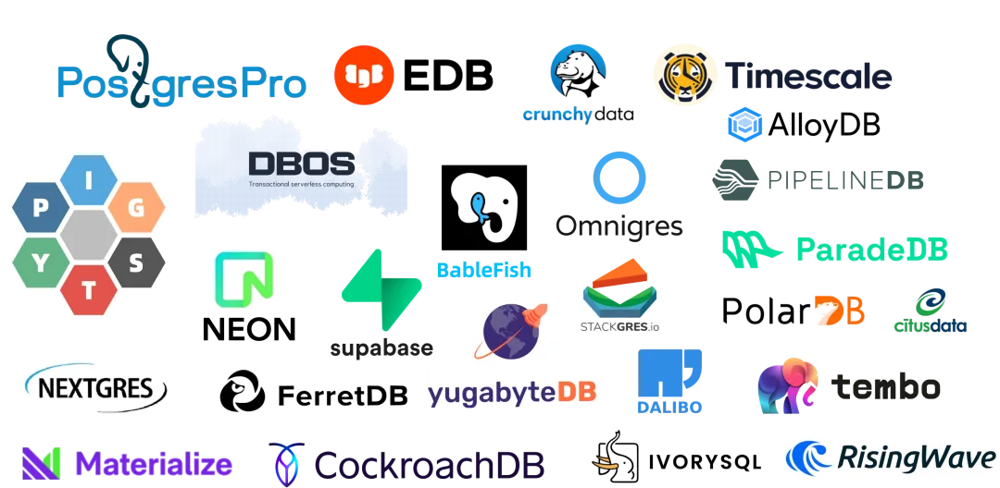
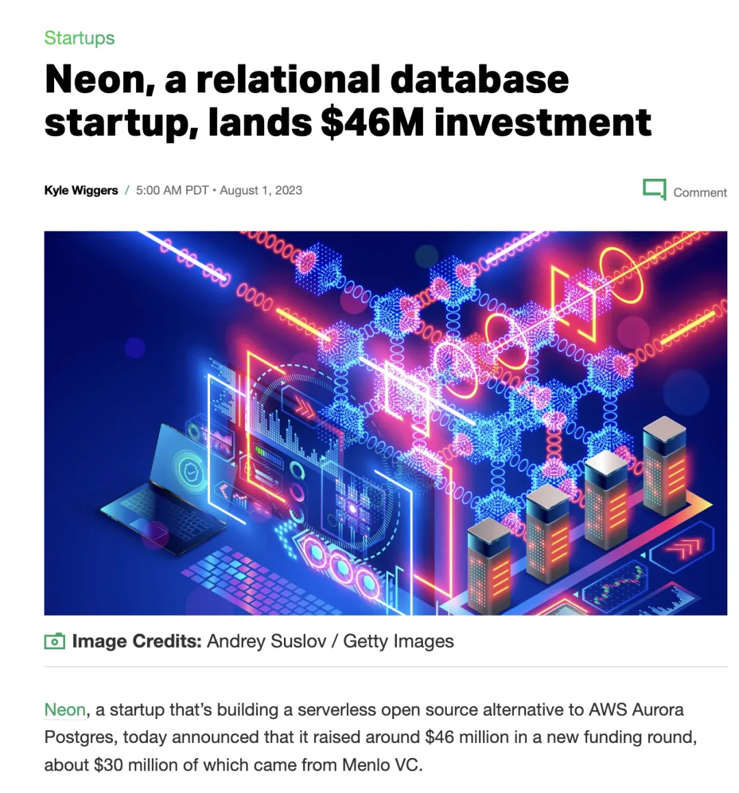
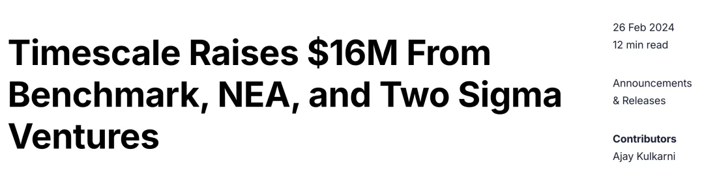
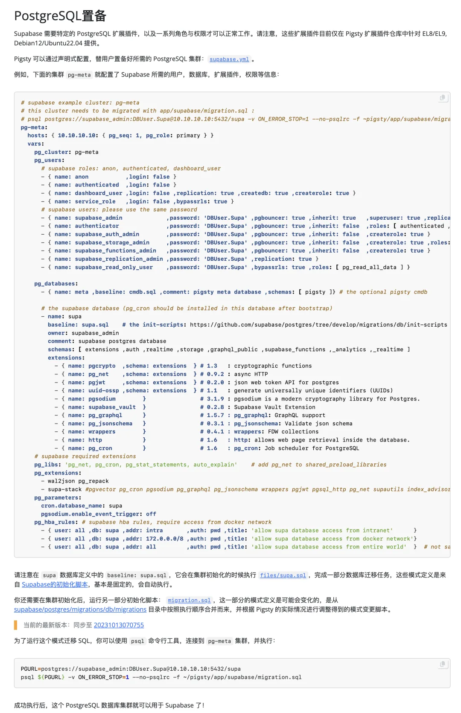

昨天，**Supabase** 官宣了八千万美金的 C 轮融资，这是继 2022 年八千万 B 轮融资后的新一轮融资，在当下资本市场与数据库行业环境中难能可贵。

老实说，我并不感到意外，在《[**PostgreSQL正在吞噬数据库世界**](/pg/pg-eat-db-world/)》一文中，我就说过，PostgreSQL 将会成为数据库世界的 Linux，而聪明的资本已经开始涌入这个领域。

看看过去一年来数据库领域的融资纪录，不难发现几乎都是 PostgreSQL 生态的创业公司，以下是 PostgreSQL 生态或相关的公司最近的融资纪录。可以说，PG 生态几乎包揽了整个数据库世界的 New Money。

------------------------------------------------------------------------

作为旨在整合 PostgreSQL 生态合力的创业项目，Pigsty 很早就关注到了 Supabase，并且深度整合了 Supabase 的扩展插件，允许用户在现有的高可用 PostgreSQL 集群上，运行自建/自托管的 Supabase 服务。

除了我自己在做的 Pigsty 之外，在 PostgreSQL 生态中，我最看好就是这三家创业公司： **Supabase**，**Neon**，以及 **TimescaleDB**；比较看好的第二梯队创业公司则包括 Hydra 与 ParadeDB 。

顺便一提，这些插件都已经整合到 Pigsty 中，开箱即用了。

------------------------------------------------------------------------

**Supabase  B轮/C轮融资 80M \$**

Supabase 封装了 PostgreSQL 作为底层的数据库，并深度利用了 PostgreSQL 的扩展插件机制，提供了一个开源的 Firebase 替代 —— 一条龙式地解决了数据库，对象存储，认证等问题，实现了 Backend as a Service，提供了极佳的开发者体验。

------------------------------------------------------------------------

**Neon  B轮/C轮融资 25M / 46M**

Neon 将 PostgreSQL 改造为开箱即用的 Serverless 服务，将易用性体验做到了极致。去年八月，Neon 刚融到了四千六百万美金，今年八月，Neon 又融到了一笔 25M 的 Funding。

------------------------------------------------------------------------

**TimescaleDB  B轮/C轮融资 25M / 46M**

TimescaleDB 基于 PostgreSQL ，提供了一个时序数据库插件，强化了 PostgreSQL 的时序/分析能力。此外，它们还开发了诸如 pgai ，pgvectorscale 这样的扩展。

------------------------------------------------------------------------

**ClickHouse 收购 PeerDB**

PeerDB  是一家专注于高性价比 Postgres 复制和变更数据捕获的公司。仅仅是 3M 的种子轮，[就直接被 ClickHouse 收购拿下了](http://mp.weixin.qq.com/s?__biz=MzU5ODAyNTM5Ng==&mid=2247488085&idx=1&sn=eb3f7e2ce618eeb3695d77c1681014c7&chksm=fe4b278ec93cae986e926b3f82f82aa9c0a2b066edad7f5a7cee061b7efd4260c7c7a968b332&scene=21#wechat_redirect)。

[ClickHouse收购PeerDB：这浓眉大眼的也要来搞 PG 了？](/pg/clickhouse-peerdb/)

------------------------------------------------------------------------

**如何自建 Supabase？**

Supabase 实际上分为两个部分，有状态的部分使用外部的 PostgreSQL 实例，无状态的部分可以使用 Docker 一键拉起。

当然，并不是所有的 PG 实例都可以用于承载 Supabase ：Supabase 使用到了几个自行开发的扩展插件，目前仅在 Pigsty 中针对几个主流操作系统发行版提供，例如 supautils, pg_graphql, pg_jsonschema, pgjwt, wrappers, vault, index_advisor 等。

完整自建教程，请参考：https://pigsty.cc/zh/docs/kernel/supabase/

------------------------------------------------------------------------

## 数据库老司机

**（这个小助手很懒，请使劲拍打他）**

------------------------------------------------------------------------

**世界上最流行的数据库 PostgreSQL**

[**PostgreSQL正在吞噬数据库世界**](/pg/pg-eat-db-world/)

[PG隆中对，一个PG三个核，一个好汉三百个帮](http://mp.weixin.qq.com/s?__biz=MzU5ODAyNTM5Ng==&mid=2247488113&idx=1&sn=1dfbaec151e98d67aeb66a94a72fca0a&chksm=fe4b27aac93caebce09827a5b27ddd4cad4ecb907afbe9633ca890fbb5454bfea905b341c8a7&scene=21#wechat_redirect)

[憋大招，数据库全能王真的要来了。](http://mp.weixin.qq.com/s?__biz=MzU5ODAyNTM5Ng==&mid=2247488097&idx=1&sn=b94c9e2464cf416103d164e3b70b45fd&chksm=fe4b27bac93caeac6edfa75ffe409611efba7d54235ed8ae69058f6bfa5838743c37b52a69bb&scene=21#wechat_redirect)

[StackOverflow 2024调研：PostgreSQL已经超神了](http://mp.weixin.qq.com/s?__biz=MzU5ODAyNTM5Ng==&mid=2247488057&idx=1&sn=6733b62b5cd48c62acd798fc48db1c92&chksm=fe4b27e2c93caef4b210e2fe2de8d77afbededa7a81e3aeb865aff4af66769b5107ba283c33b&scene=21#wechat_redirect)

[PostgreSQL小版本更新，17beta3，12将EOL](/pg/pg-17beta3/)

[PostgreSQL 17 Beta1 发布！牙膏管挤爆了！](http://mp.weixin.qq.com/s?__biz=MzU5ODAyNTM5Ng==&mid=2247487626&idx=1&sn=4c7662f5506259ab00ed7fcfa32360a3&chksm=fe4b2551c93cac47f8ccaeb5b6fb049d89e785d7a512a45da48a55d778267c3643dc7199533e&scene=21#wechat_redirect)

[为什么PostgreSQL是未来数据的基石？](http://mp.weixin.qq.com/s?__biz=MzU5ODAyNTM5Ng==&mid=2247487577&idx=1&sn=e217c7addb57e6f8d45368b969cdf398&chksm=fe4b2582c93cac944a4417df3ae1a01d9aa82d4486bc6755b703d026792da62d503e3daecd73&scene=21#wechat_redirect)

[令人惊叹的PostgreSQL可伸缩性](/pg/pg-scalability/)\

[PostgreSQL is eating the database world](http://mp.weixin.qq.com/s?__biz=MzU5ODAyNTM5Ng==&mid=2247487156&idx=1&sn=dea8abae114716013dbc4f5fb978064d&chksm=fe4b3b6fc93cb27926cf450af31bc03d826da44120aadc288303ffd64301c99b3596459776b6&scene=21#wechat_redirect)

[技术极简主义：一切皆用Postgres](/pg/just-use-pg/)\

[PostgreSQL：世界上最成功的数据库](http://mp.weixin.qq.com/s?__biz=MzU5ODAyNTM5Ng==&mid=2247485933&idx=3&sn=ea360aa7a59a4cd23ad5f9a9f415a0a0&chksm=fe4b3c36c93cb520bda4596136e927d7cf92c597a76c04077c256588b2428202bdb7f004c08b&scene=21#wechat_redirect)\

[PostgreSQL 到底有多强？](/pg/pg-performence/)\

[PostgreSQL会修改开源许可证吗？](/pg/pg-license/)

[《黑历史：Mongo》：现由PostgreSQL驱动](http://mp.weixin.qq.com/s?__biz=MzU5ODAyNTM5Ng==&mid=2247488292&idx=1&sn=a9a1cf86027fff620fcc478240865391&chksm=fe4b26ffc93cafe92118f867843e6c5f918c3b91f0687be3550c023f9e6ab026db0b2657db1d&scene=21#wechat_redirect)\

[PostgreSQL可以替换微软SQL Server吗？](http://mp.weixin.qq.com/s?__biz=MzU5ODAyNTM5Ng==&mid=2247488287&idx=1&sn=50f068767c6faab8c8f9ca01128090b9&chksm=fe4b26c4c93cafd2c7f27a1d3f3d00a941b39eb8081f475e0126ab1cd3f70071eb1d3285f133&scene=21#wechat_redirect)\

[ElasticSearch又重新开源了？？？](/db/elasticsearch-reopen/)

[Pigsty v3：助力PostgreSQL进入全盛时代！](http://mp.weixin.qq.com/s?__biz=MzU5ODAyNTM5Ng==&mid=2247488249&idx=1&sn=6dba0cc29919850594f3379775b1aaec&chksm=fe4b2722c93cae34d59bbad0c0af1caa15fd769bfaa6f7ffe4acbbfa7aab9fb227f85004ab42&scene=21#wechat_redirect)\

[谁整合好DuckDB，谁赢得OLAP数据库世界](http://mp.weixin.qq.com/s?__biz=MzU5ODAyNTM5Ng==&mid=2247488131&idx=1&sn=9dc6a377d0b24fb7b92cac840b229433&chksm=fe4b2758c93cae4ea6680f77f2c0b728f8a44a35ad4e086200efdc4c620ff3f127b61c2b4885&scene=21#wechat_redirect)

[让PG停摆一周的大会：PGCon.Dev参会记](http://mp.weixin.qq.com/s?__biz=MzU5ODAyNTM5Ng==&mid=2247487796&idx=1&sn=0d8c900fd5e2a0edbd9419eebb4ed234&chksm=fe4b24efc93cadf9ae88fc1907d84bf30a762cb337e3e8392b71fc2cb9f1870e0ccab049c35e&scene=21#wechat_redirect)

[PGCon.Dev 扩展生态峰会小记 @ 温哥华](http://mp.weixin.qq.com/s?__biz=MzU5ODAyNTM5Ng==&mid=2247487665&idx=1&sn=7792bc69e14bdcd606ec7780ed087101&chksm=fe4b256ac93cac7c3b2bd49d8a5a04646dce7091b74717ef3061f4e1ed6ab335a915c81269bb&scene=21#wechat_redirect)\

**开箱即用的 PostgreSQL 数据库发行版 Pigsty**
