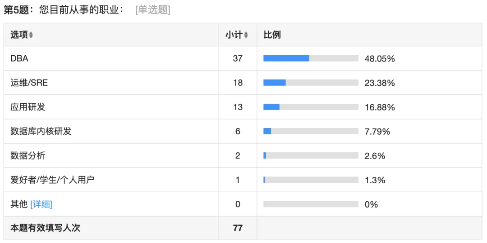
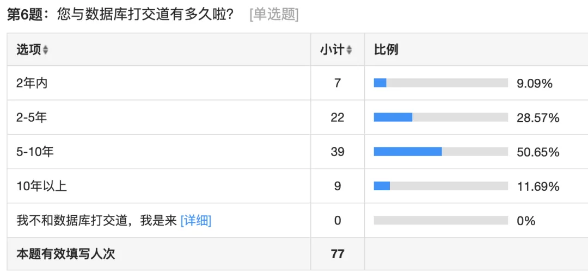
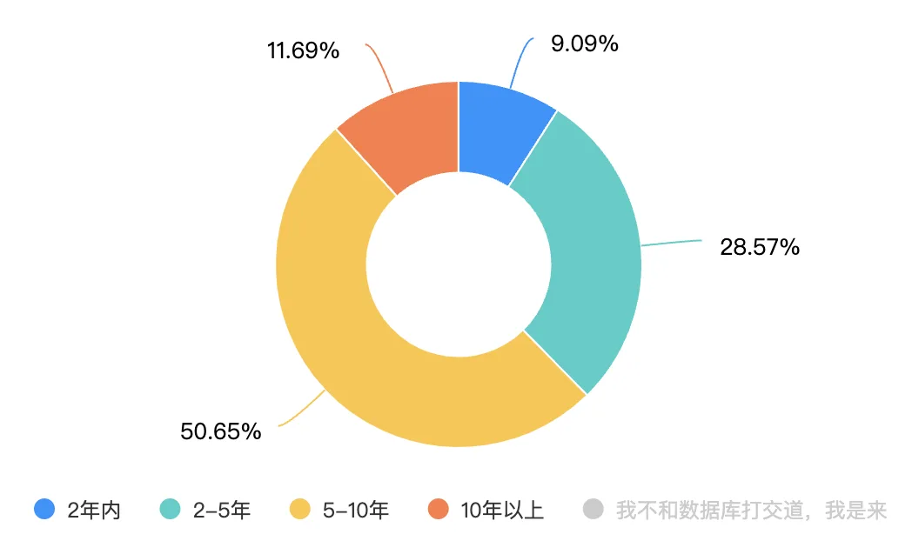
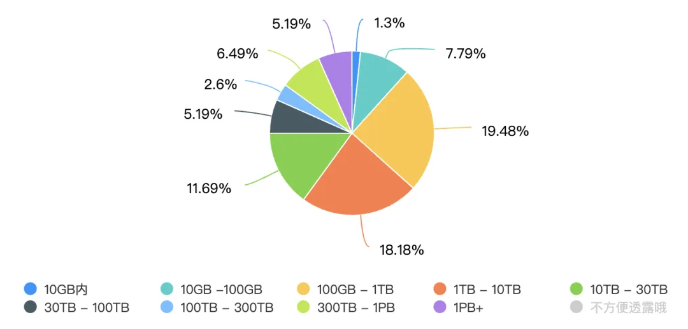
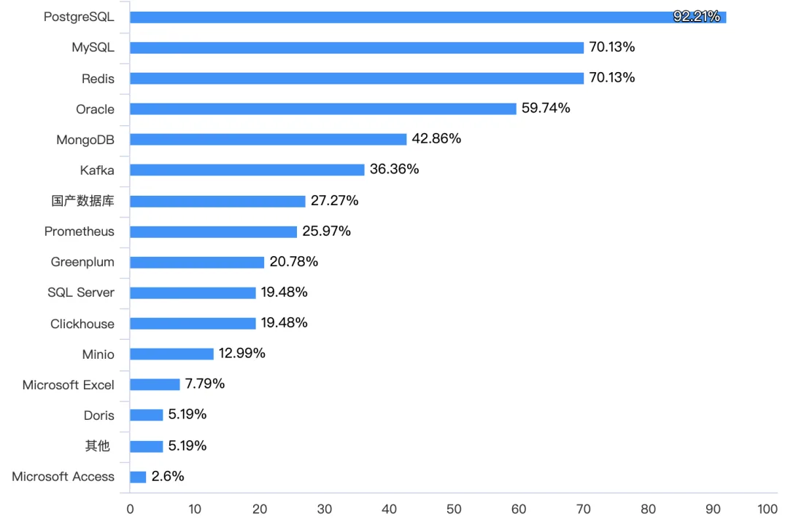
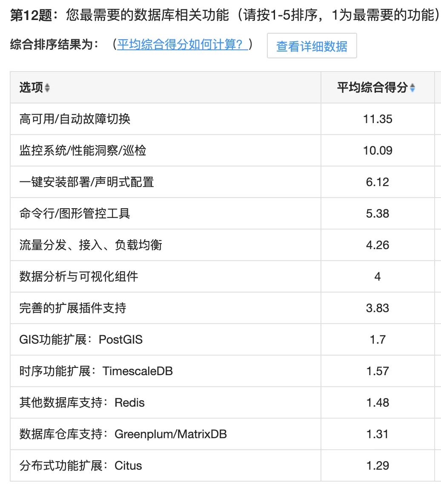
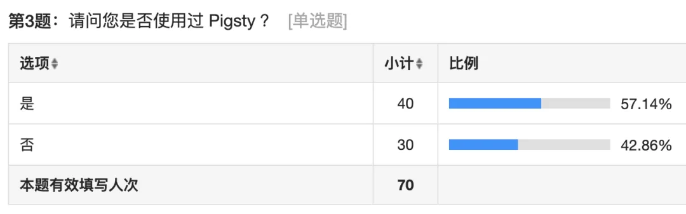
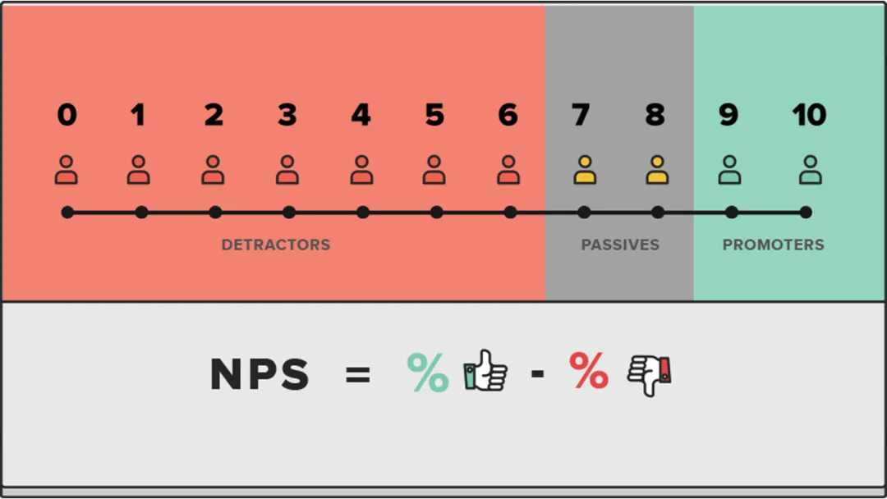
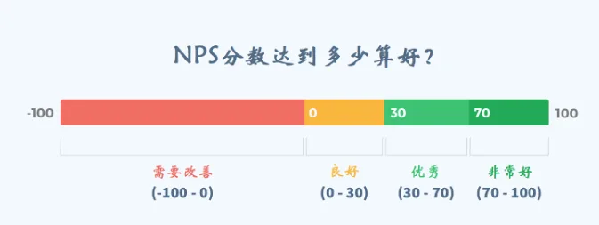
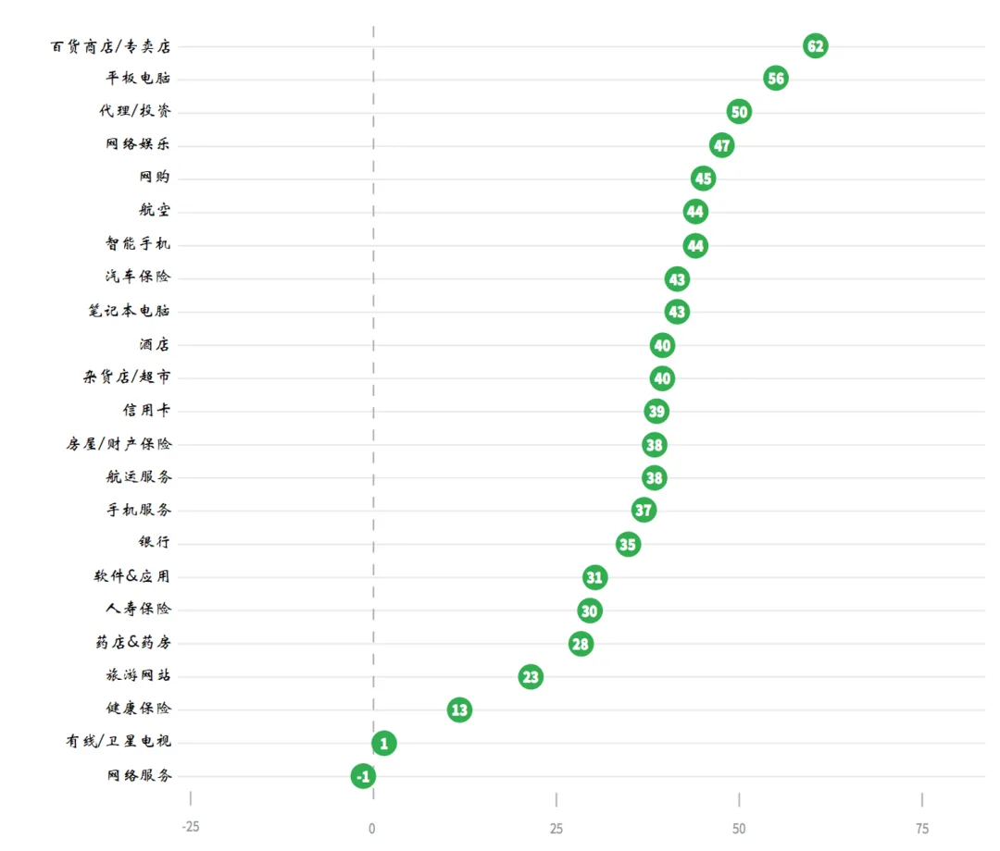

上周，我们进行了一次题为PostgreSQL与Pigsty用户需求调研的问卷调查。主要希望对用户的数据库需求进行了解，两天时间共收集有77份有效问卷。

本次问卷调查基于 PostgreSQL 社区 与 Pigsty 社区用户群体，通过微信公众号与群组进行发放。部分结果可能存在Bias，但足以真实反映用户满意度与整体用户需求。

## 基本情况

此次接受调研的用户群体中，DBA占近半数，DBA与运维共计占71%，应用研发次之，占17%。

其中，近半数参与调研者与数据库打交道的时间在5-10年范围内，90%以上的受访者有两年以上相关工作经验。\

其中，超过30%受访者的公司有着较大规模：超过10人以上的数据库专职团队与200+数据库实例。

在数据量上，超过半数的公司的业务数据量坐落于几百GB到几TB的数量级。

1TB内占比36%，1TB-1PB占比56%，PB以上占比7%。

## 数据库使用情况

在数据库的使用上，PostgreSQL占比最高，达到90%，当然有一部分因素是调研对象是PostgreSQL社区/Pigsty社区。此外，使用MySQL与Redis的用户并列第二，达到70%。Oracle排第四位占比60%。MongoDB与Kafka也分别有43%与36%的采用率，位列第五第六。“其他”选项中包括IBM DB2，Starrocks，ElasticSearch，InfluxDB等。

### \

### 数据库管理工具

在受访群体中，60%的用户倾向于使用开源的数据库发行版来满足数据库管控的需求。倾向于购买云数据库的用户占比为20%，使用商业数据库或商业管控软件的用户占比约为10%。（注：本题可能因调研用户群体而产生Bias）

### 最需要的数据库相关功能

用户将选出自己最看重的五项 数据库相关 能力，其中，**高可用**与**监控系统**是用户最为强烈的需求， 一键安装/CLI/GUI的需求次之。流量分发、接入、负载均衡、数据分析、扩展插件基本位于第三梯队。

## Pigsty相关

Pigsty是开箱即用的PostgreSQL数据库发行版。在参与调查的77人中，有70人听说过Pigsty，在70人中，有40人使用过Pigsty。在使用Pigsty的40人里，NPS分数为80%。

### NPS分数

NPS（Net Promoter Score），净推荐值，又称净促进者得分，亦可称**口碑**，是一种计量某个客户将会向其他人推荐某个企业或服务可能性的指数，它是最流行的用户满意度分析指标。

NPS的计算方式为，询问用户有多大可能性向朋友或同事推荐此产品，然后用推荐者比例（9,10分）减去 - 贬损者比例（0-6分）。

在Pigsty的40位用户中，有83%的用户给出了积极评价（9分与10分），6位用户给出了中性评价（7，8），1位用户给出了5分，净推荐指数为80%，是一个相当惊人的值。

80%的NPS是一个相当惊人的值，作为参考，软件行业的平均NPS大致在31%。

常见行业NPS均值报告，软件业均值为31%

非常感谢各位填写问卷的朋友，参与问卷调查的用户如果留有收件地址，将会有一份随机小礼品发送，不过因为疫情原因还在定制中，将在问卷调查结束/寄到后统一发放。

贴纸，两种胸针随机发送～

顺便一提，最近Pigsty进行了一次路演预演，在五十多个创业项目（从全球5600个项目初筛）中排名并列第二。以下是预演视频删减录像。

[嵌入媒体](https://mp.weixin.qq.com/mp/readtemplate?t=pages/video_player_tmpl&action=mpvideo&auto=0&vid=wxv_2337910865909465088)

最后，添加Pigsty小助手，加入Pigsty群组！

